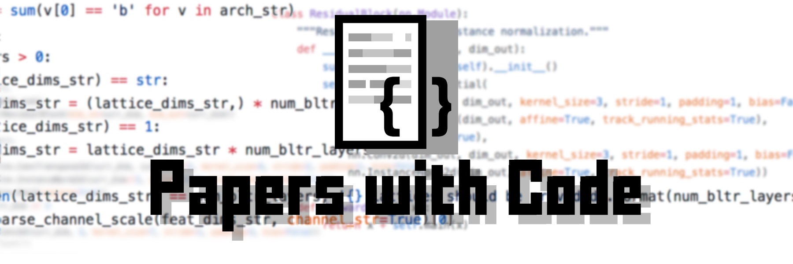

<h1>
    </img>
</h1>

| [2018](#2018) | [2017](#2017) | [2016](#2016) | [2015](#2015) | [2014](#2014) | [2013](#2013) | 2012 | 2011 | 2010 | 2009 | 2008 |  | [Suggestions](https://github.com/zziz/pwc/issues/1) |    
|:-------:|:-------:|:-------:|:-------:|:-------:|:-------:|:-------:|:-------:|:-------:|:-------:|:-------:|:-------:|:-------:|

This work is in continuous progress and update. We are adding new PWC everyday! Tweet me [@fvzaur](https://twitter.com/fvzaur)   
Use [this](https://github.com/zziz/pwc/issues/11) thread to request us your favorite conference to be added to our watchlist and to PWC list.   
#### Weekly updated pushed! 

## 2018
| Title | Conf | Code | Stars |
|:--------|:--------:|:--------:|:--------:|
| [Video-to-Video Synthesis](https://arxiv.org/abs/1808.06601) | NIPS | [code](https://github.com/NVIDIA/vid2vid) | 5578 | 
| [Deep Image Prior](http://openaccess.thecvf.com/content_cvpr_2018/papers/Ulyanov_Deep_Image_Prior_CVPR_2018_paper.pdf) | CVPR | [code](https://github.com/DmitryUlyanov/deep-image-prior) | 3736 | 
| [StarGAN: Unified Generative Adversarial Networks for Multi-Domain Image-to-Image Translation](http://openaccess.thecvf.com/content_cvpr_2018/papers/Choi_StarGAN_Unified_Generative_CVPR_2018_paper.pdf) | CVPR | [code](https://github.com/yunjey/StarGAN) | 3405 | 
| [Joint 3D Face Reconstruction and Dense Alignment with Position Map Regression Network](http://openaccess.thecvf.com/content_ECCV_2018/html/Yao_Feng_Joint_3D_Face_ECCV_2018_paper.html) | ECCV | [code](https://github.com/YadiraF/PRNet) | 2434 | 
| [Learning to See in the Dark](http://openaccess.thecvf.com/content_cvpr_2018/papers/Chen_Learning_to_See_CVPR_2018_paper.pdf) | CVPR | [code](https://github.com/cchen156/Learning-to-See-in-the-Dark) | 2326 | 
| [Glow: Generative Flow with Invertible 1x1 Convolutions](http://arxiv.org/abs/1807.03039v2) | NIPS | [code](https://github.com/openai/glow) | 2088 | 
| [Squeeze-and-Excitation Networks](http://openaccess.thecvf.com/content_cvpr_2018/papers/Hu_Squeeze-and-Excitation_Networks_CVPR_2018_paper.pdf) | CVPR | [code](https://github.com/hujie-frank/SENet) | 1477 | 
| [Efficient Neural Architecture Search via Parameters Sharing](http://proceedings.mlr.press/v80/pham18a.html) | ICML | [code](https://github.com/carpedm20/ENAS-pytorch) | 1382 | 
| [Multimodal Unsupervised Image-to-image Translation](http://openaccess.thecvf.com/content_ECCV_2018/html/Xun_Huang_Multimodal_Unsupervised_Image-to-image_ECCV_2018_paper.html) | ECCV | [code](https://github.com/NVlabs/MUNIT) | 1296 | 
| [Non-Local Neural Networks](http://openaccess.thecvf.com/content_cvpr_2018/papers/Wang_Non-Local_Neural_Networks_CVPR_2018_paper.pdf) | CVPR | [code](https://github.com/facebookresearch/video-nonlocal-net) | 992 | 
| [Can Spatiotemporal 3D CNNs Retrace the History of 2D CNNs and ImageNet?](http://openaccess.thecvf.com/content_cvpr_2018/papers/Hara_Can_Spatiotemporal_3D_CVPR_2018_paper.pdf) | CVPR | [code](https://github.com/kenshohara/3D-ResNets-PyTorch) | 924 | 
| [Single-Shot Refinement Neural Network for Object Detection](http://openaccess.thecvf.com/content_cvpr_2018/papers/Zhang_Single-Shot_Refinement_Neural_CVPR_2018_paper.pdf) | CVPR | [code](https://github.com/sfzhang15/RefineDet) | 875 | 
| [Image Generation From Scene Graphs](http://openaccess.thecvf.com/content_cvpr_2018/papers/Johnson_Image_Generation_From_CVPR_2018_paper.pdf) | CVPR | [code](https://github.com/google/sg2im) | 851 | 
| [GANimation: Anatomically-aware Facial Animation from a Single Image](http://openaccess.thecvf.com/content_ECCV_2018/html/Albert_Pumarola_Anatomically_Coherent_Facial_ECCV_2018_paper.html) | ECCV | [code](https://github.com/albertpumarola/GANimation) | 772 | 
| [Simple Baselines for Human Pose Estimation and Tracking](http://openaccess.thecvf.com/content_ECCV_2018/html/Bin_Xiao_Simple_Baselines_for_ECCV_2018_paper.html) | ECCV | [code](https://github.com/Microsoft/human-pose-estimation.pytorch) | 752 | 
| [Visualizing the Loss Landscape of Neural Nets](http://arxiv.org/abs/1712.09913v2) | NIPS | [code](https://github.com/tomgoldstein/loss-landscape) | 724 | 
| [Detect-and-Track: Efficient Pose Estimation in Videos](http://openaccess.thecvf.com/content_cvpr_2018/papers/Girdhar_Detect-and-Track_Efficient_Pose_CVPR_2018_paper.pdf) | CVPR | [code](https://github.com/facebookresearch/DetectAndTrack) | 650 | 
| [Relation Networks for Object Detection](http://openaccess.thecvf.com/content_cvpr_2018/papers/Hu_Relation_Networks_for_CVPR_2018_paper.pdf) | CVPR | [code](https://github.com/msracver/Relation-Networks-for-Object-Detection) | 635 | 
| [Generative Image Inpainting With Contextual Attention](http://openaccess.thecvf.com/content_cvpr_2018/papers/Yu_Generative_Image_Inpainting_CVPR_2018_paper.pdf) | CVPR | [code](https://github.com/JiahuiYu/generative_inpainting) | 609 | 
| [PointCNN](http://arxiv.org/abs/1801.07791v3) | NIPS | [code](https://github.com/yangyanli/PointCNN) | 607 | 
| [Look at Boundary: A Boundary-Aware Face Alignment Algorithm](http://openaccess.thecvf.com/content_cvpr_2018/papers/Wu_Look_at_Boundary_CVPR_2018_paper.pdf) | CVPR | [code](https://github.com/wywu/LAB) | 575 | 
| [Pelee: A Real-Time Object Detection System on Mobile Devices](nan) | NIPS | [code](https://github.com/Robert-JunWang/Pelee) | 548 | 
| [Distractor-aware Siamese Networks for Visual Object Tracking](http://openaccess.thecvf.com/content_ECCV_2018/html/Zheng_Zhu_Distractor-aware_Siamese_Networks_ECCV_2018_paper.html) | ECCV | [code](https://github.com/foolwood/DaSiamRPN) | 545 | 
| [Obfuscated Gradients Give a False Sense of Security: Circumventing Defenses to Adversarial Examples](http://proceedings.mlr.press/v80/athalye18a.html) | ICML | [code](https://github.com/anishathalye/obfuscated-gradients) | 535 | 
| [Which Training Methods for GANs do actually Converge?](http://proceedings.mlr.press/v80/mescheder18a.html) | ICML | [code](https://github.com/LMescheder/GAN_stability) | 520 | 
| [End-to-End Recovery of Human Shape and Pose](http://openaccess.thecvf.com/content_cvpr_2018/papers/Kanazawa_End-to-End_Recovery_of_CVPR_2018_paper.pdf) | CVPR | [code](https://github.com/akanazawa/hmr) | 502 | 
| [Taskonomy: Disentangling Task Transfer Learning](http://openaccess.thecvf.com/content_cvpr_2018/papers/Zamir_Taskonomy_Disentangling_Task_CVPR_2018_paper.pdf) | CVPR | [code](https://github.com/StanfordVL/taskonomy) | 502 | 
| [Cascaded Pyramid Network for Multi-Person Pose Estimation](http://openaccess.thecvf.com/content_cvpr_2018/papers/Chen_Cascaded_Pyramid_Network_CVPR_2018_paper.pdf) | CVPR | [code](https://github.com/chenyilun95/tf-cpn) | 497 | 
| [Neural 3D Mesh Renderer](http://openaccess.thecvf.com/content_cvpr_2018/papers/Kato_Neural_3D_Mesh_CVPR_2018_paper.pdf) | CVPR | [code](https://github.com/hiroharu-kato/neural_renderer) | 489 | 
| [Zero-Shot Recognition via Semantic Embeddings and Knowledge Graphs](http://openaccess.thecvf.com/content_cvpr_2018/papers/Wang_Zero-Shot_Recognition_via_CVPR_2018_paper.pdf) | CVPR | [code](https://github.com/JudyYe/zero-shot-gcn) | 489 | 
| [In-Place Activated BatchNorm for Memory-Optimized Training of DNNs](http://openaccess.thecvf.com/content_cvpr_2018/papers/Bulo_In-Place_Activated_BatchNorm_CVPR_2018_paper.pdf) | CVPR | [code](https://github.com/mapillary/inplace_abn) | 485 | 
| [The Unreasonable Effectiveness of Deep Features as a Perceptual Metric](http://openaccess.thecvf.com/content_cvpr_2018/papers/Zhang_The_Unreasonable_Effectiveness_CVPR_2018_paper.pdf) | CVPR | [code](https://github.com/richzhang/PerceptualSimilarity) | 447 | 
| [Frustum PointNets for 3D Object Detection From RGB-D Data](http://openaccess.thecvf.com/content_cvpr_2018/papers/Qi_Frustum_PointNets_for_CVPR_2018_paper.pdf) | CVPR | [code](https://github.com/charlesq34/frustum-pointnets) | 434 | 
| [The Lovász-Softmax Loss: A Tractable Surrogate for the Optimization of the Intersection-Over-Union Measure in Neural Networks](http://openaccess.thecvf.com/content_cvpr_2018/papers/Berman_The_LovaSz-Softmax_Loss_CVPR_2018_paper.pdf) | CVPR | [code](https://github.com/bermanmaxim/LovaszSoftmax) | 416 | 
| [ICNet for Real-Time Semantic Segmentation on High-Resolution Images](http://openaccess.thecvf.com/content_ECCV_2018/html/Hengshuang_Zhao_ICNet_for_Real-Time_ECCV_2018_paper.html) | ECCV | [code](https://github.com/hszhao/ICNet) | 415 | 
| [PWC-Net: CNNs for Optical Flow Using Pyramid, Warping, and Cost Volume](http://openaccess.thecvf.com/content_cvpr_2018/papers/Sun_PWC-Net_CNNs_for_CVPR_2018_paper.pdf) | CVPR | [code](https://github.com/NVlabs/PWC-Net) | 398 | 
| [Efficient Interactive Annotation of Segmentation Datasets With Polygon-RNN++](http://openaccess.thecvf.com/content_cvpr_2018/papers/Acuna_Efficient_Interactive_Annotation_CVPR_2018_paper.pdf) | CVPR | [code](https://github.com/fidler-lab/polyrnn-pp-pytorch) | 397 | 
| [Gibson Env: Real-World Perception for Embodied Agents](http://openaccess.thecvf.com/content_cvpr_2018/papers/Xia_Gibson_Env_Real-World_CVPR_2018_paper.pdf) | CVPR | [code](https://github.com/StanfordVL/GibsonEnv) | 385 | 
| [Acquisition of Localization Confidence for Accurate Object Detection](http://openaccess.thecvf.com/content_ECCV_2018/html/Borui_Jiang_Acquisition_of_Localization_ECCV_2018_paper.html) | ECCV | [code](https://github.com/vacancy/PreciseRoIPooling) | 384 | 
| [Noise2Noise: Learning Image Restoration without Clean Data](http://proceedings.mlr.press/v80/lehtinen18a.html) | ICML | [code](https://github.com/yu4u/noise2noise) | 370 | 
| [GeoNet: Geometric Neural Network for Joint Depth and Surface Normal Estimation](http://openaccess.thecvf.com/content_cvpr_2018/papers/Qi_GeoNet_Geometric_Neural_CVPR_2018_paper.pdf) | CVPR | [code](https://github.com/yzcjtr/GeoNet) | 359 | 
| [GeoNet: Unsupervised Learning of Dense Depth, Optical Flow and Camera Pose](http://openaccess.thecvf.com/content_cvpr_2018/papers/Yin_GeoNet_Unsupervised_Learning_CVPR_2018_paper.pdf) | CVPR | [code](https://github.com/yzcjtr/GeoNet) | 359 | 
| [A Style-Aware Content Loss for Real-time HD Style Transfer](http://openaccess.thecvf.com/content_ECCV_2018/html/Artsiom_Sanakoyeu_A_Style-aware_Content_ECCV_2018_paper.html) | ECCV | [code](https://github.com/CompVis/adaptive-style-transfer) | 349 | 
| [Soccer on Your Tabletop](http://openaccess.thecvf.com/content_cvpr_2018/papers/Rematas_Soccer_on_Your_CVPR_2018_paper.pdf) | CVPR | [code](https://github.com/krematas/soccerontable) | 338 | 
| [Pyramid Stereo Matching Network](http://openaccess.thecvf.com/content_cvpr_2018/papers/Chang_Pyramid_Stereo_Matching_CVPR_2018_paper.pdf) | CVPR | [code](https://github.com/JiaRenChang/PSMNet) | 335 | 
| [Neural Baby Talk](http://openaccess.thecvf.com/content_cvpr_2018/papers/Lu_Neural_Baby_Talk_CVPR_2018_paper.pdf) | CVPR | [code](https://github.com/jiasenlu/NeuralBabyTalk) | 332 | 
| [License Plate Detection and Recognition in Unconstrained Scenarios](http://openaccess.thecvf.com/content_ECCV_2018/html/Sergio_Silva_License_Plate_Detection_ECCV_2018_paper.html) | ECCV | [code](https://github.com/sergiomsilva/alpr-unconstrained) | 326 | 
| [Supervision-by-Registration: An Unsupervised Approach to Improve the Precision of Facial Landmark Detectors](http://openaccess.thecvf.com/content_cvpr_2018/papers/Dong_Supervision-by-Registration_An_Unsupervised_CVPR_2018_paper.pdf) | CVPR | [code](https://github.com/facebookresearch/supervision-by-registration) | 326 | 
| [Pixel2Mesh: Generating 3D Mesh Models from Single RGB Images](http://openaccess.thecvf.com/content_ECCV_2018/html/Nanyang_Wang_Pixel2Mesh_Generating_3D_ECCV_2018_paper.html) | ECCV | [code](https://github.com/nywang16/Pixel2Mesh) | 323 | 
| [Transparency by Design: Closing the Gap Between Performance and Interpretability in Visual Reasoning](http://openaccess.thecvf.com/content_cvpr_2018/papers/Mascharka_Transparency_by_Design_CVPR_2018_paper.pdf) | CVPR | [code](https://github.com/davidmascharka/tbd-nets) | 317 | 
| [Fast End-to-End Trainable Guided Filter](http://openaccess.thecvf.com/content_cvpr_2018/papers/Wu_Fast_End-to-End_Trainable_CVPR_2018_paper.pdf) | CVPR | [code](https://github.com/wuhuikai/DeepGuidedFilter) | 312 | 
| [Deep Clustering for Unsupervised Learning of Visual Features](http://openaccess.thecvf.com/content_ECCV_2018/html/Mathilde_Caron_Deep_Clustering_for_ECCV_2018_paper.html) | ECCV | [code](https://github.com/facebookresearch/deepcluster) | 302 | 
| [Deep Photo Enhancer: Unpaired Learning for Image Enhancement From Photographs With GANs](http://openaccess.thecvf.com/content_cvpr_2018/papers/Chen_Deep_Photo_Enhancer_CVPR_2018_paper.pdf) | CVPR | [code](https://github.com/nothinglo/Deep-Photo-Enhancer) | 294 | 
| [Neural Relational Inference for Interacting Systems](http://proceedings.mlr.press/v80/kipf18a.html) | ICML | [code](https://github.com/ethanfetaya/NRI) | 289 | 
| [Adversarially Regularized Autoencoders](http://proceedings.mlr.press/v80/zhao18b.html) | ICML | [code](https://github.com/jakezhaojb/ARAE) | 282 | 
| [Learning to Adapt Structured Output Space for Semantic Segmentation](http://openaccess.thecvf.com/content_cvpr_2018/papers/Tsai_Learning_to_Adapt_CVPR_2018_paper.pdf) | CVPR | [code](https://github.com/wasidennis/AdaptSegNet) | 280 | 
| [Convolutional Neural Networks With Alternately Updated Clique](http://openaccess.thecvf.com/content_cvpr_2018/papers/Yang_Convolutional_Neural_Networks_CVPR_2018_paper.pdf) | CVPR | [code](https://github.com/iboing/CliqueNet) | 272 | 
| [Learning to Segment Every Thing](http://openaccess.thecvf.com/content_cvpr_2018/papers/Hu_Learning_to_Segment_CVPR_2018_paper.pdf) | CVPR | [code](https://github.com/ronghanghu/seg_every_thing) | 269 | 
| [Supervising Unsupervised Learning](http://arxiv.org/abs/1709.05262v2) | NIPS | [code](https://github.com/quinnliu/machineLearning) | 262 | 
| [LiteFlowNet: A Lightweight Convolutional Neural Network for Optical Flow Estimation](http://openaccess.thecvf.com/content_cvpr_2018/papers/Hui_LiteFlowNet_A_Lightweight_CVPR_2018_paper.pdf) | CVPR | [code](https://github.com/twhui/LiteFlowNet) | 261 | 
| [Bilinear Attention Networks](http://arxiv.org/abs/1805.07932v1) | NIPS | [code](https://github.com/jnhwkim/ban-vqa) | 258 | 
| [ESPNet: Efficient Spatial Pyramid of Dilated Convolutions for Semantic Segmentation](http://openaccess.thecvf.com/content_ECCV_2018/html/Sachin_Mehta_ESPNet_Efficient_Spatial_ECCV_2018_paper.html) | ECCV | [code](https://github.com/sacmehta/ESPNet) | 254 | 
| [An intriguing failing of convolutional neural networks and the CoordConv solution](https://arxiv.org/abs/1807.03247) | NIPS | [code](https://github.com/mkocabas/CoordConv-pytorch) | 249 | 
| [End-to-End Learning of Motion Representation for Video Understanding](http://openaccess.thecvf.com/content_cvpr_2018/papers/Fan_End-to-End_Learning_of_CVPR_2018_paper.pdf) | CVPR | [code](https://github.com/LijieFan/tvnet) | 238 | 
| [Image Super-Resolution Using Very Deep Residual Channel Attention Networks](http://openaccess.thecvf.com/content_ECCV_2018/html/Yulun_Zhang_Image_Super-Resolution_Using_ECCV_2018_paper.html) | ECCV | [code](https://github.com/yulunzhang/RCAN) | 234 | 
| [Iterative Visual Reasoning Beyond Convolutions](http://openaccess.thecvf.com/content_cvpr_2018/papers/Chen_Iterative_Visual_Reasoning_CVPR_2018_paper.pdf) | CVPR | [code](https://github.com/endernewton/iter-reason) | 228 | 
| [Semi-Parametric Image Synthesis](http://openaccess.thecvf.com/content_cvpr_2018/papers/Qi_Semi-Parametric_Image_Synthesis_CVPR_2018_paper.pdf) | CVPR | [code](https://github.com/xjqicuhk/SIMS) | 226 | 
| [Compressed Video Action Recognition](http://openaccess.thecvf.com/content_cvpr_2018/papers/Wu_Compressed_Video_Action_CVPR_2018_paper.pdf) | CVPR | [code](https://github.com/chaoyuaw/pytorch-coviar) | 225 | 
| [Style Aggregated Network for Facial Landmark Detection](http://openaccess.thecvf.com/content_cvpr_2018/papers/Dong_Style_Aggregated_Network_CVPR_2018_paper.pdf) | CVPR | [code](https://github.com/D-X-Y/SAN) | 223 | 
| [Pose-Robust Face Recognition via Deep Residual Equivariant Mapping](http://openaccess.thecvf.com/content_cvpr_2018/papers/Cao_Pose-Robust_Face_Recognition_CVPR_2018_paper.pdf) | CVPR | [code](https://github.com/penincillin/DREAM) | 220 | 
| [Multi-Content GAN for Few-Shot Font Style Transfer](http://openaccess.thecvf.com/content_cvpr_2018/papers/Azadi_Multi-Content_GAN_for_CVPR_2018_paper.pdf) | CVPR | [code](https://github.com/azadis/MC-GAN) | 218 | 
| [GraphRNN: Generating Realistic Graphs with Deep Auto-regressive Models](http://proceedings.mlr.press/v80/you18a.html) | ICML | [code](https://github.com/JiaxuanYou/graph-generation) | 214 | 
| [Referring Relationships](http://openaccess.thecvf.com/content_cvpr_2018/papers/Krishna_Referring_Relationships_CVPR_2018_paper.pdf) | CVPR | [code](https://github.com/StanfordVL/ReferringRelationships) | 210 | 
| [MoCoGAN: Decomposing Motion and Content for Video Generation](http://openaccess.thecvf.com/content_cvpr_2018/papers/Tulyakov_MoCoGAN_Decomposing_Motion_CVPR_2018_paper.pdf) | CVPR | [code](https://github.com/sergeytulyakov/mocogan) | 205 | 
| [Latent Alignment and Variational Attention](http://arxiv.org/abs/1807.03756v1) | NIPS | [code](https://github.com/harvardnlp/var-attn) | 204 | 
| [LayoutNet: Reconstructing the 3D Room Layout From a Single RGB Image](http://openaccess.thecvf.com/content_cvpr_2018/papers/Zou_LayoutNet_Reconstructing_the_CVPR_2018_paper.pdf) | CVPR | [code](https://github.com/zouchuhang/LayoutNet) | 202 | 
| [Large-Scale Point Cloud Semantic Segmentation With Superpoint Graphs](http://openaccess.thecvf.com/content_cvpr_2018/papers/Landrieu_Large-Scale_Point_Cloud_CVPR_2018_paper.pdf) | CVPR | [code](https://github.com/loicland/superpoint_graph) | 197 | 
| [An End-to-End TextSpotter With Explicit Alignment and Attention](http://openaccess.thecvf.com/content_cvpr_2018/papers/He_An_End-to-End_TextSpotter_CVPR_2018_paper.pdf) | CVPR | [code](https://github.com/tonghe90/textspotter) | 195 | 
| [DeblurGAN: Blind Motion Deblurring Using Conditional Adversarial Networks](http://openaccess.thecvf.com/content_cvpr_2018/papers/Kupyn_DeblurGAN_Blind_Motion_CVPR_2018_paper.pdf) | CVPR | [code](https://github.com/RaphaelMeudec/deblur-gan) | 189 | 
| [SPLATNet: Sparse Lattice Networks for Point Cloud Processing](http://openaccess.thecvf.com/content_cvpr_2018/papers/Su_SPLATNet_Sparse_Lattice_CVPR_2018_paper.pdf) | CVPR | [code](https://github.com/NVlabs/splatnet) | 188 | 
| [Attentive Generative Adversarial Network for Raindrop Removal From a Single Image](http://openaccess.thecvf.com/content_cvpr_2018/papers/Qian_Attentive_Generative_Adversarial_CVPR_2018_paper.pdf) | CVPR | [code](https://github.com/rui1996/DeRaindrop) | 186 | 
| [Single View Stereo Matching](http://openaccess.thecvf.com/content_cvpr_2018/papers/Luo_Single_View_Stereo_CVPR_2018_paper.pdf) | CVPR | [code](https://github.com/lawy623/SVS) | 182 | 
| [MegaDepth: Learning Single-View Depth Prediction From Internet Photos](http://openaccess.thecvf.com/content_cvpr_2018/papers/Li_MegaDepth_Learning_Single-View_CVPR_2018_paper.pdf) | CVPR | [code](https://github.com/lixx2938/MegaDepth) | 181 | 
| [ECO: Efficient Convolutional Network for Online Video Understanding](http://openaccess.thecvf.com/content_ECCV_2018/html/Mohammadreza_Zolfaghari_ECO_Efficient_Convolutional_ECCV_2018_paper.html) | ECCV | [code](https://github.com/mzolfaghari/ECO-efficient-video-understanding) | 180 | 
| [Unsupervised Feature Learning via Non-Parametric Instance Discrimination](http://openaccess.thecvf.com/content_cvpr_2018/papers/Wu_Unsupervised_Feature_Learning_CVPR_2018_paper.pdf) | CVPR | [code](https://github.com/zhirongw/lemniscate.pytorch) | 180 | 
| [ST-GAN: Spatial Transformer Generative Adversarial Networks for Image Compositing](http://openaccess.thecvf.com/content_cvpr_2018/papers/Lin_ST-GAN_Spatial_Transformer_CVPR_2018_paper.pdf) | CVPR | [code](https://github.com/chenhsuanlin/spatial-transformer-GAN) | 179 | 
| [Video Based Reconstruction of 3D People Models](http://openaccess.thecvf.com/content_cvpr_2018/papers/Alldieck_Video_Based_Reconstruction_CVPR_2018_paper.pdf) | CVPR | [code](https://github.com/thmoa/videoavatars) | 179 | 
| [Social GAN: Socially Acceptable Trajectories With Generative Adversarial Networks](http://openaccess.thecvf.com/content_cvpr_2018/papers/Gupta_Social_GAN_Socially_CVPR_2018_paper.pdf) | CVPR | [code](https://github.com/agrimgupta92/sgan) | 178 | 
| [Learning Category-Specific Mesh Reconstruction from Image Collections](http://openaccess.thecvf.com/content_ECCV_2018/html/Angjoo_Kanazawa_Learning_Category-Specific_Mesh_ECCV_2018_paper.html) | ECCV | [code](https://github.com/akanazawa/cmr) | 176 | 
| [Realistic Evaluation of Deep Semi-Supervised Learning Algorithms](http://arxiv.org/abs/1804.09170v2) | NIPS | [code](https://github.com/brain-research/realistic-ssl-evaluation) | 175 | 
| [BSN: Boundary Sensitive Network for Temporal Action Proposal Generation](http://openaccess.thecvf.com/content_ECCV_2018/html/Tianwei_Lin_BSN_Boundary_Sensitive_ECCV_2018_paper.html) | ECCV | [code](https://github.com/wzmsltw/BSN-boundary-sensitive-network) | 175 | 
| [Group Normalization](http://openaccess.thecvf.com/content_ECCV_2018/html/Yuxin_Wu_Group_Normalization_ECCV_2018_paper.html) | ECCV | [code](https://github.com/shaohua0116/Group-Normalization-Tensorflow) | 175 | 
| [Real-Time Seamless Single Shot 6D Object Pose Prediction](http://openaccess.thecvf.com/content_cvpr_2018/papers/Tekin_Real-Time_Seamless_Single_CVPR_2018_paper.pdf) | CVPR | [code](https://github.com/Microsoft/singleshotpose) | 174 | 
| [MVSNet: Depth Inference for Unstructured Multi-view Stereo](http://openaccess.thecvf.com/content_ECCV_2018/html/Yao_Yao_MVSNet_Depth_Inference_ECCV_2018_paper.html) | ECCV | [code](https://github.com/YoYo000/MVSNet) | 174 | 
| [Neural Motifs: Scene Graph Parsing With Global Context](http://openaccess.thecvf.com/content_cvpr_2018/papers/Zellers_Neural_Motifs_Scene_CVPR_2018_paper.pdf) | CVPR | [code](https://github.com/rowanz/neural-motifs) | 171 | 
| [Learning a Single Convolutional Super-Resolution Network for Multiple Degradations](http://openaccess.thecvf.com/content_cvpr_2018/papers/Zhang_Learning_a_Single_CVPR_2018_paper.pdf) | CVPR | [code](https://github.com/cszn/SRMD) | 169 | 
| [Optimizing Video Object Detection via a Scale-Time Lattice](http://openaccess.thecvf.com/content_cvpr_2018/papers/Chen_Optimizing_Video_Object_CVPR_2018_paper.pdf) | CVPR | [code](https://github.com/hellock/scale-time-lattice) | 168 | 
| [MultiPoseNet: Fast Multi-Person Pose Estimation using Pose Residual Network](http://openaccess.thecvf.com/content_ECCV_2018/html/Muhammed_Kocabas_MultiPoseNet_Fast_Multi-Person_ECCV_2018_paper.html) | ECCV | [code](https://github.com/salihkaragoz/pose-residual-network-pytorch) | 167 | 
| [Unsupervised Cross-Dataset Person Re-Identification by Transfer Learning of Spatial-Temporal Patterns](http://openaccess.thecvf.com/content_cvpr_2018/papers/Lv_Unsupervised_Cross-Dataset_Person_CVPR_2018_paper.pdf) | CVPR | [code](https://github.com/ahangchen/TFusion) | 166 | 
| [Weakly Supervised Instance Segmentation Using Class Peak Response](http://openaccess.thecvf.com/content_cvpr_2018/papers/Zhou_Weakly_Supervised_Instance_CVPR_2018_paper.pdf) | CVPR | [code](https://github.com/ZhouYanzhao/PRM) | 166 | 
| [PlaneNet: Piece-Wise Planar Reconstruction From a Single RGB Image](http://openaccess.thecvf.com/content_cvpr_2018/papers/Liu_PlaneNet_Piece-Wise_Planar_CVPR_2018_paper.pdf) | CVPR | [code](https://github.com/art-programmer/PlaneNet) | 164 | 
| [Residual Dense Network for Image Super-Resolution](http://openaccess.thecvf.com/content_cvpr_2018/papers/Zhang_Residual_Dense_Network_CVPR_2018_paper.pdf) | CVPR | [code](https://github.com/yulunzhang/RDN) | 163 | 
| [Embodied Question Answering](http://openaccess.thecvf.com/content_cvpr_2018/papers/Das_Embodied_Question_Answering_CVPR_2018_paper.pdf) | CVPR | [code](https://github.com/facebookresearch/EmbodiedQA) | 162 | 
| [Evolved Policy Gradients](http://arxiv.org/abs/1802.04821v2) | NIPS | [code](https://github.com/openai/EPG) | 160 | 
| [Camera Style Adaptation for Person Re-Identification](http://openaccess.thecvf.com/content_cvpr_2018/papers/Zhong_Camera_Style_Adaptation_CVPR_2018_paper.pdf) | CVPR | [code](https://github.com/zhunzhong07/CamStyle) | 159 | 
| [Weakly and Semi Supervised Human Body Part Parsing via Pose-Guided Knowledge Transfer](http://openaccess.thecvf.com/content_cvpr_2018/papers/Fang_Weakly_and_Semi_CVPR_2018_paper.pdf) | CVPR | [code](https://github.com/MVIG-SJTU/WSHP) | 159 | 
| [Scale-Recurrent Network for Deep Image Deblurring](http://openaccess.thecvf.com/content_cvpr_2018/papers/Tao_Scale-Recurrent_Network_for_CVPR_2018_paper.pdf) | CVPR | [code](https://github.com/jiangsutx/SRN-Deblur) | 159 | 
| [Unsupervised Learning of Monocular Depth Estimation and Visual Odometry With Deep Feature Reconstruction](http://openaccess.thecvf.com/content_cvpr_2018/papers/Zhan_Unsupervised_Learning_of_CVPR_2018_paper.pdf) | CVPR | [code](https://github.com/Huangying-Zhan/Depth-VO-Feat) | 158 | 
| [Relational recurrent neural networks](https://arxiv.org/abs/1806.01822) | NIPS | [code](https://github.com/L0SG/relational-rnn-pytorch) | 157 | 
| [Densely Connected Pyramid Dehazing Network](http://openaccess.thecvf.com/content_cvpr_2018/papers/Zhang_Densely_Connected_Pyramid_CVPR_2018_paper.pdf) | CVPR | [code](https://github.com/hezhangsprinter/DCPDN) | 155 | 
| [Image Inpainting for Irregular Holes Using Partial Convolutions](http://openaccess.thecvf.com/content_ECCV_2018/html/Guilin_Liu_Image_Inpainting_for_ECCV_2018_paper.html) | ECCV | [code](https://github.com/naoto0804/pytorch-inpainting-with-partial-conv) | 153 | 
| [SO-Net: Self-Organizing Network for Point Cloud Analysis](http://openaccess.thecvf.com/content_cvpr_2018/papers/Li_SO-Net_Self-Organizing_Network_CVPR_2018_paper.pdf) | CVPR | [code](https://github.com/lijx10/SO-Net) | 152 | 
| [Pix3D: Dataset and Methods for Single-Image 3D Shape Modeling](http://openaccess.thecvf.com/content_cvpr_2018/papers/Sun_Pix3D_Dataset_and_CVPR_2018_paper.pdf) | CVPR | [code](https://github.com/xingyuansun/pix3d) | 152 | 
| [ShuffleNet: An Extremely Efficient Convolutional Neural Network for Mobile Devices](http://openaccess.thecvf.com/content_cvpr_2018/papers/Zhang_ShuffleNet_An_Extremely_CVPR_2018_paper.pdf) | CVPR | [code](https://github.com/camel007/Caffe-ShuffleNet) | 152 | 
| [DenseASPP for Semantic Segmentation in Street Scenes](http://openaccess.thecvf.com/content_cvpr_2018/papers/Yang_DenseASPP_for_Semantic_CVPR_2018_paper.pdf) | CVPR | [code](https://github.com/DeepMotionAIResearch/DenseASPP) | 151 | 
| [Facelet-Bank for Fast Portrait Manipulation](http://openaccess.thecvf.com/content_cvpr_2018/papers/Chen_Facelet-Bank_for_Fast_CVPR_2018_paper.pdf) | CVPR | [code](https://github.com/yingcong/Facelet_Bank) | 150 | 
| [Self-Imitation Learning](http://proceedings.mlr.press/v80/oh18b.html) | ICML | [code](https://github.com/junhyukoh/self-imitation-learning) | 145 | 
| [Graph R-CNN for Scene Graph Generation](http://openaccess.thecvf.com/content_ECCV_2018/html/Jianwei_Yang_Graph_R-CNN_for_ECCV_2018_paper.html) | ECCV | [code](https://github.com/jwyang/graph-rcnn.pytorch) | 144 | 
| [A Closer Look at Spatiotemporal Convolutions for Action Recognition](http://openaccess.thecvf.com/content_cvpr_2018/papers/Tran_A_Closer_Look_CVPR_2018_paper.pdf) | CVPR | [code](https://github.com/irhumshafkat/R2Plus1D-PyTorch) | 143 | 
| [Cross-Domain Weakly-Supervised Object Detection Through Progressive Domain Adaptation](http://openaccess.thecvf.com/content_cvpr_2018/papers/Inoue_Cross-Domain_Weakly-Supervised_Object_CVPR_2018_paper.pdf) | CVPR | [code](https://github.com/naoto0804/cross-domain-detection) | 143 | 
| [Quantized Densely Connected U-Nets for Efficient Landmark Localization](http://openaccess.thecvf.com/content_ECCV_2018/html/Zhiqiang_Tang_Quantized_Densely_Connected_ECCV_2018_paper.html) | ECCV | [code](https://github.com/zhiqiangdon/CU-Net) | 143 | 
| [Recurrent Squeeze-and-Excitation Context Aggregation Net for Single Image Deraining](http://openaccess.thecvf.com/content_ECCV_2018/html/Xia_Li_Recurrent_Squeeze-and-Excitation_Context_ECCV_2018_paper.html) | ECCV | [code](https://github.com/XiaLiPKU/RESCAN) | 142 | 
| [Two-Stream Convolutional Networks for Dynamic Texture Synthesis](http://openaccess.thecvf.com/content_cvpr_2018/papers/Tesfaldet_Two-Stream_Convolutional_Networks_CVPR_2018_paper.pdf) | CVPR | [code](https://github.com/ryersonvisionlab/two-stream-dyntex-synth) | 141 | 
| [Integral Human Pose Regression](http://openaccess.thecvf.com/content_ECCV_2018/html/Xiao_Sun_Integral_Human_Pose_ECCV_2018_paper.html) | ECCV | [code](https://github.com/JimmySuen/integral-human-pose) | 141 | 
| [Adaptive Affinity Fields for Semantic Segmentation](http://openaccess.thecvf.com/content_ECCV_2018/html/Jyh-Jing_Hwang_Adaptive_Affinity_Field_ECCV_2018_paper.html) | ECCV | [code](https://github.com/twke18/Adaptive_Affinity_Fields) | 141 | 
| [LSTM Pose Machines](http://openaccess.thecvf.com/content_cvpr_2018/papers/Luo_LSTM_Pose_Machines_CVPR_2018_paper.pdf) | CVPR | [code](https://github.com/lawy623/LSTM_Pose_Machines) | 141 | 
| [Structure Inference Net: Object Detection Using Scene-Level Context and Instance-Level Relationships](http://openaccess.thecvf.com/content_cvpr_2018/papers/Liu_Structure_Inference_Net_CVPR_2018_paper.pdf) | CVPR | [code](https://github.com/choasup/SIN) | 140 | 
| [Recovering Realistic Texture in Image Super-Resolution by Deep Spatial Feature Transform](http://openaccess.thecvf.com/content_cvpr_2018/papers/Wang_Recovering_Realistic_Texture_CVPR_2018_paper.pdf) | CVPR | [code](https://github.com/xinntao/CVPR18-SFTGAN) | 139 | 
| [Image-Image Domain Adaptation With Preserved Self-Similarity and Domain-Dissimilarity for Person Re-Identification](http://openaccess.thecvf.com/content_cvpr_2018/papers/Deng_Image-Image_Domain_Adaptation_CVPR_2018_paper.pdf) | CVPR | [code](https://github.com/Simon4Yan/Learning-via-Translation) | 137 | 
| [Learning to Compare: Relation Network for Few-Shot Learning](http://openaccess.thecvf.com/content_cvpr_2018/papers/Sung_Learning_to_Compare_CVPR_2018_paper.pdf) | CVPR | [code](https://github.com/lzrobots/LearningToCompare_ZSL) | 135 | 
| [CosFace: Large Margin Cosine Loss for Deep Face Recognition](http://openaccess.thecvf.com/content_cvpr_2018/papers/Wang_CosFace_Large_Margin_CVPR_2018_paper.pdf) | CVPR | [code](https://github.com/yule-li/CosFace) | 135 | 
| [Deep Depth Completion of a Single RGB-D Image](http://openaccess.thecvf.com/content_cvpr_2018/papers/Zhang_Deep_Depth_Completion_CVPR_2018_paper.pdf) | CVPR | [code](https://github.com/yindaz/DeepCompletionRelease) | 134 | 
| [Deep Back-Projection Networks for Super-Resolution](http://openaccess.thecvf.com/content_cvpr_2018/papers/Haris_Deep_Back-Projection_Networks_CVPR_2018_paper.pdf) | CVPR | [code](https://github.com/alterzero/DBPN-Pytorch) | 132 | 
| [Context Embedding Networks](http://openaccess.thecvf.com/content_cvpr_2018/papers/Kim_Context_Embedding_Networks_CVPR_2018_paper.pdf) | CVPR | [code](https://github.com/thunlp/CANE) | 131 | 
| [Multi-Task Learning Using Uncertainty to Weigh Losses for Scene Geometry and Semantics](http://openaccess.thecvf.com/content_cvpr_2018/papers/Kendall_Multi-Task_Learning_Using_CVPR_2018_paper.pdf) | CVPR | [code](https://github.com/alexgkendall/multitaskvision) | 131 | 
| [Perturbative Neural Networks](http://openaccess.thecvf.com/content_cvpr_2018/papers/Juefei-Xu_Perturbative_Neural_Networks_CVPR_2018_paper.pdf) | CVPR | [code](https://github.com/juefeix/pnn.pytorch) | 130 | 
| [Style Tokens: Unsupervised Style Modeling, Control and Transfer in End-to-End Speech Synthesis](http://proceedings.mlr.press/v80/wang18h.html) | ICML | [code](https://github.com/syang1993/gst-tacotron) | 129 | 
| [Fast and Accurate Online Video Object Segmentation via Tracking Parts](http://openaccess.thecvf.com/content_cvpr_2018/papers/Cheng_Fast_and_Accurate_CVPR_2018_paper.pdf) | CVPR | [code](https://github.com/JingchunCheng/FAVOS) | 129 | 
| [Nonlinear 3D Face Morphable Model](http://openaccess.thecvf.com/content_cvpr_2018/papers/Tran_Nonlinear_3D_Face_CVPR_2018_paper.pdf) | CVPR | [code](https://github.com/tranluan/Nonlinear_Face_3DMM) | 128 | 
| [BodyNet: Volumetric Inference of 3D Human Body Shapes](http://openaccess.thecvf.com/content_ECCV_2018/html/Gul_Varol_BodyNet_Volumetric_Inference_ECCV_2018_paper.html) | ECCV | [code](https://github.com/gulvarol/bodynet) | 126 | 
| [3D-CODED: 3D Correspondences by Deep Deformation](http://openaccess.thecvf.com/content_ECCV_2018/html/Thibault_Groueix_Shape_correspondences_from_ECCV_2018_paper.html) | ECCV | [code](https://github.com/ThibaultGROUEIX/3D-CODED) | 125 | 
| [DeepMVS: Learning Multi-View Stereopsis](http://openaccess.thecvf.com/content_cvpr_2018/papers/Huang_DeepMVS_Learning_Multi-View_CVPR_2018_paper.pdf) | CVPR | [code](https://github.com/phuang17/DeepMVS) | 125 | 
| [Hierarchical Imitation and Reinforcement Learning](http://proceedings.mlr.press/v80/le18a.html) | ICML | [code](https://github.com/hoangminhle/hierarchical_IL_RL) | 124 | 
| [Domain Adaptive Faster R-CNN for Object Detection in the Wild](http://openaccess.thecvf.com/content_cvpr_2018/papers/Chen_Domain_Adaptive_Faster_CVPR_2018_paper.pdf) | CVPR | [code](https://github.com/yuhuayc/da-faster-rcnn) | 123 | 
| [L4: Practical loss-based stepsize adaptation for deep learning](http://arxiv.org/abs/1802.05074v4) | NIPS | [code](https://github.com/martius-lab/l4-optimizer) | 123 | 
| [A Generative Adversarial Approach for Zero-Shot Learning From Noisy Texts](http://openaccess.thecvf.com/content_cvpr_2018/papers/Zhu_A_Generative_Adversarial_CVPR_2018_paper.pdf) | CVPR | [code](https://github.com/EthanZhu90/ZSL_GAN_CVPR18) | 122 | 
| [Recurrent Relational Networks](http://arxiv.org/abs/1711.08028v2) | NIPS | [code](https://github.com/rasmusbergpalm/recurrent-relational-networks) | 121 | 
| [Gated Path Planning Networks](http://proceedings.mlr.press/v80/lee18c.html) | ICML | [code](https://github.com/lileee/gated-path-planning-networks) | 121 | 
| [PSANet: Point-wise Spatial Attention Network for Scene Parsing](http://openaccess.thecvf.com/content_ECCV_2018/html/Hengshuang_Zhao_PSANet_Point-wise_Spatial_ECCV_2018_paper.html) | ECCV | [code](https://github.com/hszhao/PSANet) | 121 | 
| [Rethinking Feature Distribution for Loss Functions in Image Classification](http://openaccess.thecvf.com/content_cvpr_2018/papers/Wan_Rethinking_Feature_Distribution_CVPR_2018_paper.pdf) | CVPR | [code](https://github.com/WeitaoVan/L-GM-loss) | 120 | 
| [Density-Aware Single Image De-Raining Using a Multi-Stream Dense Network](http://openaccess.thecvf.com/content_cvpr_2018/papers/Zhang_Density-Aware_Single_Image_CVPR_2018_paper.pdf) | CVPR | [code](https://github.com/hezhangsprinter/DID-MDN) | 118 | 
| [FOTS: Fast Oriented Text Spotting With a Unified Network](http://openaccess.thecvf.com/content_cvpr_2018/papers/Liu_FOTS_Fast_Oriented_CVPR_2018_paper.pdf) | CVPR | [code](https://github.com/jiangxiluning/FOTS.PyTorch) | 118 | 
| [ELEGANT: Exchanging Latent Encodings with GAN for Transferring Multiple Face Attributes](http://openaccess.thecvf.com/content_ECCV_2018/html/Taihong_Xiao_ELEGANT_Exchanging_Latent_ECCV_2018_paper.html) | ECCV | [code](https://github.com/Prinsphield/ELEGANT) | 117 | 
| [PU-Net: Point Cloud Upsampling Network](http://openaccess.thecvf.com/content_cvpr_2018/papers/Yu_PU-Net_Point_Cloud_CVPR_2018_paper.pdf) | CVPR | [code](https://github.com/yulequan/PU-Net) | 117 | 
| [PackNet: Adding Multiple Tasks to a Single Network by Iterative Pruning](http://openaccess.thecvf.com/content_cvpr_2018/papers/Mallya_PackNet_Adding_Multiple_CVPR_2018_paper.pdf) | CVPR | [code](https://github.com/arunmallya/packnet) | 117 | 
| [Long-term Tracking in the Wild: a Benchmark](http://openaccess.thecvf.com/content_ECCV_2018/html/Efstratios_Gavves_Long-term_Tracking_in_ECCV_2018_paper.html) | ECCV | [code](https://github.com/oxuva/long-term-tracking-benchmark) | 116 | 
| [Factoring Shape, Pose, and Layout From the 2D Image of a 3D Scene](http://openaccess.thecvf.com/content_cvpr_2018/papers/Tulsiani_Factoring_Shape_Pose_CVPR_2018_paper.pdf) | CVPR | [code](https://github.com/shubhtuls/factored3d) | 114 | 
| [Repulsion Loss: Detecting Pedestrians in a Crowd](http://openaccess.thecvf.com/content_cvpr_2018/papers/Wang_Repulsion_Loss_Detecting_CVPR_2018_paper.pdf) | CVPR | [code](https://github.com/bailvwangzi/repulsion_loss_ssd) | 113 | 
| [Unsupervised Attention-guided Image-to-Image Translation](https://arxiv.org/abs/1806.02311) | NIPS | [code](https://github.com/AlamiMejjati/Unsupervised-Attention-guided-Image-to-Image-Translation) | 110 | 
| [Attention-based Deep Multiple Instance Learning](http://proceedings.mlr.press/v80/ilse18a.html) | ICML | [code](https://github.com/AMLab-Amsterdam/AttentionDeepMIL) | 109 | 
| [Learning Blind Video Temporal Consistency](http://openaccess.thecvf.com/content_ECCV_2018/html/Wei-Sheng_Lai_Real-Time_Blind_Video_ECCV_2018_paper.html) | ECCV | [code](https://github.com/phoenix104104/fast_blind_video_consistency) | 109 | 
| [Noisy Natural Gradient as Variational Inference](http://proceedings.mlr.press/v80/zhang18l.html) | ICML | [code](https://github.com/wlwkgus/NoisyNaturalGradient) | 108 | 
| [End-to-End Weakly-Supervised Semantic Alignment](http://openaccess.thecvf.com/content_cvpr_2018/papers/Rocco_End-to-End_Weakly-Supervised_Semantic_CVPR_2018_paper.pdf) | CVPR | [code](https://github.com/ignacio-rocco/weakalign) | 106 | 
| [Decoupled Networks](http://openaccess.thecvf.com/content_cvpr_2018/papers/Liu_Decoupled_Networks_CVPR_2018_paper.pdf) | CVPR | [code](https://github.com/wy1iu/DCNets) | 105 | 
| [LiDAR-Video Driving Dataset: Learning Driving Policies Effectively](http://openaccess.thecvf.com/content_cvpr_2018/papers/Chen_LiDAR-Video_Driving_Dataset_CVPR_2018_paper.pdf) | CVPR | [code](https://github.com/driving-behavior/DBNet) | 104 | 
| [MAttNet: Modular Attention Network for Referring Expression Comprehension](http://openaccess.thecvf.com/content_cvpr_2018/papers/Yu_MAttNet_Modular_Attention_CVPR_2018_paper.pdf) | CVPR | [code](https://github.com/lichengunc/MAttNet) | 104 | 
| [LQ-Nets: Learned Quantization for Highly Accurate and Compact Deep Neural Networks](http://openaccess.thecvf.com/content_ECCV_2018/html/Dongqing_Zhang_Optimized_Quantization_for_ECCV_2018_paper.html) | ECCV | [code](https://github.com/Microsoft/LQ-Nets) | 103 | 
| [FSRNet: End-to-End Learning Face Super-Resolution With Facial Priors](http://openaccess.thecvf.com/content_cvpr_2018/papers/Chen_FSRNet_End-to-End_Learning_CVPR_2018_paper.pdf) | CVPR | [code](https://github.com/tyshiwo/FSRNet) | 100 | 
| [Deep Mutual Learning](http://openaccess.thecvf.com/content_cvpr_2018/papers/Zhang_Deep_Mutual_Learning_CVPR_2018_paper.pdf) | CVPR | [code](https://github.com/YingZhangDUT/Deep-Mutual-Learning) | 100 | 
| [Macro-Micro Adversarial Network for Human Parsing](http://openaccess.thecvf.com/content_ECCV_2018/html/Yawei_Luo_Macro-Micro_Adversarial_Network_ECCV_2018_paper.html) | ECCV | [code](https://github.com/RoyalVane/MMAN) | 98 | 
| [ScanComplete: Large-Scale Scene Completion and Semantic Segmentation for 3D Scans](http://openaccess.thecvf.com/content_cvpr_2018/papers/Dai_ScanComplete_Large-Scale_Scene_CVPR_2018_paper.pdf) | CVPR | [code](https://github.com/angeladai/ScanComplete) | 97 | 
| [Learning Depth From Monocular Videos Using Direct Methods](http://openaccess.thecvf.com/content_cvpr_2018/papers/Wang_Learning_Depth_From_CVPR_2018_paper.pdf) | CVPR | [code](https://github.com/MightyChaos/LKVOLearner) | 97 | 
| [VITON: An Image-Based Virtual Try-On Network](http://openaccess.thecvf.com/content_cvpr_2018/papers/Han_VITON_An_Image-Based_CVPR_2018_paper.pdf) | CVPR | [code](https://github.com/xthan/VITON) | 95 | 
| [Cascade R-CNN: Delving Into High Quality Object Detection](http://openaccess.thecvf.com/content_cvpr_2018/papers/Cai_Cascade_R-CNN_Delving_CVPR_2018_paper.pdf) | CVPR | [code](https://github.com/guoruoqian/cascade-rcnn_Pytorch) | 93 | 
| [Learning Human-Object Interactions by Graph Parsing Neural Networks](http://openaccess.thecvf.com/content_ECCV_2018/html/Siyuan_Qi_Learning_Human-Object_Interactions_ECCV_2018_paper.html) | ECCV | [code](https://github.com/SiyuanQi/gpnn) | 93 | 
| [Future Frame Prediction for Anomaly Detection – A New Baseline](http://openaccess.thecvf.com/content_cvpr_2018/papers/Liu_Future_Frame_Prediction_CVPR_2018_paper.pdf) | CVPR | [code](https://github.com/StevenLiuWen/ano_pred_cvpr2018) | 92 | 
| [Multi-view to Novel view: Synthesizing novel views with Self-Learned Confidence](http://openaccess.thecvf.com/content_ECCV_2018/html/Shao-Hua_Sun_Multi-view_to_Novel_ECCV_2018_paper.html) | ECCV | [code](https://github.com/shaohua0116/Multiview2Novelview) | 92 | 
| [Tell Me Where to Look: Guided Attention Inference Network](http://openaccess.thecvf.com/content_cvpr_2018/papers/Li_Tell_Me_Where_CVPR_2018_paper.pdf) | CVPR | [code](https://github.com/alokwhitewolf/Guided-Attention-Inference-Network) | 91 | 
| [Neural Kinematic Networks for Unsupervised Motion Retargetting](http://openaccess.thecvf.com/content_cvpr_2018/papers/Villegas_Neural_Kinematic_Networks_CVPR_2018_paper.pdf) | CVPR | [code](https://github.com/rubenvillegas/cvpr2018nkn) | 90 | 
| [Learning SO(3) Equivariant Representations with Spherical CNNs](http://openaccess.thecvf.com/content_ECCV_2018/html/Carlos_Esteves_Learning_SO3_Equivariant_ECCV_2018_paper.html) | ECCV | [code](https://github.com/daniilidis-group/spherical-cnn) | 89 | 
| [One-Shot Unsupervised Cross Domain Translation](http://arxiv.org/abs/1806.06029v1) | NIPS | [code](https://github.com/sagiebenaim/OneShotTranslation) | 89 | 
| [Synthesizing Images of Humans in Unseen Poses](http://openaccess.thecvf.com/content_cvpr_2018/papers/Balakrishnan_Synthesizing_Images_of_CVPR_2018_paper.pdf) | CVPR | [code](https://github.com/balakg/posewarp-cvpr2018) | 88 | 
| [Depth-aware CNN for RGB-D Segmentation](http://openaccess.thecvf.com/content_ECCV_2018/html/Weiyue_Wang_Depth-aware_CNN_for_ECCV_2018_paper.html) | ECCV | [code](https://github.com/laughtervv/DepthAwareCNN) | 88 | 
| [Piggyback: Adapting a Single Network to Multiple Tasks by Learning to Mask Weights](http://openaccess.thecvf.com/content_ECCV_2018/html/Arun_Mallya_Piggyback_Adapting_a_ECCV_2018_paper.html) | ECCV | [code](https://github.com/arunmallya/piggyback) | 88 | 
| [Knowledge Aided Consistency for Weakly Supervised Phrase Grounding](http://openaccess.thecvf.com/content_cvpr_2018/papers/Chen_Knowledge_Aided_Consistency_CVPR_2018_paper.pdf) | CVPR | [code](https://github.com/kanchen-usc/KAC-Net) | 87 | 
| [CSRNet: Dilated Convolutional Neural Networks for Understanding the Highly Congested Scenes](http://openaccess.thecvf.com/content_cvpr_2018/papers/Li_CSRNet_Dilated_Convolutional_CVPR_2018_paper.pdf) | CVPR | [code](https://github.com/leeyeehoo/CSRNet-pytorch) | 87 | 
| [Neural Arithmetic Logic Units](http://arxiv.org/abs/1808.00508v1) | NIPS | [code](https://github.com/llSourcell/Neural_Arithmetic_Logic_Units) | 87 | 
| [A PID Controller Approach for Stochastic Optimization of Deep Networks](http://openaccess.thecvf.com/content_cvpr_2018/papers/An_A_PID_Controller_CVPR_2018_paper.pdf) | CVPR | [code](https://github.com/tensorboy/PIDOptimizer) | 87 | 
| [VITAL: VIsual Tracking via Adversarial Learning](http://openaccess.thecvf.com/content_cvpr_2018/papers/Song_VITAL_VIsual_Tracking_CVPR_2018_paper.pdf) | CVPR | [code](https://github.com/ybsong00/Vital_release) | 86 | 
| [Learning Spatial-Temporal Regularized Correlation Filters for Visual Tracking](http://openaccess.thecvf.com/content_cvpr_2018/papers/Li_Learning_Spatial-Temporal_Regularized_CVPR_2018_paper.pdf) | CVPR | [code](https://github.com/lifeng9472/STRCF) | 86 | 
| [Recurrent Pixel Embedding for Instance Grouping](http://openaccess.thecvf.com/content_cvpr_2018/papers/Kong_Recurrent_Pixel_Embedding_CVPR_2018_paper.pdf) | CVPR | [code](https://github.com/aimerykong/Recurrent-Pixel-Embedding-for-Instance-Grouping) | 85 | 
| [SGPN: Similarity Group Proposal Network for 3D Point Cloud Instance Segmentation](http://openaccess.thecvf.com/content_cvpr_2018/papers/Wang_SGPN_Similarity_Group_CVPR_2018_paper.pdf) | CVPR | [code](https://github.com/laughtervv/SGPN) | 84 | 
| [Multi-Scale Location-Aware Kernel Representation for Object Detection](http://openaccess.thecvf.com/content_cvpr_2018/papers/Wang_Multi-Scale_Location-Aware_Kernel_CVPR_2018_paper.pdf) | CVPR | [code](https://github.com/Hwang64/MLKP) | 84 | 
| [Repeatability Is Not Enough: Learning Affine Regions via Discriminability](http://openaccess.thecvf.com/content_ECCV_2018/html/Dmytro_Mishkin_Repeatability_Is_Not_ECCV_2018_paper.html) | ECCV | [code](https://github.com/ducha-aiki/affnet) | 84 | 
| [“Zero-Shot” Super-Resolution Using Deep Internal Learning](http://openaccess.thecvf.com/content_cvpr_2018/papers/Shocher_Zero-Shot_Super-Resolution_Using_CVPR_2018_paper.pdf) | CVPR | [code](https://github.com/assafshocher/ZSSR) | 84 | 
| [DF-Net: Unsupervised Joint Learning of Depth and Flow using Cross-Task Consistency](http://openaccess.thecvf.com/content_ECCV_2018/html/Yuliang_Zou_DF-Net_Unsupervised_Joint_ECCV_2018_paper.html) | ECCV | [code](https://github.com/vt-vl-lab/DF-Net) | 82 | 
| [Multi-View Consistency as Supervisory Signal for Learning Shape and Pose Prediction](http://openaccess.thecvf.com/content_cvpr_2018/papers/Tulsiani_Multi-View_Consistency_as_CVPR_2018_paper.pdf) | CVPR | [code](https://github.com/shubhtuls/mvcSnP) | 80 | 
| [Factorizable Net: An Efficient Subgraph-based Framework for Scene Graph Generation](http://openaccess.thecvf.com/content_ECCV_2018/html/Yikang_LI_Factorizable_Net_An_ECCV_2018_paper.html) | ECCV | [code](https://github.com/yikang-li/FactorizableNet) | 78 | 
| [Generalizing A Person Retrieval Model Hetero- and Homogeneously](http://openaccess.thecvf.com/content_ECCV_2018/html/Zhun_Zhong_Generalizing_A_Person_ECCV_2018_paper.html) | ECCV | [code](https://github.com/zhunzhong07/HHL) | 78 | 
| [Crafting a Toolchain for Image Restoration by Deep Reinforcement Learning](http://openaccess.thecvf.com/content_cvpr_2018/papers/Yu_Crafting_a_Toolchain_CVPR_2018_paper.pdf) | CVPR | [code](https://github.com/yuke93/RL-Restore) | 77 | 
| [Pairwise Confusion for Fine-Grained Visual Classification](http://openaccess.thecvf.com/content_ECCV_2018/html/Abhimanyu_Dubey_Improving_Fine-Grained_Visual_ECCV_2018_paper.html) | ECCV | [code](https://github.com/abhimanyudubey/confusion) | 77 | 
| [Learning to Reweight Examples for Robust Deep Learning](http://proceedings.mlr.press/v80/ren18a.html) | ICML | [code](https://github.com/danieltan07/learning-to-reweight-examples) | 76 | 
| [Improving Generalization via  Scalable Neighborhood Component Analysis](http://openaccess.thecvf.com/content_ECCV_2018/html/Zhirong_Wu_Improving_Embedding_Generalization_ECCV_2018_paper.html) | ECCV | [code](https://github.com/Microsoft/snca.pytorch) | 76 | 
| [SparseMAP: Differentiable Sparse Structured Inference](http://proceedings.mlr.press/v80/niculae18a.html) | ICML | [code](https://github.com/vene/sparsemap) | 75 | 
| [PDE-Net: Learning PDEs from Data](http://proceedings.mlr.press/v80/long18a.html) | ICML | [code](https://github.com/ZichaoLong/PDE-Net) | 75 | 
| [Pose-Normalized Image Generation for Person Re-identification](http://openaccess.thecvf.com/content_ECCV_2018/html/Xuelin_Qian_Pose-Normalized_Image_Generation_ECCV_2018_paper.html) | ECCV | [code](https://github.com/naiq/PN_GAN) | 75 | 
| [Disentangled Person Image Generation](http://openaccess.thecvf.com/content_cvpr_2018/papers/Ma_Disentangled_Person_Image_CVPR_2018_paper.pdf) | CVPR | [code](https://github.com/charliememory/Disentangled-Person-Image-Generation) | 75 | 
| [Learning to Navigate for Fine-grained Classification](http://openaccess.thecvf.com/content_ECCV_2018/html/Ze_Yang_Learning_to_Navigate_ECCV_2018_paper.html) | ECCV | [code](https://github.com/yangze0930/NTS-Net) | 74 | 
| [Superpixel Sampling Networks](http://openaccess.thecvf.com/content_ECCV_2018/html/Varun_Jampani_Superpixel_Sampling_Networks_ECCV_2018_paper.html) | ECCV | [code](https://github.com/NVlabs/ssn_superpixels) | 74 | 
| [Shift-Net: Image Inpainting via Deep Feature Rearrangement](http://openaccess.thecvf.com/content_ECCV_2018/html/Zhaoyi_Yan_Shift-Net_Image_Inpainting_ECCV_2018_paper.html) | ECCV | [code](https://github.com/Zhaoyi-Yan/Shift-Net_pytorch) | 74 | 
| [3DMV: Joint 3D-Multi-View Prediction for 3D Semantic Scene Segmentation](http://openaccess.thecvf.com/content_ECCV_2018/html/Angela_Dai_3DMV_Joint_3D-Multi-View_ECCV_2018_paper.html) | ECCV | [code](https://github.com/angeladai/3DMV) | 74 | 
| [Ordinal Depth Supervision for 3D Human Pose Estimation](http://openaccess.thecvf.com/content_cvpr_2018/papers/Pavlakos_Ordinal_Depth_Supervision_CVPR_2018_paper.pdf) | CVPR | [code](https://github.com/geopavlakos/ordinal-pose3d) | 74 | 
| [Path-Level Network Transformation for Efficient Architecture Search](http://proceedings.mlr.press/v80/cai18a.html) | ICML | [code](https://github.com/han-cai/PathLevel-EAS) | 73 | 
| [Diverse Image-to-Image Translation via Disentangled Representations](http://openaccess.thecvf.com/content_ECCV_2018/html/Hsin-Ying_Lee_Diverse_Image-to-Image_Translation_ECCV_2018_paper.html) | ECCV | [code](https://github.com/taki0112/DRIT-Tensorflow) | 72 | 
| [Visual Feature Attribution Using Wasserstein GANs](http://openaccess.thecvf.com/content_cvpr_2018/papers/Baumgartner_Visual_Feature_Attribution_CVPR_2018_paper.pdf) | CVPR | [code](https://github.com/orobix/Visual-Feature-Attribution-Using-Wasserstein-GANs-Pytorch) | 72 | 
| [Real-World Anomaly Detection in Surveillance Videos](http://openaccess.thecvf.com/content_cvpr_2018/papers/Sultani_Real-World_Anomaly_Detection_CVPR_2018_paper.pdf) | CVPR | [code](https://github.com/WaqasSultani/AnomalyDetectionCVPR2018) | 72 | 
| [Self-Supervised Adversarial Hashing Networks for Cross-Modal Retrieval](http://openaccess.thecvf.com/content_cvpr_2018/papers/Li_Self-Supervised_Adversarial_Hashing_CVPR_2018_paper.pdf) | CVPR | [code](https://github.com/lelan-li/SSAH) | 72 | 
| [Holistic 3D Scene Parsing and Reconstruction from a Single RGB Image](http://openaccess.thecvf.com/content_ECCV_2018/html/Siyuan_Huang_Monocular_Scene_Parsing_ECCV_2018_paper.html) | ECCV | [code](https://github.com/thusiyuan/holistic_scene_parsing) | 72 | 
| [Learning to Find Good Correspondences](http://openaccess.thecvf.com/content_cvpr_2018/papers/Yi_Learning_to_Find_CVPR_2018_paper.pdf) | CVPR | [code](https://github.com/vcg-uvic/learned-correspondence-release) | 72 | 
| [Learning Less Is More - 6D Camera Localization via 3D Surface Regression](http://openaccess.thecvf.com/content_cvpr_2018/papers/Brachmann_Learning_Less_Is_CVPR_2018_paper.pdf) | CVPR | [code](https://github.com/vislearn/LessMore) | 72 | 
| [Object Level Visual Reasoning in Videos](http://openaccess.thecvf.com/content_ECCV_2018/html/Fabien_Baradel_Object_Level_Visual_ECCV_2018_paper.html) | ECCV | [code](https://github.com/fabienbaradel/object_level_visual_reasoning) | 71 | 
| [Weakly-Supervised Semantic Segmentation Network With Deep Seeded Region Growing](http://openaccess.thecvf.com/content_cvpr_2018/papers/Huang_Weakly-Supervised_Semantic_Segmentation_CVPR_2018_paper.pdf) | CVPR | [code](https://github.com/speedinghzl/DSRG) | 71 | 
| [Avatar-Net: Multi-Scale Zero-Shot Style Transfer by Feature Decoration](http://openaccess.thecvf.com/content_cvpr_2018/papers/Sheng_Avatar-Net_Multi-Scale_Zero-Shot_CVPR_2018_paper.pdf) | CVPR | [code](https://github.com/LucasSheng/avatar-net) | 71 | 
| [Fast and Accurate Single Image Super-Resolution via Information Distillation Network](http://openaccess.thecvf.com/content_cvpr_2018/papers/Hui_Fast_and_Accurate_CVPR_2018_paper.pdf) | CVPR | [code](https://github.com/Zheng222/IDN-Caffe) | 71 | 
| [Regularizing RNNs for Caption Generation by Reconstructing the Past With the Present](http://openaccess.thecvf.com/content_cvpr_2018/papers/Chen_Regularizing_RNNs_for_CVPR_2018_paper.pdf) | CVPR | [code](https://github.com/chenxinpeng/ARNet) | 70 | 
| [Multi-Shot Pedestrian Re-Identification via Sequential Decision Making](http://openaccess.thecvf.com/content_cvpr_2018/papers/Zhang_Multi-Shot_Pedestrian_Re-Identification_CVPR_2018_paper.pdf) | CVPR | [code](https://github.com/TuSimple/rl-multishot-reid) | 70 | 
| [PointNetVLAD: Deep Point Cloud Based Retrieval for Large-Scale Place Recognition](http://openaccess.thecvf.com/content_cvpr_2018/papers/Uy_PointNetVLAD_Deep_Point_CVPR_2018_paper.pdf) | CVPR | [code](https://github.com/mikacuy/pointnetvlad) | 69 | 
| [Progressive Neural Architecture Search](http://openaccess.thecvf.com/content_ECCV_2018/html/Chenxi_Liu_Progressive_Neural_Architecture_ECCV_2018_paper.html) | ECCV | [code](https://github.com/titu1994/progressive-neural-architecture-search) | 68 | 
| [Generative Neural Machine Translation](http://arxiv.org/abs/1806.05138v1) | NIPS | [code](https://github.com/ZhenYangIACAS/NMT_GAN) | 68 | 
| [Learning Latent Super-Events to Detect Multiple Activities in Videos](http://openaccess.thecvf.com/content_cvpr_2018/papers/Piergiovanni_Learning_Latent_Super-Events_CVPR_2018_paper.pdf) | CVPR | [code](https://github.com/piergiaj/super-events-cvpr18) | 67 | 
| [Generate to Adapt: Aligning Domains Using Generative Adversarial Networks](http://openaccess.thecvf.com/content_cvpr_2018/papers/Sankaranarayanan_Generate_to_Adapt_CVPR_2018_paper.pdf) | CVPR | [code](https://github.com/yogeshbalaji/Generate_To_Adapt) | 67 | 
| [Adversarial Feature Augmentation for Unsupervised Domain Adaptation](http://openaccess.thecvf.com/content_cvpr_2018/papers/Volpi_Adversarial_Feature_Augmentation_CVPR_2018_paper.pdf) | CVPR | [code](https://github.com/ricvolpi/adversarial-feature-augmentation) | 67 | 
| [Learning Attentions: Residual Attentional Siamese Network for High Performance Online Visual Tracking](http://openaccess.thecvf.com/content_cvpr_2018/papers/Wang_Learning_Attentions_Residual_CVPR_2018_paper.pdf) | CVPR | [code](https://github.com/foolwood/RASNet) | 67 | 
| [Pointwise Convolutional Neural Networks](http://openaccess.thecvf.com/content_cvpr_2018/papers/Hua_Pointwise_Convolutional_Neural_CVPR_2018_paper.pdf) | CVPR | [code](https://github.com/scenenn/pointwise) | 67 | 
| [Optimizing the Latent Space of Generative Networks](http://proceedings.mlr.press/v80/bojanowski18a.html) | ICML | [code](https://github.com/tneumann/minimal_glo) | 66 | 
| [Part-Aligned Bilinear Representations for Person Re-Identification](http://openaccess.thecvf.com/content_ECCV_2018/html/Yumin_Suh_Part-Aligned_Bilinear_Representations_ECCV_2018_paper.html) | ECCV | [code](https://github.com/yuminsuh/part_bilinear_reid) | 64 | 
| [Geometry-Aware Learning of Maps for Camera Localization](http://openaccess.thecvf.com/content_cvpr_2018/papers/Brahmbhatt_Geometry-Aware_Learning_of_CVPR_2018_paper.pdf) | CVPR | [code](https://github.com/samarth-robo/MapNet) | 63 | 
| [Fighting Fake News: Image Splice Detection via Learned Self-Consistency](http://openaccess.thecvf.com/content_ECCV_2018/html/Jacob_Huh_Fighting_Fake_News_ECCV_2018_paper.html) | ECCV | [code](https://github.com/minyoungg/selfconsistency) | 62 | 
| [Isolating Sources of Disentanglement in Variational Autoencoders](http://arxiv.org/abs/1802.04942v2) | NIPS | [code](https://github.com/rtqichen/beta-tcvae) | 62 | 
| [Neural Program Synthesis from Diverse Demonstration Videos](http://proceedings.mlr.press/v80/sun18a.html) | ICML | [code](https://github.com/shaohua0116/demo2program) | 62 | 
| [Learning Rigidity in Dynamic Scenes with a Moving Camera for 3D Motion Field Estimation](http://openaccess.thecvf.com/content_ECCV_2018/html/Zhaoyang_Lv_Learning_Rigidity_in_ECCV_2018_paper.html) | ECCV | [code](https://github.com/NVlabs/learningrigidity) | 61 | 
| [Rotation-Sensitive Regression for Oriented Scene Text Detection](http://openaccess.thecvf.com/content_cvpr_2018/papers/Liao_Rotation-Sensitive_Regression_for_CVPR_2018_paper.pdf) | CVPR | [code](https://github.com/MhLiao/RRD) | 61 | 
| [Human Semantic Parsing for Person Re-Identification](http://openaccess.thecvf.com/content_cvpr_2018/papers/Kalayeh_Human_Semantic_Parsing_CVPR_2018_paper.pdf) | CVPR | [code](https://github.com/emrahbasaran/SPReID) | 61 | 
| [Unsupervised Discovery of Object Landmarks as Structural Representations](http://openaccess.thecvf.com/content_cvpr_2018/papers/Zhang_Unsupervised_Discovery_of_CVPR_2018_paper.pdf) | CVPR | [code](https://github.com/YutingZhang/lmdis-rep) | 61 | 
| [IQA: Visual Question Answering in Interactive Environments](http://openaccess.thecvf.com/content_cvpr_2018/papers/Gordon_IQA_Visual_Question_CVPR_2018_paper.pdf) | CVPR | [code](https://github.com/danielgordon10/thor-iqa-cvpr-2018) | 60 | 
| [Hierarchical Long-term Video Prediction without Supervision](http://proceedings.mlr.press/v80/wichers18a.html) | ICML | [code](https://github.com/brain-research/long-term-video-prediction-without-supervision) | 60 | 
| [Unsupervised Domain Adaptation for 3D Keypoint Estimation via View Consistency](http://openaccess.thecvf.com/content_ECCV_2018/html/Xingyi_Zhou_Unsupervised_Domain_Adaptation_ECCV_2018_paper.html) | ECCV | [code](https://github.com/xingyizhou/3DKeypoints-DA) | 60 | 
| [Exploit the Unknown Gradually: One-Shot Video-Based Person Re-Identification by Stepwise Learning](http://openaccess.thecvf.com/content_cvpr_2018/papers/Wu_Exploit_the_Unknown_CVPR_2018_paper.pdf) | CVPR | [code](https://github.com/Yu-Wu/Exploit-Unknown-Gradually) | 59 | 
| [Neural Style Transfer via Meta Networks](http://openaccess.thecvf.com/content_cvpr_2018/papers/Shen_Neural_Style_Transfer_CVPR_2018_paper.pdf) | CVPR | [code](https://github.com/FalongShen/styletransfer) | 59 | 
| [Frame-Recurrent Video Super-Resolution](http://openaccess.thecvf.com/content_cvpr_2018/papers/Sajjadi_Frame-Recurrent_Video_Super-Resolution_CVPR_2018_paper.pdf) | CVPR | [code](https://github.com/msmsajjadi/FRVSR) | 58 | 
| [PlaneMatch: Patch Coplanarity Prediction for Robust RGB-D Reconstruction](http://openaccess.thecvf.com/content_ECCV_2018/html/Yifei_Shi_PlaneMatch_Patch_Coplanarity_ECCV_2018_paper.html) | ECCV | [code](https://github.com/yifeishi/PlaneMatch) | 57 | 
| [CBAM: Convolutional Block Attention Module](http://openaccess.thecvf.com/content_ECCV_2018/html/Sanghyun_Woo_Convolutional_Block_Attention_ECCV_2018_paper.html) | ECCV | [code](https://github.com/Youngkl0726/Convolutional-Block-Attention-Module) | 57 | 
| [Decorrelated Batch Normalization](http://openaccess.thecvf.com/content_cvpr_2018/papers/Huang_Decorrelated_Batch_Normalization_CVPR_2018_paper.pdf) | CVPR | [code](https://github.com/umich-vl/DecorrelatedBN) | 57 | 
| [Learning Conditioned Graph Structures for Interpretable Visual Question Answering](nan) | NIPS | [code](https://github.com/aimbrain/vqa-project) | 57 | 
| [Hierarchical Bilinear Pooling for Fine-Grained Visual Recognition](http://openaccess.thecvf.com/content_ECCV_2018/html/Chaojian_Yu_Hierarchical_Bilinear_Pooling_ECCV_2018_paper.html) | ECCV | [code](https://github.com/ChaojianYu/Hierarchical-Bilinear-Pooling) | 57 | 
| [Leveraging Unlabeled Data for Crowd Counting by Learning to Rank](http://openaccess.thecvf.com/content_cvpr_2018/papers/Liu_Leveraging_Unlabeled_Data_CVPR_2018_paper.pdf) | CVPR | [code](https://github.com/xialeiliu/CrowdCountingCVPR18) | 56 | 
| [Deep Marching Cubes: Learning Explicit Surface Representations](http://openaccess.thecvf.com/content_cvpr_2018/papers/Liao_Deep_Marching_Cubes_CVPR_2018_paper.pdf) | CVPR | [code](https://github.com/yiyiliao/deep_marching_cubes) | 56 | 
| [Learning From Synthetic Data: Addressing Domain Shift for Semantic Segmentation](http://openaccess.thecvf.com/content_cvpr_2018/papers/Sankaranarayanan_Learning_From_Synthetic_CVPR_2018_paper.pdf) | CVPR | [code](https://github.com/swamiviv/LSD-seg) | 56 | 
| [LF-Net: Learning Local Features from Images](https://arxiv.org/abs/1805.09662) | NIPS | [code](https://github.com/vcg-uvic/lf-net-release) | 55 | 
| [Semi-supervised Adversarial Learning to Generate Photorealistic Face Images of New Identities from 3D Morphable Model](http://openaccess.thecvf.com/content_ECCV_2018/html/Baris_Gecer_Semi-supervised_Adversarial_Learning_ECCV_2018_paper.html) | ECCV | [code](https://github.com/barisgecer/facegan) | 55 | 
| [Discriminability Objective for Training Descriptive Captions](http://openaccess.thecvf.com/content_cvpr_2018/papers/Luo_Discriminability_Objective_for_CVPR_2018_paper.pdf) | CVPR | [code](https://github.com/ruotianluo/DiscCaptioning) | 54 | 
| [BlockDrop: Dynamic Inference Paths in Residual Networks](http://openaccess.thecvf.com/content_cvpr_2018/papers/Wu_BlockDrop_Dynamic_Inference_CVPR_2018_paper.pdf) | CVPR | [code](https://github.com/Tushar-N/blockdrop) | 54 | 
| [Conditional Probability Models for Deep Image Compression](http://openaccess.thecvf.com/content_cvpr_2018/papers/Mentzer_Conditional_Probability_Models_CVPR_2018_paper.pdf) | CVPR | [code](https://github.com/fab-jul/imgcomp-cvpr) | 54 | 
| [Jointly Optimize Data Augmentation and Network Training: Adversarial Data Augmentation in Human Pose Estimation](http://openaccess.thecvf.com/content_cvpr_2018/papers/Peng_Jointly_Optimize_Data_CVPR_2018_paper.pdf) | CVPR | [code](https://github.com/zhiqiangdon/pose-adv-aug) | 54 | 
| [Learning towards Minimum Hyperspherical Energy](http://arxiv.org/abs/1805.09298v4) | NIPS | [code](https://github.com/wy1iu/MHE) | 54 | 
| [DeepVS: A Deep Learning Based Video Saliency Prediction Approach](http://openaccess.thecvf.com/content_ECCV_2018/html/Lai_Jiang_DeepVS_A_Deep_ECCV_2018_paper.html) | ECCV | [code](https://github.com/remega/OMCNN_2CLSTM) | 53 | 
| [Learning Efficient Single-stage Pedestrian Detectors by Asymptotic Localization Fitting](http://openaccess.thecvf.com/content_ECCV_2018/html/Wei_Liu_Learning_Efficient_Single-stage_ECCV_2018_paper.html) | ECCV | [code](https://github.com/liuwei16/ALFNet) | 52 | 
| [Learning Pixel-Level Semantic Affinity With Image-Level Supervision for Weakly Supervised Semantic Segmentation](http://openaccess.thecvf.com/content_cvpr_2018/papers/Ahn_Learning_Pixel-Level_Semantic_CVPR_2018_paper.pdf) | CVPR | [code](https://github.com/jiwoon-ahn/psa) | 52 | 
| [Wasserstein Introspective Neural Networks](http://openaccess.thecvf.com/content_cvpr_2018/papers/Lee_Wasserstein_Introspective_Neural_CVPR_2018_paper.pdf) | CVPR | [code](https://github.com/kjunelee/WINN) | 51 | 
| [SketchyGAN: Towards Diverse and Realistic Sketch to Image Synthesis](http://openaccess.thecvf.com/content_cvpr_2018/papers/Chen_SketchyGAN_Towards_Diverse_CVPR_2018_paper.pdf) | CVPR | [code](https://github.com/wchen342/SketchyGAN) | 51 | 
| [Self-produced Guidance for Weakly-supervised Object Localization](http://openaccess.thecvf.com/content_ECCV_2018/html/Xiaolin_Zhang_Self-produced_Guidance_for_ECCV_2018_paper.html) | ECCV | [code](https://github.com/xiaomengyc/SPG) | 51 | 
| [Measuring abstract reasoning in neural networks](http://proceedings.mlr.press/v80/santoro18a.html) | ICML | [code](https://github.com/deepmind/abstract-reasoning-matrices) | 51 | 
| [A Unified Feature Disentangler for Multi-Domain Image Translation and Manipulation](https://arxiv.org/abs/1809.01361) | NIPS | [code](https://github.com/XenderLiu/UFDN) | 51 | 
| [RayNet: Learning Volumetric 3D Reconstruction With Ray Potentials](http://openaccess.thecvf.com/content_cvpr_2018/papers/Paschalidou_RayNet_Learning_Volumetric_CVPR_2018_paper.pdf) | CVPR | [code](https://github.com/paschalidoud/raynet) | 51 | 
| [Coloring with Words: Guiding Image Colorization Through Text-based Palette Generation](http://openaccess.thecvf.com/content_ECCV_2018/html/Hyojin_Bahng_Coloring_with_Words_ECCV_2018_paper.html) | ECCV | [code](https://github.com/awesome-davian/Text2Colors) | 50 | 
| [Efficient end-to-end learning for quantizable representations](http://proceedings.mlr.press/v80/jeong18a.html) | ICML | [code](https://github.com/maestrojeong/Deep-Hash-Table-ICML18) | 50 | 
| [Visual Question Generation as Dual Task of Visual Question Answering](http://openaccess.thecvf.com/content_cvpr_2018/papers/Li_Visual_Question_Generation_CVPR_2018_paper.pdf) | CVPR | [code](https://github.com/yikang-li/iQAN) | 50 | 
| [Fast and Scalable Bayesian Deep Learning by Weight-Perturbation in Adam](http://proceedings.mlr.press/v80/khan18a.html) | ICML | [code](https://github.com/emtiyaz/vadam) | 49 | 
| [Surface Networks](http://openaccess.thecvf.com/content_cvpr_2018/papers/Kostrikov_Surface_Networks_CVPR_2018_paper.pdf) | CVPR | [code](https://github.com/jiangzhongshi/SurfaceNetworks) | 48 | 
| [Deep k-Means: Re-Training and Parameter Sharing with Harder Cluster Assignments for Compressing Deep Convolutions](http://proceedings.mlr.press/v80/wu18h.html) | ICML | [code](https://github.com/Sandbox3aster/Deep-K-Means-pytorch) | 48 | 
| [Stacked Cross Attention for Image-Text Matching](http://openaccess.thecvf.com/content_ECCV_2018/html/Kuang-Huei_Lee_Stacked_Cross_Attention_ECCV_2018_paper.html) | ECCV | [code](https://github.com/kuanghuei/SCAN) | 48 | 
| [Actor and Observer: Joint Modeling of First and Third-Person Videos](http://openaccess.thecvf.com/content_cvpr_2018/papers/Sigurdsson_Actor_and_Observer_CVPR_2018_paper.pdf) | CVPR | [code](https://github.com/gsig/actor-observer) | 48 | 
| [Super SloMo: High Quality Estimation of Multiple Intermediate Frames for Video Interpolation](http://openaccess.thecvf.com/content_cvpr_2018/papers/Jiang_Super_SloMo_High_CVPR_2018_paper.pdf) | CVPR | [code](https://github.com/TheFairBear/Super-SlowMo) | 47 | 
| [Learning-based Video Motion Magnification](http://openaccess.thecvf.com/content_ECCV_2018/html/Tae-Hyun_Oh_Learning-based_Video_Motion_ECCV_2018_paper.html) | ECCV | [code](https://github.com/12dmodel/deep_motion_mag) | 47 | 
| [Pose Partition Networks for Multi-Person Pose Estimation](http://openaccess.thecvf.com/content_ECCV_2018/html/Xuecheng_Nie_Pose_Partition_Networks_ECCV_2018_paper.html) | ECCV | [code](https://github.com/NieXC/pytorch-ppn) | 47 | 
| [Neural Autoregressive Flows](http://proceedings.mlr.press/v80/huang18d.html) | ICML | [code](https://github.com/CW-Huang/NAF) | 47 | 
| [Weakly- and Semi-Supervised Panoptic Segmentation](http://openaccess.thecvf.com/content_ECCV_2018/html/Anurag_Arnab_Weakly-_and_Semi-Supervised_ECCV_2018_paper.html) | ECCV | [code](https://github.com/qizhuli/Weakly-Supervised-Panoptic-Segmentation) | 46 | 
| [Video Re-localization](http://openaccess.thecvf.com/content_ECCV_2018/html/Yang_Feng_Video_Re-localization_via_ECCV_2018_paper.html) | ECCV | [code](https://github.com/fengyang0317/video_reloc) | 46 | 
| [Real-time 'Actor-Critic' Tracking](http://openaccess.thecvf.com/content_ECCV_2018/html/Boyu_Chen_Real-time_Actor-Critic_Tracking_ECCV_2018_paper.html) | ECCV | [code](https://github.com/bychen515/ACT) | 46 | 
| [Black-box Adversarial Attacks with Limited Queries and Information](http://proceedings.mlr.press/v80/ilyas18a.html) | ICML | [code](https://github.com/labsix/limited-blackbox-attacks) | 46 | 
| [Hyperbolic Entailment Cones for Learning Hierarchical Embeddings](http://proceedings.mlr.press/v80/ganea18a.html) | ICML | [code](https://github.com/dalab/hyperbolic_cones) | 46 | 
| [Structured Attention Guided Convolutional Neural Fields for Monocular Depth Estimation](http://openaccess.thecvf.com/content_cvpr_2018/papers/Xu_Structured_Attention_Guided_CVPR_2018_paper.pdf) | CVPR | [code](https://github.com/danxuhk/StructuredAttentionDepthEstimation) | 46 | 
| [Differentiable Compositional Kernel Learning for Gaussian Processes](http://proceedings.mlr.press/v80/sun18e.html) | ICML | [code](https://github.com/ssydasheng/Neural-Kernel-Network) | 45 | 
| [Visualizing and Understanding Atari Agents](http://proceedings.mlr.press/v80/greydanus18a.html) | ICML | [code](https://github.com/greydanus/visualize_atari) | 45 | 
| [Image Manipulation with Perceptual Discriminators](http://openaccess.thecvf.com/content_ECCV_2018/html/Diana_Sungatullina_Image_Manipulation_with_ECCV_2018_paper.html) | ECCV | [code](https://github.com/egorzakharov/PerceptualGAN) | 45 | 
| [Learning Intrinsic Image Decomposition From Watching the World](http://openaccess.thecvf.com/content_cvpr_2018/papers/Li_Learning_Intrinsic_Image_CVPR_2018_paper.pdf) | CVPR | [code](https://github.com/lixx2938/unsupervised-learning-intrinsic-images) | 45 | 
| [Overcoming Catastrophic Forgetting with Hard Attention to the Task](http://proceedings.mlr.press/v80/serra18a.html) | ICML | [code](https://github.com/joansj/hat) | 44 | 
| [Learning Pose Specific Representations by Predicting Different Views](http://openaccess.thecvf.com/content_cvpr_2018/papers/Poier_Learning_Pose_Specific_CVPR_2018_paper.pdf) | CVPR | [code](https://github.com/poier/PreView) | 44 | 
| [Zero-Shot Object Detection](http://openaccess.thecvf.com/content_ECCV_2018/html/Ankan_Bansal_Zero-Shot_Object_Detection_ECCV_2018_paper.html) | ECCV | [code](https://github.com/salman-h-khan/ZSD_Release) | 43 | 
| [Mean Field Multi-Agent Reinforcement Learning](http://proceedings.mlr.press/v80/yang18d.html) | ICML | [code](https://github.com/mlii/mfrl) | 43 | 
| [Partial Adversarial Domain Adaptation](http://openaccess.thecvf.com/content_ECCV_2018/html/Zhangjie_Cao_Partial_Adversarial_Domain_ECCV_2018_paper.html) | ECCV | [code](https://github.com/thuml/PADA) | 43 | 
| [Mutual Learning to Adapt for Joint Human Parsing and Pose Estimation](http://openaccess.thecvf.com/content_ECCV_2018/html/Xuecheng_Nie_Mutual_Learning_to_ECCV_2018_paper.html) | ECCV | [code](https://github.com/NieXC/pytorch-mula) | 43 | 
| [Robust Classification With Convolutional Prototype Learning](http://openaccess.thecvf.com/content_cvpr_2018/papers/Yang_Robust_Classification_With_CVPR_2018_paper.pdf) | CVPR | [code](https://github.com/YangHM/Convolutional-Prototype-Learning) | 43 | 
| [SimplE Embedding for Link Prediction in Knowledge Graphs](http://arxiv.org/abs/1802.04868v1) | NIPS | [code](https://github.com/Mehran-k/SimplE) | 42 | 
| [PredRNN++: Towards A Resolution of the Deep-in-Time Dilemma in Spatiotemporal Predictive Learning](http://proceedings.mlr.press/v80/wang18b.html) | ICML | [code](https://github.com/Yunbo426/predrnn-pp) | 42 | 
| [Learning to Blend Photos](http://openaccess.thecvf.com/content_ECCV_2018/html/Wei-Chih_Hung_Learning_to_Blend_ECCV_2018_paper.html) | ECCV | [code](https://github.com/hfslyc/LearnToBlend) | 42 | 
| [Mask-Guided Contrastive Attention Model for Person Re-Identification](http://openaccess.thecvf.com/content_cvpr_2018/papers/Song_Mask-Guided_Contrastive_Attention_CVPR_2018_paper.pdf) | CVPR | [code](https://github.com/developfeng/MGCAM) | 41 | 
| [Link Prediction Based on Graph Neural Networks](http://arxiv.org/abs/1802.09691v2) | NIPS | [code](https://github.com/muhanzhang/SEAL) | 41 | 
| [Generalisation in humans and deep neural networks](http://arxiv.org/abs/1808.08750v1) | NIPS | [code](https://github.com/rgeirhos/generalisation-humans-DNNs) | 41 | 
| [Towards Binary-Valued Gates for Robust LSTM Training](http://proceedings.mlr.press/v80/li18c.html) | ICML | [code](https://github.com/zhuohan123/g2-lstm) | 41 | 
| [Multi-scale Residual Network for Image Super-Resolution](http://openaccess.thecvf.com/content_ECCV_2018/html/Juncheng_Li_Multi-scale_Residual_Network_ECCV_2018_paper.html) | ECCV | [code](https://github.com/MIVRC/MSRN-PyTorch) | 41 | 
| [Fully Motion-Aware Network for Video Object Detection](http://openaccess.thecvf.com/content_ECCV_2018/html/Shiyao_Wang_Fully_Motion-Aware_Network_ECCV_2018_paper.html) | ECCV | [code](https://github.com/wangshy31/MANet_for_Video_Object_Detection) | 41 | 
| [Interpretable Convolutional Neural Networks](http://openaccess.thecvf.com/content_cvpr_2018/papers/Zhang_Interpretable_Convolutional_Neural_CVPR_2018_paper.pdf) | CVPR | [code](https://github.com/seongjunyun/CNN-with-Dual-Local-and-Global-Attention) | 40 | 
| [Generative Adversarial Perturbations](http://openaccess.thecvf.com/content_cvpr_2018/papers/Poursaeed_Generative_Adversarial_Perturbations_CVPR_2018_paper.pdf) | CVPR | [code](https://github.com/OmidPoursaeed/Generative_Adversarial_Perturbations) | 40 | 
| [The Sound of Pixels](http://openaccess.thecvf.com/content_ECCV_2018/html/Hang_Zhao_The_Sound_of_ECCV_2018_paper.html) | ECCV | [code](https://github.com/roudimit/MUSIC_dataset) | 40 | 
| [Towards Faster Training of Global Covariance Pooling Networks by Iterative Matrix Square Root Normalization](http://openaccess.thecvf.com/content_cvpr_2018/papers/Li_Towards_Faster_Training_CVPR_2018_paper.pdf) | CVPR | [code](https://github.com/jiangtaoxie/fast-MPN-COV) | 40 | 
| [Choose Your Neuron: Incorporating Domain Knowledge through Neuron-Importance](http://openaccess.thecvf.com/content_ECCV_2018/html/Ramprasaath_Ramasamy_Selvaraju_Choose_Your_Neuron_ECCV_2018_paper.html) | ECCV | [code](https://github.com/ramprs/neuron-importance-zsl) | 40 | 
| [Multi-View Silhouette and Depth Decomposition for High Resolution 3D Object Representation](https://arxiv.org/abs/1802.09987) | NIPS | [code](https://github.com/EdwardSmith1884/Multi-View-Silhouette-and-Depth-Decomposition-for-High-Resolution-3D-Object-Representation) | 40 | 
| [Learning Warped Guidance for Blind Face Restoration](http://openaccess.thecvf.com/content_ECCV_2018/html/Xiaoming_Li_Learning_Warped_Guidance_ECCV_2018_paper.html) | ECCV | [code](https://github.com/csxmli2016/GFRNet) | 39 | 
| [Adversarial Complementary Learning for Weakly Supervised Object Localization](http://openaccess.thecvf.com/content_cvpr_2018/papers/Zhang_Adversarial_Complementary_Learning_CVPR_2018_paper.pdf) | CVPR | [code](https://github.com/xiaomengyc/ACoL) | 39 | 
| [Learning Semantic Representations for Unsupervised Domain Adaptation](http://proceedings.mlr.press/v80/xie18c.html) | ICML | [code](https://github.com/Mid-Push/Moving-Semantic-Transfer-Network) | 39 | 
| [Neural Architecture Search with Bayesian Optimisation and Optimal Transport](https://arxiv.org/abs/1802.07191) | NIPS | [code](https://github.com/kirthevasank/nasbot) | 39 | 
| [Mutual Information Neural Estimation](http://proceedings.mlr.press/v80/belghazi18a.html) | ICML | [code](https://github.com/MasanoriYamada/Mine_pytorch) | 39 | 
| [NetGAN: Generating Graphs via Random Walks](http://proceedings.mlr.press/v80/bojchevski18a.html) | ICML | [code](https://github.com/danielzuegner/netgan) | 39 | 
| [Learning to Evaluate Image Captioning](http://openaccess.thecvf.com/content_cvpr_2018/papers/Cui_Learning_to_Evaluate_CVPR_2018_paper.pdf) | CVPR | [code](https://github.com/richardaecn/cvpr18-caption-eval) | 38 | 
| [Hyperbolic Neural Networks](http://arxiv.org/abs/1805.09112v2) | NIPS | [code](https://github.com/dalab/hyperbolic_nn) | 37 | 
| [Unsupervised Geometry-Aware Representation for 3D Human Pose Estimation](http://openaccess.thecvf.com/content_ECCV_2018/html/Helge_Rhodin_Unsupervised_Geometry-Aware_Representation_ECCV_2018_paper.html) | ECCV | [code](https://github.com/hrhodin/UnsupervisedGeometryAwareRepresentationLearning) | 37 | 
| [Adversarially Learned One-Class Classifier for Novelty Detection](http://openaccess.thecvf.com/content_cvpr_2018/papers/Sabokrou_Adversarially_Learned_One-Class_CVPR_2018_paper.pdf) | CVPR | [code](https://github.com/khalooei/ALOCC-CVPR2018) | 37 | 
| [Disentangling by Factorising](http://proceedings.mlr.press/v80/kim18b.html) | ICML | [code](https://github.com/1Konny/FactorVAE) | 37 | 
| [Extracting Automata from Recurrent Neural Networks Using Queries and Counterexamples](http://proceedings.mlr.press/v80/weiss18a.html) | ICML | [code](https://github.com/tech-srl/lstar_extraction) | 37 | 
| [Tangent Convolutions for Dense Prediction in 3D](http://openaccess.thecvf.com/content_cvpr_2018/papers/Tatarchenko_Tangent_Convolutions_for_CVPR_2018_paper.pdf) | CVPR | [code](https://github.com/tatarchm/tangent_conv) | 37 | 
| [Few-Shot Image Recognition by Predicting Parameters From Activations](http://openaccess.thecvf.com/content_cvpr_2018/papers/Qiao_Few-Shot_Image_Recognition_CVPR_2018_paper.pdf) | CVPR | [code](https://github.com/joe-siyuan-qiao/FewShot-CVPR) | 37 | 
| [Real-Time Monocular Depth Estimation Using Synthetic Data With Domain Adaptation via Image Style Transfer](http://openaccess.thecvf.com/content_cvpr_2018/papers/Atapour-Abarghouei_Real-Time_Monocular_Depth_CVPR_2018_paper.pdf) | CVPR | [code](https://github.com/atapour/monocularDepth-Inference) | 37 | 
| [Generalizing to Unseen Domains via Adversarial Data Augmentation](http://arxiv.org/abs/1805.12018v1) | NIPS | [code](https://github.com/ricvolpi/generalize-unseen-domains) | 36 | 
| [SeGAN: Segmenting and Generating the Invisible](http://openaccess.thecvf.com/content_cvpr_2018/papers/Ehsani_SeGAN_Segmenting_and_CVPR_2018_paper.pdf) | CVPR | [code](https://github.com/ehsanik/SeGAN) | 36 | 
| [Graphical Generative Adversarial Networks](http://arxiv.org/abs/1804.03429v1) | NIPS | [code](https://github.com/zhenxuan00/graphical-gan) | 36 | 
| [PieAPP: Perceptual Image-Error Assessment Through Pairwise Preference](http://openaccess.thecvf.com/content_cvpr_2018/papers/Prashnani_PieAPP_Perceptual_Image-Error_CVPR_2018_paper.pdf) | CVPR | [code](https://github.com/prashnani/PerceptualImageError) | 36 | 
| [Gated Fusion Network for Single Image Dehazing](http://openaccess.thecvf.com/content_cvpr_2018/papers/Ren_Gated_Fusion_Network_CVPR_2018_paper.pdf) | CVPR | [code](https://github.com/rwenqi/GFN-dehazing) | 35 | 
| [Neural Code Comprehension: A Learnable Representation of Code Semantics](http://arxiv.org/abs/1806.07336v2) | NIPS | [code](https://github.com/spcl/ncc) | 35 | 
| [Eye In-Painting With Exemplar Generative Adversarial Networks](http://openaccess.thecvf.com/content_cvpr_2018/papers/Dolhansky_Eye_In-Painting_With_CVPR_2018_paper.pdf) | CVPR | [code](https://github.com/zhangqianhui/Exemplar-GAN-Eye-Inpainting-Tensorflow) | 35 | 
| [Deep One-Class Classification](http://proceedings.mlr.press/v80/ruff18a.html) | ICML | [code](https://github.com/lukasruff/Deep-SVDD) | 34 | 
| [Deep Regression Tracking with Shrinkage Loss](http://openaccess.thecvf.com/content_ECCV_2018/html/Xiankai_Lu_Deep_Regression_Tracking_ECCV_2018_paper.html) | ECCV | [code](https://github.com/chaoma99/DSLT) | 34 | 
| [Deflecting Adversarial Attacks With Pixel Deflection](http://openaccess.thecvf.com/content_cvpr_2018/papers/Prakash_Deflecting_Adversarial_Attacks_CVPR_2018_paper.pdf) | CVPR | [code](https://github.com/iamaaditya/pixel-deflection) | 34 | 
| [Learning Visual Question Answering by Bootstrapping Hard Attention](http://openaccess.thecvf.com/content_ECCV_2018/html/Mateusz_Malinowski_Learning_Visual_Question_ECCV_2018_paper.html) | ECCV | [code](https://github.com/gnouhp/PyTorch-AdaHAN) | 33 | 
| [Human-Centric Indoor Scene Synthesis Using Stochastic Grammar](http://openaccess.thecvf.com/content_cvpr_2018/papers/Qi_Human-Centric_Indoor_Scene_CVPR_2018_paper.pdf) | CVPR | [code](https://github.com/SiyuanQi/human-centric-scene-synthesis) | 33 | 
| [Improved Fusion of Visual and Language Representations by Dense Symmetric Co-Attention for Visual Question Answering](http://openaccess.thecvf.com/content_cvpr_2018/papers/Nguyen_Improved_Fusion_of_CVPR_2018_paper.pdf) | CVPR | [code](https://github.com/cvlab-tohoku/Dense-CoAttention-Network) | 33 | 
| [CleanNet: Transfer Learning for Scalable Image Classifier Training With Label Noise](http://openaccess.thecvf.com/content_cvpr_2018/papers/Lee_CleanNet_Transfer_Learning_CVPR_2018_paper.pdf) | CVPR | [code](https://github.com/kuanghuei/clean-net) | 33 | 
| [Speaker-Follower Models for Vision-and-Language Navigation](https://arxiv.org/abs/1806.02724) | NIPS | [code](https://github.com/ronghanghu/speaker_follower) | 33 | 
| [Improving Shape Deformation in Unsupervised Image-to-Image Translation](http://openaccess.thecvf.com/content_ECCV_2018/html/Aaron_Gokaslan_Improving_Shape_Deformation_ECCV_2018_paper.html) | ECCV | [code](https://github.com/brownvc/ganimorph) | 33 | 
| [Learning Single-View 3D Reconstruction with Limited Pose Supervision](http://openaccess.thecvf.com/content_ECCV_2018/html/Guandao_Yang_A_Unified_Framework_ECCV_2018_paper.html) | ECCV | [code](https://github.com/stevenygd/3d-recon) | 33 | 
| [3D Steerable CNNs: Learning Rotationally Equivariant Features in Volumetric Data](https://arxiv.org/abs/1807.02547) | NIPS | [code](https://github.com/mariogeiger/se3cnn) | 33 | 
| [Adversarial Logit Pairing](http://arxiv.org/abs/1803.06373v1) | NIPS | [code](https://github.com/labsix/adversarial-logit-pairing-analysis) | 32 | 
| [Attention in Convolutional LSTM for Gesture Recognition](https://nips.cc/Conferences/2018/Schedule?showEvent=11207) | NIPS | [code](https://github.com/GuangmingZhu/AttentionConvLSTM) | 32 | 
| [Graph-Cut RANSAC](http://openaccess.thecvf.com/content_cvpr_2018/papers/Barath_Graph-Cut_RANSAC_CVPR_2018_paper.pdf) | CVPR | [code](https://github.com/danini/graph-cut-ransac) | 32 | 
| [Neural Guided Constraint Logic Programming for Program Synthesis](http://arxiv.org/abs/1809.02840v2) | NIPS | [code](https://github.com/xuexue/neuralkanren) | 32 | 
| [Learning Dynamic Memory Networks for Object Tracking](http://openaccess.thecvf.com/content_ECCV_2018/html/Tianyu_Yang_Learning_Dynamic_Memory_ECCV_2018_paper.html) | ECCV | [code](https://github.com/skyoung/MemTrack) | 32 | 
| [GeoDesc: Learning Local Descriptors by Integrating Geometry Constraints](http://openaccess.thecvf.com/content_ECCV_2018/html/Zixin_Luo_Learning_Local_Descriptors_ECCV_2018_paper.html) | ECCV | [code](https://github.com/lzx551402/geodesc) | 32 | 
| [A Simple Unified Framework for Detecting Out-of-Distribution Samples and Adversarial Attacks](nan) | NIPS | [code](https://github.com/pokaxpoka/deep_Mahalanobis_detector) | 32 | 
| [Flow-Grounded Spatial-Temporal Video Prediction from Still Images](http://openaccess.thecvf.com/content_ECCV_2018/html/Yijun_Li_Flow-Grounded_Spatial-Temporal_Video_ECCV_2018_paper.html) | ECCV | [code](https://github.com/Yijunmaverick/FlowGrounded-VideoPrediction) | 32 | 
| [Bidirectional Feature Pyramid Network with Recurrent Attention Residual Modules for Shadow Detection](http://openaccess.thecvf.com/content_ECCV_2018/html/Lei_Zhu_Bi-directional_Feature_Pyramid_ECCV_2018_paper.html) | ECCV | [code](https://github.com/zijundeng/BDRAR) | 32 | 
| [On the Robustness of Semantic Segmentation Models to Adversarial Attacks](http://openaccess.thecvf.com/content_cvpr_2018/papers/Arnab_On_the_Robustness_CVPR_2018_paper.pdf) | CVPR | [code](https://github.com/hmph/adversarial-attacks) | 31 | 
| [Large Scale Fine-Grained Categorization and Domain-Specific Transfer Learning](http://openaccess.thecvf.com/content_cvpr_2018/papers/Cui_Large_Scale_Fine-Grained_CVPR_2018_paper.pdf) | CVPR | [code](https://github.com/richardaecn/cvpr18-inaturalist-transfer) | 31 | 
| [SketchyScene: Richly-Annotated Scene Sketches](http://openaccess.thecvf.com/content_ECCV_2018/html/Changqing_Zou_SketchyScene_Richly-Annotated_Scene_ECCV_2018_paper.html) | ECCV | [code](https://github.com/SketchyScene/SketchyScene) | 31 | 
| [Deep Randomized Ensembles for Metric Learning](http://openaccess.thecvf.com/content_ECCV_2018/html/Hong_Xuan_Randomized_Ensemble_Embeddings_ECCV_2018_paper.html) | ECCV | [code](https://github.com/littleredxh/DREML) | 30 | 
| [Deep High Dynamic Range Imaging with Large Foreground Motions](http://openaccess.thecvf.com/content_ECCV_2018/html/Shangzhe_Wu_Deep_High_Dynamic_ECCV_2018_paper.html) | ECCV | [code](https://github.com/elliottwu/DeepHDR) | 30 | 
| [Revisiting Video Saliency: A Large-Scale Benchmark and a New Model](http://openaccess.thecvf.com/content_cvpr_2018/papers/Wang_Revisiting_Video_Saliency_CVPR_2018_paper.pdf) | CVPR | [code](https://github.com/wenguanwang/DHF1K) | 30 | 
| [Blazingly Fast Video Object Segmentation With Pixel-Wise Metric Learning](http://openaccess.thecvf.com/content_cvpr_2018/papers/Chen_Blazingly_Fast_Video_CVPR_2018_paper.pdf) | CVPR | [code](https://github.com/yuhuayc/fast-vos) | 30 | 
| [Deep Model-Based 6D Pose Refinement in RGB](http://openaccess.thecvf.com/content_ECCV_2018/html/Fabian_Manhardt_Deep_Model-Based_6D_ECCV_2018_paper.html) | ECCV | [code](https://github.com/fabi92/eccv18-rgb_pose_refinement) | 30 | 
| [TOM-Net: Learning Transparent Object Matting From a Single Image](http://openaccess.thecvf.com/content_cvpr_2018/papers/Chen_TOM-Net_Learning_Transparent_CVPR_2018_paper.pdf) | CVPR | [code](https://github.com/guanyingc/TOM-Net) | 30 | 
| [Quaternion Convolutional Neural Networks](http://openaccess.thecvf.com/content_ECCV_2018/html/Xuanyu_Zhu_Quaternion_Convolutional_Neural_ECCV_2018_paper.html) | ECCV | [code](https://github.com/TParcollet/Quaternion-Convolutional-Neural-Networks-for-End-to-End-Automatic-Speech-Recognition) | 30 | 
| [Densely Connected Attention Propagation for Reading Comprehension](https://nips.cc/Conferences/2018/Schedule?showEvent=11481) | NIPS | [code](https://github.com/vanzytay/NIPS2018_DECAPROP) | 30 | 
| [A Trilateral Weighted Sparse Coding Scheme for Real-World Image Denoising](http://openaccess.thecvf.com/content_ECCV_2018/html/XU_JUN_A_Trilateral_Weighted_ECCV_2018_paper.html) | ECCV | [code](https://github.com/csjunxu/TWSC-ECCV2018) | 30 | 
| [Self-Consistent Trajectory Autoencoder: Hierarchical Reinforcement Learning with Trajectory Embeddings](http://proceedings.mlr.press/v80/co-reyes18a.html) | ICML | [code](https://github.com/wyndwarrior/Sectar) | 29 | 
| [Video Rain Streak Removal by Multiscale Convolutional Sparse Coding](http://openaccess.thecvf.com/content_cvpr_2018/papers/Li_Video_Rain_Streak_CVPR_2018_paper.pdf) | CVPR | [code](https://github.com/MinghanLi/MS-CSC-Rain-Streak-Removal) | 29 | 
| [Recurrent Scene Parsing With Perspective Understanding in the Loop](http://openaccess.thecvf.com/content_cvpr_2018/papers/Kong_Recurrent_Scene_Parsing_CVPR_2018_paper.pdf) | CVPR | [code](https://github.com/aimerykong/Recurrent-Scene-Parsing-with-Perspective-Understanding-in-the-loop) | 29 | 
| [Single Shot Scene Text Retrieval](http://openaccess.thecvf.com/content_ECCV_2018/html/Lluis_Gomez_Single_Shot_Scene_ECCV_2018_paper.html) | ECCV | [code](https://github.com/lluisgomez/single-shot-str) | 29 | 
| [Toward Characteristic-Preserving Image-based Virtual Try-On Network](http://openaccess.thecvf.com/content_ECCV_2018/html/Bochao_Wang_Toward_Characteristic-Preserving_Image-based_ECCV_2018_paper.html) | ECCV | [code](https://github.com/sergeywong/cp-vton) | 29 | 
| [Explainable Neural Computation via Stack Neural Module Networks](http://openaccess.thecvf.com/content_ECCV_2018/html/Ronghang_Hu_Explainable_Neural_Computation_ECCV_2018_paper.html) | ECCV | [code](https://github.com/ronghanghu/snmn) | 29 | 
| [Exploring Disentangled Feature Representation Beyond Face Identification](http://openaccess.thecvf.com/content_cvpr_2018/papers/Liu_Exploring_Disentangled_Feature_CVPR_2018_paper.pdf) | CVPR | [code](https://github.com/sciencefans/D2AE-Face-Generator) | 29 | 
| [Controllable Video Generation With Sparse Trajectories](http://openaccess.thecvf.com/content_cvpr_2018/papers/Hao_Controllable_Video_Generation_CVPR_2018_paper.pdf) | CVPR | [code](https://github.com/zekunhao1995/ControllableVideoGen) | 28 | 
| [Layer-structured 3D Scene Inference via View Synthesis](http://openaccess.thecvf.com/content_ECCV_2018/html/Shubham_Tulsiani_Layer-structured_3D_Scene_ECCV_2018_paper.html) | ECCV | [code](https://github.com/google/layered-scene-inference) | 28 | 
| [Encoder-Decoder with Atrous Separable Convolution for Semantic Image Segmentation](http://openaccess.thecvf.com/content_ECCV_2018/html/Liang-Chieh_Chen_Encoder-Decoder_with_Atrous_ECCV_2018_paper.html) | ECCV | [code](https://github.com/qixuxiang/deeplabv3plus) | 28 | 
| [PiCANet: Learning Pixel-Wise Contextual Attention for Saliency Detection](http://openaccess.thecvf.com/content_cvpr_2018/papers/Liu_PiCANet_Learning_Pixel-Wise_CVPR_2018_paper.pdf) | CVPR | [code](https://github.com/Ugness/PiCANet-Implementation) | 28 | 
| [Learning Rich Features for Image Manipulation Detection](http://openaccess.thecvf.com/content_cvpr_2018/papers/Zhou_Learning_Rich_Features_CVPR_2018_paper.pdf) | CVPR | [code](https://github.com/LarryJiang134/Image_manipulation_detection) | 27 | 
| [Fast Video Object Segmentation by Reference-Guided Mask Propagation](http://openaccess.thecvf.com/content_cvpr_2018/papers/Oh_Fast_Video_Object_CVPR_2018_paper.pdf) | CVPR | [code](https://github.com/seoungwugoh/RGMP) | 27 | 
| [3DFeat-Net: Weakly Supervised Local 3D Features for Point Cloud Registration](http://openaccess.thecvf.com/content_ECCV_2018/html/Zi_Jian_Yew_3DFeat-Net_Weakly_Supervised_ECCV_2018_paper.html) | ECCV | [code](https://github.com/yewzijian/3DFeatNet) | 27 | 
| [Who Let the Dogs Out? Modeling Dog Behavior From Visual Data](http://openaccess.thecvf.com/content_cvpr_2018/papers/Ehsani_Who_Let_the_CVPR_2018_paper.pdf) | CVPR | [code](https://github.com/ehsanik/dogTorch) | 27 | 
| [EC-Net: an Edge-aware Point set Consolidation Network](http://openaccess.thecvf.com/content_ECCV_2018/html/Lequan_Yu_EC-Net_an_Edge-aware_ECCV_2018_paper.html) | ECCV | [code](https://github.com/yulequan/EC-Net) | 27 | 
| [Interpretable Intuitive Physics Model](http://openaccess.thecvf.com/content_ECCV_2018/html/Tian_Ye_Interpretable_Intuitive_Physics_ECCV_2018_paper.html) | ECCV | [code](https://github.com/tianye95/interpretable-intuitive-physics-model) | 27 | 
| [Learning a Discriminative Feature Network for Semantic Segmentation](http://openaccess.thecvf.com/content_cvpr_2018/papers/Yu_Learning_a_Discriminative_CVPR_2018_paper.pdf) | CVPR | [code](https://github.com/lxtGH/dfn_seg) | 26 | 
| [Partial Transfer Learning With Selective Adversarial Networks](http://openaccess.thecvf.com/content_cvpr_2018/papers/Cao_Partial_Transfer_Learning_CVPR_2018_paper.pdf) | CVPR | [code](https://github.com/thuml/SAN) | 26 | 
| [Cross-Modal Deep Variational Hand Pose Estimation](http://openaccess.thecvf.com/content_cvpr_2018/papers/Spurr_Cross-Modal_Deep_Variational_CVPR_2018_paper.pdf) | CVPR | [code](https://github.com/spurra/vae-hands-3d) | 26 | 
| [Between-Class Learning for Image Classification](http://openaccess.thecvf.com/content_cvpr_2018/papers/Tokozume_Between-Class_Learning_for_CVPR_2018_paper.pdf) | CVPR | [code](https://github.com/mil-tokyo/bc_learning_image) | 26 | 
| [AON: Towards Arbitrarily-Oriented Text Recognition](http://openaccess.thecvf.com/content_cvpr_2018/papers/Cheng_AON_Towards_Arbitrarily-Oriented_CVPR_2018_paper.pdf) | CVPR | [code](https://github.com/huizhang0110/AON) | 26 | 
| [Conditional Image-to-Image Translation](http://openaccess.thecvf.com/content_cvpr_2018/papers/Lin_Conditional_Image-to-Image_Translation_CVPR_2018_paper.pdf) | CVPR | [code](https://github.com/znxlwm/pytorch-Conditional-image-to-image-translation) | 25 | 
| [Learning Convolutional Networks for Content-Weighted Image Compression](http://openaccess.thecvf.com/content_cvpr_2018/papers/Li_Learning_Convolutional_Networks_CVPR_2018_paper.pdf) | CVPR | [code](https://github.com/limuhit/ImageCompression) | 25 | 
| [Diversity Regularized Spatiotemporal Attention for Video-Based Person Re-Identification](http://openaccess.thecvf.com/content_cvpr_2018/papers/Li_Diversity_Regularized_Spatiotemporal_CVPR_2018_paper.pdf) | CVPR | [code](https://github.com/ShuangLI59/Diversity-Regularized-Spatiotemporal-Attention) | 25 | 
| [Dynamic Multimodal Instance Segmentation Guided by Natural Language Queries](http://openaccess.thecvf.com/content_ECCV_2018/html/Edgar_Margffoy-Tuay_Dynamic_Multimodal_Instance_ECCV_2018_paper.html) | ECCV | [code](https://github.com/BCV-Uniandes/query-objseg) | 25 | 
| [CBMV: A Coalesced Bidirectional Matching Volume for Disparity Estimation](http://openaccess.thecvf.com/content_cvpr_2018/papers/Batsos_CBMV_A_Coalesced_CVPR_2018_paper.pdf) | CVPR | [code](https://github.com/kbatsos/CBMV) | 25 | 
| [Deep Texture Manifold for Ground Terrain Recognition](http://openaccess.thecvf.com/content_cvpr_2018/papers/Xue_Deep_Texture_Manifold_CVPR_2018_paper.pdf) | CVPR | [code](https://github.com/jiaxue1993/Deep-Encoding-Pooling-Network-DEP-) | 25 | 
| [Audio-Visual Event Localization in Unconstrained Videos](http://openaccess.thecvf.com/content_ECCV_2018/html/Yapeng_Tian_Audio-Visual_Event_Localization_ECCV_2018_paper.html) | ECCV | [code](https://github.com/YapengTian/AVE-ECCV18) | 25 | 
| [First Order Generative Adversarial Networks](http://proceedings.mlr.press/v80/seward18a.html) | ICML | [code](https://github.com/zalandoresearch/first_order_gan) | 25 | 
| [Visual Coreference Resolution in Visual Dialog using Neural Module Networks](http://openaccess.thecvf.com/content_ECCV_2018/html/Satwik_Kottur_Visual_Coreference_Resolution_ECCV_2018_paper.html) | ECCV | [code](https://github.com/facebookresearch/corefnmn) | 25 | 
| [SYQ: Learning Symmetric Quantization for Efficient Deep Neural Networks](http://openaccess.thecvf.com/content_cvpr_2018/papers/Faraone_SYQ_Learning_Symmetric_CVPR_2018_paper.pdf) | CVPR | [code](https://github.com/julianfaraone/SYQ) | 24 | 
| [Deep Reinforcement Learning of Marked Temporal Point Processes](http://arxiv.org/abs/1805.09360v1) | NIPS | [code](https://github.com/Networks-Learning/tpprl) | 24 | 
| [Explicit Inductive Bias for Transfer Learning with Convolutional Networks](http://proceedings.mlr.press/v80/li18a.html) | ICML | [code](https://github.com/holyseven/TransferLearningClassification) | 24 | 
| [LEGO: Learning Edge With Geometry All at Once by Watching Videos](http://openaccess.thecvf.com/content_cvpr_2018/papers/Yang_LEGO_Learning_Edge_CVPR_2018_paper.pdf) | CVPR | [code](https://github.com/zhenheny/LEGO) | 24 | 
| [Verisimilar Image Synthesis for Accurate Detection and Recognition of Texts in Scenes](http://openaccess.thecvf.com/content_ECCV_2018/html/Fangneng_Zhan_Verisimilar_Image_Synthesis_ECCV_2018_paper.html) | ECCV | [code](https://github.com/fnzhan/Verisimilar-Image-Synthesis-for-Accurate-Detection-and-Recognition-of-Texts-in-Scenes) | 24 | 
| [Multi-Agent Diverse Generative Adversarial Networks](http://openaccess.thecvf.com/content_cvpr_2018/papers/Ghosh_Multi-Agent_Diverse_Generative_CVPR_2018_paper.pdf) | CVPR | [code](https://github.com/arnabgho/MADGAN) | 23 | 
| [Face Aging With Identity-Preserved Conditional Generative Adversarial Networks](http://openaccess.thecvf.com/content_cvpr_2018/papers/Wang_Face_Aging_With_CVPR_2018_paper.pdf) | CVPR | [code](https://github.com/dawei6875797/Face-Aging-with-Identity-Preserved-Conditional-Generative-Adversarial-Networks) | 23 | 
| [Learning to Separate Object Sounds by Watching Unlabeled Video](http://openaccess.thecvf.com/content_ECCV_2018/html/Ruohan_Gao_Learning_to_Separate_ECCV_2018_paper.html) | ECCV | [code](https://github.com/rhgao/separating-object-sounds) | 23 | 
| [Exploiting the Potential of Standard Convolutional Autoencoders for Image Restoration by Evolutionary Search](http://proceedings.mlr.press/v80/suganuma18a.html) | ICML | [code](https://github.com/sg-nm/Evolutionary-Autoencoders) | 23 | 
| [To Trust Or Not To Trust A Classifier](http://arxiv.org/abs/1805.11783v1) | NIPS | [code](https://github.com/google/TrustScore) | 23 | 
| [Im2Flow: Motion Hallucination From Static Images for Action Recognition](http://openaccess.thecvf.com/content_cvpr_2018/papers/Gao_Im2Flow_Motion_Hallucination_CVPR_2018_paper.pdf) | CVPR | [code](https://github.com/rhgao/Im2Flow) | 22 | 
| [ISTA-Net: Interpretable Optimization-Inspired Deep Network for Image Compressive Sensing](http://openaccess.thecvf.com/content_cvpr_2018/papers/Zhang_ISTA-Net_Interpretable_Optimization-Inspired_CVPR_2018_paper.pdf) | CVPR | [code](https://github.com/jianzhangcs/ISTA-Net) | 22 | 
| [Hallucinated-IQA: No-Reference Image Quality Assessment via Adversarial Learning](http://openaccess.thecvf.com/content_cvpr_2018/papers/Lin_Hallucinated-IQA_No-Reference_Image_CVPR_2018_paper.pdf) | CVPR | [code](https://github.com/kwanyeelin/HIQA) | 22 | 
| [Anonymous Walk Embeddings](http://proceedings.mlr.press/v80/ivanov18a.html) | ICML | [code](https://github.com/nd7141/AWE) | 22 | 
| [Learning to Multitask](http://arxiv.org/abs/1805.07541v1) | NIPS | [code](https://github.com/jfutoma/MGP-RNN) | 22 | 
| [CondenseNet: An Efficient DenseNet Using Learned Group Convolutions](http://openaccess.thecvf.com/content_cvpr_2018/papers/Huang_CondenseNet_An_Efficient_CVPR_2018_paper.pdf) | CVPR | [code](https://github.com/markdtw/condensenet-tensorflow) | 22 | 
| [HashGAN: Deep Learning to Hash With Pair Conditional Wasserstein GAN](http://openaccess.thecvf.com/content_cvpr_2018/papers/Cao_HashGAN_Deep_Learning_CVPR_2018_paper.pdf) | CVPR | [code](https://github.com/thuml/HashGAN) | 22 | 
| [Hierarchical Relational Networks for Group Activity Recognition and Retrieval](http://openaccess.thecvf.com/content_ECCV_2018/html/Mostafa_Ibrahim_Hierarchical_Relational_Networks_ECCV_2018_paper.html) | ECCV | [code](https://github.com/mostafa-saad/hierarchical-relational-network) | 22 | 
| [Collaborative and Adversarial Network for Unsupervised Domain Adaptation](http://openaccess.thecvf.com/content_cvpr_2018/papers/Zhang_Collaborative_and_Adversarial_CVPR_2018_paper.pdf) | CVPR | [code](https://github.com/mahfuj9346449/iCAN) | 22 | 
| [Geometry-Aware Scene Text Detection With Instance Transformation Network](http://openaccess.thecvf.com/content_cvpr_2018/papers/Wang_Geometry-Aware_Scene_Text_CVPR_2018_paper.pdf) | CVPR | [code](https://github.com/zlmzju/itn) | 22 | 
| [Learning to Promote Saliency Detectors](http://openaccess.thecvf.com/content_cvpr_2018/papers/Zeng_Learning_to_Promote_CVPR_2018_paper.pdf) | CVPR | [code](https://github.com/zengxianyu/lps) | 21 | 
| [CSGNet: Neural Shape Parser for Constructive Solid Geometry](http://openaccess.thecvf.com/content_cvpr_2018/papers/Sharma_CSGNet_Neural_Shape_CVPR_2018_paper.pdf) | CVPR | [code](https://github.com/Hippogriff/CSGNet) | 21 | 
| [Local Spectral Graph Convolution for Point Set Feature Learning](http://openaccess.thecvf.com/content_ECCV_2018/html/Chu_Wang_Local_Spectral_Graph_ECCV_2018_paper.html) | ECCV | [code](https://github.com/fate3439/LocalSpecGCN) | 21 | 
| [HiDDeN: Hiding Data with Deep Networks](http://openaccess.thecvf.com/content_ECCV_2018/html/Jiren_Zhu_HiDDeN_Hiding_Data_ECCV_2018_paper.html) | ECCV | [code](https://github.com/jirenz/HiDDeN) | 21 | 
| [GraphBit: Bitwise Interaction Mining via Deep Reinforcement Learning](http://openaccess.thecvf.com/content_cvpr_2018/papers/Duan_GraphBit_Bitwise_Interaction_CVPR_2018_paper.pdf) | CVPR | [code](https://github.com/duanyq14/GraphBit) | 20 | 
| [Stacked Conditional Generative Adversarial Networks for Jointly Learning Shadow Detection and Shadow Removal](http://openaccess.thecvf.com/content_cvpr_2018/papers/Wang_Stacked_Conditional_Generative_CVPR_2018_paper.pdf) | CVPR | [code](https://github.com/DeepInsight-PCALab/ST-CGAN) | 20 | 
| [Fully-Convolutional Point Networks for Large-Scale Point Clouds](http://openaccess.thecvf.com/content_ECCV_2018/html/Dario_Rethage_Fully-Convolutional_Point_Networks_ECCV_2018_paper.html) | ECCV | [code](https://github.com/drethage/fully-convolutional-point-network) | 20 | 
| [Learning Superpixels With Segmentation-Aware Affinity Loss](http://openaccess.thecvf.com/content_cvpr_2018/papers/Tu_Learning_Superpixels_With_CVPR_2018_paper.pdf) | CVPR | [code](https://github.com/wctu/SEAL) | 20 | 
| [Zero-Shot Visual Recognition Using Semantics-Preserving Adversarial Embedding Networks](http://openaccess.thecvf.com/content_cvpr_2018/papers/Chen_Zero-Shot_Visual_Recognition_CVPR_2018_paper.pdf) | CVPR | [code](https://github.com/zjuchenlong/sp-aen.cvpr18) | 20 | 
| [Crowd Counting With Deep Negative Correlation Learning](http://openaccess.thecvf.com/content_cvpr_2018/papers/Shi_Crowd_Counting_With_CVPR_2018_paper.pdf) | CVPR | [code](https://github.com/shizenglin/Deep-NCL) | 20 | 
| [Dimensionality-Driven Learning with Noisy Labels](http://proceedings.mlr.press/v80/ma18d.html) | ICML | [code](https://github.com/xingjunm/dimensionality-driven-learning) | 20 | 
| [Objects that Sound](http://openaccess.thecvf.com/content_ECCV_2018/html/Relja_Arandjelovic_Objects_that_Sound_ECCV_2018_paper.html) | ECCV | [code](https://github.com/rohitrango/objects-that-sound) | 20 | 
| [Deep Expander Networks: Efficient Deep Networks from Graph Theory](http://openaccess.thecvf.com/content_ECCV_2018/html/Ameya_Prabhu_Deep_Expander_Networks_ECCV_2018_paper.html) | ECCV | [code](https://github.com/DrImpossible/Deep-Expander-Networks) | 19 | 
| [Low-Shot Learning With Large-Scale Diffusion](http://openaccess.thecvf.com/content_cvpr_2018/papers/Douze_Low-Shot_Learning_With_CVPR_2018_paper.pdf) | CVPR | [code](https://github.com/facebookresearch/low-shot-with-diffusion) | 19 | 
| [Low-Shot Learning With Imprinted Weights](http://openaccess.thecvf.com/content_cvpr_2018/papers/Qi_Low-Shot_Learning_With_CVPR_2018_paper.pdf) | CVPR | [code](https://github.com/YU1ut/imprinted-weights) | 19 | 
| [Cross-Domain Self-Supervised Multi-Task Feature Learning Using Synthetic Imagery](http://openaccess.thecvf.com/content_cvpr_2018/papers/Ren_Cross-Domain_Self-Supervised_Multi-Task_CVPR_2018_paper.pdf) | CVPR | [code](https://github.com/jason718/game-feature-learning) | 19 | 
| [Learning Descriptor Networks for 3D Shape Synthesis and Analysis](http://openaccess.thecvf.com/content_cvpr_2018/papers/Xie_Learning_Descriptor_Networks_CVPR_2018_paper.pdf) | CVPR | [code](https://github.com/jianwen-xie/3DDescriptorNet) | 19 | 
| [Disentangling Factors of Variation with Cycle-Consistent Variational Auto-Encoders](http://openaccess.thecvf.com/content_ECCV_2018/html/Ananya_Harsh_Jha_Disentangling_Factors_of_ECCV_2018_paper.html) | ECCV | [code](https://github.com/ananyahjha93/cycle-consistent-vae) | 19 | 
| [CTAP: Complementary Temporal Action Proposal Generation](http://openaccess.thecvf.com/content_ECCV_2018/html/Jiyang_Gao_CTAP_Complementary_Temporal_ECCV_2018_paper.html) | ECCV | [code](https://github.com/jiyanggao/CTAP) | 18 | 
| [DVAE#: Discrete Variational Autoencoders with Relaxed Boltzmann Priors](http://arxiv.org/abs/1805.07445v3) | NIPS | [code](https://github.com/dojoteef/dvae) | 18 | 
| [Conditional Image-Text Embedding Networks](http://openaccess.thecvf.com/content_ECCV_2018/html/Bryan_Plummer_Conditional_Image-Text_Embedding_ECCV_2018_paper.html) | ECCV | [code](https://github.com/BryanPlummer/cite) | 18 | 
| [EPINET: A Fully-Convolutional Neural Network Using Epipolar Geometry for Depth From Light Field Images](http://openaccess.thecvf.com/content_cvpr_2018/papers/Shin_EPINET_A_Fully-Convolutional_CVPR_2018_paper.pdf) | CVPR | [code](https://github.com/chshin10/epinet) | 18 | 
| [Glimpse Clouds: Human Activity Recognition From Unstructured Feature Points](http://openaccess.thecvf.com/content_cvpr_2018/papers/Baradel_Glimpse_Clouds_Human_CVPR_2018_paper.pdf) | CVPR | [code](https://github.com/fabienbaradel/glimpse_clouds) | 18 | 
| [Bayesian Optimization of Combinatorial Structures](http://proceedings.mlr.press/v80/baptista18a.html) | ICML | [code](https://github.com/baptistar/BOCS) | 18 | 
| [FeaStNet: Feature-Steered Graph Convolutions for 3D Shape Analysis](http://openaccess.thecvf.com/content_cvpr_2018/papers/Verma_FeaStNet_Feature-Steered_Graph_CVPR_2018_paper.pdf) | CVPR | [code](https://github.com/nitika-verma/FeaStNet) | 18 | 
| [Learning Type-Aware Embeddings for Fashion Compatibility](http://openaccess.thecvf.com/content_ECCV_2018/html/Mariya_Vasileva_Learning_Type-Aware_Embeddings_ECCV_2018_paper.html) | ECCV | [code](https://github.com/mvasil/fashion-compatibility) | 17 | 
| [Sliced Wasserstein Distance for Learning Gaussian Mixture Models](http://openaccess.thecvf.com/content_cvpr_2018/papers/Kolouri_Sliced_Wasserstein_Distance_CVPR_2018_paper.pdf) | CVPR | [code](https://github.com/skolouri/swgmm) | 17 | 
| [Revisiting Deep Intrinsic Image Decompositions](http://openaccess.thecvf.com/content_cvpr_2018/papers/Fan_Revisiting_Deep_Intrinsic_CVPR_2018_paper.pdf) | CVPR | [code](https://github.com/fqnchina/IntrinsicImage) | 17 | 
| [A Spectral Approach to Gradient Estimation for Implicit Distributions](http://proceedings.mlr.press/v80/shi18a.html) | ICML | [code](https://github.com/thjashin/spectral-stein-grad) | 17 | 
| [Hierarchical Novelty Detection for Visual Object Recognition](http://openaccess.thecvf.com/content_cvpr_2018/papers/Lee_Hierarchical_Novelty_Detection_CVPR_2018_paper.pdf) | CVPR | [code](https://github.com/kibok90/cvpr2018-hnd) | 17 | 
| [Total Capture: A 3D Deformation Model for Tracking Faces, Hands, and Bodies](http://openaccess.thecvf.com/content_cvpr_2018/papers/Joo_Total_Capture_A_CVPR_2018_paper.pdf) | CVPR | [code](https://github.com/Myzhencai/Total-Capture) | 17 | 
| [Learning Generative ConvNets via Multi-Grid Modeling and Sampling](http://openaccess.thecvf.com/content_cvpr_2018/papers/Gao_Learning_Generative_ConvNets_CVPR_2018_paper.pdf) | CVPR | [code](https://github.com/ruiqigao/Multigrid_learning) | 17 | 
| [Learning 3D Shape Completion From Laser Scan Data With Weak Supervision](http://openaccess.thecvf.com/content_cvpr_2018/papers/Stutz_Learning_3D_Shape_CVPR_2018_paper.pdf) | CVPR | [code](https://github.com/davidstutz/cvpr2018-shape-completion) | 17 | 
| [Triplet Loss in Siamese Network for Object Tracking](http://openaccess.thecvf.com/content_ECCV_2018/html/Xingping_Dong_Triplet_Loss_with_ECCV_2018_paper.html) | ECCV | [code](https://github.com/shenjianbing/TripletTracking) | 17 | 
| [Adversarial Attack on Graph Structured Data](http://proceedings.mlr.press/v80/dai18b.html) | ICML | [code](https://github.com/Hanjun-Dai/graph_adversarial_attack) | 17 | 
| [Arbitrary Style Transfer With Deep Feature Reshuffle](http://openaccess.thecvf.com/content_cvpr_2018/papers/Gu_Arbitrary_Style_Transfer_CVPR_2018_paper.pdf) | CVPR | [code](https://github.com/msracver/Style-Feature-Reshuffle) | 17 | 
| [Visual Question Reasoning on General Dependency Tree](http://openaccess.thecvf.com/content_cvpr_2018/papers/Cao_Visual_Question_Reasoning_CVPR_2018_paper.pdf) | CVPR | [code](https://github.com/bezorro/ACMN-Pytorch) | 17 | 
| [Predicting Gaze in Egocentric Video by Learning Task-dependent Attention Transition](http://openaccess.thecvf.com/content_ECCV_2018/html/Huang_Predicting_Gaze_in_ECCV_2018_paper.html) | ECCV | [code](https://github.com/hyf015/egocentric-gaze-prediction) | 16 | 
| [Lipschitz-Margin Training: Scalable Certification of Perturbation Invariance for Deep Neural Networks](https://arxiv.org/abs/1802.04034) | NIPS | [code](https://github.com/ytsmiling/lmt) | 16 | 
| [Coded Sparse Matrix Multiplication](http://proceedings.mlr.press/v80/wang18e.html) | ICML | [code](https://github.com/ksopyla/CudaDotProd) | 16 | 
| [Weakly-Supervised Action Segmentation With Iterative Soft Boundary Assignment](http://openaccess.thecvf.com/content_cvpr_2018/papers/Ding_Weakly-Supervised_Action_Segmentation_CVPR_2018_paper.pdf) | CVPR | [code](https://github.com/Zephyr-D/TCFPN-ISBA) | 16 | 
| [Recovering 3D Planes from a Single Image via Convolutional Neural Networks](http://openaccess.thecvf.com/content_ECCV_2018/html/Fengting_Yang_Recovering_3D_Planes_ECCV_2018_paper.html) | ECCV | [code](https://github.com/fuy34/planerecover) | 16 | 
| [SegStereo: Exploiting Semantic Information for Disparity Estimation](http://openaccess.thecvf.com/content_ECCV_2018/html/Guorun_Yang_SegStereo_Exploiting_Semantic_ECCV_2018_paper.html) | ECCV | [code](https://github.com/yangguorun/SegStereo) | 16 | 
| [Functional Gradient Boosting based on Residual Network Perception](http://proceedings.mlr.press/v80/nitanda18a.html) | ICML | [code](https://github.com/anitan0925/ResFGB) | 16 | 
| [NAG: Network for Adversary Generation](http://openaccess.thecvf.com/content_cvpr_2018/papers/Mopuri_NAG_Network_for_CVPR_2018_paper.pdf) | CVPR | [code](https://github.com/val-iisc/nag) | 16 | 
| [Generative Probabilistic Novelty Detection with Adversarial Autoencoders](http://arxiv.org/abs/1807.02588v1) | NIPS | [code](https://github.com/podgorskiy/GPND) | 16 | 
| [Hashing as Tie-Aware Learning to Rank](http://openaccess.thecvf.com/content_cvpr_2018/papers/He_Hashing_as_Tie-Aware_CVPR_2018_paper.pdf) | CVPR | [code](https://github.com/kunhe/TALR) | 15 | 
| [Pose Proposal Networks](http://openaccess.thecvf.com/content_ECCV_2018/html/Sekii_Pose_Proposal_Networks_ECCV_2018_paper.html) | ECCV | [code](https://github.com/salihkaragoz/MultiPerson-pose-estimation) | 15 | 
| [Convolutional Sequence to Sequence Model for Human Dynamics](http://openaccess.thecvf.com/content_cvpr_2018/papers/Li_Convolutional_Sequence_to_CVPR_2018_paper.pdf) | CVPR | [code](https://github.com/chaneyddtt/Convolutional-Sequence-to-Sequence-Model-for-Human-Dynamics) | 15 | 
| [Joint Pose and Expression Modeling for Facial Expression Recognition](http://openaccess.thecvf.com/content_cvpr_2018/papers/Zhang_Joint_Pose_and_CVPR_2018_paper.pdf) | CVPR | [code](https://github.com/FFZhang1231/Facial-expression-recognition) | 15 | 
| [Grounding Referring Expressions in Images by Variational Context](http://openaccess.thecvf.com/content_cvpr_2018/papers/Zhang_Grounding_Referring_Expressions_CVPR_2018_paper.pdf) | CVPR | [code](https://github.com/yuleiniu/vc) | 15 | 
| [Rethinking the Form of Latent States in Image Captioning](http://openaccess.thecvf.com/content_ECCV_2018/html/Bo_Dai_Rethinking_the_Form_ECCV_2018_paper.html) | ECCV | [code](https://github.com/doubledaibo/2dcaption_eccv2018) | 15 | 
| [Open Set Domain Adaptation by Backpropagation](http://openaccess.thecvf.com/content_ECCV_2018/html/Kuniaki_Saito_Adversarial_Open_Set_ECCV_2018_paper.html) | ECCV | [code](https://github.com/YU1ut/openset-DA) | 15 | 
| [Neural Sign Language Translation](http://openaccess.thecvf.com/content_cvpr_2018/papers/Camgoz_Neural_Sign_Language_CVPR_2018_paper.pdf) | CVPR | [code](https://github.com/neccam/nslt) | 15 | 
| [SpiderCNN: Deep Learning on Point Sets with Parameterized Convolutional Filters](http://openaccess.thecvf.com/content_ECCV_2018/html/Yifan_Xu_SpiderCNN_Deep_Learning_ECCV_2018_paper.html) | ECCV | [code](https://github.com/xyf513/SpiderCNN) | 15 | 
| [Efficient Neural Audio Synthesis](http://proceedings.mlr.press/v80/kalchbrenner18a.html) | ICML | [code](https://github.com/fedden/TensorFlow-Efficient-Neural-Audio-Synthesis) | 15 | 
| [Deep Learning Under Privileged Information Using Heteroscedastic Dropout](http://openaccess.thecvf.com/content_cvpr_2018/papers/Lambert_Deep_Learning_Under_CVPR_2018_paper.pdf) | CVPR | [code](https://github.com/johnwlambert/dlupi-heteroscedastic-dropout) | 14 | 
| [Image Transformer](http://proceedings.mlr.press/v80/parmar18a.html) | ICML | [code](https://github.com/ssingal05/ImageTransformer) | 14 | 
| [Learning to Understand Image Blur](http://openaccess.thecvf.com/content_cvpr_2018/papers/Zhang_Learning_to_Understand_CVPR_2018_paper.pdf) | CVPR | [code](https://github.com/Lotuslisa/Understand_Image_Blur) | 14 | 
| [Learning and Using the Arrow of Time](http://openaccess.thecvf.com/content_cvpr_2018/papers/Wei_Learning_and_Using_CVPR_2018_paper.pdf) | CVPR | [code](https://github.com/donglaiw/AoT_TCAM) | 14 | 
| [Action Sets: Weakly Supervised Action Segmentation Without Ordering Constraints](http://openaccess.thecvf.com/content_cvpr_2018/papers/Richard_Action_Sets_Weakly_CVPR_2018_paper.pdf) | CVPR | [code](https://github.com/alexanderrichard/action-sets) | 14 | 
| [Learning to Forecast and Refine Residual Motion for Image-to-Video Generation](http://openaccess.thecvf.com/content_ECCV_2018/html/Long_Zhao_Learning_to_Forecast_ECCV_2018_paper.html) | ECCV | [code](https://github.com/garyzhao/FRGAN) | 14 | 
| [Multi-Scale Weighted Nuclear Norm Image Restoration](http://openaccess.thecvf.com/content_cvpr_2018/papers/Yair_Multi-Scale_Weighted_Nuclear_CVPR_2018_paper.pdf) | CVPR | [code](https://github.com/noamyairTC/MSWNNM) | 14 | 
| [Synthesizing Robust Adversarial Examples](http://proceedings.mlr.press/v80/athalye18b.html) | ICML | [code](https://github.com/prabhant/synthesizing-robust-adversarial-examples) | 13 | 
| [Fine-Grained Visual Categorization using Meta-Learning Optimization with Sample Selection of Auxiliary Data](http://openaccess.thecvf.com/content_ECCV_2018/html/Yabin_Zhang_Fine-Grained_Visual_Categorization_ECCV_2018_paper.html) | ECCV | [code](https://github.com/YabinZhang1994/MetaFGNet) | 13 | 
| [Assessing Generative Models via Precision and Recall](http://arxiv.org/abs/1806.00035v1) | NIPS | [code](https://github.com/msmsajjadi/precision-recall-distributions) | 13 | 
| [Deep Diffeomorphic Transformer Networks](http://openaccess.thecvf.com/content_cvpr_2018/papers/Detlefsen_Deep_Diffeomorphic_Transformer_CVPR_2018_paper.pdf) | CVPR | [code](https://github.com/SkafteNicki/ddtn) | 13 | 
| [Learning by Asking Questions](http://openaccess.thecvf.com/content_cvpr_2018/papers/Misra_Learning_by_Asking_CVPR_2018_paper.pdf) | CVPR | [code](https://github.com/yanghoonkim/question_generation) | 13 | 
| [Towards Human-Machine Cooperation: Self-Supervised Sample Mining for Object Detection](http://openaccess.thecvf.com/content_cvpr_2018/papers/Wang_Towards_Human-Machine_Cooperation_CVPR_2018_paper.pdf) | CVPR | [code](https://github.com/yanxp/SSM) | 13 | 
| [Variational Autoencoders for Deforming 3D Mesh Models](http://openaccess.thecvf.com/content_cvpr_2018/papers/Tan_Variational_Autoencoders_for_CVPR_2018_paper.pdf) | CVPR | [code](https://github.com/aldehydecho/Mesh-VAE) | 13 | 
| [Min-Entropy Latent Model for Weakly Supervised Object Detection](http://openaccess.thecvf.com/content_cvpr_2018/papers/Wan_Min-Entropy_Latent_Model_CVPR_2018_paper.pdf) | CVPR | [code](https://github.com/Winfrand/MELM) | 13 | 
| [Bottom-Up and Top-Down Attention for Image Captioning and Visual Question Answering](http://openaccess.thecvf.com/content_cvpr_2018/papers/Anderson_Bottom-Up_and_Top-Down_CVPR_2018_paper.pdf) | CVPR | [code](https://github.com/Wentong-DST/up-down-captioner) | 13 | 
| [Gradient-Based Meta-Learning with Learned Layerwise Metric and Subspace](http://proceedings.mlr.press/v80/lee18a.html) | ICML | [code](https://github.com/yoonholee/MT-net) | 13 | 
| [Learning a Discriminative Filter Bank Within a CNN for Fine-Grained Recognition](http://openaccess.thecvf.com/content_cvpr_2018/papers/Wang_Learning_a_Discriminative_CVPR_2018_paper.pdf) | CVPR | [code](https://github.com/hubeihubei/DFL-CNN-pytorch) | 13 | 
| [Finding Influential Training Samples for Gradient Boosted Decision Trees](http://proceedings.mlr.press/v80/sharchilev18a.html) | ICML | [code](https://github.com/bsharchilev/influence_boosting) | 13 | 
| [Gesture Recognition: Focus on the Hands](http://openaccess.thecvf.com/content_cvpr_2018/papers/Narayana_Gesture_Recognition_Focus_CVPR_2018_paper.pdf) | CVPR | [code](https://github.com/beckabec/HandDetection) | 12 | 
| [Cross-View Image Synthesis Using Conditional GANs](http://openaccess.thecvf.com/content_cvpr_2018/papers/Regmi_Cross-View_Image_Synthesis_CVPR_2018_paper.pdf) | CVPR | [code](https://github.com/kregmi/cross-view-image-synthesis) | 12 | 
| [Joint Optimization Framework for Learning With Noisy Labels](http://openaccess.thecvf.com/content_cvpr_2018/papers/Tanaka_Joint_Optimization_Framework_CVPR_2018_paper.pdf) | CVPR | [code](https://github.com/DaikiTanaka-UT/JointOptimization) | 12 | 
| [Future Person Localization in First-Person Videos](http://openaccess.thecvf.com/content_cvpr_2018/papers/Yagi_Future_Person_Localization_CVPR_2018_paper.pdf) | CVPR | [code](https://github.com/takumayagi/fpl) | 12 | 
| [AutoLoc: Weakly-supervised Temporal Action Localization in Untrimmed Videos](http://openaccess.thecvf.com/content_ECCV_2018/html/Zheng_Shou_AutoLoc_Weakly-supervised_Temporal_ECCV_2018_paper.html) | ECCV | [code](https://github.com/zhengshou/AutoLoc) | 12 | 
| [Learning Transferable Architectures for Scalable Image Recognition](http://openaccess.thecvf.com/content_cvpr_2018/papers/Zoph_Learning_Transferable_Architectures_CVPR_2018_paper.pdf) | CVPR | [code](https://github.com/aussetg/nasnet.pytorch) | 12 | 
| [Clipped Action Policy Gradient](http://proceedings.mlr.press/v80/fujita18a.html) | ICML | [code](https://github.com/pfnet-research/capg) | 12 | 
| [Mix and Match Networks: Encoder-Decoder Alignment for Zero-Pair Image Translation](http://openaccess.thecvf.com/content_cvpr_2018/papers/Wang_Mix_and_Match_CVPR_2018_paper.pdf) | CVPR | [code](https://github.com/yaxingwang/Mix-and-match-networks) | 12 | 
| [Decouple Learning for Parameterized Image Operators](http://openaccess.thecvf.com/content_ECCV_2018/html/Qingnan_Fan_Learning_to_Learn_ECCV_2018_paper.html) | ECCV | [code](https://github.com/fqnchina/DecoupleLearning) | 12 | 
| [Generalized Earley Parser: Bridging Symbolic Grammars and Sequence Data for Future Prediction](http://proceedings.mlr.press/v80/qi18a.html) | ICML | [code](https://github.com/SiyuanQi/generalized-earley-parser) | 12 | 
| [Adaptive Skip Intervals: Temporal Abstraction for Recurrent Dynamical Models](https://arxiv.org/abs/1808.04768) | NIPS | [code](https://github.com/neitzal/adaptive-skip-intervals) | 12 | 
| [AMNet: Memorability Estimation With Attention](http://openaccess.thecvf.com/content_cvpr_2018/papers/Fajtl_AMNet_Memorability_Estimation_CVPR_2018_paper.pdf) | CVPR | [code](https://github.com/ok1zjf/AMNet) | 12 | 
| [Adversarial Time-to-Event Modeling](http://proceedings.mlr.press/v80/chapfuwa18a.html) | ICML | [code](https://github.com/paidamoyo/adversarial_time_to_event) | 12 | 
| [Reversible Recurrent Neural Networks](nan) | NIPS | [code](https://github.com/gan3sh500/revrnn) | 12 | 
| [Human Pose Estimation With Parsing Induced Learner](http://openaccess.thecvf.com/content_cvpr_2018/papers/Nie_Human_Pose_Estimation_CVPR_2018_paper.pdf) | CVPR | [code](https://github.com/NieXC/pytorch-pil) | 11 | 
| [ShapeStacks: Learning Vision-Based Physical Intuition for Generalised Object Stacking](http://openaccess.thecvf.com/content_ECCV_2018/html/Oliver_Groth_ShapeStacks_Learning_Vision-Based_ECCV_2018_paper.html) | ECCV | [code](https://github.com/ogroth/shapestacks) | 11 | 
| [A Joint Sequence Fusion Model for Video Question Answering and Retrieval](http://openaccess.thecvf.com/content_ECCV_2018/html/Youngjae_Yu_A_Joint_Sequence_ECCV_2018_paper.html) | ECCV | [code](https://github.com/yj-yu/lsmdc) | 11 | 
| [Learning Face Age Progression: A Pyramid Architecture of GANs](http://openaccess.thecvf.com/content_cvpr_2018/papers/Yang_Learning_Face_Age_CVPR_2018_paper.pdf) | CVPR | [code](https://github.com/ajithvallabai/Pyramid-Architecture-of-GANs) | 11 | 
| [Robust Physical-World Attacks on Deep Learning Visual Classification](http://openaccess.thecvf.com/content_cvpr_2018/papers/Eykholt_Robust_Physical-World_Attacks_CVPR_2018_paper.pdf) | CVPR | [code](https://github.com/evtimovi/robust_physical_perturbations) | 11 | 
| [High-Quality Prediction Intervals for Deep Learning: A Distribution-Free, Ensembled Approach](http://proceedings.mlr.press/v80/pearce18a.html) | ICML | [code](https://github.com/TeaPearce/Deep_Learning_Prediction_Intervals) | 11 | 
| [Meta-Learning by Adjusting Priors Based on Extended PAC-Bayes Theory](http://proceedings.mlr.press/v80/amit18a.html) | ICML | [code](https://github.com/ron-amit/meta-learning-adjusting-priors) | 11 | 
| [Multimodal Explanations: Justifying Decisions and Pointing to the Evidence](http://openaccess.thecvf.com/content_cvpr_2018/papers/Park_Multimodal_Explanations_Justifying_CVPR_2018_paper.pdf) | CVPR | [code](https://github.com/Seth-Park/MultimodalExplanations) | 11 | 
| [Accelerating Natural Gradient with Higher-Order Invariance](http://proceedings.mlr.press/v80/song18a.html) | ICML | [code](https://github.com/ermongroup/higher_order_invariance) | 11 | 
| [Hierarchical Multi-Label Classification Networks](http://proceedings.mlr.press/v80/wehrmann18a.html) | ICML | [code](https://github.com/omoju/receiptdID) | 11 | 
| [Convolutional Image Captioning](http://openaccess.thecvf.com/content_cvpr_2018/papers/Aneja_Convolutional_Image_Captioning_CVPR_2018_paper.pdf) | CVPR | [code](https://github.com/eladhoffer/captionGeneration.torch) | 11 | 
| [Boosting Domain Adaptation by Discovering Latent Domains](http://openaccess.thecvf.com/content_cvpr_2018/papers/Mancini_Boosting_Domain_Adaptation_CVPR_2018_paper.pdf) | CVPR | [code](https://github.com/mancinimassimiliano/latent_domains_DA) | 11 | 
| [Logo Synthesis and Manipulation With Clustered Generative Adversarial Networks](http://openaccess.thecvf.com/content_cvpr_2018/papers/Sage_Logo_Synthesis_and_CVPR_2018_paper.pdf) | CVPR | [code](https://github.com/alex-sage/logo-gen) | 10 | 
| [PacGAN: The power of two samples in generative adversarial networks](http://arxiv.org/abs/1712.04086v2) | NIPS | [code](https://github.com/fjxmlzn/PacGAN) | 10 | 
| [Attention Clusters: Purely Attention Based Local Feature Integration for Video Classification](http://openaccess.thecvf.com/content_cvpr_2018/papers/Long_Attention_Clusters_Purely_CVPR_2018_paper.pdf) | CVPR | [code](https://github.com/pomonam/AttentionCluster) | 10 | 
| [End-to-End Incremental Learning](http://openaccess.thecvf.com/content_ECCV_2018/html/Francisco_M._Castro_End-to-End_Incremental_Learning_ECCV_2018_paper.html) | ECCV | [code](https://github.com/fmcp/EndToEndIncrementalLearning) | 10 | 
| [Multi-Oriented Scene Text Detection via Corner Localization and Region Segmentation](http://openaccess.thecvf.com/content_cvpr_2018/papers/Lyu_Multi-Oriented_Scene_Text_CVPR_2018_paper.pdf) | CVPR | [code](https://github.com/JK-Rao/Corner_Segmentation_TextDetection) | 10 | 
| [On GANs and GMMs](http://arxiv.org/abs/1805.12462v1) | NIPS | [code](https://github.com/eitanrich/gans-n-gmms) | 10 | 
| [Salient Object Detection Driven by Fixation Prediction](http://openaccess.thecvf.com/content_cvpr_2018/papers/Wang_Salient_Object_Detection_CVPR_2018_paper.pdf) | CVPR | [code](https://github.com/wenguanwang/ASNet) | 9 | 
| [Semantic Video Segmentation by Gated Recurrent Flow Propagation](http://openaccess.thecvf.com/content_cvpr_2018/papers/Nilsson_Semantic_Video_Segmentation_CVPR_2018_paper.pdf) | CVPR | [code](https://github.com/D-Nilsson/GRFP) | 9 | 
| [Constraint-Aware Deep Neural Network Compression](http://openaccess.thecvf.com/content_ECCV_2018/html/Changan_Chen_Constraints_Matter_in_ECCV_2018_paper.html) | ECCV | [code](https://github.com/ChanganVR/ConstraintAwareCompression) | 9 | 
| [Statistically-motivated Second-order Pooling](http://openaccess.thecvf.com/content_ECCV_2018/html/Kaicheng_Yu_Statistically-motivated_Second-order_Pooling_ECCV_2018_paper.html) | ECCV | [code](https://github.com/kcyu2014/smsop) | 9 | 
| [Excitation Backprop for RNNs](http://openaccess.thecvf.com/content_cvpr_2018/papers/Bargal_Excitation_Backprop_for_CVPR_2018_paper.pdf) | CVPR | [code](https://github.com/sbargal/Caffe-ExcitationBP-RNNs) | 9 | 
| [Analyzing Uncertainty in Neural Machine Translation](http://proceedings.mlr.press/v80/ott18a.html) | ICML | [code](https://github.com/facebookresearch/analyzing-uncertainty-nmt) | 9 | 
| [Learning Dynamics of Linear Denoising Autoencoders](http://proceedings.mlr.press/v80/pretorius18a.html) | ICML | [code](https://github.com/arnupretorius/lindaedynamics_icml2018) | 9 | 
| [Saliency Detection in 360° Videos](http://openaccess.thecvf.com/content_ECCV_2018/html/Ziheng_Zhang_Saliency_Detection_in_ECCV_2018_paper.html) | ECCV | [code](https://github.com/xuyanyu-shh/Saliency-detection-in-360-video) | 9 | 
| [Density Adaptive Point Set Registration](http://openaccess.thecvf.com/content_cvpr_2018/papers/Lawin_Density_Adaptive_Point_CVPR_2018_paper.pdf) | CVPR | [code](https://github.com/felja633/DARE) | 9 | 
| [Decoupled Parallel Backpropagation with Convergence Guarantee](http://proceedings.mlr.press/v80/huo18a.html) | ICML | [code](https://github.com/slowbull/DDG) | 9 | 
| [Classification from Pairwise Similarity and Unlabeled Data](http://proceedings.mlr.press/v80/bao18a.html) | ICML | [code](https://github.com/levelfour/SU_Classification) | 9 | 
| [oi-VAE: Output Interpretable VAEs for Nonlinear Group Factor Analysis](http://proceedings.mlr.press/v80/ainsworth18a.html) | ICML | [code](https://github.com/samuela/oi-vae) | 9 | 
| [Modeling Sparse Deviations for Compressed Sensing using Generative Models](http://proceedings.mlr.press/v80/dhar18a.html) | ICML | [code](https://github.com/ermongroup/sparse_gen) | 9 | 
| [Pixels, Voxels, and Views: A Study of Shape Representations for Single View 3D Object Shape Prediction](http://openaccess.thecvf.com/content_cvpr_2018/papers/Shin_Pixels_Voxels_and_CVPR_2018_paper.pdf) | CVPR | [code](https://github.com/daeyun/object-shapes-cvpr18) | 9 | 
| [Towards Open-Set Identity Preserving Face Synthesis](http://openaccess.thecvf.com/content_cvpr_2018/papers/Bao_Towards_Open-Set_Identity_CVPR_2018_paper.pdf) | CVPR | [code](https://github.com/chloeguoqing/Towards-Open-Set-Identity-Preserving-Face-Synthesis) | 9 | 
| [Five-Point Fundamental Matrix Estimation for Uncalibrated Cameras](http://openaccess.thecvf.com/content_cvpr_2018/papers/Barath_Five-Point_Fundamental_Matrix_CVPR_2018_paper.pdf) | CVPR | [code](https://github.com/danini/five-point-fundamental) | 8 | 
| [BourGAN: Generative Networks with Metric Embeddings](https://arxiv.org/abs/1805.07674) | NIPS | [code](https://github.com/a554b554/BourGAN) | 8 | 
| [Fast Information-theoretic Bayesian Optimisation](http://proceedings.mlr.press/v80/ru18a.html) | ICML | [code](https://github.com/rubinxin/FITBO) | 8 | 
| [Deep Variational Reinforcement Learning for POMDPs](http://proceedings.mlr.press/v80/igl18a.html) | ICML | [code](https://github.com/oxwhirl/Deep-Variational-Reinforcement-Learning) | 8 | 
| [Specular-to-Diffuse Translation for Multi-View Reconstruction](http://openaccess.thecvf.com/content_ECCV_2018/html/Shihao_Wu_Specular-to-Diffuse_Translation_for_ECCV_2018_paper.html) | ECCV | [code](https://github.com/wsh312/S2Dnet) | 8 | 
| [Dynamic Conditional Networks for Few-Shot Learning](http://openaccess.thecvf.com/content_ECCV_2018/html/Fang_Zhao_Dynamic_Conditional_Networks_ECCV_2018_paper.html) | ECCV | [code](https://github.com/ZhaoJ9014/Dynamic-Conditional-Networks-for-Few-Shot-Learning.pytorch) | 8 | 
| [Learning Facial Action Units From Web Images With Scalable Weakly Supervised Clustering](http://openaccess.thecvf.com/content_cvpr_2018/papers/Zhao_Learning_Facial_Action_CVPR_2018_paper.pdf) | CVPR | [code](https://github.com/zkl20061823/WSC) | 8 | 
| [High-Resolution Image Synthesis and Semantic Manipulation With Conditional GANs](http://openaccess.thecvf.com/content_cvpr_2018/papers/Wang_High-Resolution_Image_Synthesis_CVPR_2018_paper.pdf) | CVPR | [code](https://github.com/chenxli/High-Resolution-Image-Synthesis-and-Semantic-Manipulation-with-Conditional-GANsl-) | 8 | 
| [Deep Defense: Training DNNs with Improved Adversarial Robustness](http://arxiv.org/abs/1803.00404v2) | NIPS | [code](https://github.com/ZiangYan/deepdefense.pytorch) | 8 | 
| [Learning K-way D-dimensional Discrete Codes for Compact Embedding Representations](http://proceedings.mlr.press/v80/chen18g.html) | ICML | [code](https://github.com/chentingpc/kdcode-lm) | 8 | 
| [Light Structure from Pin Motion: Simple and Accurate Point Light Calibration for Physics-based Modeling](http://openaccess.thecvf.com/content_ECCV_2018/html/Hiroaki_Santo_Light_Structure_from_ECCV_2018_paper.html) | ECCV | [code](https://github.com/hiroaki-santo/light-structure-from-pin-motion) | 7 | 
| [Non-metric Similarity Graphs for Maximum Inner Product Search](nan) | NIPS | [code](https://github.com/stanis-morozov/ip-nsw) | 7 | 
| [Towards Realistic Predictors](http://openaccess.thecvf.com/content_ECCV_2018/html/Pei_Wang_Towards_Realistic_Predictors_ECCV_2018_paper.html) | ECCV | [code](https://github.com/peiwang062/towards-realistic-predictors) | 7 | 
| [Deep Non-Blind Deconvolution via Generalized Low-Rank Approximation](nan) | NIPS | [code](https://github.com/rwenqi/NBD-GLRA) | 7 | 
| [Don’t Just Assume  Look and Answer: Overcoming Priors for Visual Question Answering](http://openaccess.thecvf.com/content_cvpr_2018/papers/Agrawal_Dont_Just_Assume_CVPR_2018_paper.pdf) | CVPR | [code](https://github.com/AishwaryaAgrawal/GVQA) | 7 | 
| [Learning Dual Convolutional Neural Networks for Low-Level Vision](http://openaccess.thecvf.com/content_cvpr_2018/papers/Pan_Learning_Dual_Convolutional_CVPR_2018_paper.pdf) | CVPR | [code](https://github.com/galad-loth/DualCNN-TF) | 7 | 
| [The Mirage of Action-Dependent Baselines in Reinforcement Learning](http://proceedings.mlr.press/v80/tucker18a.html) | ICML | [code](https://github.com/brain-research/mirage-rl) | 7 | 
| [DVQA: Understanding Data Visualizations via Question Answering](http://openaccess.thecvf.com/content_cvpr_2018/papers/Kafle_DVQA_Understanding_Data_CVPR_2018_paper.pdf) | CVPR | [code](https://github.com/kushalkafle/DVQA_dataset) | 7 | 
| [A Two-Step Disentanglement Method](http://openaccess.thecvf.com/content_cvpr_2018/papers/Hadad_A_Two-Step_Disentanglement_CVPR_2018_paper.pdf) | CVPR | [code](https://github.com/naamahadad/A-Two-Step-Disentanglement-Method) | 7 | 
| [Detecting and Correcting for Label Shift with Black Box Predictors](http://proceedings.mlr.press/v80/lipton18a.html) | ICML | [code](https://github.com/zackchase/label-shift) | 7 | 
| [Conditional Prior Networks for Optical Flow](http://openaccess.thecvf.com/content_ECCV_2018/html/Yanchao_Yang_Conditional_Prior_Networks_ECCV_2018_paper.html) | ECCV | [code](https://github.com/YanchaoYang/Conditional-Prior-Networks) | 7 | 
| [Generative Adversarial Learning Towards Fast Weakly Supervised Detection](http://openaccess.thecvf.com/content_cvpr_2018/papers/Shen_Generative_Adversarial_Learning_CVPR_2018_paper.pdf) | CVPR | [code](https://github.com/shenyunhang/GAL-fWSD) | 7 | 
| [Adversarial Learning with Local Coordinate Coding](http://proceedings.mlr.press/v80/cao18a.html) | ICML | [code](https://github.com/guoyongcs/LCCGAN) | 7 | 
| [Stochastic Downsampling for Cost-Adjustable Inference and Improved Regularization in Convolutional Networks](http://openaccess.thecvf.com/content_cvpr_2018/papers/Kuen_Stochastic_Downsampling_for_CVPR_2018_paper.pdf) | CVPR | [code](https://github.com/xternalz/SDPoint) | 7 | 
| [AttnGAN: Fine-Grained Text to Image Generation With Attentional Generative Adversarial Networks](http://openaccess.thecvf.com/content_cvpr_2018/papers/Xu_AttnGAN_Fine-Grained_Text_CVPR_2018_paper.pdf) | CVPR | [code](https://github.com/Wentong-DST/attn-gan) | 7 | 
| [Learning to Explain: An Information-Theoretic Perspective on Model Interpretation](http://proceedings.mlr.press/v80/chen18j.html) | ICML | [code](https://github.com/nickvosk/acl2015-dataset-learning-to-explain-entity-relationships) | 7 | 
| [Banach Wasserstein GAN](http://arxiv.org/abs/1806.06621v1) | NIPS | [code](https://github.com/adler-j/bwgan) | 7 | 
| [Gradually Updated Neural Networks for Large-Scale Image Recognition](http://proceedings.mlr.press/v80/qiao18b.html) | ICML | [code](https://github.com/joe-siyuan-qiao/GUNN) | 7 | 
| [Learning Steady-States of Iterative Algorithms over Graphs](http://proceedings.mlr.press/v80/dai18a.html) | ICML | [code](https://github.com/Hanjun-Dai/steady_state_embedding) | 7 | 
| [Progressive Attention Guided Recurrent Network for Salient Object Detection](http://openaccess.thecvf.com/content_cvpr_2018/papers/Zhang_Progressive_Attention_Guided_CVPR_2018_paper.pdf) | CVPR | [code](https://github.com/zhangxiaoning666/PAGR) | 7 | 
| [Zoom and Learn: Generalizing Deep Stereo Matching to Novel Domains](http://openaccess.thecvf.com/content_cvpr_2018/papers/Pang_Zoom_and_Learn_CVPR_2018_paper.pdf) | CVPR | [code](https://github.com/Artifineuro/zole) | 6 | 
| [Unsupervised holistic image generation from key local patches](http://openaccess.thecvf.com/content_ECCV_2018/html/Donghoon_Lee_Unsupervised_holistic_image_ECCV_2018_paper.html) | ECCV | [code](https://github.com/hellbell/KeyPatchGan) | 6 | 
| [Inner Space Preserving Generative Pose Machine](http://openaccess.thecvf.com/content_ECCV_2018/html/Shuangjun_Liu_Inner_Space_Preserving_ECCV_2018_paper.html) | ECCV | [code](https://github.com/ostadabbas/isp-gpm) | 6 | 
| [Bilevel Programming for Hyperparameter Optimization and Meta-Learning](http://proceedings.mlr.press/v80/franceschi18a.html) | ICML | [code](https://github.com/prolearner/hyper-representation) | 6 | 
| [Optical Flow Guided Feature: A Fast and Robust Motion Representation for Video Action Recognition](http://openaccess.thecvf.com/content_cvpr_2018/papers/Sun_Optical_Flow_Guided_CVPR_2018_paper.pdf) | CVPR | [code](https://github.com/kitsune999/Optical-Flow-Guided-Feature) | 6 | 
| [Breaking the Activation Function Bottleneck through Adaptive Parameterization](https://arxiv.org/abs/1805.08574) | NIPS | [code](https://github.com/flennerhag/alstm) | 6 | 
| [Ultra Large-Scale Feature Selection using Count-Sketches](http://proceedings.mlr.press/v80/aghazadeh18a.html) | ICML | [code](https://github.com/rdspring1/MISSION) | 6 | 
| [Dynamic Scene Deblurring Using Spatially Variant Recurrent Neural Networks](http://openaccess.thecvf.com/content_cvpr_2018/papers/Zhang_Dynamic_Scene_Deblurring_CVPR_2018_paper.pdf) | CVPR | [code](https://github.com/zhjwustc/cvpr18_rnn_deblur_matcaffe) | 6 | 
| [Orthogonally Decoupled Variational Gaussian Processes](http://arxiv.org/abs/1809.08820v1) | NIPS | [code](https://github.com/hughsalimbeni/orth_decoupled_var_gps) | 6 | 
| [Batch Bayesian Optimization via Multi-objective Acquisition Ensemble for Automated Analog Circuit Design](http://proceedings.mlr.press/v80/lyu18a.html) | ICML | [code](https://github.com/Alaya-in-Matrix/MACE) | 6 | 
| [A Modulation Module for Multi-task Learning with Applications in Image Retrieval](http://openaccess.thecvf.com/content_ECCV_2018/html/Xiangyun_Zhao_A_Modulation_Module_ECCV_2018_paper.html) | ECCV | [code](https://github.com/Zhaoxiangyun/Multi-Task-Modulation-Module) | 6 | 
| [A Memory Network Approach for Story-Based Temporal Summarization of 360° Videos](http://openaccess.thecvf.com/content_cvpr_2018/papers/Lee_A_Memory_Network_CVPR_2018_paper.pdf) | CVPR | [code](https://github.com/sangho-vision/PFMN) | 6 | 
| [Towards Effective Low-Bitwidth Convolutional Neural Networks](http://openaccess.thecvf.com/content_cvpr_2018/papers/Zhuang_Towards_Effective_Low-Bitwidth_CVPR_2018_paper.pdf) | CVPR | [code](https://github.com/nowgood/QuantizeCNNModel) | 5 | 
| [Disentangling Factors of Variation by Mixing Them](http://openaccess.thecvf.com/content_cvpr_2018/papers/Hu_Disentangling_Factors_of_CVPR_2018_paper.pdf) | CVPR | [code](https://github.com/HuQyang/Disentangling-Factors-of-Variation-by-Mixing-Them) | 5 | 
| [Weakly-supervised Video Summarization using Variational Encoder-Decoder and Web Prior](http://openaccess.thecvf.com/content_ECCV_2018/html/Sijia_Cai_Weakly-supervised_Video_Summarization_ECCV_2018_paper.html) | ECCV | [code](https://github.com/cssjcai/vesd) | 5 | 
| [Learning Longer-term Dependencies in RNNs with Auxiliary Losses](http://proceedings.mlr.press/v80/trinh18a.html) | ICML | [code](https://github.com/belepi93/rnn-auxiliary-loss) | 5 | 
| [Contour Knowledge Transfer for Salient Object Detection](http://openaccess.thecvf.com/content_ECCV_2018/html/Xin_Li_Contour_Knowledge_Transfer_ECCV_2018_paper.html) | ECCV | [code](https://github.com/lixin666/C2SNet) | 5 | 
| [HybridNet: Classification and Reconstruction Cooperation for Semi-Supervised Learning](http://openaccess.thecvf.com/content_ECCV_2018/html/Thomas_Robert_HybridNet_Classification_and_ECCV_2018_paper.html) | ECCV | [code](https://github.com/dakshitagrawal97/HybridNet) | 5 | 
| [Sidekick Policy Learning for Active Visual Exploration](http://openaccess.thecvf.com/content_ECCV_2018/html/Santhosh_Kumar_Ramakrishnan_Sidekick_Policy_Learning_ECCV_2018_paper.html) | ECCV | [code](https://github.com/srama2512/sidekicks) | 5 | 
| [Learning to Localize Sound Source in Visual Scenes](http://openaccess.thecvf.com/content_cvpr_2018/papers/Senocak_Learning_to_Localize_CVPR_2018_paper.pdf) | CVPR | [code](https://github.com/ardasnck/learning_to_localize_sound) | 5 | 
| [Neural Architecture Optimization](http://arxiv.org/abs/1808.07233v3) | NIPS | [code](https://github.com/dicarlolab/archconvnets) | 5 | 
| [COLA: Decentralized Linear Learning](nan) | NIPS | [code](https://github.com/epfml/cola) | 5 | 
| [Diverse and Coherent Paragraph Generation from Images](http://openaccess.thecvf.com/content_ECCV_2018/html/Moitreya_Chatterjee_Diverse_and_Coherent_ECCV_2018_paper.html) | ECCV | [code](https://github.com/metro-smiles/CapG_RevG_Code) | 5 | 
| [DRACO: Byzantine-resilient Distributed Training via Redundant Gradients](http://proceedings.mlr.press/v80/chen18l.html) | ICML | [code](https://github.com/hwang595/Draco) | 5 | 
| [Inter and Intra Topic Structure Learning with Word Embeddings](http://proceedings.mlr.press/v80/zhao18a.html) | ICML | [code](https://github.com/ethanhezhao/WEDTM) | 5 | 
| [Estimating the Success of Unsupervised Image to Image Translation](http://openaccess.thecvf.com/content_ECCV_2018/html/Lior_Wolf_Estimating_the_Success_ECCV_2018_paper.html) | ECCV | [code](https://github.com/sagiebenaim/gan_bound) | 5 | 
| [Dynamic-Structured Semantic Propagation Network](http://openaccess.thecvf.com/content_cvpr_2018/papers/Liang_Dynamic-Structured_Semantic_Propagation_CVPR_2018_paper.pdf) | CVPR | [code](https://github.com/limberc/DSSPN) | 5 | 
| [The Description Length of Deep Learning models](https://arxiv.org/abs/1802.07044) | NIPS | [code](https://github.com/leonardblier/descriptionlengthdeeplearning) | 5 | 
| [Stereo Vision-based Semantic 3D Object and Ego-motion Tracking for Autonomous Driving](http://openaccess.thecvf.com/content_ECCV_2018/html/Peiliang_LI_Stereo_Vision-based_Semantic_ECCV_2018_paper.html) | ECCV | [code](https://github.com/zhanghanduo/stereo_semantic_mapping) | 5 | 
| [Blind Justice: Fairness with Encrypted Sensitive Attributes](http://proceedings.mlr.press/v80/kilbertus18a.html) | ICML | [code](https://github.com/nikikilbertus/blind-justice) | 5 | 
| [Transfer Learning via Learning to Transfer](http://proceedings.mlr.press/v80/wei18a.html) | ICML | [code](https://github.com/QuebecAI/webcam-transfer-learning-v1) | 5 | 
| [Deepcode: Feedback Codes via Deep Learning](http://arxiv.org/abs/1807.00801v1) | NIPS | [code](https://github.com/hyejikim1/Deepcode) | 4 | 
| [Configurable Markov Decision Processes](http://proceedings.mlr.press/v80/metelli18a.html) | ICML | [code](https://github.com/albertometelli/Configurable-Markov-Decision-Processes-ICML-2018) | 4 | 
| [A Framework for Evaluating 6-DOF Object Trackers](http://openaccess.thecvf.com/content_ECCV_2018/html/Mathieu_Garon_A_Framework_for_ECCV_2018_paper.html) | ECCV | [code](https://github.com/lvsn/6DOF_tracking_evaluation) | 4 | 
| [Differentially Private Database Release via Kernel Mean Embeddings](http://proceedings.mlr.press/v80/balog18a.html) | ICML | [code](https://github.com/matejbalog/RKHS-private-database) | 4 | 
| [Recognizing Human Actions as the Evolution of Pose Estimation Maps](http://openaccess.thecvf.com/content_cvpr_2018/papers/Liu_Recognizing_Human_Actions_CVPR_2018_paper.pdf) | CVPR | [code](https://github.com/nkliuyifang/Skeleton-based-Human-Action-Recognition) | 4 | 
| [Connecting Pixels to Privacy and Utility: Automatic Redaction of Private Information in Images](http://openaccess.thecvf.com/content_cvpr_2018/papers/Orekondy_Connecting_Pixels_to_CVPR_2018_paper.pdf) | CVPR | [code](https://github.com/tribhuvanesh/visual_redactions) | 4 | 
| [DeLS-3D: Deep Localization and Segmentation With a 3D Semantic Map](http://openaccess.thecvf.com/content_cvpr_2018/papers/Wang_DeLS-3D_Deep_Localization_CVPR_2018_paper.pdf) | CVPR | [code](https://github.com/pengwangucla/DeLS-3D) | 4 | 
| [Geolocation Estimation of Photos using a Hierarchical Model and Scene Classification](http://openaccess.thecvf.com/content_ECCV_2018/html/Eric_Muller-Budack_Geolocation_Estimation_of_ECCV_2018_paper.html) | ECCV | [code](https://github.com/TIBHannover/GeoEstimation) | 4 | 
| [Tracking Emerges by Colorizing Videos](http://openaccess.thecvf.com/content_ECCV_2018/html/Carl_Vondrick_Self-supervised_Tracking_by_ECCV_2018_paper.html) | ECCV | [code](https://github.com/Oh-Yoojin/Tracking-Emerges-by-Colorizing-Videos) | 4 | 
| [Diverse Conditional Image Generation by Stochastic Regression with Latent Drop-Out Codes](http://openaccess.thecvf.com/content_ECCV_2018/html/Yang_He_Diverse_Conditional_Image_ECCV_2018_paper.html) | ECCV | [code](https://github.com/SSAW14/Image_Generation_with_Latent_Code) | 4 | 
| [Inference Suboptimality in Variational Autoencoders](http://proceedings.mlr.press/v80/cremer18a.html) | ICML | [code](https://github.com/lxuechen/inference-suboptimality) | 4 | 
| [Black Box FDR](http://proceedings.mlr.press/v80/tansey18a.html) | ICML | [code](https://github.com/tansey/bb-fdr) | 4 | 
| [Feedback-Prop: Convolutional Neural Network Inference Under Partial Evidence](http://openaccess.thecvf.com/content_cvpr_2018/papers/Wang_Feedback-Prop_Convolutional_Neural_CVPR_2018_paper.pdf) | CVPR | [code](https://github.com/uvavision/feedbackprop) | 4 | 
| [Quadrature-based features for kernel approximation](http://arxiv.org/abs/1802.03832v3) | NIPS | [code](https://github.com/quffka/quffka) | 4 | 
| [Joint Representation and Truncated Inference Learning for Correlation Filter based Tracking](http://openaccess.thecvf.com/content_ECCV_2018/html/Yingjie_Yao_Joint_Representation_and_ECCV_2018_paper.html) | ECCV | [code](https://github.com/tourmaline612/RTINet) | 4 | 
| [Transferable Adversarial Perturbations](http://openaccess.thecvf.com/content_ECCV_2018/html/Bruce_Hou_Transferable_Adversarial_Perturbations_ECCV_2018_paper.html) | ECCV | [code](https://github.com/vinayprabhu/Gainsboro-box-attacks-) | 4 | 
| [Single Image Water Hazard Detection using FCN with Reflection Attention Units](http://openaccess.thecvf.com/content_ECCV_2018/html/Xiaofeng_Han_Single_Image_Water_ECCV_2018_paper.html) | ECCV | [code](https://github.com/Cow911/SingleImageWaterHazardDetectionWithRAU) | 4 | 
| [Multimodal Generative Models for Scalable Weakly-Supervised Learning](http://arxiv.org/abs/1802.05335v2) | NIPS | [code](https://github.com/mhw32/multimodal-vae-public) | 4 | 
| [Importance Weighted Transfer of Samples in Reinforcement Learning](http://proceedings.mlr.press/v80/tirinzoni18a.html) | ICML | [code](https://github.com/AndreaTirinzoni/iw-transfer-rl) | 3 | 
| [Feature Generating Networks for Zero-Shot Learning](http://openaccess.thecvf.com/content_cvpr_2018/papers/Xian_Feature_Generating_Networks_CVPR_2018_paper.pdf) | CVPR | [code](https://github.com/akku1506/Feature-Generating-Networks-for-ZSL) | 3 | 
| [DICOD: Distributed Convolutional Coordinate Descent for Convolutional Sparse Coding](http://proceedings.mlr.press/v80/moreau18a.html) | ICML | [code](https://github.com/tomMoral/Dicod) | 3 | 
| [CapProNet: Deep Feature Learning via Orthogonal Projections onto Capsule Subspaces](nan) | NIPS | [code](https://github.com/maple-research-lab/CapProNet) | 3 | 
| [Bidirectional Retrieval Made Simple](http://openaccess.thecvf.com/content_cvpr_2018/papers/Wehrmann_Bidirectional_Retrieval_Made_CVPR_2018_paper.pdf) | CVPR | [code](https://github.com/jwehrmann/chain-vse) | 3 | 
| [Multilingual Anchoring: Interactive Topic Modeling and Alignment Across Languages](nan) | NIPS | [code](https://github.com/forest-snow/mtanchor_demo) | 3 | 
| [A Hybrid l1-l0 Layer Decomposition Model for Tone Mapping](http://openaccess.thecvf.com/content_cvpr_2018/papers/Liang_A_Hybrid_l1-l0_CVPR_2018_paper.pdf) | CVPR | [code](https://github.com/csjunxu/L1L0_TM-CVPR2018) | 3 | 
| [Spatially-Adaptive Filter Units for Deep Neural Networks](http://openaccess.thecvf.com/content_cvpr_2018/papers/Tabernik_Spatially-Adaptive_Filter_Units_CVPR_2018_paper.pdf) | CVPR | [code](https://github.com/skokec/DAU-ConvNet) | 3 | 
| [Learning to Branch](http://proceedings.mlr.press/v80/balcan18a.html) | ICML | [code](https://github.com/StoneyJackson/github-workflow-activity) | 3 | 
| [Explanations based on the Missing: Towards Contrastive Explanations with Pertinent Negatives](nan) | NIPS | [code](https://github.com/IBM/Contrastive-Explanation-Method) | 3 | 
| [Lifelong Learning via Progressive Distillation and Retrospection](http://openaccess.thecvf.com/content_ECCV_2018/html/Saihui_Hou_Progressive_Lifelong_Learning_ECCV_2018_paper.html) | ECCV | [code](https://github.com/hshustc/ECCV18_Lifelong_Learning) | 3 | 
| [CLEAR: Cumulative LEARning for One-Shot One-Class Image Recognition](http://openaccess.thecvf.com/content_cvpr_2018/papers/Kozerawski_CLEAR_Cumulative_LEARning_CVPR_2018_paper.pdf) | CVPR | [code](https://github.com/JKozerawski/CLEAR-osoc) | 3 | 
| [Not to Cry Wolf: Distantly Supervised Multitask Learning in Critical Care](http://proceedings.mlr.press/v80/schwab18a.html) | ICML | [code](https://github.com/d909b/DSMT-Nets) | 3 | 
| [Learning Answer Embeddings for Visual Question Answering](http://openaccess.thecvf.com/content_cvpr_2018/papers/Hu_Learning_Answer_Embeddings_CVPR_2018_paper.pdf) | CVPR | [code](https://github.com/hexiang-hu/answer_embedding) | 3 | 
| [Information Constraints on Auto-Encoding Variational Bayes](http://arxiv.org/abs/1805.08672v2) | NIPS | [code](https://github.com/romain-lopez/HCV) | 3 | 
| [Parallel Bayesian Network Structure Learning](http://proceedings.mlr.press/v80/gao18b.html) | ICML | [code](https://github.com/bign8/PyStruct) | 3 | 
| [Ring Loss: Convex Feature Normalization for Face Recognition](http://openaccess.thecvf.com/content_cvpr_2018/papers/Zheng_Ring_Loss_Convex_CVPR_2018_paper.pdf) | CVPR | [code](https://github.com/vsatyakumar/Ring-Loss-Keras) | 3 | 
| [Teaching Categories to Human Learners With Visual Explanations](http://openaccess.thecvf.com/content_cvpr_2018/papers/Aodha_Teaching_Categories_to_CVPR_2018_paper.pdf) | CVPR | [code](https://github.com/macaodha/explain_teach) | 3 | 
| [Stabilizing Gradients for Deep Neural Networks via Efficient SVD Parameterization](http://proceedings.mlr.press/v80/zhang18g.html) | ICML | [code](https://github.com/zhangjiong724/spectral-RNN) | 3 | 
| [Deep Burst Denoising](http://openaccess.thecvf.com/content_ECCV_2018/html/Clement_Godard_Deep_Burst_Denoising_ECCV_2018_paper.html) | ECCV | [code](https://github.com/mrharicot/deep_burst_denoising) | 3 | 
| [Convergent Tree Backup and Retrace with Function Approximation](http://proceedings.mlr.press/v80/touati18a.html) | ICML | [code](https://github.com/ahmed-touati/convergent-off-policy) | 3 | 
| [Gaze Prediction in Dynamic 360° Immersive Videos](http://openaccess.thecvf.com/content_cvpr_2018/papers/Xu_Gaze_Prediction_in_CVPR_2018_paper.pdf) | CVPR | [code](https://github.com/xuyanyu-shh/VR-EyeTracking) | 3 | 
| [Statistical Recurrent Models on Manifold valued Data](http://arxiv.org/abs/1805.11204v1) | NIPS | [code](https://github.com/zhenxingjian/SPD-SRU) | 3 | 
| [End-to-End Flow Correlation Tracking With Spatial-Temporal Attention](http://openaccess.thecvf.com/content_cvpr_2018/papers/Zhu_End-to-End_Flow_Correlation_CVPR_2018_paper.pdf) | CVPR | [code](https://github.com/zhengzhugithub/FlowTrack) | 3 | 

<b><a href="#----">↥ back to top</a></b>

## 2017
| Title | Conf | Code | Stars |
|:--------|:--------:|:--------:|:--------:|
| [Bridging the Gap Between Value and Policy Based Reinforcement Learning](http://papers.nips.cc/paper/6870-bridging-the-gap-between-value-and-policy-based-reinforcement-learning.pdf) | NIPS | [code](https://github.com/tensorflow/models) | 46593 | 
| [REBAR: Low-variance, unbiased gradient estimates for discrete latent variable models](http://papers.nips.cc/paper/6856-rebar-low-variance-unbiased-gradient-estimates-for-discrete-latent-variable-models.pdf) | NIPS | [code](https://github.com/tensorflow/models) | 46593 | 
| [Focal Loss for Dense Object Detection](http://openaccess.thecvf.com/content_iccv_2017/html/Lin_Focal_Loss_for_ICCV_2017_paper.html) | ICCV | [code](https://github.com/facebookresearch/Detectron) | 18356 | 
| [Mask R-CNN](http://openaccess.thecvf.com/content_iccv_2017/html/He_Mask_R-CNN_ICCV_2017_paper.html) | ICCV | [code](https://github.com/matterport/Mask_RCNN) | 9493 | 
| [Deep Photo Style Transfer](http://openaccess.thecvf.com/content_cvpr_2017/html/Luan_Deep_Photo_Style_CVPR_2017_paper.html) | CVPR | [code](https://github.com/luanfujun/deep-photo-styletransfer) | 8655 | 
| [LightGBM: A Highly Efficient Gradient Boosting Decision Tree](http://papers.nips.cc/paper/6907-lightgbm-a-highly-efficient-gradient-boosting-decision-tree.pdf) | NIPS | [code](https://github.com/Microsoft/LightGBM) | 7536 | 
| [Scalable trust-region method for deep reinforcement learning using Kronecker-factored approximation](http://papers.nips.cc/paper/7112-scalable-trust-region-method-for-deep-reinforcement-learning-using-kronecker-factored-approximation.pdf) | NIPS | [code](https://github.com/openai/baselines) | 6449 | 
| [Attention is All you Need](http://papers.nips.cc/paper/7181-attention-is-all-you-need.pdf) | NIPS | [code](https://github.com/tensorflow/tensor2tensor) | 6288 | 
| [Large Pose 3D Face Reconstruction From a Single Image via Direct Volumetric CNN Regression](http://openaccess.thecvf.com/content_iccv_2017/html/Jackson_Large_Pose_3D_ICCV_2017_paper.html) | ICCV | [code](https://github.com/AaronJackson/vrn) | 3354 | 
| [Densely Connected Convolutional Networks](http://openaccess.thecvf.com/content_cvpr_2017/html/Huang_Densely_Connected_Convolutional_CVPR_2017_paper.html) | CVPR | [code](https://github.com/liuzhuang13/DenseNet) | 3130 | 
| [A Unified Approach to Interpreting Model Predictions](http://papers.nips.cc/paper/7062-a-unified-approach-to-interpreting-model-predictions.pdf) | NIPS | [code](https://github.com/slundberg/shap) | 3122 | 
| [Deformable Convolutional Networks](http://openaccess.thecvf.com/content_iccv_2017/html/Dai_Deformable_Convolutional_Networks_ICCV_2017_paper.html) | ICCV | [code](https://github.com/msracver/Deformable-ConvNets) | 2165 | 
| [ELF: An Extensive, Lightweight and Flexible Research Platform for Real-time Strategy Games](http://papers.nips.cc/paper/6859-elf-an-extensive-lightweight-and-flexible-research-platform-for-real-time-strategy-games.pdf) | NIPS | [code](https://github.com/facebookresearch/ELF) | 1823 | 
| [PointNet: Deep Learning on Point Sets for 3D Classification and Segmentation](http://openaccess.thecvf.com/content_cvpr_2017/html/Qi_PointNet_Deep_Learning_CVPR_2017_paper.html) | CVPR | [code](https://github.com/charlesq34/pointnet) | 1523 | 
| [Improved Training of Wasserstein GANs](http://papers.nips.cc/paper/7159-improved-training-of-wasserstein-gans.pdf) | NIPS | [code](https://github.com/igul222/improved_wgan_training) | 1405 | 
| [Fully Convolutional Instance-Aware Semantic Segmentation](http://openaccess.thecvf.com/content_cvpr_2017/html/Li_Fully_Convolutional_Instance-Aware_CVPR_2017_paper.html) | CVPR | [code](https://github.com/msracver/FCIS) | 1395 | 
| [Aggregated Residual Transformations for Deep Neural Networks](http://openaccess.thecvf.com/content_cvpr_2017/html/Xie_Aggregated_Residual_Transformations_CVPR_2017_paper.html) | CVPR | [code](https://github.com/facebookresearch/ResNeXt) | 1361 | 
| [Photo-Realistic Single Image Super-Resolution Using a Generative Adversarial Network](http://openaccess.thecvf.com/content_cvpr_2017/html/Ledig_Photo-Realistic_Single_Image_CVPR_2017_paper.html) | CVPR | [code](https://github.com/tensorlayer/srgan) | 1301 | 
| [Unsupervised Image-to-Image Translation Networks](http://papers.nips.cc/paper/6672-unsupervised-image-to-image-translation-networks.pdf) | NIPS | [code](https://github.com/mingyuliutw/unit) | 1205 | 
| [Photographic Image Synthesis With Cascaded Refinement Networks](http://openaccess.thecvf.com/content_iccv_2017/html/Chen_Photographic_Image_Synthesis_ICCV_2017_paper.html) | ICCV | [code](https://github.com/CQFIO/PhotographicImageSynthesis) | 1142 | 
| [High-Resolution Image Inpainting Using Multi-Scale Neural Patch Synthesis](http://openaccess.thecvf.com/content_cvpr_2017/html/Yang_High-Resolution_Image_Inpainting_CVPR_2017_paper.html) | CVPR | [code](https://github.com/leehomyc/Faster-High-Res-Neural-Inpainting) | 1072 | 
| [SphereFace: Deep Hypersphere Embedding for Face Recognition](http://openaccess.thecvf.com/content_cvpr_2017/html/Liu_SphereFace_Deep_Hypersphere_CVPR_2017_paper.html) | CVPR | [code](https://github.com/wy1iu/sphereface) | 1048 | 
| [Deep Feature Flow for Video Recognition](http://openaccess.thecvf.com/content_cvpr_2017/html/Zhu_Deep_Feature_Flow_CVPR_2017_paper.html) | CVPR | [code](https://github.com/msracver/Deep-Feature-Flow) | 966 | 
| [Bayesian GAN](http://papers.nips.cc/paper/6953-bayesian-gan.pdf) | NIPS | [code](https://github.com/andrewgordonwilson/bayesgan) | 942 | 
| [Pyramid Scene Parsing Network](http://openaccess.thecvf.com/content_cvpr_2017/html/Zhao_Pyramid_Scene_Parsing_CVPR_2017_paper.html) | CVPR | [code](https://github.com/hszhao/PSPNet) | 934 | 
| [Efficient Modeling of Latent Information in Supervised Learning using Gaussian Processes](http://papers.nips.cc/paper/7098-efficient-modeling-of-latent-information-in-supervised-learning-using-gaussian-processes.pdf) | NIPS | [code](https://github.com/SheffieldML/GPy) | 906 | 
| [Finding Tiny Faces](http://openaccess.thecvf.com/content_cvpr_2017/html/Hu_Finding_Tiny_Faces_CVPR_2017_paper.html) | CVPR | [code](https://github.com/peiyunh/tiny) | 856 | 
| [Toward Multimodal Image-to-Image Translation](http://papers.nips.cc/paper/6650-toward-multimodal-image-to-image-translation.pdf) | NIPS | [code](https://github.com/junyanz/BiCycleGAN) | 794 | 
| [Learning to Discover Cross-Domain Relations with Generative Adversarial Networks](http://proceedings.mlr.press/v70/kim17a.html) | ICML | [code](https://github.com/carpedm20/DiscoGAN-pytorch) | 784 | 
| [YOLO9000: Better, Faster, Stronger](http://openaccess.thecvf.com/content_cvpr_2017/html/Redmon_YOLO9000_Better_Faster_CVPR_2017_paper.html) | CVPR | [code](https://github.com/philipperemy/yolo-9000) | 773 | 
| [PointNet++: Deep Hierarchical Feature Learning on Point Sets in a Metric Space](http://papers.nips.cc/paper/7095-pointnet-deep-hierarchical-feature-learning-on-point-sets-in-a-metric-space.pdf) | NIPS | [code](https://github.com/charlesq34/pointnet2) | 772 | 
| [Model-Agnostic Meta-Learning for Fast Adaptation of Deep Networks](http://proceedings.mlr.press/v70/finn17a.html) | ICML | [code](https://github.com/cbfinn/maml) | 729 | 
| [FlowNet 2.0: Evolution of Optical Flow Estimation With Deep Networks](http://openaccess.thecvf.com/content_cvpr_2017/html/Ilg_FlowNet_2.0_Evolution_CVPR_2017_paper.html) | CVPR | [code](https://github.com/lmb-freiburg/flownet2) | 720 | 
| [Channel Pruning for Accelerating Very Deep Neural Networks](http://openaccess.thecvf.com/content_iccv_2017/html/He_Channel_Pruning_for_ICCV_2017_paper.html) | ICCV | [code](https://github.com/yihui-he/channel-pruning) | 649 | 
| [Dilated Residual Networks](http://openaccess.thecvf.com/content_cvpr_2017/html/Yu_Dilated_Residual_Networks_CVPR_2017_paper.html) | CVPR | [code](https://github.com/fyu/drn) | 640 | 
| [Inferring and Executing Programs for Visual Reasoning](http://openaccess.thecvf.com/content_iccv_2017/html/Johnson_Inferring_and_Executing_ICCV_2017_paper.html) | ICCV | [code](https://github.com/facebookresearch/clevr-iep) | 636 | 
| [DSOD: Learning Deeply Supervised Object Detectors From Scratch](http://openaccess.thecvf.com/content_iccv_2017/html/Shen_DSOD_Learning_Deeply_ICCV_2017_paper.html) | ICCV | [code](https://github.com/szq0214/DSOD) | 582 | 
| [Arbitrary Style Transfer in Real-Time With Adaptive Instance Normalization](http://openaccess.thecvf.com/content_iccv_2017/html/Huang_Arbitrary_Style_Transfer_ICCV_2017_paper.html) | ICCV | [code](https://github.com/xunhuang1995/AdaIN-style) | 572 | 
| [Accelerating Eulerian Fluid Simulation With Convolutional Networks](http://proceedings.mlr.press/v70/tompson17a.html) | ICML | [code](https://github.com/google/FluidNet) | 570 | 
| [Learning Disentangled Representations with Semi-Supervised Deep Generative Models](http://papers.nips.cc/paper/7174-learning-disentangled-representations-with-semi-supervised-deep-generative-models.pdf) | NIPS | [code](https://github.com/probtorch/probtorch) | 556 | 
| [Inductive Representation Learning on Large Graphs](http://papers.nips.cc/paper/6703-inductive-representation-learning-on-large-graphs.pdf) | NIPS | [code](https://github.com/williamleif/GraphSAGE) | 552 | 
| [Regressing Robust and Discriminative 3D Morphable Models With a Very Deep Neural Network](http://openaccess.thecvf.com/content_cvpr_2017/html/Tran_Regressing_Robust_and_CVPR_2017_paper.html) | CVPR | [code](https://github.com/anhttran/3dmm_cnn) | 537 | 
| [How Far Are We From Solving the 2D & 3D Face Alignment Problem? (And a Dataset of 230,000 3D Facial Landmarks)](http://openaccess.thecvf.com/content_iccv_2017/html/Bulat_How_Far_Are_ICCV_2017_paper.html) | ICCV | [code](https://github.com/1adrianb/2D-and-3D-face-alignment) | 526 | 
| [SSH: Single Stage Headless Face Detector](http://openaccess.thecvf.com/content_iccv_2017/html/Najibi_SSH_Single_Stage_ICCV_2017_paper.html) | ICCV | [code](https://github.com/mahyarnajibi/SSH) | 515 | 
| [Learning From Simulated and Unsupervised Images Through Adversarial Training](http://openaccess.thecvf.com/content_cvpr_2017/html/Shrivastava_Learning_From_Simulated_CVPR_2017_paper.html) | CVPR | [code](https://github.com/carpedm20/simulated-unsupervised-tensorflow) | 492 | 
| [Plug & Play Generative Networks: Conditional Iterative Generation of Images in Latent Space](http://openaccess.thecvf.com/content_cvpr_2017/html/Nguyen_Plug__Play_CVPR_2017_paper.html) | CVPR | [code](https://github.com/Evolving-AI-Lab/ppgn) | 487 | 
| [Video Frame Interpolation via Adaptive Convolution](http://openaccess.thecvf.com/content_cvpr_2017/html/Niklaus_Video_Frame_Interpolation_CVPR_2017_paper.html) | CVPR | [code](https://github.com/sniklaus/pytorch-sepconv) | 482 | 
| [Video Frame Interpolation via Adaptive Separable Convolution](http://openaccess.thecvf.com/content_iccv_2017/html/Niklaus_Video_Frame_Interpolation_ICCV_2017_paper.html) | ICCV | [code](https://github.com/sniklaus/pytorch-sepconv) | 482 | 
| [GMS: Grid-based Motion Statistics for Fast, Ultra-Robust Feature Correspondence](http://openaccess.thecvf.com/content_cvpr_2017/html/Bian_GMS_Grid-based_Motion_CVPR_2017_paper.html) | CVPR | [code](https://github.com/JiawangBian/GMS-Feature-Matcher) | 460 | 
| [Joint Detection and Identification Feature Learning for Person Search](http://openaccess.thecvf.com/content_cvpr_2017/html/Xiao_Joint_Detection_and_CVPR_2017_paper.html) | CVPR | [code](https://github.com/ShuangLI59/person_search) | 459 | 
| [Dual Path Networks](http://papers.nips.cc/paper/7033-dual-path-networks.pdf) | NIPS | [code](https://github.com/cypw/DPNs) | 451 | 
| [Flow-Guided Feature Aggregation for Video Object Detection](http://openaccess.thecvf.com/content_iccv_2017/html/Zhu_Flow-Guided_Feature_Aggregation_ICCV_2017_paper.html) | ICCV | [code](https://github.com/msracver/Flow-Guided-Feature-Aggregation) | 436 | 
| [Deep Image Matting](http://openaccess.thecvf.com/content_cvpr_2017/html/Xu_Deep_Image_Matting_CVPR_2017_paper.html) | CVPR | [code](https://github.com/Joker316701882/Deep-Image-Matting) | 434 | 
| [Richer Convolutional Features for Edge Detection](http://openaccess.thecvf.com/content_cvpr_2017/html/Liu_Richer_Convolutional_Features_CVPR_2017_paper.html) | CVPR | [code](https://github.com/yun-liu/rcf) | 399 | 
| [Annotating Object Instances With a Polygon-RNN](http://openaccess.thecvf.com/content_cvpr_2017/html/Castrejon_Annotating_Object_Instances_CVPR_2017_paper.html) | CVPR | [code](https://github.com/fidler-lab/polyrnn-pp-pytorch) | 397 | 
| [Recurrent Highway Networks](http://proceedings.mlr.press/v70/zilly17a.html) | ICML | [code](https://github.com/julian121266/RecurrentHighwayNetworks) | 397 | 
| [Detect to Track and Track to Detect](http://openaccess.thecvf.com/content_iccv_2017/html/Feichtenhofer_Detect_to_Track_ICCV_2017_paper.html) | ICCV | [code](https://github.com/feichtenhofer/Detect-Track) | 387 | 
| [RefineNet: Multi-Path Refinement Networks for High-Resolution Semantic Segmentation](http://openaccess.thecvf.com/content_cvpr_2017/html/Lin_RefineNet_Multi-Path_Refinement_CVPR_2017_paper.html) | CVPR | [code](https://github.com/guosheng/refinenet) | 379 | 
| [Detecting Oriented Text in Natural Images by Linking Segments](http://openaccess.thecvf.com/content_cvpr_2017/html/Shi_Detecting_Oriented_Text_CVPR_2017_paper.html) | CVPR | [code](https://github.com/dengdan/seglink) | 364 | 
| [Deep Lattice Networks and Partial Monotonic Functions](http://papers.nips.cc/paper/6891-deep-lattice-networks-and-partial-monotonic-functions.pdf) | NIPS | [code](https://github.com/tensorflow/lattice) | 349 | 
| [Mean teachers are better role models: Weight-averaged consistency targets improve semi-supervised deep learning results](http://papers.nips.cc/paper/6719-mean-teachers-are-better-role-models-weight-averaged-consistency-targets-improve-semi-supervised-deep-learning-results.pdf) | NIPS | [code](https://github.com/CuriousAI/mean-teacher/) | 347 | 
| [RON: Reverse Connection With Objectness Prior Networks for Object Detection](http://openaccess.thecvf.com/content_cvpr_2017/html/Kong_RON_Reverse_Connection_CVPR_2017_paper.html) | CVPR | [code](https://github.com/taokong/RON) | 345 | 
| [Universal Style Transfer via Feature Transforms](http://papers.nips.cc/paper/6642-universal-style-transfer-via-feature-transforms.pdf) | NIPS | [code](https://github.com/Yijunmaverick/UniversalStyleTransfer) | 344 | 
| [Residual Attention Network for Image Classification](http://openaccess.thecvf.com/content_cvpr_2017/html/Wang_Residual_Attention_Network_CVPR_2017_paper.html) | CVPR | [code](https://github.com/fwang91/residual-attention-network) | 329 | 
| [One-Shot Video Object Segmentation](http://openaccess.thecvf.com/content_cvpr_2017/html/Caelles_One-Shot_Video_Object_CVPR_2017_paper.html) | CVPR | [code](https://github.com/scaelles/OSVOS-TensorFlow) | 316 | 
| [Accurate Single Stage Detector Using Recurrent Rolling Convolution](http://openaccess.thecvf.com/content_cvpr_2017/html/Ren_Accurate_Single_Stage_CVPR_2017_paper.html) | CVPR | [code](https://github.com/xiaohaoChen/rrc_detection) | 314 | 
| [Feature Pyramid Networks for Object Detection](http://openaccess.thecvf.com/content_cvpr_2017/html/Lin_Feature_Pyramid_Networks_CVPR_2017_paper.html) | CVPR | [code](https://github.com/unsky/FPN) | 310 | 
| [Efficient softmax approximation for GPUs](http://proceedings.mlr.press/v70/grave17a.html) | ICML | [code](https://github.com/facebookresearch/adaptive-softmax) | 304 | 
| [OctNet: Learning Deep 3D Representations at High Resolutions](http://openaccess.thecvf.com/content_cvpr_2017/html/Riegler_OctNet_Learning_Deep_CVPR_2017_paper.html) | CVPR | [code](https://github.com/griegler/octnet) | 302 | 
| [Deep Laplacian Pyramid Networks for Fast and Accurate Super-Resolution](http://openaccess.thecvf.com/content_cvpr_2017/html/Lai_Deep_Laplacian_Pyramid_CVPR_2017_paper.html) | CVPR | [code](https://github.com/phoenix104104/LapSRN) | 301 | 
| [Pixel Recursive Super Resolution](http://openaccess.thecvf.com/content_iccv_2017/html/Dahl_Pixel_Recursive_Super_ICCV_2017_paper.html) | ICCV | [code](https://github.com/nilboy/pixel-recursive-super-resolution) | 301 | 
| [Self-Critical Sequence Training for Image Captioning](http://openaccess.thecvf.com/content_cvpr_2017/html/Rennie_Self-Critical_Sequence_Training_CVPR_2017_paper.html) | CVPR | [code](https://github.com/ruotianluo/self-critical.pytorch) | 299 | 
| [Age Progression/Regression by Conditional Adversarial Autoencoder](http://openaccess.thecvf.com/content_cvpr_2017/html/Zhang_Age_ProgressionRegression_by_CVPR_2017_paper.html) | CVPR | [code](https://github.com/ZZUTK/Face-Aging-CAAE) | 297 | 
| [Style Transfer from Non-Parallel Text by Cross-Alignment](http://papers.nips.cc/paper/7259-style-transfer-from-non-parallel-text-by-cross-alignment.pdf) | NIPS | [code](https://github.com/shentianxiao/language-style-transfer) | 296 | 
| [Dilated Recurrent Neural Networks](http://papers.nips.cc/paper/6613-dilated-recurrent-neural-networks.pdf) | NIPS | [code](https://github.com/code-terminator/DilatedRNN) | 285 | 
| [Lifting From the Deep: Convolutional 3D Pose Estimation From a Single Image](http://openaccess.thecvf.com/content_cvpr_2017/html/Tome_Lifting_From_the_CVPR_2017_paper.html) | CVPR | [code](https://github.com/DenisTome/Lifting-from-the-Deep-release) | 280 | 
| [DeepBach: a Steerable Model for Bach Chorales Generation](http://proceedings.mlr.press/v70/hadjeres17a.html) | ICML | [code](https://github.com/Ghadjeres/DeepBach) | 276 | 
| [The Predictron:  End-To-End Learning and Planning](http://proceedings.mlr.press/v70/silver17a.html) | ICML | [code](https://github.com/zhongwen/predictron) | 274 | 
| [Convolutional Sequence to Sequence Learning](http://proceedings.mlr.press/v70/gehring17a.html) | ICML | [code](https://github.com/tobyyouup/conv_seq2seq) | 258 | 
| [OptNet: Differentiable Optimization as a Layer in Neural Networks](http://proceedings.mlr.press/v70/amos17a.html) | ICML | [code](https://github.com/locuslab/optnet) | 245 | 
| [Prototypical Networks for Few-shot Learning](http://papers.nips.cc/paper/6996-prototypical-networks-for-few-shot-learning.pdf) | NIPS | [code](https://github.com/jakesnell/prototypical-networks) | 244 | 
| [Deep Voice: Real-time Neural Text-to-Speech](http://proceedings.mlr.press/v70/arik17a.html) | ICML | [code](https://github.com/israelg99/deepvoice) | 242 | 
| [Reinforcement Learning with Deep Energy-Based Policies](http://proceedings.mlr.press/v70/haarnoja17a.html) | ICML | [code](https://github.com/haarnoja/softqlearning) | 233 | 
| [Learning Deep CNN Denoiser Prior for Image Restoration](http://openaccess.thecvf.com/content_cvpr_2017/html/Zhang_Learning_Deep_CNN_CVPR_2017_paper.html) | CVPR | [code](https://github.com/cszn/IRCNN) | 231 | 
| [GANs Trained by a Two Time-Scale Update Rule Converge to a Local Nash Equilibrium](http://papers.nips.cc/paper/7240-gans-trained-by-a-two-time-scale-update-rule-converge-to-a-local-nash-equilibrium.pdf) | NIPS | [code](https://github.com/bioinf-jku/TTUR) | 229 | 
| [A Point Set Generation Network for 3D Object Reconstruction From a Single Image](http://openaccess.thecvf.com/content_cvpr_2017/html/Fan_A_Point_Set_CVPR_2017_paper.html) | CVPR | [code](https://github.com/fanhqme/PointSetGeneration) | 228 | 
| [Deeply Supervised Salient Object Detection With Short Connections](http://openaccess.thecvf.com/content_cvpr_2017/html/Hou_Deeply_Supervised_Salient_CVPR_2017_paper.html) | CVPR | [code](https://github.com/Joker316701882/Salient-Object-Detection) | 228 | 
| [BlitzNet: A Real-Time Deep Network for Scene Understanding](http://openaccess.thecvf.com/content_iccv_2017/html/Dvornik_BlitzNet_A_Real-Time_ICCV_2017_paper.html) | ICCV | [code](https://github.com/dvornikita/blitznet) | 227 | 
| [Language Modeling with Gated Convolutional Networks](http://proceedings.mlr.press/v70/dauphin17a.html) | ICML | [code](https://github.com/anantzoid/Language-Modeling-GatedCNN) | 221 | 
| [Unlabeled Samples Generated by GAN Improve the Person Re-Identification Baseline in Vitro](http://openaccess.thecvf.com/content_iccv_2017/html/Zheng_Unlabeled_Samples_Generated_ICCV_2017_paper.html) | ICCV | [code](https://github.com/layumi/Person-reID_GAN) | 215 | 
| [Stacked Generative Adversarial Networks](http://openaccess.thecvf.com/content_cvpr_2017/html/Huang_Stacked_Generative_Adversarial_CVPR_2017_paper.html) | CVPR | [code](https://github.com/xunhuang1995/SGAN) | 215 | 
| [RMPE: Regional Multi-Person Pose Estimation](http://openaccess.thecvf.com/content_iccv_2017/html/Fang_RMPE_Regional_Multi-Person_ICCV_2017_paper.html) | ICCV | [code](https://github.com/MVIG-SJTU/RMPE) | 215 | 
| [Knowing When to Look: Adaptive Attention via a Visual Sentinel for Image Captioning](http://openaccess.thecvf.com/content_cvpr_2017/html/Lu_Knowing_When_to_CVPR_2017_paper.html) | CVPR | [code](https://github.com/jiasenlu/AdaptiveAttention) | 214 | 
| [Generative Face Completion](http://openaccess.thecvf.com/content_cvpr_2017/html/Li_Generative_Face_Completion_CVPR_2017_paper.html) | CVPR | [code](https://github.com/Yijunmaverick/GenerativeFaceCompletion) | 212 | 
| [VPGNet: Vanishing Point Guided Network for Lane and Road Marking Detection and Recognition](http://openaccess.thecvf.com/content_iccv_2017/html/Lee_VPGNet_Vanishing_Point_ICCV_2017_paper.html) | ICCV | [code](https://github.com/SeokjuLee/VPGNet) | 210 | 
| [The Reversible Residual Network: Backpropagation Without Storing Activations](http://papers.nips.cc/paper/6816-the-reversible-residual-network-backpropagation-without-storing-activations.pdf) | NIPS | [code](https://github.com/renmengye/revnet-public) | 210 | 
| [Recurrent Scale Approximation for Object Detection in CNN](http://openaccess.thecvf.com/content_iccv_2017/html/Liu_Recurrent_Scale_Approximation_ICCV_2017_paper.html) | ICCV | [code](https://github.com/sciencefans/RSA-for-object-detection) | 209 | 
| [Learning From Synthetic Humans](http://openaccess.thecvf.com/content_cvpr_2017/html/Varol_Learning_From_Synthetic_CVPR_2017_paper.html) | CVPR | [code](https://github.com/gulvarol/surreal) | 207 | 
| [Spatially Adaptive Computation Time for Residual Networks](http://openaccess.thecvf.com/content_cvpr_2017/html/Figurnov_Spatially_Adaptive_Computation_CVPR_2017_paper.html) | CVPR | [code](https://github.com/mfigurnov/sact) | 203 | 
| [Beyond Face Rotation: Global and Local Perception GAN for Photorealistic and Identity Preserving Frontal View Synthesis](http://openaccess.thecvf.com/content_iccv_2017/html/Huang_Beyond_Face_Rotation_ICCV_2017_paper.html) | ICCV | [code](https://github.com/HRLTY/TP-GAN) | 202 | 
| [3D Bounding Box Estimation Using Deep Learning and Geometry](http://openaccess.thecvf.com/content_cvpr_2017/html/Mousavian_3D_Bounding_Box_CVPR_2017_paper.html) | CVPR | [code](https://github.com/smallcorgi/3D-Deepbox) | 200 | 
| [Multi-View 3D Object Detection Network for Autonomous Driving](http://openaccess.thecvf.com/content_cvpr_2017/html/Chen_Multi-View_3D_Object_CVPR_2017_paper.html) | CVPR | [code](https://github.com/bostondiditeam/MV3D) | 199 | 
| [Visual Dialog](http://openaccess.thecvf.com/content_cvpr_2017/html/Das_Visual_Dialog_CVPR_2017_paper.html) | CVPR | [code](https://github.com/batra-mlp-lab/visdial) | 199 | 
| [Interpretable Explanations of Black Boxes by Meaningful Perturbation](http://openaccess.thecvf.com/content_iccv_2017/html/Fong_Interpretable_Explanations_of_ICCV_2017_paper.html) | ICCV | [code](https://github.com/jacobgil/pytorch-explain-black-box) | 192 | 
| [Inverse Compositional Spatial Transformer Networks](http://openaccess.thecvf.com/content_cvpr_2017/html/Lin_Inverse_Compositional_Spatial_CVPR_2017_paper.html) | CVPR | [code](https://github.com/chenhsuanlin/inverse-compositional-STN) | 189 | 
| [FastMask: Segment Multi-Scale Object Candidates in One Shot](http://openaccess.thecvf.com/content_cvpr_2017/html/Hu_FastMask_Segment_Multi-Scale_CVPR_2017_paper.html) | CVPR | [code](https://github.com/voidrank/FastMask) | 189 | 
| [OnACID: Online Analysis of Calcium Imaging Data in Real Time](http://papers.nips.cc/paper/6832-onacid-online-analysis-of-calcium-imaging-data-in-real-time.pdf) | NIPS | [code](https://github.com/simonsfoundation/caiman) | 189 | 
| [Semantic Scene Completion From a Single Depth Image](http://openaccess.thecvf.com/content_cvpr_2017/html/Song_Semantic_Scene_Completion_CVPR_2017_paper.html) | CVPR | [code](https://github.com/shurans/sscnet) | 188 | 
| [Learning Efficient Convolutional Networks Through Network Slimming](http://openaccess.thecvf.com/content_iccv_2017/html/Liu_Learning_Efficient_Convolutional_ICCV_2017_paper.html) | ICCV | [code](https://github.com/liuzhuang13/slimming) | 186 | 
| [Learning Feature Pyramids for Human Pose Estimation](http://openaccess.thecvf.com/content_iccv_2017/html/Yang_Learning_Feature_Pyramids_ICCV_2017_paper.html) | ICCV | [code](https://github.com/bearpaw/PyraNet) | 185 | 
| [Be Your Own Prada: Fashion Synthesis With Structural Coherence](http://openaccess.thecvf.com/content_iccv_2017/html/Zhu_Be_Your_Own_ICCV_2017_paper.html) | ICCV | [code](https://github.com/zhusz/ICCV17-fashionGAN) | 183 | 
| [Scene Graph Generation by Iterative Message Passing](http://openaccess.thecvf.com/content_cvpr_2017/html/Xu_Scene_Graph_Generation_CVPR_2017_paper.html) | CVPR | [code](https://github.com/danfeiX/scene-graph-TF-release) | 182 | 
| [Fast Image Processing With Fully-Convolutional Networks](http://openaccess.thecvf.com/content_iccv_2017/html/Chen_Fast_Image_Processing_ICCV_2017_paper.html) | ICCV | [code](https://github.com/CQFIO/FastImageProcessing) | 180 | 
| [Learning Multiple Tasks with Multilinear Relationship Networks](http://papers.nips.cc/paper/6757-learning-multiple-tasks-with-multilinear-relationship-networks.pdf) | NIPS | [code](https://github.com/thuml/Xlearn) | 178 | 
| [Learning to Reason: End-To-End Module Networks for Visual Question Answering](http://openaccess.thecvf.com/content_iccv_2017/html/Hu_Learning_to_Reason_ICCV_2017_paper.html) | ICCV | [code](https://github.com/ronghanghu/n2nmn) | 178 | 
| [Single Shot Text Detector With Regional Attention](http://openaccess.thecvf.com/content_iccv_2017/html/He_Single_Shot_Text_ICCV_2017_paper.html) | ICCV | [code](https://github.com/BestSonny/SSTD) | 176 | 
| [Binarized Convolutional Landmark Localizers for Human Pose Estimation and Face Alignment With Limited Resources](http://openaccess.thecvf.com/content_iccv_2017/html/Bulat_Binarized_Convolutional_Landmark_ICCV_2017_paper.html) | ICCV | [code](https://github.com/1adrianb/binary-human-pose-estimation) | 175 | 
| [Deep Feature Interpolation for Image Content Changes](http://openaccess.thecvf.com/content_cvpr_2017/html/Upchurch_Deep_Feature_Interpolation_CVPR_2017_paper.html) | CVPR | [code](https://github.com/paulu/deepfeatinterp) | 170 | 
| [On Human Motion Prediction Using Recurrent Neural Networks](http://openaccess.thecvf.com/content_cvpr_2017/html/Martinez_On_Human_Motion_CVPR_2017_paper.html) | CVPR | [code](https://github.com/una-dinosauria/human-motion-prediction) | 167 | 
| [Image Super-Resolution via Deep Recursive Residual Network](http://openaccess.thecvf.com/content_cvpr_2017/html/Tai_Image_Super-Resolution_via_CVPR_2017_paper.html) | CVPR | [code](https://github.com/tyshiwo/DRRN_CVPR17) | 163 | 
| [Learning Cross-Modal Embeddings for Cooking Recipes and Food Images](http://openaccess.thecvf.com/content_cvpr_2017/html/Salvador_Learning_Cross-Modal_Embeddings_CVPR_2017_paper.html) | CVPR | [code](https://github.com/torralba-lab/im2recipe) | 160 | 
| [Input Convex Neural Networks](http://proceedings.mlr.press/v70/amos17b.html) | ICML | [code](https://github.com/locuslab/icnn) | 159 | 
| [Simple Does It: Weakly Supervised Instance and Semantic Segmentation](http://openaccess.thecvf.com/content_cvpr_2017/html/Khoreva_Simple_Does_It_CVPR_2017_paper.html) | CVPR | [code](https://github.com/philferriere/tfwss) | 159 | 
| [Low-Shot Visual Recognition by Shrinking and Hallucinating Features](http://openaccess.thecvf.com/content_iccv_2017/html/Hariharan_Low-Shot_Visual_Recognition_ICCV_2017_paper.html) | ICCV | [code](https://github.com/facebookresearch/low-shot-shrink-hallucinate) | 158 | 
| [Oriented Response Networks](http://openaccess.thecvf.com/content_cvpr_2017/html/Zhou_Oriented_Response_Networks_CVPR_2017_paper.html) | CVPR | [code](https://github.com/ZhouYanzhao/ORN) | 157 | 
| [Soft Proposal Networks for Weakly Supervised Object Localization](http://openaccess.thecvf.com/content_iccv_2017/html/Zhu_Soft_Proposal_Networks_ICCV_2017_paper.html) | ICCV | [code](https://github.com/yeezhu/SPN.pytorch) | 154 | 
| [Adversarial Variational Bayes: Unifying Variational Autoencoders and Generative Adversarial Networks](http://proceedings.mlr.press/v70/mescheder17a.html) | ICML | [code](https://github.com/LMescheder/AdversarialVariationalBayes) | 147 | 
| [Axiomatic Attribution for Deep Networks](http://proceedings.mlr.press/v70/sundararajan17a.html) | ICML | [code](https://github.com/hiranumn/IntegratedGradients) | 146 | 
| [Gradient Episodic Memory for Continual Learning](http://papers.nips.cc/paper/7225-gradient-episodic-memory-for-continual-learning.pdf) | NIPS | [code](https://github.com/facebookresearch/GradientEpisodicMemory) | 146 | 
| [DSAC - Differentiable RANSAC for Camera Localization](http://openaccess.thecvf.com/content_cvpr_2017/html/Brachmann_DSAC_-_Differentiable_CVPR_2017_paper.html) | CVPR | [code](https://github.com/cvlab-dresden/DSAC) | 144 | 
| [Attend to You: Personalized Image Captioning With Context Sequence Memory Networks](http://openaccess.thecvf.com/content_cvpr_2017/html/Park_Attend_to_You_CVPR_2017_paper.html) | CVPR | [code](https://github.com/cesc-park/attend2u) | 143 | 
| [Conditional Similarity Networks](http://openaccess.thecvf.com/content_cvpr_2017/html/Veit_Conditional_Similarity_Networks_CVPR_2017_paper.html) | CVPR | [code](https://github.com/andreasveit/conditional-similarity-networks) | 142 | 
| [Language Modeling with Recurrent Highway Hypernetworks](http://papers.nips.cc/paper/6919-language-modeling-with-recurrent-highway-hypernetworks.pdf) | NIPS | [code](https://github.com/jsuarez5341/Recurrent-Highway-Hypernetworks-NIPS) | 141 | 
| [Triple Generative Adversarial Nets](http://papers.nips.cc/paper/6997-triple-generative-adversarial-nets.pdf) | NIPS | [code](https://github.com/zhenxuan00/triple-gan) | 138 | 
| [Interpolated Policy Gradient: Merging On-Policy and Off-Policy Gradient Estimation for Deep Reinforcement Learning](http://papers.nips.cc/paper/6974-interpolated-policy-gradient-merging-on-policy-and-off-policy-gradient-estimation-for-deep-reinforcement-learning.pdf) | NIPS | [code](https://github.com/shaneshixiang/rllabplusplus) | 138 | 
| [One-Sided Unsupervised Domain Mapping](http://papers.nips.cc/paper/6677-one-sided-unsupervised-domain-mapping.pdf) | NIPS | [code](https://github.com/sagiebenaim/DistanceGAN) | 137 | 
| [Detecting Visual Relationships With Deep Relational Networks](http://openaccess.thecvf.com/content_cvpr_2017/html/Dai_Detecting_Visual_Relationships_CVPR_2017_paper.html) | CVPR | [code](https://github.com/doubledaibo/drnet_cvpr2017) | 137 | 
| [Attentive Recurrent Comparators](http://proceedings.mlr.press/v70/shyam17a.html) | ICML | [code](https://github.com/sanyam5/arc-pytorch) | 136 | 
| [Towards 3D Human Pose Estimation in the Wild: A Weakly-Supervised Approach](http://openaccess.thecvf.com/content_iccv_2017/html/Zhou_Towards_3D_Human_ICCV_2017_paper.html) | ICCV | [code](https://github.com/xingyizhou/pose-hg-3d) | 136 | 
| [Learning a Multi-View Stereo Machine](http://papers.nips.cc/paper/6640-learning-a-multi-view-stereo-machine.pdf) | NIPS | [code](https://github.com/akar43/lsm) | 135 | 
| [Deep Learning for Precipitation Nowcasting: A Benchmark and A New Model](http://papers.nips.cc/paper/7145-deep-learning-for-precipitation-nowcasting-a-benchmark-and-a-new-model.pdf) | NIPS | [code](https://github.com/sxjscience/HKO-7) | 134 | 
| [Multi-Context Attention for Human Pose Estimation](http://openaccess.thecvf.com/content_cvpr_2017/html/Chu_Multi-Context_Attention_for_CVPR_2017_paper.html) | CVPR | [code](https://github.com/bearpaw/pose-attention) | 131 | 
| [Controlling Perceptual Factors in Neural Style Transfer](http://openaccess.thecvf.com/content_cvpr_2017/html/Gatys_Controlling_Perceptual_Factors_CVPR_2017_paper.html) | CVPR | [code](https://github.com/leongatys/NeuralImageSynthesis) | 130 | 
| [Bayesian Compression for Deep Learning](http://papers.nips.cc/paper/6921-bayesian-compression-for-deep-learning.pdf) | NIPS | [code](https://github.com/KarenUllrich/Tutorial_BayesianCompressionForDL) | 130 | 
| [Adversarial Discriminative Domain Adaptation](http://openaccess.thecvf.com/content_cvpr_2017/html/Tzeng_Adversarial_Discriminative_Domain_CVPR_2017_paper.html) | CVPR | [code](https://github.com/corenel/pytorch-adda) | 129 | 
| [Working hard to know your neighbor's margins: Local descriptor learning loss](http://papers.nips.cc/paper/7068-working-hard-to-know-your-neighbors-margins-local-descriptor-learning-loss.pdf) | NIPS | [code](https://github.com/DagnyT/hardnet) | 128 | 
| [Concrete Dropout](http://papers.nips.cc/paper/6949-concrete-dropout.pdf) | NIPS | [code](https://github.com/yaringal/ConcreteDropout) | 127 | 
| [SegFlow: Joint Learning for Video Object Segmentation and Optical Flow](http://openaccess.thecvf.com/content_iccv_2017/html/Cheng_SegFlow_Joint_Learning_ICCV_2017_paper.html) | ICCV | [code](https://github.com/JingchunCheng/SegFlow) | 127 | 
| [Segmentation-Aware Convolutional Networks Using Local Attention Masks](http://openaccess.thecvf.com/content_iccv_2017/html/Harley_Segmentation-Aware_Convolutional_Networks_ICCV_2017_paper.html) | ICCV | [code](https://github.com/aharley/segaware) | 126 | 
| [Detail-Revealing Deep Video Super-Resolution](http://openaccess.thecvf.com/content_iccv_2017/html/Tao_Detail-Revealing_Deep_Video_ICCV_2017_paper.html) | ICCV | [code](https://github.com/jiangsutx/SPMC_VideoSR) | 126 | 
| [CREST: Convolutional Residual Learning for Visual Tracking](http://openaccess.thecvf.com/content_iccv_2017/html/Song_CREST_Convolutional_Residual_ICCV_2017_paper.html) | ICCV | [code](https://github.com/ybsong00/CREST-Release) | 126 | 
| [Discriminative Correlation Filter With Channel and Spatial Reliability](http://openaccess.thecvf.com/content_cvpr_2017/html/Lukezic_Discriminative_Correlation_Filter_CVPR_2017_paper.html) | CVPR | [code](https://github.com/alanlukezic/csr-dcf) | 124 | 
| [SVDNet for Pedestrian Retrieval](http://openaccess.thecvf.com/content_iccv_2017/html/Sun_SVDNet_for_Pedestrian_ICCV_2017_paper.html) | ICCV | [code](https://github.com/syfafterzy/SVDNet-for-Pedestrian-Retrieval) | 121 | 
| [Semantic Image Synthesis via Adversarial Learning](http://openaccess.thecvf.com/content_iccv_2017/html/Dong_Semantic_Image_Synthesis_ICCV_2017_paper.html) | ICCV | [code](https://github.com/woozzu/dong_iccv_2017) | 121 | 
| [Spatiotemporal Multiplier Networks for Video Action Recognition](http://openaccess.thecvf.com/content_cvpr_2017/html/Feichtenhofer_Spatiotemporal_Multiplier_Networks_CVPR_2017_paper.html) | CVPR | [code](https://github.com/feichtenhofer/st-resnet) | 121 | 
| [PoseTrack: Joint Multi-Person Pose Estimation and Tracking](http://openaccess.thecvf.com/content_cvpr_2017/html/Iqbal_PoseTrack_Joint_Multi-Person_CVPR_2017_paper.html) | CVPR | [code](https://github.com/iqbalu/PoseTrack-CVPR2017) | 121 | 
| [Hierarchical Attentive Recurrent Tracking](http://papers.nips.cc/paper/6898-hierarchical-attentive-recurrent-tracking.pdf) | NIPS | [code](https://github.com/akosiorek/hart) | 121 | 
| [Good Semi-supervised Learning That Requires a Bad GAN](http://papers.nips.cc/paper/7229-good-semi-supervised-learning-that-requires-a-bad-gan.pdf) | NIPS | [code](https://github.com/kimiyoung/ssl_bad_gan) | 120 | 
| [Deep Watershed Transform for Instance Segmentation](http://openaccess.thecvf.com/content_cvpr_2017/html/Bai_Deep_Watershed_Transform_CVPR_2017_paper.html) | CVPR | [code](https://github.com/min2209/dwt) | 120 | 
| [Associative Domain Adaptation](http://openaccess.thecvf.com/content_iccv_2017/html/Haeusser_Associative_Domain_Adaptation_ICCV_2017_paper.html) | ICCV | [code](https://github.com/haeusser/learning_by_association) | 119 | 
| [Learning by Association -- A Versatile Semi-Supervised Training Method for Neural Networks](http://openaccess.thecvf.com/content_cvpr_2017/html/Haeusser_Learning_by_Association_CVPR_2017_paper.html) | CVPR | [code](https://github.com/haeusser/learning_by_association) | 119 | 
| [Value Prediction Network](http://papers.nips.cc/paper/7192-value-prediction-network.pdf) | NIPS | [code](https://github.com/junhyukoh/value-prediction-network) | 119 | 
| [Unrestricted Facial Geometry Reconstruction Using Image-To-Image Translation](http://openaccess.thecvf.com/content_iccv_2017/html/Sela_Unrestricted_Facial_Geometry_ICCV_2017_paper.html) | ICCV | [code](https://github.com/matansel/pix2vertex) | 119 | 
| [MemNet: A Persistent Memory Network for Image Restoration](http://openaccess.thecvf.com/content_iccv_2017/html/Tai_MemNet_A_Persistent_ICCV_2017_paper.html) | ICCV | [code](https://github.com/tyshiwo/MemNet) | 119 | 
| [Bayesian Optimization with Gradients](http://papers.nips.cc/paper/7111-bayesian-optimization-with-gradients.pdf) | NIPS | [code](https://github.com/wujian16/Cornell-MOE) | 117 | 
| [TernGrad: Ternary Gradients to Reduce Communication in Distributed Deep Learning](http://papers.nips.cc/paper/6749-terngrad-ternary-gradients-to-reduce-communication-in-distributed-deep-learning.pdf) | NIPS | [code](https://github.com/wenwei202/terngrad) | 117 | 
| [Compressed Sensing using Generative Models](http://proceedings.mlr.press/v70/bora17a.html) | ICML | [code](https://github.com/AshishBora/csgm) | 116 | 
| [Switching Convolutional Neural Network for Crowd Counting](http://openaccess.thecvf.com/content_cvpr_2017/html/Sam_Switching_Convolutional_Neural_CVPR_2017_paper.html) | CVPR | [code](https://github.com/val-iisc/crowd-counting-scnn) | 116 | 
| [WILDCAT: Weakly Supervised Learning of Deep ConvNets for Image Classification, Pointwise Localization and Segmentation](http://openaccess.thecvf.com/content_cvpr_2017/html/Durand_WILDCAT_Weakly_Supervised_CVPR_2017_paper.html) | CVPR | [code](https://github.com/durandtibo/wildcat.pytorch) | 116 | 
| [Show, Adapt and Tell: Adversarial Training of Cross-Domain Image Captioner](http://openaccess.thecvf.com/content_iccv_2017/html/Chen_Show_Adapt_and_ICCV_2017_paper.html) | ICCV | [code](https://github.com/tsenghungchen/show-adapt-and-tell) | 115 | 
| [Video Frame Synthesis Using Deep Voxel Flow](http://openaccess.thecvf.com/content_iccv_2017/html/Liu_Video_Frame_Synthesis_ICCV_2017_paper.html) | ICCV | [code](https://github.com/liuziwei7/voxel-flow) | 114 | 
| [Multiple Instance Detection Network With Online Instance Classifier Refinement](http://openaccess.thecvf.com/content_cvpr_2017/html/Tang_Multiple_Instance_Detection_CVPR_2017_paper.html) | CVPR | [code](https://github.com/ppengtang/oicr) | 113 | 
| [Deep Pyramidal Residual Networks](http://openaccess.thecvf.com/content_cvpr_2017/html/Han_Deep_Pyramidal_Residual_CVPR_2017_paper.html) | CVPR | [code](https://github.com/jhkim89/PyramidNet) | 112 | 
| [Train longer, generalize better: closing the generalization gap in large batch training of neural networks](http://papers.nips.cc/paper/6770-train-longer-generalize-better-closing-the-generalization-gap-in-large-batch-training-of-neural-networks.pdf) | NIPS | [code](https://github.com/eladhoffer/bigBatch) | 112 | 
| [Split-Brain Autoencoders: Unsupervised Learning by Cross-Channel Prediction](http://openaccess.thecvf.com/content_cvpr_2017/html/Zhang_Split-Brain_Autoencoders_Unsupervised_CVPR_2017_paper.html) | CVPR | [code](https://github.com/richzhang/splitbrainauto) | 110 | 
| [Unite the People: Closing the Loop Between 3D and 2D Human Representations](http://openaccess.thecvf.com/content_cvpr_2017/html/Lassner_Unite_the_People_CVPR_2017_paper.html) | CVPR | [code](https://github.com/classner/up) | 110 | 
| [Learning Combinatorial Optimization Algorithms over Graphs](http://papers.nips.cc/paper/7214-learning-combinatorial-optimization-algorithms-over-graphs.pdf) | NIPS | [code](https://github.com/Hanjun-Dai/graph_comb_opt) | 109 | 
| [FeUdal Networks for Hierarchical Reinforcement Learning](http://proceedings.mlr.press/v70/vezhnevets17a.html) | ICML | [code](https://github.com/dmakian/feudal_networks) | 107 | 
| [ThiNet: A Filter Level Pruning Method for Deep Neural Network Compression](http://openaccess.thecvf.com/content_iccv_2017/html/Luo_ThiNet_A_Filter_ICCV_2017_paper.html) | ICCV | [code](https://github.com/Roll920/ThiNet) | 105 | 
| [Learning a Deep Embedding Model for Zero-Shot Learning](http://openaccess.thecvf.com/content_cvpr_2017/html/Zhang_Learning_a_Deep_CVPR_2017_paper.html) | CVPR | [code](https://github.com/lzrobots/DeepEmbeddingModel_ZSL) | 104 | 
| [ECO: Efficient Convolution Operators for Tracking](http://openaccess.thecvf.com/content_cvpr_2017/html/Danelljan_ECO_Efficient_Convolution_CVPR_2017_paper.html) | CVPR | [code](https://github.com/nicewsyly/ECO) | 103 | 
| [SCA-CNN: Spatial and Channel-Wise Attention in Convolutional Networks for Image Captioning](http://openaccess.thecvf.com/content_cvpr_2017/html/Chen_SCA-CNN_Spatial_and_CVPR_2017_paper.html) | CVPR | [code](https://github.com/zjuchenlong/sca-cnn.cvpr17) | 102 | 
| [Multi-View Supervision for Single-View Reconstruction via Differentiable Ray Consistency](http://openaccess.thecvf.com/content_cvpr_2017/html/Tulsiani_Multi-View_Supervision_for_CVPR_2017_paper.html) | CVPR | [code](https://github.com/shubhtuls/drc) | 100 | 
| [Task-based End-to-end Model Learning in Stochastic Optimization](http://papers.nips.cc/paper/7132-task-based-end-to-end-model-learning-in-stochastic-optimization.pdf) | NIPS | [code](https://github.com/locuslab/e2e-model-learning) | 100 | 
| [Learning to Compose Domain-Specific Transformations for Data Augmentation](http://papers.nips.cc/paper/6916-learning-to-compose-domain-specific-transformations-for-data-augmentation.pdf) | NIPS | [code](https://github.com/HazyResearch/tanda) | 97 | 
| [Genetic CNN](http://openaccess.thecvf.com/content_iccv_2017/html/Xie_Genetic_CNN_ICCV_2017_paper.html) | ICCV | [code](https://github.com/aqibsaeed/Genetic-CNN) | 97 | 
| [HashNet: Deep Learning to Hash by Continuation](http://openaccess.thecvf.com/content_iccv_2017/html/Cao_HashNet_Deep_Learning_ICCV_2017_paper.html) | ICCV | [code](https://github.com/thuml/HashNet) | 97 | 
| [Interleaved Group Convolutions](http://openaccess.thecvf.com/content_iccv_2017/html/Zhang_Interleaved_Group_Convolutions_ICCV_2017_paper.html) | ICCV | [code](https://github.com/hellozting/InterleavedGroupConvolutions) | 95 | 
| [Deeply-Learned Part-Aligned Representations for Person Re-Identification](http://openaccess.thecvf.com/content_iccv_2017/html/Zhao_Deeply-Learned_Part-Aligned_Representations_ICCV_2017_paper.html) | ICCV | [code](https://github.com/zlmzju/part_reid) | 95 | 
| [Best of Both Worlds: Transferring Knowledge from Discriminative Learning to a Generative Visual Dialog Model](http://papers.nips.cc/paper/6635-best-of-both-worlds-transferring-knowledge-from-discriminative-learning-to-a-generative-visual-dialog-model.pdf) | NIPS | [code](https://github.com/jiasenlu/visDial.pytorch) | 94 | 
| [Multi-Scale Continuous CRFs as Sequential Deep Networks for Monocular Depth Estimation](http://openaccess.thecvf.com/content_cvpr_2017/html/Xu_Multi-Scale_Continuous_CRFs_CVPR_2017_paper.html) | CVPR | [code](https://github.com/danxuhk/ContinuousCRF-CNN) | 93 | 
| [Octree Generating Networks: Efficient Convolutional Architectures for High-Resolution 3D Outputs](http://openaccess.thecvf.com/content_iccv_2017/html/Tatarchenko_Octree_Generating_Networks_ICCV_2017_paper.html) | ICCV | [code](https://github.com/lmb-freiburg/ogn) | 92 | 
| [Semantic Autoencoder for Zero-Shot Learning](http://openaccess.thecvf.com/content_cvpr_2017/html/Kodirov_Semantic_Autoencoder_for_CVPR_2017_paper.html) | CVPR | [code](https://github.com/Elyorcv/SAE) | 92 | 
| [Deep Hyperspherical Learning](http://papers.nips.cc/paper/6984-deep-hyperspherical-learning.pdf) | NIPS | [code](https://github.com/wy1iu/SphereNet) | 92 | 
| [Decoupled Neural Interfaces using Synthetic Gradients](http://proceedings.mlr.press/v70/jaderberg17a.html) | ICML | [code](https://github.com/andrewliao11/dni.pytorch) | 90 | 
| [Geometric Matrix Completion with Recurrent Multi-Graph Neural Networks](http://papers.nips.cc/paper/6960-geometric-matrix-completion-with-recurrent-multi-graph-neural-networks.pdf) | NIPS | [code](https://github.com/fmonti/mgcnn) | 90 | 
| [Practical Bayesian Optimization for Model Fitting with Bayesian Adaptive Direct Search](http://papers.nips.cc/paper/6780-practical-bayesian-optimization-for-model-fitting-with-bayesian-adaptive-direct-search.pdf) | NIPS | [code](https://github.com/lacerbi/bads) | 90 | 
| [Optical Flow Estimation Using a Spatial Pyramid Network](http://openaccess.thecvf.com/content_cvpr_2017/html/Ranjan_Optical_Flow_Estimation_CVPR_2017_paper.html) | CVPR | [code](https://github.com/sniklaus/pytorch-spynet) | 90 | 
| [AMC: Attention guided Multi-modal Correlation Learning for Image Search](http://openaccess.thecvf.com/content_cvpr_2017/html/Chen_AMC_Attention_guided_CVPR_2017_paper.html) | CVPR | [code](https://github.com/kanchen-usc/AMC_ATT) | 90 | 
| [Deep Video Deblurring for Hand-Held Cameras](http://openaccess.thecvf.com/content_cvpr_2017/html/Su_Deep_Video_Deblurring_CVPR_2017_paper.html) | CVPR | [code](https://github.com/shuochsu/DeepVideoDeblurring) | 89 | 
| [Unsupervised Learning of Disentangled and Interpretable Representations from Sequential Data](http://papers.nips.cc/paper/6784-unsupervised-learning-of-disentangled-and-interpretable-representations-from-sequential-data.pdf) | NIPS | [code](https://github.com/wnhsu/FactorizedHierarchicalVAE) | 88 | 
| [Causal Effect Inference with Deep Latent-Variable Models](http://papers.nips.cc/paper/7223-causal-effect-inference-with-deep-latent-variable-models.pdf) | NIPS | [code](https://github.com/AMLab-Amsterdam/CEVAE) | 87 | 
| [GANs for Biological Image Synthesis](http://openaccess.thecvf.com/content_iccv_2017/html/Osokin_GANs_for_Biological_ICCV_2017_paper.html) | ICCV | [code](https://github.com/aosokin/biogans) | 85 | 
| [MMD GAN: Towards Deeper Understanding of Moment Matching Network](http://papers.nips.cc/paper/6815-mmd-gan-towards-deeper-understanding-of-moment-matching-network.pdf) | NIPS | [code](https://github.com/OctoberChang/MMD-GAN) | 84 | 
| [Representation Learning by Learning to Count](http://openaccess.thecvf.com/content_iccv_2017/html/Noroozi_Representation_Learning_by_ICCV_2017_paper.html) | ICCV | [code](https://github.com/gitlimlab/Representation-Learning-by-Learning-to-Count) | 84 | 
| [Optical Flow in Mostly Rigid Scenes](http://openaccess.thecvf.com/content_cvpr_2017/html/Wulff_Optical_Flow_in_CVPR_2017_paper.html) | CVPR | [code](https://github.com/jswulff/mrflow) | 83 | 
| [Fast-Slow Recurrent Neural Networks](http://papers.nips.cc/paper/7173-fast-slow-recurrent-neural-networks.pdf) | NIPS | [code](https://github.com/amujika/Fast-Slow-LSTM) | 82 | 
| [Unsupervised Video Summarization With Adversarial LSTM Networks](http://openaccess.thecvf.com/content_cvpr_2017/html/Mahasseni_Unsupervised_Video_Summarization_CVPR_2017_paper.html) | CVPR | [code](https://github.com/j-min/Adversarial_Video_Summary) | 82 | 
| [Constrained Policy Optimization](http://proceedings.mlr.press/v70/achiam17a.html) | ICML | [code](https://github.com/jachiam/cpo) | 81 | 
| [A-NICE-MC: Adversarial Training for MCMC](http://papers.nips.cc/paper/7099-a-nice-mc-adversarial-training-for-mcmc.pdf) | NIPS | [code](https://github.com/jiamings/a-nice-mc) | 80 | 
| [Coarse-To-Fine Volumetric Prediction for Single-Image 3D Human Pose](http://openaccess.thecvf.com/content_cvpr_2017/html/Pavlakos_Coarse-To-Fine_Volumetric_Prediction_CVPR_2017_paper.html) | CVPR | [code](https://github.com/geopavlakos/c2f-vol-train) | 80 | 
| [End-To-End Instance Segmentation With Recurrent Attention](http://openaccess.thecvf.com/content_cvpr_2017/html/Ren_End-To-End_Instance_Segmentation_CVPR_2017_paper.html) | CVPR | [code](https://github.com/renmengye/rec-attend-public) | 78 | 
| [DeLiGAN : Generative Adversarial Networks for Diverse and Limited Data](http://openaccess.thecvf.com/content_cvpr_2017/html/Gurumurthy_DeLiGAN__Generative_CVPR_2017_paper.html) | CVPR | [code](https://github.com/val-iisc/deligan) | 78 | 
| [Learning Shape Abstractions by Assembling Volumetric Primitives](http://openaccess.thecvf.com/content_cvpr_2017/html/Tulsiani_Learning_Shape_Abstractions_CVPR_2017_paper.html) | CVPR | [code](https://github.com/shubhtuls/volumetricPrimitives) | 77 | 
| [Local Binary Convolutional Neural Networks](http://openaccess.thecvf.com/content_cvpr_2017/html/Juefei-Xu_Local_Binary_Convolutional_CVPR_2017_paper.html) | CVPR | [code](https://github.com/juefeix/lbcnn.torch) | 77 | 
| [Raster-To-Vector: Revisiting Floorplan Transformation](http://openaccess.thecvf.com/content_iccv_2017/html/Liu_Raster-To-Vector_Revisiting_Floorplan_ICCV_2017_paper.html) | ICCV | [code](https://github.com/art-programmer/FloorplanTransformation) | 76 | 
| [Positive-Unlabeled Learning with Non-Negative Risk Estimator](http://papers.nips.cc/paper/6765-positive-unlabeled-learning-with-non-negative-risk-estimator.pdf) | NIPS | [code](https://github.com/kiryor/nnPUlearning) | 76 | 
| [Hard-Aware Deeply Cascaded Embedding](http://openaccess.thecvf.com/content_iccv_2017/html/Yuan_Hard-Aware_Deeply_Cascaded_ICCV_2017_paper.html) | ICCV | [code](https://github.com/PkuRainBow/Hard-Aware-Deeply-Cascaded-Embedding_release) | 75 | 
| [Deep Image Harmonization](http://openaccess.thecvf.com/content_cvpr_2017/html/Tsai_Deep_Image_Harmonization_CVPR_2017_paper.html) | CVPR | [code](https://github.com/wasidennis/DeepHarmonization) | 73 | 
| [Shape Completion Using 3D-Encoder-Predictor CNNs and Shape Synthesis](http://openaccess.thecvf.com/content_cvpr_2017/html/Dai_Shape_Completion_Using_CVPR_2017_paper.html) | CVPR | [code](https://github.com/angeladai/cnncomplete) | 73 | 
| [Not All Pixels Are Equal: Difficulty-Aware Semantic Segmentation via Deep Layer Cascade](http://openaccess.thecvf.com/content_cvpr_2017/html/Li_Not_All_Pixels_CVPR_2017_paper.html) | CVPR | [code](https://github.com/liuziwei7/region-conv) | 73 | 
| [Improved Stereo Matching With Constant Highway Networks and Reflective Confidence Learning](http://openaccess.thecvf.com/content_cvpr_2017/html/Shaked_Improved_Stereo_Matching_CVPR_2017_paper.html) | CVPR | [code](https://github.com/amitshaked/resmatch) | 72 | 
| [Query-Guided Regression Network With Context Policy for Phrase Grounding](http://openaccess.thecvf.com/content_iccv_2017/html/Chen_Query-Guided_Regression_Network_ICCV_2017_paper.html) | ICCV | [code](https://github.com/kanchen-usc/QRC-Net) | 72 | 
| [Top-Down Visual Saliency Guided by Captions](http://openaccess.thecvf.com/content_cvpr_2017/html/Ramanishka_Top-Down_Visual_Saliency_CVPR_2017_paper.html) | CVPR | [code](https://github.com/VisionLearningGroup/caption-guided-saliency) | 72 | 
| [Feedback Networks](http://openaccess.thecvf.com/content_cvpr_2017/html/Zamir_Feedback_Networks_CVPR_2017_paper.html) | CVPR | [code](https://github.com/amir32002/feedback-networks) | 72 | 
| [What Actions Are Needed for Understanding Human Actions in Videos?](http://openaccess.thecvf.com/content_iccv_2017/html/Sigurdsson_What_Actions_Are_ICCV_2017_paper.html) | ICCV | [code](https://github.com/gsig/actions-for-actions) | 71 | 
| [Xception: Deep Learning With Depthwise Separable Convolutions](http://openaccess.thecvf.com/content_cvpr_2017/html/Chollet_Xception_Deep_Learning_CVPR_2017_paper.html) | CVPR | [code](https://github.com/tstandley/Xception-PyTorch) | 71 | 
| [Action-Decision Networks for Visual Tracking With Deep Reinforcement Learning](http://openaccess.thecvf.com/content_cvpr_2017/html/Yun_Action-Decision_Networks_for_CVPR_2017_paper.html) | CVPR | [code](https://github.com/hellbell/ADNet) | 71 | 
| [Video Propagation Networks](http://openaccess.thecvf.com/content_cvpr_2017/html/Jampani_Video_Propagation_Networks_CVPR_2017_paper.html) | CVPR | [code](https://github.com/varunjampani/video_prop_networks) | 70 | 
| [Image-To-Image Translation With Conditional Adversarial Networks](http://openaccess.thecvf.com/content_cvpr_2017/html/Isola_Image-To-Image_Translation_With_CVPR_2017_paper.html) | CVPR | [code](https://github.com/williamFalcon/pix2pix-keras) | 70 | 
| [Quality Aware Network for Set to Set Recognition](http://openaccess.thecvf.com/content_cvpr_2017/html/Liu_Quality_Aware_Network_CVPR_2017_paper.html) | CVPR | [code](https://github.com/sciencefans/Quality-Aware-Network) | 69 | 
| [Self-Supervised Learning of Visual Features Through Embedding Images Into Text Topic Spaces](http://openaccess.thecvf.com/content_cvpr_2017/html/Gomez_Self-Supervised_Learning_of_CVPR_2017_paper.html) | CVPR | [code](https://github.com/lluisgomez/TextTopicNet) | 69 | 
| [Deep Subspace Clustering Networks](http://papers.nips.cc/paper/6608-deep-subspace-clustering-networks.pdf) | NIPS | [code](https://github.com/panji1990/Deep-subspace-clustering-networks) | 68 | 
| [Escape From Cells: Deep Kd-Networks for the Recognition of 3D Point Cloud Models](http://openaccess.thecvf.com/content_iccv_2017/html/Klokov_Escape_From_Cells_ICCV_2017_paper.html) | ICCV | [code](https://github.com/fxia22/kdnet.pytorch) | 68 | 
| [A Distributional Perspective on Reinforcement Learning](http://proceedings.mlr.press/v70/bellemare17a.html) | ICML | [code](https://github.com/Silvicek/distributional-dqn) | 68 | 
| [Physically-Based Rendering for Indoor Scene Understanding Using Convolutional Neural Networks](http://openaccess.thecvf.com/content_cvpr_2017/html/Zhang_Physically-Based_Rendering_for_CVPR_2017_paper.html) | CVPR | [code](https://github.com/yindaz/pbrs) | 67 | 
| [Deep Transfer Learning with Joint Adaptation Networks](http://proceedings.mlr.press/v70/long17a.html) | ICML | [code](https://github.com/USTCPCS/CVPR2018_attention) | 67 | 
| [Training Deep Networks without Learning Rates Through Coin Betting](http://papers.nips.cc/paper/6811-training-deep-networks-without-learning-rates-through-coin-betting.pdf) | NIPS | [code](https://github.com/bremen79/cocob) | 66 | 
| [Full Resolution Image Compression With Recurrent Neural Networks](http://openaccess.thecvf.com/content_cvpr_2017/html/Toderici_Full_Resolution_Image_CVPR_2017_paper.html) | CVPR | [code](https://github.com/1zb/pytorch-image-comp-rnn) | 66 | 
| [SurfaceNet: An End-To-End 3D Neural Network for Multiview Stereopsis](http://openaccess.thecvf.com/content_iccv_2017/html/Ji_SurfaceNet_An_End-To-End_ICCV_2017_paper.html) | ICCV | [code](https://github.com/mjiUST/SurfaceNet) | 66 | 
| [Doubly Stochastic Variational Inference for Deep Gaussian Processes](http://papers.nips.cc/paper/7045-doubly-stochastic-variational-inference-for-deep-gaussian-processes.pdf) | NIPS | [code](https://github.com/ICL-SML/Doubly-Stochastic-DGP) | 66 | 
| [TURN TAP: Temporal Unit Regression Network for Temporal Action Proposals](http://openaccess.thecvf.com/content_iccv_2017/html/Gao_TURN_TAP_Temporal_ICCV_2017_paper.html) | ICCV | [code](https://github.com/jiyanggao/TURN-TAP) | 66 | 
| [Jointly Attentive Spatial-Temporal Pooling Networks for Video-Based Person Re-Identification](http://openaccess.thecvf.com/content_iccv_2017/html/Xu_Jointly_Attentive_Spatial-Temporal_ICCV_2017_paper.html) | ICCV | [code](https://github.com/shuangjiexu/Spatial-Temporal-Pooling-Networks-ReID) | 65 | 
| [Synthesizing 3D Shapes via Modeling Multi-View Depth Maps and Silhouettes With Deep Generative Networks](http://openaccess.thecvf.com/content_cvpr_2017/html/Soltani_Synthesizing_3D_Shapes_CVPR_2017_paper.html) | CVPR | [code](https://github.com/Amir-Arsalan/Synthesize3DviaDepthOrSil) | 65 | 
| [Dance Dance Convolution](http://proceedings.mlr.press/v70/donahue17a.html) | ICML | [code](https://github.com/chrisdonahue/ddc) | 65 | 
| [Borrowing Treasures From the Wealthy: Deep Transfer Learning Through Selective Joint Fine-Tuning](http://openaccess.thecvf.com/content_cvpr_2017/html/Ge_Borrowing_Treasures_From_CVPR_2017_paper.html) | CVPR | [code](https://github.com/ZYYSzj/Selective-Joint-Fine-tuning) | 64 | 
| [Curriculum Domain Adaptation for Semantic Segmentation of Urban Scenes](http://openaccess.thecvf.com/content_iccv_2017/html/Zhang_Curriculum_Domain_Adaptation_ICCV_2017_paper.html) | ICCV | [code](https://github.com/YangZhang4065/AdaptationSeg) | 64 | 
| [Toward Controlled Generation of Text](http://proceedings.mlr.press/v70/hu17e.html) | ICML | [code](https://github.com/GBLin5566/toward-controlled-generation-of-text-pytorch) | 63 | 
| [Person Re-Identification in the Wild](http://openaccess.thecvf.com/content_cvpr_2017/html/Zheng_Person_Re-Identification_in_CVPR_2017_paper.html) | CVPR | [code](https://github.com/liangzheng06/PRW-baseline) | 63 | 
| [ALICE: Towards Understanding Adversarial Learning for Joint Distribution Matching](http://papers.nips.cc/paper/7133-alice-towards-understanding-adversarial-learning-for-joint-distribution-matching.pdf) | NIPS | [code](https://github.com/ChunyuanLI/ALICE) | 63 | 
| [Differentiable Learning of Logical Rules for Knowledge Base Reasoning](http://papers.nips.cc/paper/6826-differentiable-learning-of-logical-rules-for-knowledge-base-reasoning.pdf) | NIPS | [code](https://github.com/fanyangxyz/Neural-LP) | 62 | 
| [Person Search With Natural Language Description](http://openaccess.thecvf.com/content_cvpr_2017/html/Li_Person_Search_With_CVPR_2017_paper.html) | CVPR | [code](https://github.com/ShuangLI59/Person-Search-with-Natural-Language-Description) | 61 | 
| [Multi-Channel Weighted Nuclear Norm Minimization for Real Color Image Denoising](http://openaccess.thecvf.com/content_iccv_2017/html/Xu_Multi-Channel_Weighted_Nuclear_ICCV_2017_paper.html) | ICCV | [code](https://github.com/csjunxu/MCWNNM-ICCV2017) | 61 | 
| [Playing for Benchmarks](http://openaccess.thecvf.com/content_iccv_2017/html/Richter_Playing_for_Benchmarks_ICCV_2017_paper.html) | ICCV | [code](https://github.com/PatrykChrabaszcz/Canonical_ES_Atari) | 61 | 
| [Unsupervised Learning by Predicting Noise](http://proceedings.mlr.press/v70/bojanowski17a.html) | ICML | [code](https://github.com/facebookresearch/noise-as-targets) | 60 | 
| [Localizing Moments in Video With Natural Language](http://openaccess.thecvf.com/content_iccv_2017/html/Hendricks_Localizing_Moments_in_ICCV_2017_paper.html) | ICCV | [code](https://github.com/LisaAnne/LocalizingMoments) | 60 | 
| [End-To-End 3D Face Reconstruction With Deep Neural Networks](http://openaccess.thecvf.com/content_cvpr_2017/html/Dou_End-To-End_3D_Face_CVPR_2017_paper.html) | CVPR | [code](https://github.com/ShownX/mxnet-E2FAR) | 60 | 
| [CoupleNet: Coupling Global Structure With Local Parts for Object Detection](http://openaccess.thecvf.com/content_iccv_2017/html/Zhu_CoupleNet_Coupling_Global_ICCV_2017_paper.html) | ICCV | [code](https://github.com/tshizys/CoupleNet) | 59 | 
| [AdaGAN: Boosting Generative Models](http://papers.nips.cc/paper/7126-adagan-boosting-generative-models.pdf) | NIPS | [code](https://github.com/tolstikhin/adagan) | 59 | 
| [Convolutional Gaussian Processes](http://papers.nips.cc/paper/6877-convolutional-gaussian-processes.pdf) | NIPS | [code](https://github.com/markvdw/convgp/) | 57 | 
| [A Deep Regression Architecture With Two-Stage Re-Initialization for High Performance Facial Landmark Detection](http://openaccess.thecvf.com/content_cvpr_2017/html/Lv_A_Deep_Regression_CVPR_2017_paper.html) | CVPR | [code](https://github.com/shaoxiaohu/Face_Alignment_Two_Stage_Re-initialization) | 57 | 
| [Modeling Relationships in Referential Expressions With Compositional Modular Networks](http://openaccess.thecvf.com/content_cvpr_2017/html/Hu_Modeling_Relationships_in_CVPR_2017_paper.html) | CVPR | [code](https://github.com/ronghanghu/cmn) | 57 | 
| [Curiosity-driven Exploration by Self-supervised Prediction](http://proceedings.mlr.press/v70/pathak17a.html) | ICML | [code](https://github.com/kimhc6028/pytorch-noreward-rl) | 56 | 
| [Wavelet-SRNet: A Wavelet-Based CNN for Multi-Scale Face Super Resolution](http://openaccess.thecvf.com/content_iccv_2017/html/Huang_Wavelet-SRNet_A_Wavelet-Based_ICCV_2017_paper.html) | ICCV | [code](https://github.com/hhb072/WaveletSRNet) | 56 | 
| [The Neural Hawkes Process: A Neurally Self-Modulating Multivariate Point Process](http://papers.nips.cc/paper/7252-the-neural-hawkes-process-a-neurally-self-modulating-multivariate-point-process.pdf) | NIPS | [code](https://github.com/HMEIatJHU/neurawkes) | 56 | 
| [Online and Linear-Time Attention by Enforcing Monotonic Alignments](http://proceedings.mlr.press/v70/raffel17a.html) | ICML | [code](https://github.com/craffel/mad) | 56 | 
| [Neural Expectation Maximization](http://papers.nips.cc/paper/7246-neural-expectation-maximization.pdf) | NIPS | [code](https://github.com/sjoerdvansteenkiste/Neural-EM) | 56 | 
| [Dense-Captioning Events in Videos](http://openaccess.thecvf.com/content_iccv_2017/html/Krishna_Dense-Captioning_Events_in_ICCV_2017_paper.html) | ICCV | [code](https://github.com/ranjaykrishna/densevid_eval) | 55 | 
| [Factorized Bilinear Models for Image Recognition](http://openaccess.thecvf.com/content_iccv_2017/html/Li_Factorized_Bilinear_Models_ICCV_2017_paper.html) | ICCV | [code](https://github.com/lyttonhao/Factorized-Bilinear-Network) | 55 | 
| [Net-Trim: Convex Pruning of Deep Neural Networks with Performance Guarantee](http://papers.nips.cc/paper/6910-net-trim-convex-pruning-of-deep-neural-networks-with-performance-guarantee.pdf) | NIPS | [code](https://github.com/DNNToolBox/Net-Trim-v1) | 54 | 
| [On-the-fly Operation Batching in Dynamic Computation Graphs](http://papers.nips.cc/paper/6986-on-the-fly-operation-batching-in-dynamic-computation-graphs.pdf) | NIPS | [code](https://github.com/neulab/dynet-benchmark) | 54 | 
| [Visual Translation Embedding Network for Visual Relation Detection](http://openaccess.thecvf.com/content_cvpr_2017/html/Zhang_Visual_Translation_Embedding_CVPR_2017_paper.html) | CVPR | [code](https://github.com/zawlin/cvpr17_vtranse) | 54 | 
| [Learning Blind Motion Deblurring](http://openaccess.thecvf.com/content_iccv_2017/html/Wieschollek_Learning_Blind_Motion_ICCV_2017_paper.html) | ICCV | [code](https://github.com/cgtuebingen/learning-blind-motion-deblurring) | 54 | 
| [A Disentangled Recognition and Nonlinear Dynamics Model for Unsupervised Learning](http://papers.nips.cc/paper/6951-a-disentangled-recognition-and-nonlinear-dynamics-model-for-unsupervised-learning.pdf) | NIPS | [code](https://github.com/simonkamronn/kvae) | 53 | 
| [Towards Diverse and Natural Image Descriptions via a Conditional GAN](http://openaccess.thecvf.com/content_iccv_2017/html/Dai_Towards_Diverse_and_ICCV_2017_paper.html) | ICCV | [code](https://github.com/doubledaibo/gancaption_iccv2017) | 53 | 
| [CDC: Convolutional-De-Convolutional Networks for Precise Temporal Action Localization in Untrimmed Videos](http://openaccess.thecvf.com/content_cvpr_2017/html/Shou_CDC_Convolutional-De-Convolutional_Networks_CVPR_2017_paper.html) | CVPR | [code](https://github.com/ColumbiaDVMM/CDC) | 53 | 
| [A Generic Deep Architecture for Single Image Reflection Removal and Image Smoothing](http://openaccess.thecvf.com/content_iccv_2017/html/Fan_A_Generic_Deep_ICCV_2017_paper.html) | ICCV | [code](https://github.com/fqnchina/CEILNet) | 52 | 
| [Deep IV: A Flexible Approach for Counterfactual Prediction](http://proceedings.mlr.press/v70/hartford17a.html) | ICML | [code](https://github.com/jhartford/DeepIV) | 52 | 
| [Triangle Generative Adversarial Networks](http://papers.nips.cc/paper/7109-triangle-generative-adversarial-networks.pdf) | NIPS | [code](https://github.com/LiqunChen0606/Triangle-GAN) | 51 | 
| [EAST: An Efficient and Accurate Scene Text Detector](http://openaccess.thecvf.com/content_cvpr_2017/html/Zhou_EAST_An_Efficient_CVPR_2017_paper.html) | CVPR | [code](https://github.com/Kathrine94/EAST) | 51 | 
| [SST: Single-Stream Temporal Action Proposals](http://openaccess.thecvf.com/content_cvpr_2017/html/Buch_SST_Single-Stream_Temporal_CVPR_2017_paper.html) | CVPR | [code](https://github.com/ranjaykrishna/SST) | 51 | 
| [Predicting Deeper Into the Future of Semantic Segmentation](http://openaccess.thecvf.com/content_iccv_2017/html/Luc_Predicting_Deeper_Into_ICCV_2017_paper.html) | ICCV | [code](https://github.com/facebookresearch/SegmPred) | 51 | 
| [L2-Net: Deep Learning of Discriminative Patch Descriptor in Euclidean Space](http://openaccess.thecvf.com/content_cvpr_2017/html/Tian_L2-Net_Deep_Learning_CVPR_2017_paper.html) | CVPR | [code](https://github.com/yuruntian/L2-Net) | 51 | 
| [TALL: Temporal Activity Localization via Language Query](http://openaccess.thecvf.com/content_iccv_2017/html/Gao_TALL_Temporal_Activity_ICCV_2017_paper.html) | ICCV | [code](https://github.com/jiyanggao/TALL) | 50 | 
| [Hybrid Reward Architecture for Reinforcement Learning](http://papers.nips.cc/paper/7123-hybrid-reward-architecture-for-reinforcement-learning.pdf) | NIPS | [code](https://github.com/Maluuba/hra) | 50 | 
| [Fast Fourier Color Constancy](http://openaccess.thecvf.com/content_cvpr_2017/html/Barron_Fast_Fourier_Color_CVPR_2017_paper.html) | CVPR | [code](https://github.com/google/ffcc) | 49 | 
| [Modulating early visual processing by language](http://papers.nips.cc/paper/7237-modulating-early-visual-processing-by-language.pdf) | NIPS | [code](https://github.com/GuessWhatGame/guesswhat) | 49 | 
| [Adversarial Examples for Semantic Segmentation and Object Detection](http://openaccess.thecvf.com/content_iccv_2017/html/Xie_Adversarial_Examples_for_ICCV_2017_paper.html) | ICCV | [code](https://github.com/cihangxie/DAG) | 49 | 
| [Learning Discrete Representations via Information Maximizing Self-Augmented Training](http://proceedings.mlr.press/v70/hu17b.html) | ICML | [code](https://github.com/weihua916/imsat) | 49 | 
| [Efficient Diffusion on Region Manifolds: Recovering Small Objects With Compact CNN Representations](http://openaccess.thecvf.com/content_cvpr_2017/html/Iscen_Efficient_Diffusion_on_CVPR_2017_paper.html) | CVPR | [code](https://github.com/ahmetius/diffusion-retrieval) | 48 | 
| [Real Time Image Saliency for Black Box Classifiers](http://papers.nips.cc/paper/7272-real-time-image-saliency-for-black-box-classifiers.pdf) | NIPS | [code](https://github.com/PiotrDabkowski/pytorch-saliency) | 48 | 
| [FC4: Fully Convolutional Color Constancy With Confidence-Weighted Pooling](http://openaccess.thecvf.com/content_cvpr_2017/html/Hu_FC4_Fully_Convolutional_CVPR_2017_paper.html) | CVPR | [code](https://github.com/yuanming-hu/fc4) | 47 | 
| [Multiple People Tracking by Lifted Multicut and Person Re-Identification](http://openaccess.thecvf.com/content_cvpr_2017/html/Tang_Multiple_People_Tracking_CVPR_2017_paper.html) | CVPR | [code](https://github.com/jutanke/cabbage) | 47 | 
| [Learned D-AMP: Principled Neural Network based Compressive Image Recovery](http://papers.nips.cc/paper/6774-learned-d-amp-principled-neural-network-based-compressive-image-recovery.pdf) | NIPS | [code](https://github.com/ricedsp/D-AMP_Toolbox) | 47 | 
| [GP CaKe: Effective brain connectivity with causal kernels](http://papers.nips.cc/paper/6696-gp-cake-effective-brain-connectivity-with-causal-kernels.pdf) | NIPS | [code](https://github.com/LucaAmbrogioni/GP-CaKe-project) | 46 | 
| [Predicting Organic Reaction Outcomes with Weisfeiler-Lehman Network](http://papers.nips.cc/paper/6854-predicting-organic-reaction-outcomes-with-weisfeiler-lehman-network.pdf) | NIPS | [code](https://github.com/wengong-jin/nips17-rexgen) | 46 | 
| [Semantic Video CNNs Through Representation Warping](http://openaccess.thecvf.com/content_iccv_2017/html/Gadde_Semantic_Video_CNNs_ICCV_2017_paper.html) | ICCV | [code](https://github.com/raghudeep/netwarp_public) | 46 | 
| [Grammar Variational Autoencoder](http://proceedings.mlr.press/v70/kusner17a.html) | ICML | [code](https://github.com/episodeyang/grammar_variational_autoencoder) | 46 | 
| [EnhanceNet: Single Image Super-Resolution Through Automated Texture Synthesis](http://openaccess.thecvf.com/content_iccv_2017/html/Sajjadi_EnhanceNet_Single_Image_ICCV_2017_paper.html) | ICCV | [code](https://github.com/msmsajjadi/EnhanceNet-Code) | 46 | 
| [Safe Model-based Reinforcement Learning with Stability Guarantees](http://papers.nips.cc/paper/6692-safe-model-based-reinforcement-learning-with-stability-guarantees.pdf) | NIPS | [code](https://github.com/befelix/safe_learning) | 45 | 
| [Deep Spectral Clustering Learning](http://proceedings.mlr.press/v70/law17a.html) | ICML | [code](https://github.com/wlwkgus/DeepSpectralClustering) | 45 | 
| [Semantic Compositional Networks for Visual Captioning](http://openaccess.thecvf.com/content_cvpr_2017/html/Gan_Semantic_Compositional_Networks_CVPR_2017_paper.html) | CVPR | [code](https://github.com/zhegan27/Semantic_Compositional_Nets) | 45 | 
| [On-Demand Learning for Deep Image Restoration](http://openaccess.thecvf.com/content_iccv_2017/html/Gao_On-Demand_Learning_for_ICCV_2017_paper.html) | ICCV | [code](https://github.com/rhgao/on-demand-learning) | 45 | 
| [Video Pixel Networks](http://proceedings.mlr.press/v70/kalchbrenner17a.html) | ICML | [code](https://github.com/3ammor/Video-Pixel-Networks) | 45 | 
| [Stabilizing Training of Generative Adversarial Networks through Regularization](http://papers.nips.cc/paper/6797-stabilizing-training-of-generative-adversarial-networks-through-regularization.pdf) | NIPS | [code](https://github.com/rothk/Stabilizing_GANs) | 45 | 
| [Structured Bayesian Pruning via Log-Normal Multiplicative Noise](http://papers.nips.cc/paper/7254-structured-bayesian-pruning-via-log-normal-multiplicative-noise.pdf) | NIPS | [code](https://github.com/necludov/group-sparsity-sbp) | 44 | 
| [Deriving Neural Architectures from Sequence and Graph Kernels](http://proceedings.mlr.press/v70/lei17a.html) | ICML | [code](https://github.com/taolei87/icml17_knn) | 44 | 
| [Masked Autoregressive Flow for Density Estimation](http://papers.nips.cc/paper/6828-masked-autoregressive-flow-for-density-estimation.pdf) | NIPS | [code](https://github.com/gpapamak/maf) | 44 | 
| [Unsupervised Adaptation for Deep Stereo](http://openaccess.thecvf.com/content_iccv_2017/html/Tonioni_Unsupervised_Adaptation_for_ICCV_2017_paper.html) | ICCV | [code](https://github.com/CVLAB-Unibo/Unsupervised-Adaptation-for-Deep-Stereo) | 44 | 
| [Learning Residual Images for Face Attribute Manipulation](http://openaccess.thecvf.com/content_cvpr_2017/html/Shen_Learning_Residual_Images_CVPR_2017_paper.html) | CVPR | [code](https://github.com/Zhongdao/FaceAttributeManipulation) | 43 | 
| [Learning to Generate Long-term Future via Hierarchical Prediction](http://proceedings.mlr.press/v70/villegas17a.html) | ICML | [code](https://github.com/rubenvillegas/icml2017hierchvid) | 43 | 
| [Accurate Optical Flow via Direct Cost Volume Processing](http://openaccess.thecvf.com/content_cvpr_2017/html/Xu_Accurate_Optical_Flow_CVPR_2017_paper.html) | CVPR | [code](https://github.com/IntelVCL/dcflow) | 42 | 
| [Generalized Orderless Pooling Performs Implicit Salient Matching](http://openaccess.thecvf.com/content_iccv_2017/html/Simon_Generalized_Orderless_Pooling_ICCV_2017_paper.html) | ICCV | [code](https://github.com/cvjena/alpha_pooling) | 42 | 
| [Comparative Evaluation of Hand-Crafted and Learned Local Features](http://openaccess.thecvf.com/content_cvpr_2017/html/Schonberger_Comparative_Evaluation_of_CVPR_2017_paper.html) | CVPR | [code](https://github.com/ahojnnes/local-feature-evaluation) | 42 | 
| [SchNet: A continuous-filter convolutional neural network for modeling quantum interactions](http://papers.nips.cc/paper/6700-schnet-a-continuous-filter-convolutional-neural-network-for-modeling-quantum-interactions.pdf) | NIPS | [code](https://github.com/atomistic-machine-learning/SchNet) | 41 | 
| [Temporal Generative Adversarial Nets With Singular Value Clipping](http://openaccess.thecvf.com/content_iccv_2017/html/Saito_Temporal_Generative_Adversarial_ICCV_2017_paper.html) | ICCV | [code](https://github.com/pfnet-research/tgan) | 41 | 
| [Multiplicative Normalizing Flows for Variational Bayesian Neural Networks](http://proceedings.mlr.press/v70/louizos17a.html) | ICML | [code](https://github.com/AMLab-Amsterdam/MNF_VBNN) | 41 | 
| [Neural Scene De-Rendering](http://openaccess.thecvf.com/content_cvpr_2017/html/Wu_Neural_Scene_De-Rendering_CVPR_2017_paper.html) | CVPR | [code](https://github.com/jiajunwu/nsd) | 40 | 
| [Semantic Image Inpainting With Deep Generative Models](http://openaccess.thecvf.com/content_cvpr_2017/html/Yeh_Semantic_Image_Inpainting_CVPR_2017_paper.html) | CVPR | [code](https://github.com/ChengBinJin/semantic-image-inpainting) | 40 | 
| [A Linear-Time Kernel Goodness-of-Fit Test](http://papers.nips.cc/paper/6630-a-linear-time-kernel-goodness-of-fit-test.pdf) | NIPS | [code](https://github.com/wittawatj/kernel-gof) | 40 | 
| [Least Squares Generative Adversarial Networks](http://openaccess.thecvf.com/content_iccv_2017/html/Mao_Least_Squares_Generative_ICCV_2017_paper.html) | ICCV | [code](https://github.com/GunhoChoi/LSGAN-TF) | 39 | 
| [Diversified Texture Synthesis With Feed-Forward Networks](http://openaccess.thecvf.com/content_cvpr_2017/html/Li_Diversified_Texture_Synthesis_CVPR_2017_paper.html) | CVPR | [code](https://github.com/Yijunmaverick/MultiTextureSynthesis) | 39 | 
| [No Fuss Distance Metric Learning Using Proxies](http://openaccess.thecvf.com/content_iccv_2017/html/Movshovitz-Attias_No_Fuss_Distance_ICCV_2017_paper.html) | ICCV | [code](https://github.com/dichotomies/proxy-nca) | 38 | 
| [Template Matching With Deformable Diversity Similarity](http://openaccess.thecvf.com/content_cvpr_2017/html/Talmi_Template_Matching_With_CVPR_2017_paper.html) | CVPR | [code](https://github.com/roimehrez/DDIS) | 38 | 
| [What's in a Question: Using Visual Questions as a Form of Supervision](http://openaccess.thecvf.com/content_cvpr_2017/html/Ganju_Whats_in_a_CVPR_2017_paper.html) | CVPR | [code](https://github.com/sidgan/whats_in_a_question) | 38 | 
| [Face Normals "In-The-Wild" Using Fully Convolutional Networks](http://openaccess.thecvf.com/content_cvpr_2017/html/Trigeorgis_Face_Normals_In-The-Wild_CVPR_2017_paper.html) | CVPR | [code](https://github.com/trigeorgis/face_normals_cvpr17) | 38 | 
| [Conditional Image Synthesis with Auxiliary Classifier GANs](http://proceedings.mlr.press/v70/odena17a.html) | ICML | [code](https://github.com/kimhc6028/acgan-pytorch) | 37 | 
| [Neural Episodic Control](http://proceedings.mlr.press/v70/pritzel17a.html) | ICML | [code](https://github.com/EndingCredits/Neural-Episodic-Control) | 37 | 
| [3D-PRNN: Generating Shape Primitives With Recurrent Neural Networks](http://openaccess.thecvf.com/content_iccv_2017/html/Zou_3D-PRNN_Generating_Shape_ICCV_2017_paper.html) | ICCV | [code](https://github.com/zouchuhang/3D-PRNN) | 37 | 
| [Structured Embedding Models for Grouped Data](http://papers.nips.cc/paper/6629-structured-embedding-models-for-grouped-data.pdf) | NIPS | [code](https://github.com/mariru/structured_embeddings) | 36 | 
| [Learning Active Learning from Data](http://papers.nips.cc/paper/7010-learning-active-learning-from-data.pdf) | NIPS | [code](https://github.com/ksenia-konyushkova/LAL) | 36 | 
| [Unified Deep Supervised Domain Adaptation and Generalization](http://openaccess.thecvf.com/content_iccv_2017/html/Motiian_Unified_Deep_Supervised_ICCV_2017_paper.html) | ICCV | [code](https://github.com/samotiian/CCSA) | 35 | 
| [Transformation-Grounded Image Generation Network for Novel 3D View Synthesis](http://openaccess.thecvf.com/content_cvpr_2017/html/Park_Transformation-Grounded_Image_Generation_CVPR_2017_paper.html) | CVPR | [code](https://github.com/silverbottlep/tvsn) | 35 | 
| [Structured Attentions for Visual Question Answering](http://openaccess.thecvf.com/content_iccv_2017/html/Zhu_Structured_Attentions_for_ICCV_2017_paper.html) | ICCV | [code](https://github.com/shtechair/vqa-sva) | 34 | 
| [Geometric Loss Functions for Camera Pose Regression With Deep Learning](http://openaccess.thecvf.com/content_cvpr_2017/html/Kendall_Geometric_Loss_Functions_CVPR_2017_paper.html) | CVPR | [code](https://github.com/futurely/deep-camera-relocalization) | 34 | 
| [VidLoc: A Deep Spatio-Temporal Model for 6-DoF Video-Clip Relocalization](http://openaccess.thecvf.com/content_cvpr_2017/html/Clark_VidLoc_A_Deep_CVPR_2017_paper.html) | CVPR | [code](https://github.com/futurely/deep-camera-relocalization) | 34 | 
| [QMDP-Net: Deep Learning for Planning under Partial Observability](http://papers.nips.cc/paper/7055-qmdp-net-deep-learning-for-planning-under-partial-observability.pdf) | NIPS | [code](https://github.com/AdaCompNUS/qmdp-net) | 34 | 
| [Using Ranking-CNN for Age Estimation](http://openaccess.thecvf.com/content_cvpr_2017/html/Chen_Using_Ranking-CNN_for_CVPR_2017_paper.html) | CVPR | [code](https://github.com/RankingCNN/Using-Ranking-CNN-for-Age-Estimation) | 33 | 
| [Hierarchical Boundary-Aware Neural Encoder for Video Captioning](http://openaccess.thecvf.com/content_cvpr_2017/html/Baraldi_Hierarchical_Boundary-Aware_Neural_CVPR_2017_paper.html) | CVPR | [code](https://github.com/Yugnaynehc/banet) | 33 | 
| [Unsupervised Learning of Disentangled Representations from Video](http://papers.nips.cc/paper/7028-unsupervised-learning-of-disentangled-representations-from-video.pdf) | NIPS | [code](https://github.com/edenton/drnet-py) | 32 | 
| [Deep Learning on Lie Groups for Skeleton-Based Action Recognition](http://openaccess.thecvf.com/content_cvpr_2017/html/Huang_Deep_Learning_on_CVPR_2017_paper.html) | CVPR | [code](https://github.com/zzhiwu/LieNet) | 32 | 
| [Deep Variation-Structured Reinforcement Learning for Visual Relationship and Attribute Detection](http://openaccess.thecvf.com/content_cvpr_2017/html/Liang_Deep_Variation-Structured_Reinforcement_CVPR_2017_paper.html) | CVPR | [code](https://github.com/nexusapoorvacus/DeepVariationStructuredRL) | 32 | 
| [3D Point Cloud Registration for Localization Using a Deep Neural Network Auto-Encoder](http://openaccess.thecvf.com/content_cvpr_2017/html/Elbaz_3D_Point_Cloud_CVPR_2017_paper.html) | CVPR | [code](https://github.com/gilbaz/LORAX) | 32 | 
| [StyleNet: Generating Attractive Visual Captions With Styles](http://openaccess.thecvf.com/content_cvpr_2017/html/Gan_StyleNet_Generating_Attractive_CVPR_2017_paper.html) | CVPR | [code](https://github.com/kacky24/stylenet) | 32 | 
| [Dynamic Word Embeddings](http://proceedings.mlr.press/v70/bamler17a.html) | ICML | [code](https://github.com/YingyuLiang/SemanticVector) | 32 | 
| [Learning to Prune Deep Neural Networks via Layer-wise Optimal Brain Surgeon](http://papers.nips.cc/paper/7071-learning-to-prune-deep-neural-networks-via-layer-wise-optimal-brain-surgeon.pdf) | NIPS | [code](https://github.com/csyhhu/L-OBS) | 31 | 
| [Continual Learning Through Synaptic Intelligence](http://proceedings.mlr.press/v70/zenke17a.html) | ICML | [code](https://github.com/ganguli-lab/pathint) | 31 | 
| [Full-Resolution Residual Networks for Semantic Segmentation in Street Scenes](http://openaccess.thecvf.com/content_cvpr_2017/html/Pohlen_Full-Resolution_Residual_Networks_CVPR_2017_paper.html) | CVPR | [code](https://github.com/hiwonjoon/tf-frrn) | 31 | 
| [Learning Detection With Diverse Proposals](http://openaccess.thecvf.com/content_cvpr_2017/html/Azadi_Learning_Detection_With_CVPR_2017_paper.html) | CVPR | [code](https://github.com/azadis/LDDP) | 31 | 
| [LCNN: Lookup-Based Convolutional Neural Network](http://openaccess.thecvf.com/content_cvpr_2017/html/Bagherinezhad_LCNN_Lookup-Based_Convolutional_CVPR_2017_paper.html) | CVPR | [code](https://github.com/hessamb/lcnn) | 31 | 
| [Towards Accurate Multi-Person Pose Estimation in the Wild](http://openaccess.thecvf.com/content_cvpr_2017/html/Papandreou_Towards_Accurate_Multi-Person_CVPR_2017_paper.html) | CVPR | [code](https://github.com/hackiey/keypoints) | 30 | 
| [Real-Time Neural Style Transfer for Videos](http://openaccess.thecvf.com/content_cvpr_2017/html/Huang_Real-Time_Neural_Style_CVPR_2017_paper.html) | CVPR | [code](https://github.com/curaai00/RT-StyleTransfer-forVideo) | 30 | 
| [Speaking the Same Language: Matching Machine to Human Captions by Adversarial Training](http://openaccess.thecvf.com/content_iccv_2017/html/Shetty_Speaking_the_Same_ICCV_2017_paper.html) | ICCV | [code](https://github.com/rakshithShetty/captionGAN) | 30 | 
| [Deep Co-Occurrence Feature Learning for Visual Object Recognition](http://openaccess.thecvf.com/content_cvpr_2017/html/Shih_Deep_Co-Occurrence_Feature_CVPR_2017_paper.html) | CVPR | [code](https://github.com/yafangshih/Deep-COOC) | 29 | 
| [Joint distribution optimal transportation for domain adaptation](http://papers.nips.cc/paper/6963-joint-distribution-optimal-transportation-for-domain-adaptation.pdf) | NIPS | [code](https://github.com/rflamary/JDOT) | 29 | 
| [Realtime Multi-Person 2D Pose Estimation Using Part Affinity Fields](http://openaccess.thecvf.com/content_cvpr_2017/html/Cao_Realtime_Multi-Person_2D_CVPR_2017_paper.html) | CVPR | [code](https://github.com/PoseAIChallenger/mxnet_pose_for_AI_challenger) | 29 | 
| [SplitNet: Learning to Semantically Split Deep Networks for Parameter Reduction and Model Parallelization](http://proceedings.mlr.press/v70/kim17b.html) | ICML | [code](https://github.com/dalgu90/splitnet-wrn) | 29 | 
| [The Statistical Recurrent Unit](http://proceedings.mlr.press/v70/oliva17a.html) | ICML | [code](https://github.com/DLHacks/SRU) | 29 | 
| [A Unified Approach of Multi-Scale Deep and Hand-Crafted Features for Defocus Estimation](http://openaccess.thecvf.com/content_cvpr_2017/html/Park_A_Unified_Approach_CVPR_2017_paper.html) | CVPR | [code](https://github.com/zzangjinsun/DHDE_CVPR17) | 28 | 
| [Learning Spread-Out Local Feature Descriptors](http://openaccess.thecvf.com/content_iccv_2017/html/Zhang_Learning_Spread-Out_Local_ICCV_2017_paper.html) | ICCV | [code](https://github.com/ColumbiaDVMM/Spread-out_Local_Feature_Descriptor) | 28 | 
| [Event-Based Visual Inertial Odometry](http://openaccess.thecvf.com/content_cvpr_2017/html/Zhu_Event-Based_Visual_Inertial_CVPR_2017_paper.html) | CVPR | [code](https://github.com/daniilidis-group/event_feature_tracking) | 27 | 
| [DropoutNet: Addressing Cold Start in Recommender Systems](http://papers.nips.cc/paper/7081-dropoutnet-addressing-cold-start-in-recommender-systems.pdf) | NIPS | [code](https://github.com/layer6ai-labs/DropoutNet) | 27 | 
| [Phrase Localization and Visual Relationship Detection With Comprehensive Image-Language Cues](http://openaccess.thecvf.com/content_iccv_2017/html/Plummer_Phrase_Localization_and_ICCV_2017_paper.html) | ICCV | [code](https://github.com/BryanPlummer/pl-clc) | 27 | 
| [Harvesting Multiple Views for Marker-Less 3D Human Pose Annotations](http://openaccess.thecvf.com/content_cvpr_2017/html/Pavlakos_Harvesting_Multiple_Views_CVPR_2017_paper.html) | CVPR | [code](https://github.com/geopavlakos/harvesting) | 27 | 
| [Deep 360 Pilot: Learning a Deep Agent for Piloting Through 360deg Sports Videos](http://openaccess.thecvf.com/content_cvpr_2017/html/Hu_Deep_360_Pilot_CVPR_2017_paper.html) | CVPR | [code](https://github.com/eborboihuc/Deep360Pilot-CVPR17) | 27 | 
| [Neural Message Passing for Quantum Chemistry](http://proceedings.mlr.press/v70/gilmer17a.html) | ICML | [code](https://github.com/brain-research/mpnn) | 27 | 
| [State-Frequency Memory Recurrent Neural Networks](http://proceedings.mlr.press/v70/hu17c.html) | ICML | [code](https://github.com/hhkunming/State-Frequency-Memory-Recurrent-Neural-Networks) | 27 | 
| [DeepCD: Learning Deep Complementary Descriptors for Patch Representations](http://openaccess.thecvf.com/content_iccv_2017/html/Yang_DeepCD_Learning_Deep_ICCV_2017_paper.html) | ICCV | [code](https://github.com/shamangary/DeepCD) | 26 | 
| [Contrastive Learning for Image Captioning](http://papers.nips.cc/paper/6691-contrastive-learning-for-image-captioning.pdf) | NIPS | [code](https://github.com/doubledaibo/clcaption_nips2017) | 26 | 
| [Stochastic Optimization with Variance Reduction for Infinite Datasets with Finite Sum Structure](http://papers.nips.cc/paper/6760-stochastic-optimization-with-variance-reduction-for-infinite-datasets-with-finite-sum-structure.pdf) | NIPS | [code](https://github.com/albietz/stochs) | 26 | 
| [Learning High Dynamic Range From Outdoor Panoramas](http://openaccess.thecvf.com/content_iccv_2017/html/Zhang_Learning_High_Dynamic_ICCV_2017_paper.html) | ICCV | [code](https://github.com/jacenfox/ldr2hdr-public) | 26 | 
| [Speed/Accuracy Trade-Offs for Modern Convolutional Object Detectors](http://openaccess.thecvf.com/content_cvpr_2017/html/Huang_SpeedAccuracy_Trade-Offs_for_CVPR_2017_paper.html) | CVPR | [code](https://github.com/rayanelleuch/Speed-accuracy-trade-offs-for-modern-convolutional-object-detectors) | 26 | 
| [Learning to Detect Salient Objects With Image-Level Supervision](http://openaccess.thecvf.com/content_cvpr_2017/html/Wang_Learning_to_Detect_CVPR_2017_paper.html) | CVPR | [code](https://github.com/scott89/WSS) | 26 | 
| [Improved Variational Autoencoders for Text Modeling using Dilated Convolutions](http://proceedings.mlr.press/v70/yang17d.html) | ICML | [code](https://github.com/ryokamoi/dcnn_textvae) | 26 | 
| [Interspecies Knowledge Transfer for Facial Keypoint Detection](http://openaccess.thecvf.com/content_cvpr_2017/html/Rashid_Interspecies_Knowledge_Transfer_CVPR_2017_paper.html) | CVPR | [code](https://github.com/menorashid/animal_human_kp) | 25 | 
| [YASS: Yet Another Spike Sorter](http://papers.nips.cc/paper/6989-yass-yet-another-spike-sorter.pdf) | NIPS | [code](https://github.com/paninski-lab/yass) | 25 | 
| [Open Set Domain Adaptation](http://openaccess.thecvf.com/content_iccv_2017/html/Busto_Open_Set_Domain_ICCV_2017_paper.html) | ICCV | [code](https://github.com/Heliot7/open-set-da) | 25 | 
| [Domain-Adaptive Deep Network Compression](http://openaccess.thecvf.com/content_iccv_2017/html/Masana_Domain-Adaptive_Deep_Network_ICCV_2017_paper.html) | ICCV | [code](https://github.com/mmasana/DALR) | 24 | 
| [Long Short-Term Memory Kalman Filters: Recurrent Neural Estimators for Pose Regularization](http://openaccess.thecvf.com/content_iccv_2017/html/Coskun_Long_Short-Term_Memory_ICCV_2017_paper.html) | ICCV | [code](https://github.com/Seleucia/lstmkf_ICCV2017) | 24 | 
| [Temporal Context Network for Activity Localization in Videos](http://openaccess.thecvf.com/content_iccv_2017/html/Dai_Temporal_Context_Network_ICCV_2017_paper.html) | ICCV | [code](https://github.com/vdavid70619/TCN) | 24 | 
| [Incremental Learning of Object Detectors Without Catastrophic Forgetting](http://openaccess.thecvf.com/content_iccv_2017/html/Shmelkov_Incremental_Learning_of_ICCV_2017_paper.html) | ICCV | [code](https://github.com/kshmelkov/incremental_detectors) | 24 | 
| [Dense Captioning With Joint Inference and Visual Context](http://openaccess.thecvf.com/content_cvpr_2017/html/Yang_Dense_Captioning_With_CVPR_2017_paper.html) | CVPR | [code](https://github.com/linjieyangsc/densecap) | 24 | 
| [Universal Adversarial Perturbations](http://openaccess.thecvf.com/content_cvpr_2017/html/Moosavi-Dezfooli_Universal_Adversarial_Perturbations_CVPR_2017_paper.html) | CVPR | [code](https://github.com/val-iisc/fast-feature-fool) | 24 | 
| [Asymmetric Tri-training for Unsupervised Domain Adaptation](http://proceedings.mlr.press/v70/saito17a.html) | ICML | [code](https://github.com/vtddggg/ATDA) | 24 | 
| [Reducing Reparameterization Gradient Variance](http://papers.nips.cc/paper/6961-reducing-reparameterization-gradient-variance.pdf) | NIPS | [code](https://github.com/andymiller/ReducedVarianceReparamGradients) | 24 | 
| [Exploiting Saliency for Object Segmentation From Image Level Labels](http://openaccess.thecvf.com/content_cvpr_2017/html/Oh_Exploiting_Saliency_for_CVPR_2017_paper.html) | CVPR | [code](https://github.com/coallaoh/GuidedLabelling) | 24 | 
| [A Dirichlet Mixture Model of Hawkes Processes for Event Sequence Clustering](http://papers.nips.cc/paper/6734-a-dirichlet-mixture-model-of-hawkes-processes-for-event-sequence-clustering.pdf) | NIPS | [code](https://github.com/HongtengXu/Hawkes-Process-Toolkit) | 24 | 
| [Shading Annotations in the Wild](http://openaccess.thecvf.com/content_cvpr_2017/html/Kovacs_Shading_Annotations_in_CVPR_2017_paper.html) | CVPR | [code](https://github.com/kovibalu/saw_release) | 24 | 
| [Straight to Shapes: Real-Time Detection of Encoded Shapes](http://openaccess.thecvf.com/content_cvpr_2017/html/Jetley_Straight_to_Shapes_CVPR_2017_paper.html) | CVPR | [code](https://github.com/torrvision/straighttoshapes) | 23 | 
| [Dual Discriminator Generative Adversarial Nets](http://papers.nips.cc/paper/6860-dual-discriminator-generative-adversarial-nets.pdf) | NIPS | [code](https://github.com/tund/D2GAN) | 23 | 
| [Zero-Order Reverse Filtering](http://openaccess.thecvf.com/content_iccv_2017/html/Tao_Zero-Order_Reverse_Filtering_ICCV_2017_paper.html) | ICCV | [code](https://github.com/jiangsutx/DeFilter) | 23 | 
| [Variational Walkback: Learning a Transition Operator as a Stochastic Recurrent Net](http://papers.nips.cc/paper/7026-variational-walkback-learning-a-transition-operator-as-a-stochastic-recurrent-net.pdf) | NIPS | [code](https://github.com/anirudh9119/walkback_nips17) | 23 | 
| [Learning Spherical Convolution for Fast Features from 360° Imagery](http://papers.nips.cc/paper/6656-learning-spherical-convolution-for-fast-features-from-360-imagery.pdf) | NIPS | [code](https://github.com/sammy-su/Spherical-Convolution) | 22 | 
| [Learning to Detect Sepsis with a Multitask Gaussian Process RNN Classifier](http://proceedings.mlr.press/v70/futoma17a.html) | ICML | [code](https://github.com/jfutoma/MGP-RNN) | 22 | 
| [Deep Cross-Modal Hashing](http://openaccess.thecvf.com/content_cvpr_2017/html/Jiang_Deep_Cross-Modal_Hashing_CVPR_2017_paper.html) | CVPR | [code](https://github.com/jiangqy/DCMH-CVPR2017) | 22 | 
| [When Unsupervised Domain Adaptation Meets Tensor Representations](http://openaccess.thecvf.com/content_iccv_2017/html/Lu_When_Unsupervised_Domain_ICCV_2017_paper.html) | ICCV | [code](https://github.com/poppinace/TAISL) | 22 | 
| [Image Super-Resolution Using Dense Skip Connections](http://openaccess.thecvf.com/content_iccv_2017/html/Tong_Image_Super-Resolution_Using_ICCV_2017_paper.html) | ICCV | [code](https://github.com/kweisamx/TensorFlow-SR-DenseNet) | 22 | 
| [Multimodal Transfer: A Hierarchical Deep Convolutional Neural Network for Fast Artistic Style Transfer](http://openaccess.thecvf.com/content_cvpr_2017/html/Wang_Multimodal_Transfer_A_CVPR_2017_paper.html) | CVPR | [code](https://github.com/fullfanta/multimodal_transfer) | 22 | 
| [STD2P: RGBD Semantic Segmentation Using Spatio-Temporal Data-Driven Pooling](http://openaccess.thecvf.com/content_cvpr_2017/html/He_STD2P_RGBD_Semantic_CVPR_2017_paper.html) | CVPR | [code](https://github.com/SSAW14/STD2P) | 22 | 
| [Learning Continuous Semantic Representations of Symbolic Expressions](http://proceedings.mlr.press/v70/allamanis17a.html) | ICML | [code](https://github.com/mast-group/eqnet) | 22 | 
| [Deep Growing Learning](http://openaccess.thecvf.com/content_iccv_2017/html/Wang_Deep_Growing_Learning_ICCV_2017_paper.html) | ICCV | [code](https://github.com/QData/deep2Read) | 21 | 
| [Combined Group and Exclusive Sparsity for Deep Neural Networks](http://proceedings.mlr.press/v70/yoon17a.html) | ICML | [code](https://github.com/jaehong-yoon93/CGES) | 21 | 
| [Hash Embeddings for Efficient Word Representations](http://papers.nips.cc/paper/7078-hash-embeddings-for-efficient-word-representations.pdf) | NIPS | [code](https://github.com/dsv77/hashembedding/) | 21 | 
| [Accuracy First: Selecting a Differential Privacy Level for Accuracy Constrained ERM](http://papers.nips.cc/paper/6850-accuracy-first-selecting-a-differential-privacy-level-for-accuracy-constrained-erm.pdf) | NIPS | [code](https://github.com/steven7woo/Accuracy-First-Differential-Privacy) | 21 | 
| [Disentangled Representation Learning GAN for Pose-Invariant Face Recognition](http://openaccess.thecvf.com/content_cvpr_2017/html/Tran_Disentangled_Representation_Learning_CVPR_2017_paper.html) | CVPR | [code](https://github.com/zhangjunh/DR-GAN-by-pytorch) | 21 | 
| [Learning to Pivot with Adversarial Networks](http://papers.nips.cc/paper/6699-learning-to-pivot-with-adversarial-networks.pdf) | NIPS | [code](https://github.com/glouppe/paper-learning-to-pivot) | 21 | 
| [Learning Dynamic Siamese Network for Visual Object Tracking](http://openaccess.thecvf.com/content_iccv_2017/html/Guo_Learning_Dynamic_Siamese_ICCV_2017_paper.html) | ICCV | [code](https://github.com/tsingqguo/DSiam) | 21 | 
| [POSEidon: Face-From-Depth for Driver Pose Estimation](http://openaccess.thecvf.com/content_cvpr_2017/html/Borghi_POSEidon_Face-From-Depth_for_CVPR_2017_paper.html) | CVPR | [code](https://github.com/gdubrg/POSEidon-Biwi) | 20 | 
| [Deep Metric Learning via Facility Location](http://openaccess.thecvf.com/content_cvpr_2017/html/Song_Deep_Metric_Learning_CVPR_2017_paper.html) | CVPR | [code](https://github.com/CongWeilin/cluster-loss-tensorflow) | 20 | 
| [Automatic Spatially-Aware Fashion Concept Discovery](http://openaccess.thecvf.com/content_iccv_2017/html/Han_Automatic_Spatially-Aware_Fashion_ICCV_2017_paper.html) | ICCV | [code](https://github.com/xthan/fashion-200k) | 20 | 
| [The Numerics of GANs](http://papers.nips.cc/paper/6779-the-numerics-of-gans.pdf) | NIPS | [code](https://github.com/LMescheder/TheNumericsOfGANs) | 20 | 
| [From Motion Blur to Motion Flow: A Deep Learning Solution for Removing Heterogeneous Motion Blur](http://openaccess.thecvf.com/content_cvpr_2017/html/Gong_From_Motion_Blur_CVPR_2017_paper.html) | CVPR | [code](https://github.com/donggong1/motion-flow-syn) | 20 | 
| [Unpaired Image-To-Image Translation Using Cycle-Consistent Adversarial Networks](http://openaccess.thecvf.com/content_iccv_2017/html/Zhu_Unpaired_Image-To-Image_Translation_ICCV_2017_paper.html) | ICCV | [code](https://github.com/adepierre/Caffe_CycleGAN) | 20 | 
| [Zero-Inflated Exponential Family Embeddings](http://proceedings.mlr.press/v70/liu17a.html) | ICML | [code](https://github.com/blei-lab/zero-inflated-embedding) | 20 | 
| [InfoGAIL: Interpretable Imitation Learning from Visual Demonstrations](http://papers.nips.cc/paper/6971-infogail-interpretable-imitation-learning-from-visual-demonstrations.pdf) | NIPS | [code](https://github.com/ermongroup/infogail) | 20 | 
| [Weakly-Supervised Learning of Visual Relations](http://openaccess.thecvf.com/content_iccv_2017/html/Peyre_Weakly-Supervised_Learning_of_ICCV_2017_paper.html) | ICCV | [code](https://github.com/jpeyre/unrel) | 20 | 
| [Multi-Label Image Recognition by Recurrently Discovering Attentional Regions](http://openaccess.thecvf.com/content_iccv_2017/html/Wang_Multi-Label_Image_Recognition_ICCV_2017_paper.html) | ICCV | [code](https://github.com/James-Yip/AttentionImageClass) | 20 | 
| [Scene Parsing With Global Context Embedding](http://openaccess.thecvf.com/content_iccv_2017/html/Hung_Scene_Parsing_With_ICCV_2017_paper.html) | ICCV | [code](https://github.com/hfslyc/GCPNet) | 20 | 
| [Context Selection for Embedding Models](http://papers.nips.cc/paper/7067-context-selection-for-embedding-models.pdf) | NIPS | [code](https://github.com/blei-lab/context-selection-embedding) | 20 | 
| [Deep Mean-Shift Priors for Image Restoration](http://papers.nips.cc/paper/6678-deep-mean-shift-priors-for-image-restoration.pdf) | NIPS | [code](https://github.com/siavashBigdeli/DMSP) | 20 | 
| [Skeleton Key: Image Captioning by Skeleton-Attribute Decomposition](http://openaccess.thecvf.com/content_cvpr_2017/html/Wang_Skeleton_Key_Image_CVPR_2017_paper.html) | CVPR | [code](https://github.com/feiyu1990/Skeleton-key) | 20 | 
| [Fully-Adaptive Feature Sharing in Multi-Task Networks With Applications in Person Attribute Classification](http://openaccess.thecvf.com/content_cvpr_2017/html/Lu_Fully-Adaptive_Feature_Sharing_CVPR_2017_paper.html) | CVPR | [code](https://github.com/luyongxi/deep_share) | 19 | 
| [Learning Compact Geometric Features](http://openaccess.thecvf.com/content_iccv_2017/html/Khoury_Learning_Compact_Geometric_ICCV_2017_paper.html) | ICCV | [code](https://github.com/marckhoury/CGF) | 19 | 
| [Structured Generative Adversarial Networks](http://papers.nips.cc/paper/6979-structured-generative-adversarial-networks.pdf) | NIPS | [code](https://github.com/thudzj/StructuredGAN) | 19 | 
| [Joint Gap Detection and Inpainting of Line Drawings](http://openaccess.thecvf.com/content_cvpr_2017/html/Sasaki_Joint_Gap_Detection_CVPR_2017_paper.html) | CVPR | [code](https://github.com/kaidlc/CVPR2017_linedrawings) | 19 | 
| [Chained Multi-Stream Networks Exploiting Pose, Motion, and Appearance for Action Classification and Detection](http://openaccess.thecvf.com/content_iccv_2017/html/Zolfaghari_Chained_Multi-Stream_Networks_ICCV_2017_paper.html) | ICCV | [code](https://github.com/mzolfaghari/chained-multistream-networks) | 19 | 
| [Adversarial Feature Matching for Text Generation](http://proceedings.mlr.press/v70/zhang17b.html) | ICML | [code](https://github.com/Jeff-HOU/UROP-Adversarial-Feature-Matching-for-Text-Generation) | 18 | 
| [BIER - Boosting Independent Embeddings Robustly](http://openaccess.thecvf.com/content_iccv_2017/html/Opitz_BIER_-_Boosting_ICCV_2017_paper.html) | ICCV | [code](https://github.com/mop/bier) | 18 | 
| [Predictive-Corrective Networks for Action Detection](http://openaccess.thecvf.com/content_cvpr_2017/html/Dave_Predictive-Corrective_Networks_for_CVPR_2017_paper.html) | CVPR | [code](https://github.com/achalddave/predictive-corrective) | 18 | 
| [Stochastic Generative Hashing](http://proceedings.mlr.press/v70/dai17a.html) | ICML | [code](https://github.com/doubling/Stochastic_Generative_Hashing) | 18 | 
| [A Bayesian Data Augmentation Approach for Learning Deep Models](http://papers.nips.cc/paper/6872-a-bayesian-data-augmentation-approach-for-learning-deep-models.pdf) | NIPS | [code](https://github.com/toantm/keras-bda) | 18 | 
| [Attentive Semantic Video Generation Using Captions](http://openaccess.thecvf.com/content_iccv_2017/html/Marwah_Attentive_Semantic_Video_ICCV_2017_paper.html) | ICCV | [code](https://github.com/Singularity42/cap2vid) | 18 | 
| [MDNet: A Semantically and Visually Interpretable Medical Image Diagnosis Network](http://openaccess.thecvf.com/content_cvpr_2017/html/Zhang_MDNet_A_Semantically_CVPR_2017_paper.html) | CVPR | [code](https://github.com/zizhaozhang/mdnet-cvpr2017) | 18 | 
| [Deep Unsupervised Similarity Learning Using Partially Ordered Sets](http://openaccess.thecvf.com/content_cvpr_2017/html/Bautista_Deep_Unsupervised_Similarity_CVPR_2017_paper.html) | CVPR | [code](https://github.com/asanakoy/deep_unsupervised_posets) | 17 | 
| [DualNet: Learn Complementary Features for Image Recognition](http://openaccess.thecvf.com/content_iccv_2017/html/Hou_DualNet_Learn_Complementary_ICCV_2017_paper.html) | ICCV | [code](https://github.com/ustc-vim/dualnet) | 17 | 
| [Neural system identification for large populations separating “what” and “where”](http://papers.nips.cc/paper/6942-neural-system-identification-for-large-populations-separating-what-and-where.pdf) | NIPS | [code](https://github.com/david-klindt/NIPS2017) | 17 | 
| [FALKON: An Optimal Large Scale Kernel Method](http://papers.nips.cc/paper/6978-falkon-an-optimal-large-scale-kernel-method.pdf) | NIPS | [code](https://github.com/LCSL/FALKON_paper) | 17 | 
| [Deep Future Gaze: Gaze Anticipation on Egocentric Videos Using Adversarial Networks](http://openaccess.thecvf.com/content_cvpr_2017/html/Zhang_Deep_Future_Gaze_CVPR_2017_paper.html) | CVPR | [code](https://github.com/Mengmi/deepfuturegaze_gan) | 17 | 
| [Deep Learning with Topological Signatures](http://papers.nips.cc/paper/6761-deep-learning-with-topological-signatures.pdf) | NIPS | [code](https://github.com/c-hofer/nips2017) | 17 | 
| [Streaming Sparse Gaussian Process Approximations](http://papers.nips.cc/paper/6922-streaming-sparse-gaussian-process-approximations.pdf) | NIPS | [code](https://github.com/thangbui/streaming_sparse_gp) | 17 | 
| [RPAN: An End-To-End Recurrent Pose-Attention Network for Action Recognition in Videos](http://openaccess.thecvf.com/content_iccv_2017/html/Du_RPAN_An_End-To-End_ICCV_2017_paper.html) | ICCV | [code](https://github.com/agethen/RPAN) | 17 | 
| [Awesome Typography: Statistics-Based Text Effects Transfer](http://openaccess.thecvf.com/content_cvpr_2017/html/Yang_Awesome_Typography_Statistics-Based_CVPR_2017_paper.html) | CVPR | [code](https://github.com/williamyang1991/Text-Effects-Transfer) | 17 | 
| [RoomNet: End-To-End Room Layout Estimation](http://openaccess.thecvf.com/content_iccv_2017/html/Lee_RoomNet_End-To-End_Room_ICCV_2017_paper.html) | ICCV | [code](https://github.com/GitBoSun/roomnet) | 17 | 
| [Deep Spatial-Semantic Attention for Fine-Grained Sketch-Based Image Retrieval](http://openaccess.thecvf.com/content_iccv_2017/html/Song_Deep_Spatial-Semantic_Attention_ICCV_2017_paper.html) | ICCV | [code](https://github.com/yuchuochuo1023/Deep_SBIR_tf) | 16 | 
| [Deep Supervised Discrete Hashing](http://papers.nips.cc/paper/6842-deep-supervised-discrete-hashing.pdf) | NIPS | [code](https://github.com/liqi-casia/DSDH-HashingCode) | 16 | 
| [Few-Shot Learning Through an Information Retrieval  Lens](http://papers.nips.cc/paper/6820-few-shot-learning-through-an-information-retrieval-lens.pdf) | NIPS | [code](https://github.com/eleniTriantafillou/few_shot_mAP_public) | 16 | 
| [Estimating Accuracy from Unlabeled Data: A Probabilistic Logic Approach](http://papers.nips.cc/paper/7023-estimating-accuracy-from-unlabeled-data-a-probabilistic-logic-approach.pdf) | NIPS | [code](https://github.com/eaplatanios/makina) | 16 | 
| [Learning to Push the Limits of Efficient FFT-Based Image Deconvolution](http://openaccess.thecvf.com/content_iccv_2017/html/Kruse_Learning_to_Push_ICCV_2017_paper.html) | ICCV | [code](https://github.com/uschmidt83/fourier-deconvolution-network) | 16 | 
| [Federated Multi-Task Learning](http://papers.nips.cc/paper/7029-federated-multi-task-learning.pdf) | NIPS | [code](https://github.com/gingsmith/fmtl) | 16 | 
| [Label Distribution Learning Forests](http://papers.nips.cc/paper/6685-label-distribution-learning-forests.pdf) | NIPS | [code](https://github.com/shenwei1231/caffe-LDLForests) | 16 | 
| [Deep Multitask Architecture for Integrated 2D and 3D Human Sensing](http://openaccess.thecvf.com/content_cvpr_2017/html/Popa_Deep_Multitask_Architecture_CVPR_2017_paper.html) | CVPR | [code](https://github.com/alinionutpopa/dmhs) | 16 | 
| [Estimating Mutual Information for Discrete-Continuous Mixtures](http://papers.nips.cc/paper/7180-estimating-mutual-information-for-discrete-continuous-mixtures.pdf) | NIPS | [code](https://github.com/wgao9/mixed_KSG) | 16 | 
| [Spatially-Varying Blur Detection Based on Multiscale Fused and Sorted Transform Coefficients of Gradient Magnitudes](http://openaccess.thecvf.com/content_cvpr_2017/html/Golestaneh_Spatially-Varying_Blur_Detection_CVPR_2017_paper.html) | CVPR | [code](https://github.com/isalirezag/HiFST) | 16 | 
| [StyleBank: An Explicit Representation for Neural Image Style Transfer](http://openaccess.thecvf.com/content_cvpr_2017/html/Chen_StyleBank_An_Explicit_CVPR_2017_paper.html) | CVPR | [code](https://github.com/jxcodetw/Stylebank) | 16 | 
| [Surface Normals in the Wild](http://openaccess.thecvf.com/content_iccv_2017/html/Chen_Surface_Normals_in_ICCV_2017_paper.html) | ICCV | [code](https://github.com/umich-vl/surface_normals) | 15 | 
| [Automatic Discovery of the Statistical Types of Variables in a Dataset](http://proceedings.mlr.press/v70/valera17a.html) | ICML | [code](https://github.com/ivaleraM/DataTypes) | 15 | 
| [Learning Diverse Image Colorization](http://openaccess.thecvf.com/content_cvpr_2017/html/Deshpande_Learning_Diverse_Image_CVPR_2017_paper.html) | CVPR | [code](https://github.com/aditya12agd5/divcolor) | 15 | 
| [Learning Proximal Operators: Using Denoising Networks for Regularizing Inverse Imaging Problems](http://openaccess.thecvf.com/content_iccv_2017/html/Meinhardt_Learning_Proximal_Operators_ICCV_2017_paper.html) | ICCV | [code](https://github.com/tum-vision/learn_prox_ops) | 15 | 
| [Non-Local Deep Features for Salient Object Detection](http://openaccess.thecvf.com/content_cvpr_2017/html/Luo_Non-Local_Deep_Features_CVPR_2017_paper.html) | CVPR | [code](https://github.com/AceCoooool/NLFD-pytorch) | 15 | 
| [Structure-Measure: A New Way to Evaluate Foreground Maps](http://openaccess.thecvf.com/content_iccv_2017/html/Fan_Structure-Measure_A_New_ICCV_2017_paper.html) | ICCV | [code](https://github.com/DengPingFan/S-measure) | 15 | 
| [Shallow Updates for Deep Reinforcement Learning](http://papers.nips.cc/paper/6906-shallow-updates-for-deep-reinforcement-learning.pdf) | NIPS | [code](https://github.com/Shallow-Updates-for-Deep-RL/Shallow_Updates_for_Deep_RL) | 15 | 
| [Wasserstein Generative Adversarial Networks](http://proceedings.mlr.press/v70/arjovsky17a.html) | ICML | [code](https://github.com/luslab/scRNAseq-WGAN-GP) | 15 | 
| [Recurrent 3D Pose Sequence Machines](http://openaccess.thecvf.com/content_cvpr_2017/html/Lin_Recurrent_3D_Pose_CVPR_2017_paper.html) | CVPR | [code](https://github.com/MudeLin/RPSM) | 15 | 
| [Variational Dropout Sparsifies Deep Neural Networks](http://proceedings.mlr.press/v70/molchanov17a.html) | ICML | [code](https://github.com/soskek/variational_dropout_sparsifies_dnn) | 15 | 
| [Captioning Images With Diverse Objects](http://openaccess.thecvf.com/content_cvpr_2017/html/Venugopalan_Captioning_Images_With_CVPR_2017_paper.html) | CVPR | [code](https://github.com/vsubhashini/noc) | 15 | 
| [Off-policy evaluation for slate recommendation](http://papers.nips.cc/paper/6954-off-policy-evaluation-for-slate-recommendation.pdf) | NIPS | [code](https://github.com/adith387/slates_semisynth_expts) | 15 | 
| [Attributes2Classname: A Discriminative Model for Attribute-Based Unsupervised Zero-Shot Learning](http://openaccess.thecvf.com/content_iccv_2017/html/Demirel_Attributes2Classname_A_Discriminative_ICCV_2017_paper.html) | ICCV | [code](https://github.com/berkandemirel/attributes2classname) | 14 | 
| [Benchmarking Denoising Algorithms With Real Photographs](http://openaccess.thecvf.com/content_cvpr_2017/html/Plotz_Benchmarking_Denoising_Algorithms_CVPR_2017_paper.html) | CVPR | [code](https://github.com/lbasek/image-denoising-benchmark) | 14 | 
| [Neural Aggregation Network for Video Face Recognition](http://openaccess.thecvf.com/content_cvpr_2017/html/Yang_Neural_Aggregation_Network_CVPR_2017_paper.html) | CVPR | [code](https://github.com/jinyanxu/Neural-Aggregation-Network-for-Video-Face-Recognition) | 14 | 
| [Learned Contextual Feature Reweighting for Image Geo-Localization](http://openaccess.thecvf.com/content_cvpr_2017/html/Kim_Learned_Contextual_Feature_CVPR_2017_paper.html) | CVPR | [code](https://github.com/hyojinie/crn) | 14 | 
| [Streaming Weak Submodularity: Interpreting Neural Networks on the Fly](http://papers.nips.cc/paper/6993-streaming-weak-submodularity-interpreting-neural-networks-on-the-fly.pdf) | NIPS | [code](https://github.com/eelenberg/streak) | 14 | 
| [CVAE-GAN: Fine-Grained Image Generation Through Asymmetric Training](http://openaccess.thecvf.com/content_iccv_2017/html/Bao_CVAE-GAN_Fine-Grained_Image_ICCV_2017_paper.html) | ICCV | [code](https://github.com/yanzhicong/VAE-GAN) | 14 | 
| [VQS: Linking Segmentations to Questions and Answers for Supervised Attention in VQA and Question-Focused Semantic Segmentation](http://openaccess.thecvf.com/content_iccv_2017/html/Gan_VQS_Linking_Segmentations_ICCV_2017_paper.html) | ICCV | [code](https://github.com/Cold-Winter/vqs) | 14 | 
| [Spherical convolutions and their application in molecular modelling](http://papers.nips.cc/paper/6935-spherical-convolutions-and-their-application-in-molecular-modelling.pdf) | NIPS | [code](https://github.com/deepfold/NIPS2017) | 14 | 
| [Multi-Information Source Optimization](http://papers.nips.cc/paper/7016-multi-information-source-optimization.pdf) | NIPS | [code](https://github.com/deepfold/NIPS2017) | 14 | 
| [Convolutional Neural Network Architecture for Geometric Matching](http://openaccess.thecvf.com/content_cvpr_2017/html/Rocco_Convolutional_Neural_Network_CVPR_2017_paper.html) | CVPR | [code](https://github.com/hjweide/convnet-for-geometric-matching) | 14 | 
| [Neural Face Editing With Intrinsic Image Disentangling](http://openaccess.thecvf.com/content_cvpr_2017/html/Shu_Neural_Face_Editing_CVPR_2017_paper.html) | CVPR | [code](https://github.com/zhixinshu/NeuralFaceEditing) | 14 | 
| [Realistic Dynamic Facial Textures From a Single Image Using GANs](http://openaccess.thecvf.com/content_iccv_2017/html/Olszewski_Realistic_Dynamic_Facial_ICCV_2017_paper.html) | ICCV | [code](https://github.com/leehomyc/ICCV-2017-Paper) | 14 | 
| [Predictive State Recurrent Neural Networks](http://papers.nips.cc/paper/7186-predictive-state-recurrent-neural-networks.pdf) | NIPS | [code](https://github.com/cmdowney/psrnn) | 13 | 
| [Deep TextSpotter: An End-To-End Trainable Scene Text Localization and Recognition Framework](http://openaccess.thecvf.com/content_iccv_2017/html/Busta_Deep_TextSpotter_An_ICCV_2017_paper.html) | ICCV | [code](https://github.com/VeitL/OCR) | 13 | 
| [ExtremeWeather: A large-scale climate dataset for semi-supervised detection, localization, and understanding of extreme weather events](http://papers.nips.cc/paper/6932-extremeweather-a-large-scale-climate-dataset-for-semi-supervised-detection-localization-and-understanding-of-extreme-weather-events.pdf) | NIPS | [code](https://github.com/eracah/hur-detect) | 13 | 
| [Hunt For The Unique, Stable, Sparse And Fast Feature Learning On Graphs](http://papers.nips.cc/paper/6614-hunt-for-the-unique-stable-sparse-and-fast-feature-learning-on-graphs.pdf) | NIPS | [code](https://github.com/vermaMachineLearning/FGSD) | 13 | 
| [Consensus Convolutional Sparse Coding](http://openaccess.thecvf.com/content_iccv_2017/html/Choudhury_Consensus_Convolutional_Sparse_ICCV_2017_paper.html) | ICCV | [code](https://github.com/vccimaging/CCSC_code_ICCV2017) | 13 | 
| [Weakly Supervised Affordance Detection](http://openaccess.thecvf.com/content_cvpr_2017/html/Sawatzky_Weakly_Supervised_Affordance_CVPR_2017_paper.html) | CVPR | [code](https://github.com/ykztawas/Weakly-Supervised-Affordance-Detection) | 13 | 
| [Joint Learning of Object and Action Detectors](http://openaccess.thecvf.com/content_iccv_2017/html/Kalogeiton_Joint_Learning_of_ICCV_2017_paper.html) | ICCV | [code](https://github.com/vkalogeiton/joint-object-action-learning) | 13 | 
| [Light Field Blind Motion Deblurring](http://openaccess.thecvf.com/content_cvpr_2017/html/Srinivasan_Light_Field_Blind_CVPR_2017_paper.html) | CVPR | [code](https://github.com/pratulsrinivasan/Light_Field_Blind_Motion_Deblurring) | 13 | 
| [Asynchronous Stochastic Gradient Descent with Delay Compensation](http://proceedings.mlr.press/v70/zheng17b.html) | ICML | [code](https://github.com/Microsoft/Delayed-Compensation-Asynchronous-Stochastic-Gradient-Descent-for-Multiverso) | 13 | 
| [Unrolled Memory Inner-Products: An Abstract GPU Operator for Efficient Vision-Related Computations](http://openaccess.thecvf.com/content_iccv_2017/html/Lin_Unrolled_Memory_Inner-Products_ICCV_2017_paper.html) | ICCV | [code](https://github.com/johnjohnlin/UMI) | 12 | 
| [Maximizing Subset Accuracy with Recurrent Neural Networks in Multi-label Classification](http://papers.nips.cc/paper/7125-maximizing-subset-accuracy-with-recurrent-neural-networks-in-multi-label-classification.pdf) | NIPS | [code](https://github.com/JinseokNam/mlc2seq) | 12 | 
| [Self-Organized Text Detection With Minimal Post-Processing via Border Learning](http://openaccess.thecvf.com/content_iccv_2017/html/Wu_Self-Organized_Text_Detection_ICCV_2017_paper.html) | ICCV | [code](https://github.com/saicoco/tf-sotd) | 12 | 
| [Coordinated Multi-Agent Imitation Learning](http://proceedings.mlr.press/v70/le17a.html) | ICML | [code](https://github.com/hoangminhle/MultiAgent-ImitationLearning) | 12 | 
| [Gradient descent GAN optimization is locally stable](http://papers.nips.cc/paper/7142-gradient-descent-gan-optimization-is-locally-stable.pdf) | NIPS | [code](https://github.com/locuslab/gradient_regularized_gan) | 12 | 
| [Removing Rain From Single Images via a Deep Detail Network](http://openaccess.thecvf.com/content_cvpr_2017/html/Fu_Removing_Rain_From_CVPR_2017_paper.html) | CVPR | [code](https://github.com/XMU-smartdsp/Removing_Rain) | 12 | 
| [Convexified Convolutional Neural Networks](http://proceedings.mlr.press/v70/zhang17f.html) | ICML | [code](https://github.com/zhangyuc/CCNN) | 12 | 
| [Multigrid Neural Architectures](http://openaccess.thecvf.com/content_cvpr_2017/html/Ke_Multigrid_Neural_Architectures_CVPR_2017_paper.html) | CVPR | [code](https://github.com/buttomnutstoast/Multigrid-Neural-Architectures) | 12 | 
| [VegFru: A Domain-Specific Dataset for Fine-Grained Visual Categorization](http://openaccess.thecvf.com/content_iccv_2017/html/Hou_VegFru_A_Domain-Specific_ICCV_2017_paper.html) | ICCV | [code](https://github.com/ustc-vim/vegfru) | 12 | 
| [Attend and Predict: Understanding Gene Regulation by Selective Attention on Chromatin](http://papers.nips.cc/paper/7255-attend-and-predict-understanding-gene-regulation-by-selective-attention-on-chromatin.pdf) | NIPS | [code](https://github.com/QData/AttentiveChrome) | 12 | 
| [Differential Angular Imaging for Material Recognition](http://openaccess.thecvf.com/content_cvpr_2017/html/Xue_Differential_Angular_Imaging_CVPR_2017_paper.html) | CVPR | [code](https://github.com/jiaxue1993/DAIN) | 12 | 
| [A Multilayer-Based Framework for Online Background Subtraction With Freely Moving Cameras](http://openaccess.thecvf.com/content_iccv_2017/html/Zhu_A_Multilayer-Based_Framework_ICCV_2017_paper.html) | ICCV | [code](https://github.com/EthanZhu90/MultilayerBSMC_ICCV17) | 11 | 
| [Formal Guarantees on the Robustness of a Classifier against Adversarial Manipulation](http://papers.nips.cc/paper/6821-formal-guarantees-on-the-robustness-of-a-classifier-against-adversarial-manipulation.pdf) | NIPS | [code](https://github.com/max-andr/cross-lipschitz) | 11 | 
| [Max-value Entropy Search for Efficient Bayesian Optimization](http://proceedings.mlr.press/v70/wang17e.html) | ICML | [code](https://github.com/zi-w/Max-value-Entropy-Search) | 11 | 
| [Higher-Order Integration of Hierarchical Convolutional Activations for Fine-Grained Visual Categorization](http://openaccess.thecvf.com/content_iccv_2017/html/Cai_Higher-Order_Integration_of_ICCV_2017_paper.html) | ICCV | [code](https://github.com/cssjcai/hihca) | 11 | 
| [Generalized Deep Image to Image Regression](http://openaccess.thecvf.com/content_cvpr_2017/html/Santhanam_Generalized_Deep_Image_CVPR_2017_paper.html) | CVPR | [code](https://github.com/venkai/RBDN) | 11 | 
| [Adversarial Image Perturbation for Privacy Protection -- A Game Theory Perspective](http://openaccess.thecvf.com/content_iccv_2017/html/Oh_Adversarial_Image_Perturbation_ICCV_2017_paper.html) | ICCV | [code](https://github.com/coallaoh/AIP) | 11 | 
| [Predicting Human Activities Using Stochastic Grammar](http://openaccess.thecvf.com/content_iccv_2017/html/Qi_Predicting_Human_Activities_ICCV_2017_paper.html) | ICCV | [code](https://github.com/SiyuanQi/grammar-activity-prediction) | 11 | 
| [DESIRE: Distant Future Prediction in Dynamic Scenes With Interacting Agents](http://openaccess.thecvf.com/content_cvpr_2017/html/Lee_DESIRE_Distant_Future_CVPR_2017_paper.html) | CVPR | [code](https://github.com/yadrimz/DESIRE) | 11 | 
| [Fisher GAN](http://papers.nips.cc/paper/6845-fisher-gan.pdf) | NIPS | [code](https://github.com/tomsercu/FisherGAN) | 11 | 
| [High-Order Attention Models for Visual Question Answering](http://papers.nips.cc/paper/6957-high-order-attention-models-for-visual-question-answering.pdf) | NIPS | [code](https://github.com/idansc/HighOrderAtten) | 11 | 
| [IM2CAD](http://openaccess.thecvf.com/content_cvpr_2017/html/Izadinia_IM2CAD_CVPR_2017_paper.html) | CVPR | [code](https://github.com/yyong119/IM2CAD) | 11 | 
| [On Fairness and Calibration](http://papers.nips.cc/paper/7151-on-fairness-and-calibration.pdf) | NIPS | [code](https://github.com/gpleiss/equalized_odds_and_calibration) | 11 | 
| [DeepPermNet: Visual Permutation Learning](http://openaccess.thecvf.com/content_cvpr_2017/html/Santa_Cruz_DeepPermNet_Visual_Permutation_CVPR_2017_paper.html) | CVPR | [code](https://github.com/rfsantacruz/deep-perm-net) | 10 | 
| [f-GANs in an Information Geometric Nutshell](http://papers.nips.cc/paper/6649-f-gans-in-an-information-geometric-nutshell.pdf) | NIPS | [code](https://github.com/qulizhen/fgan_info_geometric) | 10 | 
| [Revisiting IM2GPS in the Deep Learning Era](http://openaccess.thecvf.com/content_iccv_2017/html/Vo_Revisiting_IM2GPS_in_ICCV_2017_paper.html) | ICCV | [code](https://github.com/lugiavn/revisiting-im2gps) | 10 | 
| [Attentional Correlation Filter Network for Adaptive Visual Tracking](http://openaccess.thecvf.com/content_cvpr_2017/html/Choi_Attentional_Correlation_Filter_CVPR_2017_paper.html) | CVPR | [code](https://github.com/jongwon20000/ACFN) | 10 | 
| [Learning Cross-Modal Deep Representations for Robust Pedestrian Detection](http://openaccess.thecvf.com/content_cvpr_2017/html/Xu_Learning_Cross-Modal_Deep_CVPR_2017_paper.html) | CVPR | [code](https://github.com/danxuhk/CMT-CNN) | 10 | 
| [Confident Multiple Choice Learning](http://proceedings.mlr.press/v70/lee17b.html) | ICML | [code](https://github.com/chhwang/cmcl) | 10 | 
| [Curriculum Dropout](http://openaccess.thecvf.com/content_iccv_2017/html/Morerio_Curriculum_Dropout_ICCV_2017_paper.html) | ICCV | [code](https://github.com/pmorerio/curriculum-dropout) | 9 | 
| [Cognitive Mapping and Planning for Visual Navigation](http://openaccess.thecvf.com/content_cvpr_2017/html/Gupta_Cognitive_Mapping_and_CVPR_2017_paper.html) | CVPR | [code](https://github.com/agiantwhale/cognitive-mapping-agent) | 9 | 
| [Optimized Pre-Processing for Discrimination Prevention](http://papers.nips.cc/paper/6988-optimized-pre-processing-for-discrimination-prevention.pdf) | NIPS | [code](https://github.com/fair-preprocessing/nips2017) | 9 | 
| [Learning Motion Patterns in Videos](http://openaccess.thecvf.com/content_cvpr_2017/html/Tokmakov_Learning_Motion_Patterns_CVPR_2017_paper.html) | CVPR | [code](https://github.com/pirahansiah/opencv) | 9 | 
| [Scalable Log Determinants for Gaussian Process Kernel Learning](http://papers.nips.cc/paper/7212-scalable-log-determinants-for-gaussian-process-kernel-learning.pdf) | NIPS | [code](https://github.com/kd383/GPML_SLD) | 9 | 
| [A Hierarchical Approach for Generating Descriptive Image Paragraphs](http://openaccess.thecvf.com/content_cvpr_2017/html/Krause_A_Hierarchical_Approach_CVPR_2017_paper.html) | CVPR | [code](https://github.com/InnerPeace-Wu/im2p-tensorflow) | 9 | 
| [Deep Crisp Boundaries](http://openaccess.thecvf.com/content_cvpr_2017/html/Wang_Deep_Crisp_Boundaries_CVPR_2017_paper.html) | CVPR | [code](https://github.com/Wangyupei/CED) | 9 | 
| [Breaking the Nonsmooth Barrier: A Scalable Parallel Method for Composite Optimization](http://papers.nips.cc/paper/6611-breaking-the-nonsmooth-barrier-a-scalable-parallel-method-for-composite-optimization.pdf) | NIPS | [code](https://github.com/fabianp/ProxASAGA) | 9 | 
| [Practical Data-Dependent Metric Compression with Provable Guarantees](http://papers.nips.cc/paper/6855-practical-data-dependent-metric-compression-with-provable-guarantees.pdf) | NIPS | [code](https://github.com/talwagner/quadsketch) | 9 | 
| [Do Deep Neural Networks Suffer from Crowding?](http://papers.nips.cc/paper/7146-do-deep-neural-networks-suffer-from-crowding.pdf) | NIPS | [code](https://github.com/CBMM/eccentricity) | 9 | 
| [A Non-Convex Variational Approach to Photometric Stereo Under Inaccurate Lighting](http://openaccess.thecvf.com/content_cvpr_2017/html/Queau_A_Non-Convex_Variational_CVPR_2017_paper.html) | CVPR | [code](https://github.com/yqueau/robust_ps) | 9 | 
| [End-To-End Learning of Geometry and Context for Deep Stereo Regression](http://openaccess.thecvf.com/content_iccv_2017/html/Kendall_End-To-End_Learning_of_ICCV_2017_paper.html) | ICCV | [code](https://github.com/liuruijin17/RickLiuGC) | 9 | 
| [From Bayesian Sparsity to Gated Recurrent Nets](http://papers.nips.cc/paper/7139-from-bayesian-sparsity-to-gated-recurrent-nets.pdf) | NIPS | [code](https://github.com/hehaodele/SBL-LSTM-Net) | 8 | 
| [Regret Minimization in MDPs with Options without Prior Knowledge](http://papers.nips.cc/paper/6909-regret-minimization-in-mdps-with-options-without-prior-knowledge.pdf) | NIPS | [code](https://github.com/RonanFR/UCRL) | 8 | 
| [Following Gaze in Video](http://openaccess.thecvf.com/content_iccv_2017/html/Recasens_Following_Gaze_in_ICCV_2017_paper.html) | ICCV | [code](https://github.com/recasens/Gaze-Following) | 8 | 
| [Model-Powered Conditional Independence Test](http://papers.nips.cc/paper/6888-model-powered-conditional-independence-test.pdf) | NIPS | [code](https://github.com/rajatsen91/CCIT) | 8 | 
| [Cost efficient gradient boosting](http://papers.nips.cc/paper/6753-cost-efficient-gradient-boosting.pdf) | NIPS | [code](https://github.com/svenpeter42/LightGBM-CEGB) | 8 | 
| [Reflectance Adaptive Filtering Improves Intrinsic Image Estimation](http://openaccess.thecvf.com/content_cvpr_2017/html/Nestmeyer_Reflectance_Adaptive_Filtering_CVPR_2017_paper.html) | CVPR | [code](https://github.com/tnestmeyer/reflectance-filtering) | 8 | 
| [DeepNav: Learning to Navigate Large Cities](http://openaccess.thecvf.com/content_cvpr_2017/html/Brahmbhatt_DeepNav_Learning_to_CVPR_2017_paper.html) | CVPR | [code](https://github.com/samarth-robo/deepnav_cvpr17) | 8 | 
| [Look, Listen and Learn](http://openaccess.thecvf.com/content_iccv_2017/html/Arandjelovic_Look_Listen_and_ICCV_2017_paper.html) | ICCV | [code](https://github.com/Kajiyu/LLLNet) | 8 | 
| [Attention-Aware Face Hallucination via Deep Reinforcement Learning](http://openaccess.thecvf.com/content_cvpr_2017/html/Cao_Attention-Aware_Face_Hallucination_CVPR_2017_paper.html) | CVPR | [code](https://github.com/ykshi/facehallucination) | 8 | 
| [Plan, Attend, Generate: Planning for Sequence-to-Sequence Models](http://papers.nips.cc/paper/7131-plan-attend-generate-planning-for-sequence-to-sequence-models.pdf) | NIPS | [code](https://github.com/Dutil/PAG) | 8 | 
| [Introspective Neural Networks for Generative Modeling](http://openaccess.thecvf.com/content_iccv_2017/html/Lazarow_Introspective_Neural_Networks_ICCV_2017_paper.html) | ICCV | [code](https://github.com/intermilan/inng) | 8 | 
| [Affinity Clustering: Hierarchical Clustering at Scale](http://papers.nips.cc/paper/7262-affinity-clustering-hierarchical-clustering-at-scale.pdf) | NIPS | [code](https://github.com/MahsaDerakhshan/AffinityClustering) | 8 | 
| [Gaze Embeddings for Zero-Shot Image Classification](http://openaccess.thecvf.com/content_cvpr_2017/html/Karessli_Gaze_Embeddings_for_CVPR_2017_paper.html) | CVPR | [code](https://github.com/Noura-kr/CVPR17) | 8 | 
| [Input Switched Affine Networks: An RNN Architecture Designed for Interpretability](http://proceedings.mlr.press/v70/foerster17a.html) | ICML | [code](https://github.com/philipperemy/tensorflow-isan-rnn) | 8 | 
| [Online multiclass boosting](http://papers.nips.cc/paper/6693-online-multiclass-boosting.pdf) | NIPS | [code](https://github.com/yhjung88/OnlineBoostingWithVFDT) | 8 | 
| [Towards a Visual Privacy Advisor: Understanding and Predicting Privacy Risks in Images](http://openaccess.thecvf.com/content_iccv_2017/html/Orekondy_Towards_a_Visual_ICCV_2017_paper.html) | ICCV | [code](https://github.com/tribhuvanesh/vpa) | 8 | 
| [SubUNets: End-To-End Hand Shape and Continuous Sign Language Recognition](http://openaccess.thecvf.com/content_iccv_2017/html/Camgoz_SubUNets_End-To-End_Hand_ICCV_2017_paper.html) | ICCV | [code](https://github.com/neccam/SubUNets) | 7 | 
| [Learning Koopman Invariant Subspaces for Dynamic Mode Decomposition](http://papers.nips.cc/paper/6713-learning-koopman-invariant-subspaces-for-dynamic-mode-decomposition.pdf) | NIPS | [code](https://github.com/thetak11/learning-kis) | 7 | 
| [Unsupervised Monocular Depth Estimation With Left-Right Consistency](http://openaccess.thecvf.com/content_cvpr_2017/html/Godard_Unsupervised_Monocular_Depth_CVPR_2017_paper.html) | CVPR | [code](https://github.com/yukitsuji/monodepth_chainer) | 7 | 
| [Personalized Image Aesthetics](http://openaccess.thecvf.com/content_iccv_2017/html/Ren_Personalized_Image_Aesthetics_ICCV_2017_paper.html) | ICCV | [code](https://github.com/alanspike/personalizedImageAesthetics) | 7 | 
| [Reasoning About Fine-Grained Attribute Phrases Using Reference Games](http://openaccess.thecvf.com/content_iccv_2017/html/Su_Reasoning_About_Fine-Grained_ICCV_2017_paper.html) | ICCV | [code](https://github.com/jongchyisu/attribute_phrases) | 7 | 
| [Lost Relatives of the Gumbel Trick](http://proceedings.mlr.press/v70/balog17a.html) | ICML | [code](https://github.com/matejbalog/gumbel-relatives) | 7 | 
| [Weakly Supervised Learning of Deep Metrics for Stereo Reconstruction](http://openaccess.thecvf.com/content_iccv_2017/html/Tulyakov_Weakly_Supervised_Learning_ICCV_2017_paper.html) | ICCV | [code](https://github.com/tlkvstepan/mc-cnn-ws) | 7 | 
| [Centered Weight Normalization in Accelerating Training of Deep Neural Networks](http://openaccess.thecvf.com/content_iccv_2017/html/Huang_Centered_Weight_Normalization_ICCV_2017_paper.html) | ICCV | [code](https://github.com/huangleiBuaa/CenteredWN) | 6 | 
| [Scalable Planning with Tensorflow for Hybrid Nonlinear Domains](http://papers.nips.cc/paper/7207-scalable-planning-with-tensorflow-for-hybrid-nonlinear-domains.pdf) | NIPS | [code](https://github.com/wuga214/TOOLBOX-Learning-and-Planning-through-Backpropagation) | 6 | 
| [Convex Global 3D Registration With Lagrangian Duality](http://openaccess.thecvf.com/content_cvpr_2017/html/Briales_Convex_Global_3D_CVPR_2017_paper.html) | CVPR | [code](https://github.com/jbriales/CVPR17) | 6 | 
| [Building a Regular Decision Boundary With Deep Networks](http://openaccess.thecvf.com/content_cvpr_2017/html/Oyallon_Building_a_Regular_CVPR_2017_paper.html) | CVPR | [code](https://github.com/edouardoyallon/deep_separation_contraction) | 6 | 
| [Learning Spatial Regularization With Image-Level Supervisions for Multi-Label Image Classification](http://openaccess.thecvf.com/content_cvpr_2017/html/Zhu_Learning_Spatial_Regularization_CVPR_2017_paper.html) | CVPR | [code](https://github.com/Enjia/Spatial-Regularization-Network-in-Tensorflow) | 6 | 
| [Forecasting Human Dynamics From Static Images](http://openaccess.thecvf.com/content_cvpr_2017/html/Chao_Forecasting_Human_Dynamics_CVPR_2017_paper.html) | CVPR | [code](https://github.com/ywchao/skeleton2d3d) | 6 | 
| [AOD-Net: All-In-One Dehazing Network](http://openaccess.thecvf.com/content_iccv_2017/html/Li_AOD-Net_All-In-One_Dehazing_ICCV_2017_paper.html) | ICCV | [code](https://github.com/weber0522bb/AODnet-by-pytorch) | 6 | 
| [K-Medoids For K-Means Seeding](http://papers.nips.cc/paper/7104-k-medoids-for-k-means-seeding.pdf) | NIPS | [code](https://github.com/idiap/zentas) | 6 | 
| [Diverse Image Annotation](http://openaccess.thecvf.com/content_cvpr_2017/html/Wu_Diverse_Image_Annotation_CVPR_2017_paper.html) | CVPR | [code](https://github.com/wubaoyuan/DIA) | 6 | 
| [Practical Hash Functions for Similarity Estimation and Dimensionality Reduction](http://papers.nips.cc/paper/7239-practical-hash-functions-for-similarity-estimation-and-dimensionality-reduction.pdf) | NIPS | [code](https://github.com/zera/Nips_MT) | 6 | 
| [Deep Adaptive Image Clustering](http://openaccess.thecvf.com/content_iccv_2017/html/Chang_Deep_Adaptive_Image_ICCV_2017_paper.html) | ICCV | [code](https://github.com/HongtaoYang/DAC-tensorflow) | 6 | 
| [Robust Adversarial Reinforcement Learning](http://proceedings.mlr.press/v70/pinto17a.html) | ICML | [code](https://github.com/Jekyll1021/RARL) | 6 | 
| [Improving Training of Deep Neural Networks via Singular Value Bounding](http://openaccess.thecvf.com/content_cvpr_2017/html/Jia_Improving_Training_of_CVPR_2017_paper.html) | CVPR | [code](https://github.com/kui-jia/svb) | 6 | 
| [Analyzing Hidden Representations in End-to-End Automatic Speech Recognition Systems](http://papers.nips.cc/paper/6838-analyzing-hidden-representations-in-end-to-end-automatic-speech-recognition-systems.pdf) | NIPS | [code](https://github.com/boknilev/asr-repr-analysis) | 6 | 
| [Tensor Belief Propagation](http://proceedings.mlr.press/v70/wrigley17a.html) | ICML | [code](https://github.com/akxlr/tbp) | 6 | 
| [Sparse convolutional coding for neuronal assembly detection](http://papers.nips.cc/paper/6958-sparse-convolutional-coding-for-neuronal-assembly-detection.pdf) | NIPS | [code](https://github.com/sccfnad/Sparse-convolutional-coding-for-neuronal-assembly-detection) | 6 | 
| [Unsupervised Pixel-Level Domain Adaptation With Generative Adversarial Networks](http://openaccess.thecvf.com/content_cvpr_2017/html/Bousmalis_Unsupervised_Pixel-Level_Domain_CVPR_2017_paper.html) | CVPR | [code](https://github.com/rhythm92/Unsupervised-Pixel-Level-Domain-Adaptation-with-GAN) | 6 | 
| [Bayesian inference on random simple graphs with power law degree distributions](http://proceedings.mlr.press/v70/lee17a.html) | ICML | [code](https://github.com/juho-lee/powerlawgraph) | 6 | 
| [Tensor Biclustering](http://papers.nips.cc/paper/6730-tensor-biclustering.pdf) | NIPS | [code](https://github.com/SoheilFeizi/Tensor-Biclustering) | 6 | 
| [Riemannian approach to batch normalization](http://papers.nips.cc/paper/7107-riemannian-approach-to-batch-normalization.pdf) | NIPS | [code](https://github.com/MinhyungCho/riemannian-batch-normalization) | 6 | 
| [Unsupervised Learning of Object Landmarks by Factorized Spatial Embeddings](http://openaccess.thecvf.com/content_iccv_2017/html/Thewlis_Unsupervised_Learning_of_ICCV_2017_paper.html) | ICCV | [code](https://github.com/alldbi/Factorized-Spatial-Embeddings) | 6 | 
| [Rolling-Shutter-Aware Differential SfM and Image Rectification](http://openaccess.thecvf.com/content_iccv_2017/html/Zhuang_Rolling-Shutter-Aware_Differential_SfM_ICCV_2017_paper.html) | ICCV | [code](https://github.com/ThomasZiegler/RS-aware-differential-SfM) | 5 | 
| [Active Decision Boundary Annotation With Deep Generative Models](http://openaccess.thecvf.com/content_iccv_2017/html/Huijser_Active_Decision_Boundary_ICCV_2017_paper.html) | ICCV | [code](https://github.com/MiriamHu/ActiveBoundary) | 5 | 
| [Object Co-Skeletonization With Co-Segmentation](http://openaccess.thecvf.com/content_cvpr_2017/html/Jerripothula_Object_Co-Skeletonization_With_CVPR_2017_paper.html) | CVPR | [code](https://github.com/jkoteswarrao/Object-Co-skeletonization-with-Co-segmentation) | 5 | 
| [Discover and Learn New Objects From Documentaries](http://openaccess.thecvf.com/content_cvpr_2017/html/Chen_Discover_and_Learn_CVPR_2017_paper.html) | CVPR | [code](https://github.com/hellock/documentary-learning) | 5 | 
| [Understanding Black-box Predictions via Influence Functions](http://proceedings.mlr.press/v70/koh17a.html) | ICML | [code](https://github.com/eolecvk/InfluenceFunctions) | 5 | 
| [Making Deep Neural Networks Robust to Label Noise: A Loss Correction Approach](http://openaccess.thecvf.com/content_cvpr_2017/html/Patrini_Making_Deep_Neural_CVPR_2017_paper.html) | CVPR | [code](https://github.com/GarrettLee/label_noise_correction) | 5 | 
| [Decoupling "when to update" from "how to update"](http://papers.nips.cc/paper/6697-decoupling-when-to-update-from-how-to-update.pdf) | NIPS | [code](https://github.com/emalach/UpdateByDisagreement) | 5 | 
| [MarioQA: Answering Questions by Watching Gameplay Videos](http://openaccess.thecvf.com/content_iccv_2017/html/Mun_MarioQA_Answering_Questions_ICCV_2017_paper.html) | ICCV | [code](https://github.com/JonghwanMun/MarioQA) | 5 | 
| [Differentially private Bayesian learning on distributed data](http://papers.nips.cc/paper/6915-differentially-private-bayesian-learning-on-distributed-data.pdf) | NIPS | [code](https://github.com/DPBayes/dca-nips2017) | 5 | 
| [Grad-CAM: Visual Explanations From Deep Networks via Gradient-Based Localization](http://openaccess.thecvf.com/content_iccv_2017/html/Selvaraju_Grad-CAM_Visual_Explanations_ICCV_2017_paper.html) | ICCV | [code](https://github.com/cydonia999/Grad-CAM-in-TensorFlow) | 5 | 
| [Question Asking as Program Generation](http://papers.nips.cc/paper/6705-question-asking-as-program-generation.pdf) | NIPS | [code](https://github.com/anselmrothe/question_dataset) | 5 | 
| [Conic Scan-and-Cover algorithms for nonparametric topic modeling](http://papers.nips.cc/paper/6977-conic-scan-and-cover-algorithms-for-nonparametric-topic-modeling.pdf) | NIPS | [code](https://github.com/moonfolk/Geometric-Topic-Modeling) | 5 | 
| [Lip Reading Sentences in the Wild](http://openaccess.thecvf.com/content_cvpr_2017/html/Chung_Lip_Reading_Sentences_CVPR_2017_paper.html) | CVPR | [code](https://github.com/lsrock1/WLSNet_pytorch) | 5 | 
| [ROAM: A Rich Object Appearance Model With Application to Rotoscoping](http://openaccess.thecvf.com/content_cvpr_2017/html/Miksik_ROAM_A_Rich_CVPR_2017_paper.html) | CVPR | [code](https://github.com/omiksik/roam) | 5 | 
| [NeuralFDR: Learning Discovery Thresholds from Hypothesis Features](http://papers.nips.cc/paper/6752-neuralfdr-learning-discovery-thresholds-from-hypothesis-features.pdf) | NIPS | [code](https://github.com/fxia22/NeuralFDR) | 5 | 
| [Viraliency: Pooling Local Virality](http://openaccess.thecvf.com/content_cvpr_2017/html/Alameda-Pineda_Viraliency_Pooling_Local_CVPR_2017_paper.html) | CVPR | [code](https://github.com/xavirema/lena_pooling) | 5 | 
| [Learning Algorithms for Active Learning](http://proceedings.mlr.press/v70/bachman17a.html) | ICML | [code](https://github.com/vtphan/Code4Brownies) | 5 | 
| [Point to Set Similarity Based Deep Feature Learning for Person Re-Identification](http://openaccess.thecvf.com/content_cvpr_2017/html/Zhou_Point_to_Set_CVPR_2017_paper.html) | CVPR | [code](https://github.com/samaonline/Point-to-Set-Similarity-Based-Deep-Feature-Learning-for-Person-Re-identification) | 5 | 
| [Click Here: Human-Localized Keypoints as Guidance for Viewpoint Estimation](http://openaccess.thecvf.com/content_iccv_2017/html/Szeto_Click_Here_Human-Localized_ICCV_2017_paper.html) | ICCV | [code](https://github.com/rszeto/click-here-cnn) | 5 | 
| [The World of Fast Moving Objects](http://openaccess.thecvf.com/content_cvpr_2017/html/Rozumnyi_The_World_of_CVPR_2017_paper.html) | CVPR | [code](https://github.com/qixuanHou/Mapping-My-Break) | 5 | 
| [Cross-Modality Binary Code Learning via Fusion Similarity Hashing](http://openaccess.thecvf.com/content_cvpr_2017/html/Liu_Cross-Modality_Binary_Code_CVPR_2017_paper.html) | CVPR | [code](https://github.com/LynnHongLiu/FSH) | 5 | 
| [Testing and Learning on Distributions with Symmetric Noise Invariance](http://papers.nips.cc/paper/6733-testing-and-learning-on-distributions-with-symmetric-noise-invariance.pdf) | NIPS | [code](https://github.com/hcllaw/phase_learn) | 5 | 
| [Sticking the Landing: Simple, Lower-Variance Gradient Estimators for Variational Inference](http://papers.nips.cc/paper/7268-sticking-the-landing-simple-lower-variance-gradient-estimators-for-variational-inference.pdf) | NIPS | [code](https://github.com/geoffroeder/iwae) | 5 | 
| [Diving into the shallows: a computational perspective on large-scale shallow learning](http://papers.nips.cc/paper/6968-diving-into-the-shallows-a-computational-perspective-on-large-scale-shallow-learning.pdf) | NIPS | [code](https://github.com/EigenPro/EigenPro-tensorflow) | 5 | 
| [Rotation Equivariant Vector Field Networks](http://openaccess.thecvf.com/content_iccv_2017/html/Marcos_Rotation_Equivariant_Vector_ICCV_2017_paper.html) | ICCV | [code](https://github.com/dmarcosg/RotEqNet) | 5 | 
| [Recursive Sampling for the Nystrom Method](http://papers.nips.cc/paper/6973-recursive-sampling-for-the-nystrom-method.pdf) | NIPS | [code](https://github.com/cnmusco/recursive-nystrom) | 5 | 
| [Learning From Video and Text via Large-Scale Discriminative Clustering](http://openaccess.thecvf.com/content_iccv_2017/html/Miech_Learning_From_Video_ICCV_2017_paper.html) | ICCV | [code](https://github.com/antoine77340/iccv17learning) | 5 | 
| [Global optimization of Lipschitz functions](http://proceedings.mlr.press/v70/malherbe17a.html) | ICML | [code](https://github.com/Sycor4x/lipo) | 5 | 
| [Device Placement Optimization with Reinforcement Learning](http://proceedings.mlr.press/v70/mirhoseini17a.html) | ICML | [code](https://github.com/indrajeet95/Device-Placement-Optimization-with-Reinforcement-Learning) | 4 | 
| [Alternating Direction Graph Matching](http://openaccess.thecvf.com/content_cvpr_2017/html/Le-Huu_Alternating_Direction_Graph_CVPR_2017_paper.html) | CVPR | [code](https://github.com/netw0rkf10w/adgm) | 4 | 
| [MEC: Memory-efficient Convolution for Deep Neural Network](http://proceedings.mlr.press/v70/cho17a.html) | ICML | [code](https://github.com/CSshengxy/MEC) | 4 | 
| [Expert Gate: Lifelong Learning With a Network of Experts](http://openaccess.thecvf.com/content_cvpr_2017/html/Aljundi_Expert_Gate_Lifelong_CVPR_2017_paper.html) | CVPR | [code](https://github.com/rahafaljundi/Expert-Gate) | 4 | 
| [A Simple yet Effective Baseline for 3D Human Pose Estimation](http://openaccess.thecvf.com/content_iccv_2017/html/Martinez_A_Simple_yet_ICCV_2017_paper.html) | ICCV | [code](https://github.com/nulledge/bilinear) | 4 | 
| [On Structured Prediction Theory with Calibrated Convex Surrogate Losses](http://papers.nips.cc/paper/6634-on-structured-prediction-theory-with-calibrated-convex-surrogate-losses.pdf) | NIPS | [code](https://github.com/aosokin/consistentSurrogates_derivations) | 4 | 
| [Sub-sampled Cubic Regularization for Non-convex Optimization](http://proceedings.mlr.press/v70/kohler17a.html) | ICML | [code](https://github.com/dalab/subsampled_cubic_regularization) | 4 | 
| [Generalized Semantic Preserving Hashing for N-Label Cross-Modal Retrieval](http://openaccess.thecvf.com/content_cvpr_2017/html/Mandal_Generalized_Semantic_Preserving_CVPR_2017_paper.html) | CVPR | [code](https://github.com/devraj89/Generalized-Semantic-Preserving-Hashing-for-N-Label-Cross-Modal-Retrieval) | 4 | 
| [Bottleneck Conditional Density Estimation](http://proceedings.mlr.press/v70/shu17a.html) | ICML | [code](https://github.com/RuiShu/bcde) | 4 | 
| [Learning Cooperative Visual Dialog Agents With Deep Reinforcement Learning](http://openaccess.thecvf.com/content_iccv_2017/html/Das_Learning_Cooperative_Visual_ICCV_2017_paper.html) | ICCV | [code](https://github.com/schopra8/Cooperative_Vis_Diag_RL) | 4 | 
| [Multi-way Interacting Regression via Factorization Machines](http://papers.nips.cc/paper/6853-multi-way-interacting-regression-via-factorization-machines.pdf) | NIPS | [code](https://github.com/moonfolk/MiFM) | 4 | 
| [Joint Discovery of Object States and Manipulation Actions](http://openaccess.thecvf.com/content_iccv_2017/html/Alayrac_Joint_Discovery_of_ICCV_2017_paper.html) | ICCV | [code](https://github.com/jalayrac/object-states-action) | 4 | 
| [Predicting Salient Face in Multiple-Face Videos](http://openaccess.thecvf.com/content_cvpr_2017/html/Liu_Predicting_Salient_Face_CVPR_2017_paper.html) | CVPR | [code](https://github.com/tonysy/salient-face-in-MUVFET) | 4 | 
| [From Red Wine to Red Tomato: Composition With Context](http://openaccess.thecvf.com/content_cvpr_2017/html/Misra_From_Red_Wine_CVPR_2017_paper.html) | CVPR | [code](https://github.com/imisra/composing_cvpr17) | 4 | 
| [Encoder Based Lifelong Learning](http://openaccess.thecvf.com/content_iccv_2017/html/Rannen_Encoder_Based_Lifelong_ICCV_2017_paper.html) | ICCV | [code](https://github.com/rahafaljundi/Encoder-Based-Lifelong-learning) | 4 | 
| [Deep Recurrent Neural Network-Based Identification of Precursor microRNAs](http://papers.nips.cc/paper/6882-deep-recurrent-neural-network-based-identification-of-precursor-micrornas.pdf) | NIPS | [code](https://github.com/eleventh83/deepMiRGene) | 4 | 
| [Guarantees for Greedy Maximization of Non-submodular Functions with Applications](http://proceedings.mlr.press/v70/bian17a.html) | ICML | [code](https://github.com/bianan/non-submodular-max) | 4 | 
| [Pose-Aware Person Recognition](http://openaccess.thecvf.com/content_cvpr_2017/html/Kumar_Pose-Aware_Person_Recognition_CVPR_2017_paper.html) | CVPR | [code](https://github.com/vijaykumar01/person_recognition) | 4 | 
| [Zero-Shot Recognition Using Dual Visual-Semantic Mapping Paths](http://openaccess.thecvf.com/content_cvpr_2017/html/Li_Zero-Shot_Recognition_Using_CVPR_2017_paper.html) | CVPR | [code](https://github.com/YanaLee/Zero-Shot-Recognition-using-Dual-Visual-Semantic-Mapping-Paths) | 4 | 
| [Asynchronous Distributed Variational Gaussian Processes for Regression](nan) | ICML | [code](https://github.com/hao-peng/ADVGP) | 3 | 
| [Saliency Pattern Detection by Ranking Structured Trees](http://openaccess.thecvf.com/content_iccv_2017/html/Zhu_Saliency_Pattern_Detection_ICCV_2017_paper.html) | ICCV | [code](https://github.com/zhulei2016/RST-saliency) | 3 | 
| [Toward Goal-Driven Neural Network Models for the Rodent Whisker-Trigeminal System](http://papers.nips.cc/paper/6849-toward-goal-driven-neural-network-models-for-the-rodent-whisker-trigeminal-system.pdf) | NIPS | [code](https://github.com/neuroailab/whisker_model) | 3 | 
| [Learning Non-Maximum Suppression](http://openaccess.thecvf.com/content_cvpr_2017/html/Hosang_Learning_Non-Maximum_Suppression_CVPR_2017_paper.html) | CVPR | [code](https://github.com/XingchenYu/pedestrian_detection_iosapp) | 3 | 
| [Deep Latent Dirichlet Allocation with Topic-Layer-Adaptive Stochastic Gradient Riemannian MCMC](http://proceedings.mlr.press/v70/cong17a.html) | ICML | [code](https://github.com/mingyuanzhou/DeepLDA_TLASGR_MCMC) | 3 | 
| [Discriminative Bimodal Networks for Visual Localization and Detection With Natural Language Queries](http://openaccess.thecvf.com/content_cvpr_2017/html/Zhang_Discriminative_Bimodal_Networks_CVPR_2017_paper.html) | CVPR | [code](https://github.com/YutingZhang/dbnet-caffe-matlab) | 3 | 
| [AdaNet: Adaptive Structural Learning of Artificial Neural Networks](http://proceedings.mlr.press/v70/cortes17a.html) | ICML | [code](https://github.com/davidabek1/adanet) | 3 | 
| [Large Margin Object Tracking With Circulant Feature Maps](http://openaccess.thecvf.com/content_cvpr_2017/html/Wang_Large_Margin_Object_CVPR_2017_paper.html) | CVPR | [code](https://github.com/sallymmx/LMCF) | 3 | 
| [Compatible Reward Inverse Reinforcement Learning](http://papers.nips.cc/paper/6800-compatible-reward-inverse-reinforcement-learning.pdf) | NIPS | [code](https://github.com/albertometelli/crirl) | 3 | 
| [Adversarial Surrogate Losses for Ordinal Regression](http://papers.nips.cc/paper/6659-adversarial-surrogate-losses-for-ordinal-regression.pdf) | NIPS | [code](https://github.com/rizalzaf/adversarial-ordinal) | 3 | 
| [Non-monotone Continuous DR-submodular  Maximization: Structure and Algorithms](http://papers.nips.cc/paper/6652-continuous-dr-submodular-maximization-structure-and-algorithms.pdf) | NIPS | [code](https://github.com/bianan) | 3 | 
| [Unifying PAC and Regret: Uniform PAC Bounds for Episodic Reinforcement Learning](http://papers.nips.cc/paper/7154-unifying-pac-and-regret-uniform-pac-bounds-for-episodic-reinforcement-learning.pdf) | NIPS | [code](https://github.com/chrodan/FiniteEpisodicRL.jl) | 3 | 
| [A framework for Multi-A(rmed)/B(andit) Testing with Online FDR Control](http://papers.nips.cc/paper/7177-a-framework-for-multi-armedbandit-testing-with-online-fdr-control.pdf) | NIPS | [code](https://github.com/fanny-yang/MABFDR) | 3 | 
| [Counting Everyday Objects in Everyday Scenes](http://openaccess.thecvf.com/content_cvpr_2017/html/Chattopadhyay_Counting_Everyday_Objects_CVPR_2017_paper.html) | CVPR | [code](https://github.com/prithv1/cvpr2017_counting) | 3 | 
| [Loss Max-Pooling for Semantic Image Segmentation](http://openaccess.thecvf.com/content_cvpr_2017/html/Bulo_Loss_Max-Pooling_for_CVPR_2017_paper.html) | CVPR | [code](https://github.com/jjkke88/LMP) | 3 | 
| [Aesthetic Critiques Generation for Photos](http://openaccess.thecvf.com/content_iccv_2017/html/Chang_Aesthetic_Critiques_Generation_ICCV_2017_paper.html) | ICCV | [code](https://github.com/kunghunglu/DeepPhotoCritic-ICCV17) | 3 | 
| [Expectation Propagation with Stochastic Kinetic Model in Complex Interaction Systems](http://papers.nips.cc/paper/6798-expectation-propagation-with-stochastic-kinetic-model-in-complex-interaction-systems.pdf) | NIPS | [code](https://github.com/lefangcs/Expectation-Propagation-with-Stochastic-Kinetic-Model-in-Complex-Interaction-Systems) | 3 | 
| [Near-Optimal Edge Evaluation in Explicit Generalized Binomial Graphs](http://papers.nips.cc/paper/7049-near-optimal-edge-evaluation-in-explicit-generalized-binomial-graphs.pdf) | NIPS | [code](https://github.com/sanjibac/matlab_learning_collision_checking) | 3 | 

<b><a href="#----">↥ back to top</a></b>

## 2016
| Title | Conf | Code | Stars |
|:--------|:--------:|:--------:|:--------:|
| [R-FCN: Object Detection via Region-based Fully Convolutional Networks](https://papers.nips.cc/paper/6465-r-fcn-object-detection-via-region-based-fully-convolutional-networks.pdf) | NIPS | [code](https://github.com/facebookresearch/Detectron) | 18356 | 
| [Image Style Transfer Using Convolutional Neural Networks](http://openaccess.thecvf.com/content_cvpr_2016/html/Gatys_Image_Style_Transfer_CVPR_2016_paper.html) | CVPR | [code](https://github.com/jcjohnson/neural-style) | 16435 | 
| [Deep Residual Learning for Image Recognition](http://openaccess.thecvf.com/content_cvpr_2016/html/He_Deep_Residual_Learning_CVPR_2016_paper.html) | CVPR | [code](https://github.com/KaimingHe/deep-residual-networks) | 4468 | 
| [Convolutional Pose Machines](http://openaccess.thecvf.com/content_cvpr_2016/html/Wei_Convolutional_Pose_Machines_CVPR_2016_paper.html) | CVPR | [code](https://github.com/ZheC/Realtime_Multi-Person_Pose_Estimation) | 3260 | 
| [Synthetic Data for Text Localisation in Natural Images](http://openaccess.thecvf.com/content_cvpr_2016/html/Gupta_Synthetic_Data_for_CVPR_2016_paper.html) | CVPR | [code](https://github.com/ankush-me/SynthText) | 787 | 
| [Combining Markov Random Fields and Convolutional Neural Networks for Image Synthesis](http://openaccess.thecvf.com/content_cvpr_2016/html/Li_Combining_Markov_Random_CVPR_2016_paper.html) | CVPR | [code](https://github.com/chuanli11/CNNMRF) | 731 | 
| [Instance-Aware Semantic Segmentation via Multi-Task Network Cascades](http://openaccess.thecvf.com/content_cvpr_2016/html/Dai_Instance-Aware_Semantic_Segmentation_CVPR_2016_paper.html) | CVPR | [code](https://github.com/daijifeng001/MNC) | 433 | 
| [Learning Multi-Domain Convolutional Neural Networks for Visual Tracking](http://openaccess.thecvf.com/content_cvpr_2016/html/Nam_Learning_Multi-Domain_Convolutional_CVPR_2016_paper.html) | CVPR | [code](https://github.com/HyeonseobNam/MDNet) | 350 | 
| [Convolutional Two-Stream Network Fusion for Video Action Recognition](http://openaccess.thecvf.com/content_cvpr_2016/html/Feichtenhofer_Convolutional_Two-Stream_Network_CVPR_2016_paper.html) | CVPR | [code](https://github.com/feichtenhofer/twostreamfusion) | 342 | 
| [Learning Deep Features for Discriminative Localization](http://openaccess.thecvf.com/content_cvpr_2016/html/Zhou_Learning_Deep_Features_CVPR_2016_paper.html) | CVPR | [code](https://github.com/jazzsaxmafia/Weakly_detector) | 323 | 
| [Deep Metric Learning via Lifted Structured Feature Embedding](http://openaccess.thecvf.com/content_cvpr_2016/html/Song_Deep_Metric_Learning_CVPR_2016_paper.html) | CVPR | [code](https://github.com/rksltnl/Deep-Metric-Learning-CVPR16) | 251 | 
| [Learning Deep Representations of Fine-Grained Visual Descriptions](http://openaccess.thecvf.com/content_cvpr_2016/html/Reed_Learning_Deep_Representations_CVPR_2016_paper.html) | CVPR | [code](https://github.com/reedscot/cvpr2016) | 229 | 
| [Eye Tracking for Everyone](http://openaccess.thecvf.com/content_cvpr_2016/html/Krafka_Eye_Tracking_for_CVPR_2016_paper.html) | CVPR | [code](https://github.com/CSAILVision/GazeCapture) | 223 | 
| [NetVLAD: CNN Architecture for Weakly Supervised Place Recognition](http://openaccess.thecvf.com/content_cvpr_2016/html/Arandjelovic_NetVLAD_CNN_Architecture_CVPR_2016_paper.html) | CVPR | [code](https://github.com/Relja/netvlad) | 204 | 
| [Staple: Complementary Learners for Real-Time Tracking](http://openaccess.thecvf.com/content_cvpr_2016/html/Bertinetto_Staple_Complementary_Learners_CVPR_2016_paper.html) | CVPR | [code](https://github.com/bertinetto/staple) | 183 | 
| [Joint Unsupervised Learning of Deep Representations and Image Clusters](http://openaccess.thecvf.com/content_cvpr_2016/html/Yang_Joint_Unsupervised_Learning_CVPR_2016_paper.html) | CVPR | [code](https://github.com/jwyang/JULE.torch) | 182 | 
| [Accurate Image Super-Resolution Using Very Deep Convolutional Networks](http://openaccess.thecvf.com/content_cvpr_2016/html/Kim_Accurate_Image_Super-Resolution_CVPR_2016_paper.html) | CVPR | [code](https://github.com/Jongchan/tensorflow-vdsr) | 182 | 
| [Temporal Action Localization in Untrimmed Videos via Multi-Stage CNNs](http://openaccess.thecvf.com/content_cvpr_2016/html/Shou_Temporal_Action_Localization_CVPR_2016_paper.html) | CVPR | [code](https://github.com/zhengshou/scnn) | 167 | 
| [LocNet: Improving Localization Accuracy for Object Detection](http://openaccess.thecvf.com/content_cvpr_2016/html/Gidaris_LocNet_Improving_Localization_CVPR_2016_paper.html) | CVPR | [code](https://github.com/gidariss/LocNet) | 155 | 
| [Shallow and Deep Convolutional Networks for Saliency Prediction](http://openaccess.thecvf.com/content_cvpr_2016/html/Pan_Shallow_and_Deep_CVPR_2016_paper.html) | CVPR | [code](https://github.com/imatge-upc/saliency-2016-cvpr) | 153 | 
| [Compact Bilinear Pooling](http://openaccess.thecvf.com/content_cvpr_2016/html/Gao_Compact_Bilinear_Pooling_CVPR_2016_paper.html) | CVPR | [code](https://github.com/gy20073/compact_bilinear_pooling) | 148 | 
| [Learning Compact Binary Descriptors With Unsupervised Deep Neural Networks](http://openaccess.thecvf.com/content_cvpr_2016/html/Lin_Learning_Compact_Binary_CVPR_2016_paper.html) | CVPR | [code](https://github.com/kevinlin311tw/cvpr16-deepbit) | 144 | 
| [Dynamic Image Networks for Action Recognition](http://openaccess.thecvf.com/content_cvpr_2016/html/Bilen_Dynamic_Image_Networks_CVPR_2016_paper.html) | CVPR | [code](https://github.com/hbilen/dynamic-image-nets) | 133 | 
| [Rethinking the Inception Architecture for Computer Vision](http://openaccess.thecvf.com/content_cvpr_2016/html/Szegedy_Rethinking_the_Inception_CVPR_2016_paper.html) | CVPR | [code](https://github.com/Moodstocks/inception-v3.torch) | 130 | 
| [Deep Sliding Shapes for Amodal 3D Object Detection in RGB-D Images](http://openaccess.thecvf.com/content_cvpr_2016/html/Song_Deep_Sliding_Shapes_CVPR_2016_paper.html) | CVPR | [code](https://github.com/shurans/DeepSlidingShape) | 126 | 
| [Context Encoders: Feature Learning by Inpainting](http://openaccess.thecvf.com/content_cvpr_2016/html/Pathak_Context_Encoders_Feature_CVPR_2016_paper.html) | CVPR | [code](https://github.com/jazzsaxmafia/Inpainting) | 124 | 
| [TI-Pooling: Transformation-Invariant Pooling for Feature Learning in Convolutional Neural Networks](http://openaccess.thecvf.com/content_cvpr_2016/html/Laptev_TI-Pooling_Transformation-Invariant_Pooling_CVPR_2016_paper.html) | CVPR | [code](https://github.com/dlaptev/TI-pooling) | 109 | 
| [Weakly Supervised Deep Detection Networks](http://openaccess.thecvf.com/content_cvpr_2016/html/Bilen_Weakly_Supervised_Deep_CVPR_2016_paper.html) | CVPR | [code](https://github.com/hbilen/WSDDN) | 103 | 
| [Natural Language Object Retrieval](http://openaccess.thecvf.com/content_cvpr_2016/html/Hu_Natural_Language_Object_CVPR_2016_paper.html) | CVPR | [code](https://github.com/ronghanghu/natural-language-object-retrieval) | 100 | 
| [Deeply-Recursive Convolutional Network for Image Super-Resolution](http://openaccess.thecvf.com/content_cvpr_2016/html/Kim_Deeply-Recursive_Convolutional_Network_CVPR_2016_paper.html) | CVPR | [code](https://github.com/jiny2001/deeply-recursive-cnn-tf) | 96 | 
| [Real-Time Single Image and Video Super-Resolution Using an Efficient Sub-Pixel Convolutional Neural Network](http://openaccess.thecvf.com/content_cvpr_2016/html/Shi_Real-Time_Single_Image_CVPR_2016_paper.html) | CVPR | [code](https://github.com/leftthomas/ESPCN) | 92 | 
| [Image Question Answering Using Convolutional Neural Network With Dynamic Parameter Prediction](http://openaccess.thecvf.com/content_cvpr_2016/html/Noh_Image_Question_Answering_CVPR_2016_paper.html) | CVPR | [code](https://github.com/HyeonwooNoh/DPPnet) | 88 | 
| [Recurrent Convolutional Network for Video-Based Person Re-Identification](http://openaccess.thecvf.com/content_cvpr_2016/html/McLaughlin_Recurrent_Convolutional_Network_CVPR_2016_paper.html) | CVPR | [code](https://github.com/niallmcl/Recurrent-Convolutional-Video-ReID) | 82 | 
| [A Comparative Study for Single Image Blind Deblurring](http://openaccess.thecvf.com/content_cvpr_2016/html/Lai_A_Comparative_Study_CVPR_2016_paper.html) | CVPR | [code](https://github.com/phoenix104104/cvpr16_deblur_study) | 82 | 
| [Neural Module Networks](http://openaccess.thecvf.com/content_cvpr_2016/html/Andreas_Neural_Module_Networks_CVPR_2016_paper.html) | CVPR | [code](https://github.com/HarshTrivedi/nmn-pytorch) | 81 | 
| [Stacked Attention Networks for Image Question Answering](http://openaccess.thecvf.com/content_cvpr_2016/html/Yang_Stacked_Attention_Networks_CVPR_2016_paper.html) | CVPR | [code](https://github.com/zcyang/imageqa-san) | 78 | 
| [Progressive Prioritized Multi-View Stereo](http://openaccess.thecvf.com/content_cvpr_2016/html/Locher_Progressive_Prioritized_Multi-View_CVPR_2016_paper.html) | CVPR | [code](https://github.com/alexlocher/hpmvs) | 73 | 
| [Marr Revisited: 2D-3D Alignment via Surface Normal Prediction](http://openaccess.thecvf.com/content_cvpr_2016/html/Bansal_Marr_Revisited_2D-3D_CVPR_2016_paper.html) | CVPR | [code](https://github.com/aayushbansal/MarrRevisited) | 72 | 
| [A Hierarchical Deep Temporal Model for Group Activity Recognition](http://openaccess.thecvf.com/content_cvpr_2016/html/Ibrahim_A_Hierarchical_Deep_CVPR_2016_paper.html) | CVPR | [code](https://github.com/mostafa-saad/deep-activity-rec) | 71 | 
| [Towards Open Set Deep Networks](http://openaccess.thecvf.com/content_cvpr_2016/html/Bendale_Towards_Open_Set_CVPR_2016_paper.html) | CVPR | [code](https://github.com/abhijitbendale/OSDN) | 71 | 
| [Robust 3D Hand Pose Estimation in Single Depth Images: From Single-View CNN to Multi-View CNNs](http://openaccess.thecvf.com/content_cvpr_2016/html/Ge_Robust_3D_Hand_CVPR_2016_paper.html) | CVPR | [code](https://github.com/geliuhao/CVPR2016_HandPoseEstimation) | 70 | 
| [Bilateral Space Video Segmentation](http://openaccess.thecvf.com/content_cvpr_2016/html/Maerki_Bilateral_Space_Video_CVPR_2016_paper.html) | CVPR | [code](https://github.com/owang/BilateralVideoSegmentation) | 63 | 
| [Deep Compositional Captioning: Describing Novel Object Categories Without Paired Training Data](http://openaccess.thecvf.com/content_cvpr_2016/html/Hendricks_Deep_Compositional_Captioning_CVPR_2016_paper.html) | CVPR | [code](https://github.com/LisaAnne/DCC) | 57 | 
| [Efficient 3D Room Shape Recovery From a Single Panorama](http://openaccess.thecvf.com/content_cvpr_2016/html/Yang_Efficient_3D_Room_CVPR_2016_paper.html) | CVPR | [code](https://github.com/YANG-H/Panoramix) | 55 | 
| [Non-Local Image Dehazing](http://openaccess.thecvf.com/content_cvpr_2016/html/Berman_Non-Local_Image_Dehazing_CVPR_2016_paper.html) | CVPR | [code](https://github.com/danaberman/non-local-dehazing) | 50 | 
| [Video Segmentation via Object Flow](http://openaccess.thecvf.com/content_cvpr_2016/html/Tsai_Video_Segmentation_via_CVPR_2016_paper.html) | CVPR | [code](https://github.com/wasidennis/ObjectFlow) | 50 | 
| [Deep Supervised Hashing for Fast Image Retrieval](http://openaccess.thecvf.com/content_cvpr_2016/html/Liu_Deep_Supervised_Hashing_CVPR_2016_paper.html) | CVPR | [code](https://github.com/yg33717/DSH_tensorflow) | 50 | 
| [Deep Region and Multi-Label Learning for Facial Action Unit Detection](http://openaccess.thecvf.com/content_cvpr_2016/html/Zhao_Deep_Region_and_CVPR_2016_paper.html) | CVPR | [code](https://github.com/zkl20061823/DRML) | 43 | 
| [CRAFT Objects From Images](http://openaccess.thecvf.com/content_cvpr_2016/html/Yang_CRAFT_Objects_From_CVPR_2016_paper.html) | CVPR | [code](https://github.com/byangderek/CRAFT) | 41 | 
| [Slicing Convolutional Neural Network for Crowd Video Understanding](http://openaccess.thecvf.com/content_cvpr_2016/html/Shao_Slicing_Convolutional_Neural_CVPR_2016_paper.html) | CVPR | [code](https://github.com/amandajshao/Slicing-CNN) | 40 | 
| [Sketch Me That Shoe](http://openaccess.thecvf.com/content_cvpr_2016/html/Yu_Sketch_Me_That_CVPR_2016_paper.html) | CVPR | [code](https://github.com/seuliufeng/DeepSBIR) | 39 | 
| [Image Captioning With Semantic Attention](http://openaccess.thecvf.com/content_cvpr_2016/html/You_Image_Captioning_With_CVPR_2016_paper.html) | CVPR | [code](https://github.com/chapternewscu/image-captioning-with-semantic-attention) | 35 | 
| [Deep Saliency With Encoded Low Level Distance Map and High Level Features](http://openaccess.thecvf.com/content_cvpr_2016/html/Lee_Deep_Saliency_With_CVPR_2016_paper.html) | CVPR | [code](https://github.com/gylee1103/SaliencyELD) | 34 | 
| [A Benchmark Dataset and Evaluation Methodology for Video Object Segmentation](http://openaccess.thecvf.com/content_cvpr_2016/html/Perazzi_A_Benchmark_Dataset_CVPR_2016_paper.html) | CVPR | [code](https://github.com/davisvideochallenge/davis-matlab) | 33 | 
| [A Dual-Source Approach for 3D Pose Estimation From a Single Image](http://openaccess.thecvf.com/content_cvpr_2016/html/Yasin_A_Dual-Source_Approach_CVPR_2016_paper.html) | CVPR | [code](https://github.com/iqbalu/3D_Pose_Estimation_CVPR2016) | 32 | 
| [Learning Local Image Descriptors With Deep Siamese and Triplet Convolutional Networks by Minimising Global Loss Functions](http://openaccess.thecvf.com/content_cvpr_2016/html/G_Learning_Local_Image_CVPR_2016_paper.html) | CVPR | [code](https://github.com/vijaykbg/deep-patchmatch) | 30 | 
| [Ordinal Regression With Multiple Output CNN for Age Estimation](http://openaccess.thecvf.com/content_cvpr_2016/html/Niu_Ordinal_Regression_With_CVPR_2016_paper.html) | CVPR | [code](https://github.com/luoyetx/OrdinalRegression) | 30 | 
| [Structured Feature Learning for Pose Estimation](http://openaccess.thecvf.com/content_cvpr_2016/html/Chu_Structured_Feature_Learning_CVPR_2016_paper.html) | CVPR | [code](https://github.com/chuxiaoselena/StructuredFeature) | 29 | 
| [Unsupervised Learning of Edges](http://openaccess.thecvf.com/content_cvpr_2016/html/Li_Unsupervised_Learning_of_CVPR_2016_paper.html) | CVPR | [code](https://github.com/happyharrycn/unsupervised_edges) | 29 | 
| [PatchBatch: A Batch Augmented Loss for Optical Flow](http://openaccess.thecvf.com/content_cvpr_2016/html/Gadot_PatchBatch_A_Batch_CVPR_2016_paper.html) | CVPR | [code](https://github.com/DediGadot/PatchBatch) | 27 | 
| [Dense Human Body Correspondences Using Convolutional Networks](http://openaccess.thecvf.com/content_cvpr_2016/html/Wei_Dense_Human_Body_CVPR_2016_paper.html) | CVPR | [code](https://github.com/halimacc/DenseHumanBodyCorrespondences) | 27 | 
| [Actionness Estimation Using Hybrid Fully Convolutional Networks](http://openaccess.thecvf.com/content_cvpr_2016/html/Wang_Actionness_Estimation_Using_CVPR_2016_paper.html) | CVPR | [code](https://github.com/wanglimin/Actionness-Estimation) | 26 | 
| [You Only Look Once: Unified, Real-Time Object Detection](http://openaccess.thecvf.com/content_cvpr_2016/html/Redmon_You_Only_Look_CVPR_2016_paper.html) | CVPR | [code](https://github.com/andersy005/keras-yolo) | 26 | 
| [Fast Training of Triplet-Based Deep Binary Embedding Networks](http://openaccess.thecvf.com/content_cvpr_2016/html/Zhuang_Fast_Training_of_CVPR_2016_paper.html) | CVPR | [code](https://github.com/xwzy/Triplet-deep-hash-pytorch) | 25 | 
| [Recurrent Attention Models for Depth-Based Person Identification](http://openaccess.thecvf.com/content_cvpr_2016/html/Haque_Recurrent_Attention_Models_CVPR_2016_paper.html) | CVPR | [code](https://github.com/ahaque/ram_person_id) | 24 | 
| [Detecting Vanishing Points Using Global Image Context in a Non-Manhattan World](http://openaccess.thecvf.com/content_cvpr_2016/html/Zhai_Detecting_Vanishing_Points_CVPR_2016_paper.html) | CVPR | [code](https://github.com/viibridges/gc-horizon-detector) | 22 | 
| [First Person Action Recognition Using Deep Learned Descriptors](http://openaccess.thecvf.com/content_cvpr_2016/html/Singh_First_Person_Action_CVPR_2016_paper.html) | CVPR | [code](https://github.com/suriyasingh/EgoConvNet) | 21 | 
| [Proposal Flow](http://openaccess.thecvf.com/content_cvpr_2016/html/Ham_Proposal_Flow_CVPR_2016_paper.html) | CVPR | [code](https://github.com/bsham/ProposalFlow) | 20 | 
| [Scale-Aware Alignment of Hierarchical Image Segmentation](http://openaccess.thecvf.com/content_cvpr_2016/html/Chen_Scale-Aware_Alignment_of_CVPR_2016_paper.html) | CVPR | [code](https://github.com/yuhuayc/align-hier) | 20 | 
| [Quantized Convolutional Neural Networks for Mobile Devices](http://openaccess.thecvf.com/content_cvpr_2016/html/Wu_Quantized_Convolutional_Neural_CVPR_2016_paper.html) | CVPR | [code](https://github.com/OluwoleOyetoke/Computer_Vision_Using_TensorFlowLite) | 20 | 
| [Semantic Segmentation With Boundary Neural Fields](http://openaccess.thecvf.com/content_cvpr_2016/html/Bertasius_Semantic_Segmentation_With_CVPR_2016_paper.html) | CVPR | [code](https://github.com/gberta/BNF_globalization) | 19 | 
| [Single-Image Crowd Counting via Multi-Column Convolutional Neural Network](http://openaccess.thecvf.com/content_cvpr_2016/html/Zhang_Single-Image_Crowd_Counting_CVPR_2016_paper.html) | CVPR | [code](https://github.com/uestcchicken/crowd-counting-MCNN) | 19 | 
| [Accumulated Stability Voting: A Robust Descriptor From Descriptors of Multiple Scales](http://openaccess.thecvf.com/content_cvpr_2016/html/Yang_Accumulated_Stability_Voting_CVPR_2016_paper.html) | CVPR | [code](https://github.com/shamangary/ASV) | 19 | 
| [Structure From Motion With Objects](http://openaccess.thecvf.com/content_cvpr_2016/html/Crocco_Structure_From_Motion_CVPR_2016_paper.html) | CVPR | [code](https://github.com/danylaksono/Android-SfM-client) | 17 | 
| [Bottom-Up and Top-Down Reasoning With Hierarchical Rectified Gaussians](http://openaccess.thecvf.com/content_cvpr_2016/html/Hu_Bottom-Up_and_Top-Down_CVPR_2016_paper.html) | CVPR | [code](https://github.com/peiyunh/rg-mpii) | 16 | 
| [Semantic Filtering](http://openaccess.thecvf.com/content_cvpr_2016/html/Yang_Semantic_Filtering_CVPR_2016_paper.html) | CVPR | [code](https://github.com/shenshen-hungry/Semantic-CNN) | 16 | 
| [Online Detection and Classification of Dynamic Hand Gestures With Recurrent 3D Convolutional Neural Network](http://openaccess.thecvf.com/content_cvpr_2016/html/Molchanov_Online_Detection_and_CVPR_2016_paper.html) | CVPR | [code](https://github.com/breadbread1984/R3DCNN) | 16 | 
| [ReconNet: Non-Iterative Reconstruction of Images From Compressively Sensed Measurements](http://openaccess.thecvf.com/content_cvpr_2016/html/Kulkarni_ReconNet_Non-Iterative_Reconstruction_CVPR_2016_paper.html) | CVPR | [code](https://github.com/KuldeepKulkarni/ReconNet) | 15 | 
| [Interactive Segmentation on RGBD Images via Cue Selection](http://openaccess.thecvf.com/content_cvpr_2016/html/Feng_Interactive_Segmentation_on_CVPR_2016_paper.html) | CVPR | [code](https://github.com/ZVsion/rgbd_image_segmentation) | 14 | 
| [Object Contour Detection With a Fully Convolutional Encoder-Decoder Network](http://openaccess.thecvf.com/content_cvpr_2016/html/Yang_Object_Contour_Detection_CVPR_2016_paper.html) | CVPR | [code](https://github.com/Raj-08/tensorflow-object-contour-detection) | 14 | 
| [Automatic Content-Aware Color and Tone Stylization](http://openaccess.thecvf.com/content_cvpr_2016/html/Lee_Automatic_Content-Aware_Color_CVPR_2016_paper.html) | CVPR | [code](https://github.com/jinyu121/ACACTS) | 12 | 
| [Similarity Learning With Spatial Constraints for Person Re-Identification](http://openaccess.thecvf.com/content_cvpr_2016/html/Chen_Similarity_Learning_With_CVPR_2016_paper.html) | CVPR | [code](https://github.com/dapengchen123/SCSP) | 11 | 
| [Personalizing Human Video Pose Estimation](http://openaccess.thecvf.com/content_cvpr_2016/html/Charles_Personalizing_Human_Video_CVPR_2016_paper.html) | CVPR | [code](https://github.com/jjcharles/personalized_pose) | 10 | 
| [Visually Indicated Sounds](http://openaccess.thecvf.com/content_cvpr_2016/html/Owens_Visually_Indicated_Sounds_CVPR_2016_paper.html) | CVPR | [code](https://github.com/kanchen-usc/VIG) | 9 | 
| [Patch-Based Convolutional Neural Network for Whole Slide Tissue Image Classification](http://openaccess.thecvf.com/content_cvpr_2016/html/Hou_Patch-Based_Convolutional_Neural_CVPR_2016_paper.html) | CVPR | [code](https://github.com/cheersyouran/cancer-detector) | 9 | 
| [Region Ranking SVM for Image Classification](http://openaccess.thecvf.com/content_cvpr_2016/html/Wei_Region_Ranking_SVM_CVPR_2016_paper.html) | CVPR | [code](https://github.com/zijunwei/Region-Ranking-SVM) | 8 | 
| [Pairwise Matching Through Max-Weight Bipartite Belief Propagation](http://openaccess.thecvf.com/content_cvpr_2016/html/Zhang_Pairwise_Matching_Through_CVPR_2016_paper.html) | CVPR | [code](https://github.com/zzhang1987/HungarianBP) | 8 | 
| [Deep Hand: How to Train a CNN on 1 Million Hand Images When Your Data Is Continuous and Weakly Labelled](http://openaccess.thecvf.com/content_cvpr_2016/html/Koller_Deep_Hand_How_CVPR_2016_paper.html) | CVPR | [code](https://github.com/neccam/TF-DeepHand) | 8 | 
| [Cross-Stitch Networks for Multi-Task Learning](http://openaccess.thecvf.com/content_cvpr_2016/html/Misra_Cross-Stitch_Networks_for_CVPR_2016_paper.html) | CVPR | [code](https://github.com/helloyide/Cross-stitch-Networks-for-Multi-task-Learning) | 8 | 
| [Learning a Discriminative Null Space for Person Re-Identification](http://openaccess.thecvf.com/content_cvpr_2016/html/Zhang_Learning_a_Discriminative_CVPR_2016_paper.html) | CVPR | [code](https://github.com/lzrobots/NullSpace_ReID) | 8 | 
| [Efficient Deep Learning for Stereo Matching](http://openaccess.thecvf.com/content_cvpr_2016/html/Luo_Efficient_Deep_Learning_CVPR_2016_paper.html) | CVPR | [code](https://github.com/haojeng-wang/dl_stereo_matching) | 7 | 
| [Globally Optimal Manhattan Frame Estimation in Real-Time](http://openaccess.thecvf.com/content_cvpr_2016/html/Joo_Globally_Optimal_Manhattan_CVPR_2016_paper.html) | CVPR | [code](https://github.com/Kyungdon/mf_estimation) | 7 | 
| [Where to Look: Focus Regions for Visual Question Answering](http://openaccess.thecvf.com/content_cvpr_2016/html/Shih_Where_to_Look_CVPR_2016_paper.html) | CVPR | [code](https://github.com/kevjshih/wtl_vqa) | 7 | 
| [Detecting Migrating Birds at Night](http://openaccess.thecvf.com/content_cvpr_2016/html/Huang_Detecting_Migrating_Birds_CVPR_2016_paper.html) | CVPR | [code](https://github.com/jbhuang0604/BirdDetection) | 7 | 
| [Unsupervised Learning From Narrated Instruction Videos](http://openaccess.thecvf.com/content_cvpr_2016/html/Alayrac_Unsupervised_Learning_From_CVPR_2016_paper.html) | CVPR | [code](https://github.com/jalayrac/instructionVideos) | 7 | 
| [Efficient and Robust Color Consistency for Community Photo Collections](http://openaccess.thecvf.com/content_cvpr_2016/html/Park_Efficient_and_Robust_CVPR_2016_paper.html) | CVPR | [code](https://github.com/syncle/photo_consistency) | 7 | 
| [Recurrent Attentional Networks for Saliency Detection](http://openaccess.thecvf.com/content_cvpr_2016/html/Kuen_Recurrent_Attentional_Networks_CVPR_2016_paper.html) | CVPR | [code](https://github.com/zhangxiaoning666/PAGR) | 7 | 
| [3D Shape Attributes](http://openaccess.thecvf.com/content_cvpr_2016/html/Fouhey_3D_Shape_Attributes_CVPR_2016_paper.html) | CVPR | [code](https://github.com/petermalcolm/estimate3DStep) | 6 | 
| [Beyond Local Search: Tracking Objects Everywhere With Instance-Specific Proposals](http://openaccess.thecvf.com/content_cvpr_2016/html/Zhu_Beyond_Local_Search_CVPR_2016_paper.html) | CVPR | [code](https://github.com/GaoCode/EBT) | 5 | 
| [Functional Faces: Groupwise Dense Correspondence Using Functional Maps](http://openaccess.thecvf.com/content_cvpr_2016/html/Zhang_Functional_Faces_Groupwise_CVPR_2016_paper.html) | CVPR | [code](https://github.com/cazhang/funcFaces) | 5 | 
| [Visual Tracking Using Attention-Modulated Disintegration and Integration](http://openaccess.thecvf.com/content_cvpr_2016/html/Choi_Visual_Tracking_Using_CVPR_2016_paper.html) | CVPR | [code](https://github.com/jongwon20000/SCT) | 5 | 
| [Improving Human Action Recognition by Non-Action Classification](http://openaccess.thecvf.com/content_cvpr_2016/html/Wang_Improving_Human_Action_CVPR_2016_paper.html) | CVPR | [code](https://github.com/yangwangx/NonActionShot) | 4 | 
| [Prior-Less Compressible Structure From Motion](http://openaccess.thecvf.com/content_cvpr_2016/html/Kong_Prior-Less_Compressible_Structure_CVPR_2016_paper.html) | CVPR | [code](https://github.com/kongchen1992/compressible-sfm) | 4 | 
| [DenseCap: Fully Convolutional Localization Networks for Dense Captioning](http://openaccess.thecvf.com/content_cvpr_2016/html/Johnson_DenseCap_Fully_Convolutional_CVPR_2016_paper.html) | CVPR | [code](https://github.com/rampage644/densecap-tensorflow) | 4 | 
| [Tensor Robust Principal Component Analysis: Exact Recovery of Corrupted Low-Rank Tensors via Convex Optimization](http://openaccess.thecvf.com/content_cvpr_2016/html/Lu_Tensor_Robust_Principal_CVPR_2016_paper.html) | CVPR | [code](https://github.com/canyilu/Tensor-Robust-Principal-Component-Analysis-TRPCA) | 4 | 
| [Force From Motion: Decoding Physical Sensation in a First Person Video](http://openaccess.thecvf.com/content_cvpr_2016/html/Park_Force_From_Motion_CVPR_2016_paper.html) | CVPR | [code](https://github.com/jyhjinghwang/Force_from_Motion_Gravity_Models) | 3 | 
| [Context-Aware Gaussian Fields for Non-Rigid Point Set Registration](http://openaccess.thecvf.com/content_cvpr_2016/html/Wang_Context-Aware_Gaussian_Fields_CVPR_2016_paper.html) | CVPR | [code](https://github.com/gwang-cv/CA-LapGF-Demo) | 3 | 
| [Using Spatial Order to Boost the Elimination of Incorrect Feature Matches](http://openaccess.thecvf.com/content_cvpr_2016/html/Talker_Using_Spatial_Order_CVPR_2016_paper.html) | CVPR | [code](https://github.com/liortalker/SpatialOrder) | 3 | 
| [Fast Algorithms for Convolutional Neural Networks](http://openaccess.thecvf.com/content_cvpr_2016/html/Lavin_Fast_Algorithms_for_CVPR_2016_paper.html) | CVPR | [code](https://github.com/istoony/winograd-convolutional-nn) | 3 | 

<b><a href="#----">↥ back to top</a></b>

## 2015
| Title | Conf | Code | Stars |
|:--------|:--------:|:--------:|:--------:|
| [Faster R-CNN: Towards Real-Time Object Detectionwith Region Proposal Networks](https://papers.nips.cc/paper/5638-faster-r-cnn-towards-real-time-object-detection-with-region-proposal-networks.pdf) | NIPS | [code](https://github.com/facebookresearch/Detectron) | 18356 | 
| [Fast R-CNN](http://openaccess.thecvf.com/content_iccv_2015/html/Girshick_Fast_R-CNN_ICCV_2015_paper.html) | ICCV | [code](https://github.com/facebookresearch/Detectron) | 18356 | 
| [Conditional Random Fields as Recurrent Neural Networks](http://openaccess.thecvf.com/content_iccv_2015/html/Zheng_Conditional_Random_Fields_ICCV_2015_paper.html) | ICCV | [code](https://github.com/torrvision/crfasrnn) | 1189 | 
| [Fully Convolutional Networks for Semantic Segmentation](http://openaccess.thecvf.com/content_cvpr_2015/html/Long_Fully_Convolutional_Networks_2015_CVPR_paper.html) | CVPR | [code](https://github.com/shekkizh/FCN.tensorflow) | 911 | 
| [Learning to Track: Online Multi-Object Tracking by Decision Making](http://openaccess.thecvf.com/content_iccv_2015/html/Xiang_Learning_to_Track_ICCV_2015_paper.html) | ICCV | [code](https://github.com/yuxng/MDP_Tracking) | 308 | 
| [Learning to Compare Image Patches via Convolutional Neural Networks](http://openaccess.thecvf.com/content_cvpr_2015/html/Zagoruyko_Learning_to_Compare_2015_CVPR_paper.html) | CVPR | [code](https://github.com/szagoruyko/cvpr15deepcompare) | 300 | 
| [Learning Deconvolution Network for Semantic Segmentation](http://openaccess.thecvf.com/content_iccv_2015/html/Noh_Learning_Deconvolution_Network_ICCV_2015_paper.html) | ICCV | [code](https://github.com/HyeonwooNoh/DeconvNet) | 296 | 
| [Single Image Super-Resolution From Transformed Self-Exemplars](http://openaccess.thecvf.com/content_cvpr_2015/html/Huang_Single_Image_Super-Resolution_2015_CVPR_paper.html) | CVPR | [code](https://github.com/jbhuang0604/SelfExSR) | 289 | 
| [Sequence to Sequence - Video to Text](http://openaccess.thecvf.com/content_iccv_2015/html/Venugopalan_Sequence_to_Sequence_ICCV_2015_paper.html) | ICCV | [code](https://github.com/jazzsaxmafia/video_to_sequence) | 239 | 
| [Deep Colorization](http://openaccess.thecvf.com/content_iccv_2015/html/Cheng_Deep_Colorization_ICCV_2015_paper.html) | ICCV | [code](https://github.com/richzhang/colorization-pytorch) | 198 | 
| [Deep Neural Decision Forests](http://openaccess.thecvf.com/content_iccv_2015/html/Kontschieder_Deep_Neural_Decision_ICCV_2015_paper.html) | ICCV | [code](https://github.com/chrischoy/fully-differentiable-deep-ndf-tf) | 192 | 
| [Hierarchical Convolutional Features for Visual Tracking](http://openaccess.thecvf.com/content_iccv_2015/html/Ma_Hierarchical_Convolutional_Features_ICCV_2015_paper.html) | ICCV | [code](https://github.com/jbhuang0604/CF2) | 179 | 
| [Render for CNN: Viewpoint Estimation in Images Using CNNs Trained With Rendered 3D Model Views](http://openaccess.thecvf.com/content_iccv_2015/html/Su_Render_for_CNN_ICCV_2015_paper.html) | ICCV | [code](https://github.com/ShapeNet/RenderForCNN) | 176 | 
| [Realtime Edge-Based Visual Odometry for a Monocular Camera](http://openaccess.thecvf.com/content_iccv_2015/html/Tarrio_Realtime_Edge-Based_Visual_ICCV_2015_paper.html) | ICCV | [code](https://github.com/JuanTarrio/rebvo) | 175 | 
| [Understanding Deep Image Representations by Inverting Them](http://openaccess.thecvf.com/content_cvpr_2015/html/Mahendran_Understanding_Deep_Image_2015_CVPR_paper.html) | CVPR | [code](https://github.com/aravindhm/deep-goggle) | 154 | 
| [Context-Aware CNNs for Person Head Detection](http://openaccess.thecvf.com/content_iccv_2015/html/Vu_Context-Aware_CNNs_for_ICCV_2015_paper.html) | ICCV | [code](https://github.com/aosokin/cnn_head_detection) | 153 | 
| [Show and Tell: A Neural Image Caption Generator](http://openaccess.thecvf.com/content_cvpr_2015/html/Vinyals_Show_and_Tell_2015_CVPR_paper.html) | CVPR | [code](https://github.com/KranthiGV/Pretrained-Show-and-Tell-model) | 141 | 
| [Face Alignment by Coarse-to-Fine Shape Searching](http://openaccess.thecvf.com/content_cvpr_2015/html/Zhu_Face_Alignment_by_2015_CVPR_paper.html) | CVPR | [code](https://github.com/zhusz/CVPR15-CFSS) | 140 | 
| [An Improved Deep Learning Architecture for Person Re-Identification](http://openaccess.thecvf.com/content_cvpr_2015/html/Ahmed_An_Improved_Deep_2015_CVPR_paper.html) | CVPR | [code](https://github.com/Ning-Ding/Implementation-CVPR2015-CNN-for-ReID) | 127 | 
| [FaceNet: A Unified Embedding for Face Recognition and Clustering](http://openaccess.thecvf.com/content_cvpr_2015/html/Schroff_FaceNet_A_Unified_2015_CVPR_paper.html) | CVPR | [code](https://github.com/liorshk/facenet_pytorch) | 124 | 
| [Depth-Based Hand Pose Estimation: Data, Methods, and Challenges](http://openaccess.thecvf.com/content_iccv_2015/html/Supancic_Depth-Based_Hand_Pose_ICCV_2015_paper.html) | ICCV | [code](https://github.com/jsupancic/deep_hand_pose) | 121 | 
| [DynamicFusion: Reconstruction and Tracking of Non-Rigid Scenes in Real-Time](http://openaccess.thecvf.com/content_cvpr_2015/html/Newcombe_DynamicFusion_Reconstruction_and_2015_CVPR_paper.html) | CVPR | [code](https://github.com/mihaibujanca/dynamicfusion) | 118 | 
| [Massively Parallel Multiview Stereopsis by Surface Normal Diffusion](http://openaccess.thecvf.com/content_iccv_2015/html/Galliani_Massively_Parallel_Multiview_ICCV_2015_paper.html) | ICCV | [code](https://github.com/kysucix/gipuma) | 105 | 
| [Learning to Propose Objects](http://openaccess.thecvf.com/content_cvpr_2015/html/Krahenbuhl_Learning_to_Propose_2015_CVPR_paper.html) | CVPR | [code](https://github.com/philkr/lpo) | 91 | 
| [Learning Spatially Regularized Correlation Filters for Visual Tracking](http://openaccess.thecvf.com/content_iccv_2015/html/Danelljan_Learning_Spatially_Regularized_ICCV_2015_paper.html) | ICCV | [code](https://github.com/lifeng9472/STRCF) | 86 | 
| [A Convolutional Neural Network Cascade for Face Detection](http://openaccess.thecvf.com/content_cvpr_2015/html/Li_A_Convolutional_Neural_2015_CVPR_paper.html) | CVPR | [code](https://github.com/mks0601/A-Convolutional-Neural-Network-Cascade-for-Face-Detection) | 85 | 
| [Discriminative Learning of Deep Convolutional Feature Point Descriptors](http://openaccess.thecvf.com/content_iccv_2015/html/Simo-Serra_Discriminative_Learning_of_ICCV_2015_paper.html) | ICCV | [code](https://github.com/etrulls/deepdesc-release) | 77 | 
| [Unsupervised Visual Representation Learning by Context Prediction](http://openaccess.thecvf.com/content_iccv_2015/html/Doersch_Unsupervised_Visual_Representation_ICCV_2015_paper.html) | ICCV | [code](https://github.com/cdoersch/deepcontext) | 73 | 
| [Deep Neural Networks Are Easily Fooled: High Confidence Predictions for Unrecognizable Images](http://openaccess.thecvf.com/content_cvpr_2015/html/Nguyen_Deep_Neural_Networks_2015_CVPR_paper.html) | CVPR | [code](https://github.com/abhijitbendale/OSDN) | 71 | 
| [Deep Filter Banks for Texture Recognition and Segmentation](http://openaccess.thecvf.com/content_cvpr_2015/html/Cimpoi_Deep_Filter_Banks_2015_CVPR_paper.html) | CVPR | [code](https://github.com/mcimpoi/deep-fbanks) | 68 | 
| [Saliency Detection by Multi-Context Deep Learning](http://openaccess.thecvf.com/content_cvpr_2015/html/Zhao_Saliency_Detection_by_2015_CVPR_paper.html) | CVPR | [code](https://github.com/Robert0812/deepsaldet) | 66 | 
| [Multi-Objective Convolutional Learning for Face Labeling](http://openaccess.thecvf.com/content_cvpr_2015/html/Liu_Multi-Objective_Convolutional_Learning_2015_CVPR_paper.html) | CVPR | [code](https://github.com/Liusifei/Face_Parsing_2016) | 55 | 
| [Finding Action Tubes](http://openaccess.thecvf.com/content_cvpr_2015/html/Gkioxari_Finding_Action_Tubes_2015_CVPR_paper.html) | CVPR | [code](https://github.com/gkioxari/ActionTubes) | 51 | 
| [Category-Specific Object Reconstruction From a Single Image](http://openaccess.thecvf.com/content_cvpr_2015/html/Kar_Category-Specific_Object_Reconstruction_2015_CVPR_paper.html) | CVPR | [code](https://github.com/akar43/CategoryShapes) | 48 | 
| [Convolutional Color Constancy](http://openaccess.thecvf.com/content_iccv_2015/html/Barron_Convolutional_Color_Constancy_ICCV_2015_paper.html) | ICCV | [code](https://github.com/yuanming-hu/fc4) | 47 | 
| [Face Flow](http://openaccess.thecvf.com/content_iccv_2015/html/Snape_Face_Flow_ICCV_2015_paper.html) | ICCV | [code](https://github.com/shashanktyagi/HyperFace-TensorFlow-implementation) | 45 | 
| [P-CNN: Pose-Based CNN Features for Action Recognition](http://openaccess.thecvf.com/content_iccv_2015/html/Cheron_P-CNN_Pose-Based_CNN_ICCV_2015_paper.html) | ICCV | [code](https://github.com/gcheron/P-CNN) | 45 | 
| [Learning From Massive Noisy Labeled Data for Image Classification](http://openaccess.thecvf.com/content_cvpr_2015/html/Xiao_Learning_From_Massive_2015_CVPR_paper.html) | CVPR | [code](https://github.com/Cysu/noisy_label) | 45 | 
| [Image Specificity](http://openaccess.thecvf.com/content_cvpr_2015/html/Jas_Image_Specificity_2015_CVPR_paper.html) | CVPR | [code](https://github.com/burliEnterprises/tensorflow-image-classifier) | 40 | 
| [Predicting Depth, Surface Normals and Semantic Labels With a Common Multi-Scale Convolutional Architecture](http://openaccess.thecvf.com/content_iccv_2015/html/Eigen_Predicting_Depth_Surface_ICCV_2015_paper.html) | ICCV | [code](https://github.com/Rostifar/NYUDepthNet) | 35 | 
| [Neural Activation Constellations: Unsupervised Part Model Discovery With Convolutional Networks](http://openaccess.thecvf.com/content_iccv_2015/html/Simon_Neural_Activation_Constellations_ICCV_2015_paper.html) | ICCV | [code](https://github.com/cvjena/part_constellation_models) | 35 | 
| [VQA: Visual Question Answering](http://openaccess.thecvf.com/content_iccv_2015/html/Antol_VQA_Visual_Question_ICCV_2015_paper.html) | ICCV | [code](https://github.com/imatge-upc/vqa-2016-cvprw) | 35 | 
| [Mid-Level Deep Pattern Mining](http://openaccess.thecvf.com/content_cvpr_2015/html/Li_Mid-Level_Deep_Pattern_2015_CVPR_paper.html) | CVPR | [code](https://github.com/yaoliUoA/MDPM) | 34 | 
| [PoseNet: A Convolutional Network for Real-Time 6-DOF Camera Relocalization](http://openaccess.thecvf.com/content_iccv_2015/html/Kendall_PoseNet_A_Convolutional_ICCV_2015_paper.html) | ICCV | [code](https://github.com/futurely/deep-camera-relocalization) | 34 | 
| [Parsimonious Labeling](http://openaccess.thecvf.com/content_iccv_2015/html/Dokania_Parsimonious_Labeling_ICCV_2015_paper.html) | ICCV | [code](https://github.com/aimerykong/Pixel-Attentional-Gating) | 33 | 
| [Car That Knows Before You Do: Anticipating Maneuvers via Learning Temporal Driving Models](http://openaccess.thecvf.com/content_iccv_2015/html/Jain_Car_That_Knows_ICCV_2015_paper.html) | ICCV | [code](https://github.com/asheshjain399/ICCV2015_Brain4Cars) | 33 | 
| [Recurrent Convolutional Neural Network for Object Recognition](http://openaccess.thecvf.com/content_cvpr_2015/html/Liang_Recurrent_Convolutional_Neural_2015_CVPR_paper.html) | CVPR | [code](https://github.com/JimLee4530/RCNN) | 32 | 
| [TILDE: A Temporally Invariant Learned DEtector](http://openaccess.thecvf.com/content_cvpr_2015/html/Verdie_TILDE_A_Temporally_2015_CVPR_paper.html) | CVPR | [code](https://github.com/kmyid/TILDE) | 30 | 
| [In Defense of Color-Based Model-Free Tracking](http://openaccess.thecvf.com/content_cvpr_2015/html/Possegger_In_Defense_of_2015_CVPR_paper.html) | CVPR | [code](https://github.com/foolwood/DAT) | 30 | 
| [Fast Bilateral-Space Stereo for Synthetic Defocus](http://openaccess.thecvf.com/content_cvpr_2015/html/Barron_Fast_Bilateral-Space_Stereo_2015_CVPR_paper.html) | CVPR | [code](https://github.com/tvandenzegel/fast_bilateral_space_stereo) | 29 | 
| [Phase-Based Frame Interpolation for Video](http://openaccess.thecvf.com/content_cvpr_2015/html/Meyer_Phase-Based_Frame_Interpolation_2015_CVPR_paper.html) | CVPR | [code](https://github.com/owang/PhaseBasedInterpolation) | 28 | 
| [Understanding Tools: Task-Oriented Object Modeling, Learning and Recognition](http://openaccess.thecvf.com/content_cvpr_2015/html/Zhu_Understanding_Tools_Task-Oriented_2015_CVPR_paper.html) | CVPR | [code](https://github.com/xiaozhuchacha/Kinect2Toolbox) | 27 | 
| [Deeply Learned Attributes for Crowded Scene Understanding](http://openaccess.thecvf.com/content_cvpr_2015/html/Shao_Deeply_Learned_Attributes_2015_CVPR_paper.html) | CVPR | [code](https://github.com/amandajshao/www_deep_crowd) | 27 | 
| [Unconstrained 3D Face Reconstruction](http://openaccess.thecvf.com/content_cvpr_2015/html/Roth_Unconstrained_3D_Face_2015_CVPR_paper.html) | CVPR | [code](https://github.com/NJUPole/CVPR2015-Unconstrained-3D-Face-Reconstruction) | 26 | 
| [Viewpoints and Keypoints](http://openaccess.thecvf.com/content_cvpr_2015/html/Tulsiani_Viewpoints_and_Keypoints_2015_CVPR_paper.html) | CVPR | [code](https://github.com/shubhtuls/ViewpointsAndKeypoints) | 25 | 
| [Holistically-Nested Edge Detection](http://openaccess.thecvf.com/content_iccv_2015/html/Xie_Holistically-Nested_Edge_Detection_ICCV_2015_paper.html) | ICCV | [code](https://github.com/s9xie/hed_release-deprecated) | 25 | 
| [Going Deeper With Convolutions](http://openaccess.thecvf.com/content_cvpr_2015/html/Szegedy_Going_Deeper_With_2015_CVPR_paper.html) | CVPR | [code](https://github.com/nutszebra/googlenet) | 25 | 
| [Reconstructing the World* in Six Days *(As Captured by the Yahoo 100 Million Image Dataset)](http://openaccess.thecvf.com/content_cvpr_2015/html/Heinly_Reconstructing_the_World_2015_CVPR_paper.html) | CVPR | [code](https://github.com/jheinly/streaming_connected_component_discovery) | 25 | 
| [Data-Driven 3D Voxel Patterns for Object Category Recognition](http://openaccess.thecvf.com/content_cvpr_2015/html/Xiang_Data-Driven_3D_Voxel_2015_CVPR_paper.html) | CVPR | [code](https://github.com/yuxng/3DVP) | 24 | 
| [L0TV: A New Method for Image Restoration in the Presence of Impulse Noise](http://openaccess.thecvf.com/content_cvpr_2015/html/Yuan_L0TV_A_New_2015_CVPR_paper.html) | CVPR | [code](https://github.com/peisuke/L0TV) | 22 | 
| [Beyond Frontal Faces: Improving Person Recognition Using Multiple Cues](http://openaccess.thecvf.com/content_cvpr_2015/html/Zhang_Beyond_Frontal_Faces_2015_CVPR_paper.html) | CVPR | [code](https://github.com/sciencefans/Beyond-Frontal-Faces) | 21 | 
| [Understanding Deep Features With Computer-Generated Imagery](http://openaccess.thecvf.com/content_iccv_2015/html/Aubry_Understanding_Deep_Features_ICCV_2015_paper.html) | ICCV | [code](https://github.com/mathieuaubry/features_analysis) | 19 | 
| [HICO: A Benchmark for Recognizing Human-Object Interactions in Images](http://openaccess.thecvf.com/content_iccv_2015/html/Chao_HICO_A_Benchmark_ICCV_2015_paper.html) | ICCV | [code](https://github.com/ywchao/hico_benchmark) | 18 | 
| [Structured Feature Selection](http://openaccess.thecvf.com/content_iccv_2015/html/Gao_Structured_Feature_Selection_ICCV_2015_paper.html) | ICCV | [code](https://github.com/csliangdu/FSASL) | 17 | 
| [Learning Large-Scale Automatic Image Colorization](http://openaccess.thecvf.com/content_iccv_2015/html/Deshpande_Learning_Large-Scale_Automatic_ICCV_2015_paper.html) | ICCV | [code](https://github.com/aditya12agd5/iccv15_lscolorization) | 17 | 
| [Semantic Component Analysis](http://openaccess.thecvf.com/content_iccv_2015/html/Murdock_Semantic_Component_Analysis_ICCV_2015_paper.html) | ICCV | [code](https://github.com/aubry74/visual-word2vec) | 17 | 
| [Simultaneous Feature Learning and Hash Coding With Deep Neural Networks](http://openaccess.thecvf.com/content_cvpr_2015/html/Lai_Simultaneous_Feature_Learning_2015_CVPR_paper.html) | CVPR | [code](https://github.com/HYPJUDY/caffe-dnnh) | 16 | 
| [3D Object Reconstruction From Hand-Object Interactions](http://openaccess.thecvf.com/content_iccv_2015/html/Tzionas_3D_Object_Reconstruction_ICCV_2015_paper.html) | ICCV | [code](https://github.com/dimtziwnas/InHandScanningICCV15_Reconstruction) | 15 | 
| [Learning Temporal Embeddings for Complex Video Analysis](http://openaccess.thecvf.com/content_iccv_2015/html/Ramanathan_Learning_Temporal_Embeddings_ICCV_2015_paper.html) | ICCV | [code](https://github.com/eevignesh/videovector) | 14 | 
| [Learning to See by Moving](http://openaccess.thecvf.com/content_iccv_2015/html/Agrawal_Learning_to_See_ICCV_2015_paper.html) | ICCV | [code](https://github.com/pulkitag/learning-to-see-by-moving) | 14 | 
| [Reflection Removal Using Ghosting Cues](http://openaccess.thecvf.com/content_cvpr_2015/html/Shih_Reflection_Removal_Using_2015_CVPR_paper.html) | CVPR | [code](https://github.com/thongnguyendev/single_image) | 14 | 
| [Where to Buy It: Matching Street Clothing Photos in Online Shops](http://openaccess.thecvf.com/content_iccv_2015/html/Kiapour_Where_to_Buy_ICCV_2015_paper.html) | ICCV | [code](https://github.com/jfuentescpp/where_to_buy_it) | 14 | 
| [Oriented Edge Forests for Boundary Detection](http://openaccess.thecvf.com/content_cvpr_2015/html/Hallman_Oriented_Edge_Forests_2015_CVPR_paper.html) | CVPR | [code](https://github.com/samhallman/oef) | 13 | 
| [A Large-Scale Car Dataset for Fine-Grained Categorization and Verification](http://openaccess.thecvf.com/content_cvpr_2015/html/Yang_A_Large-Scale_Car_2015_CVPR_paper.html) | CVPR | [code](https://github.com/bogger/caffe-multigpu) | 11 | 
| [Appearance-Based Gaze Estimation in the Wild](http://openaccess.thecvf.com/content_cvpr_2015/html/Zhang_Appearance-Based_Gaze_Estimation_2015_CVPR_paper.html) | CVPR | [code](https://github.com/trakaros/MPIIGaze) | 10 | 
| [Learning a Descriptor-Specific 3D Keypoint Detector](http://openaccess.thecvf.com/content_iccv_2015/html/Salti_Learning_a_Descriptor-Specific_ICCV_2015_paper.html) | ICCV | [code](https://github.com/CVLAB-Unibo/Keypoint-Learning) | 10 | 
| [Robust Image Filtering Using Joint Static and Dynamic Guidance](http://openaccess.thecvf.com/content_cvpr_2015/html/Ham_Robust_Image_Filtering_2015_CVPR_paper.html) | CVPR | [code](https://github.com/bsham/SDFilter) | 10 | 
| [Partial Person Re-Identification](http://openaccess.thecvf.com/content_iccv_2015/html/Zheng_Partial_Person_Re-Identification_ICCV_2015_paper.html) | ICCV | [code](https://github.com/lingxiao-he/Deep-Spatial-Feature-Reconstruction-for-Partial-Person-Re-identification) | 9 | 
| [High Quality Structure From Small Motion for Rolling Shutter Cameras](http://openaccess.thecvf.com/content_iccv_2015/html/Im_High_Quality_Structure_ICCV_2015_paper.html) | ICCV | [code](https://github.com/sunghoonim/SfSM) | 9 | 
| [Boosting Object Proposals: From Pascal to COCO](http://openaccess.thecvf.com/content_iccv_2015/html/Pont-Tuset_Boosting_Object_Proposals_ICCV_2015_paper.html) | ICCV | [code](https://github.com/jponttuset/BOP) | 8 | 
| [Convolutional Channel Features](http://openaccess.thecvf.com/content_iccv_2015/html/Yang_Convolutional_Channel_Features_ICCV_2015_paper.html) | ICCV | [code](https://github.com/byangderek/CCF) | 8 | 
| [Live Repetition Counting](http://openaccess.thecvf.com/content_iccv_2015/html/Levy_Live_Repetition_Counting_ICCV_2015_paper.html) | ICCV | [code](https://github.com/tomrunia/DeepRepICCV2015) | 8 | 
| [Unsupervised Learning of Visual Representations Using Videos](http://openaccess.thecvf.com/content_iccv_2015/html/Wang_Unsupervised_Learning_of_ICCV_2015_paper.html) | ICCV | [code](https://github.com/coreylynch/unsupervised-triplet-embedding) | 8 | 
| [Supervised Discrete Hashing](http://openaccess.thecvf.com/content_cvpr_2015/html/Shen_Supervised_Discrete_Hashing_2015_CVPR_paper.html) | CVPR | [code](https://github.com/goukoutaki/FSDH) | 7 | 
| [Multi-View Convolutional Neural Networks for 3D Shape Recognition](http://openaccess.thecvf.com/content_iccv_2015/html/Su_Multi-View_Convolutional_Neural_ICCV_2015_paper.html) | ICCV | [code](https://github.com/shawnxu1318/MVCNN-Multi-View-Convolutional-Neural-Networks) | 7 | 
| [Simpler Non-Parametric Methods Provide as Good or Better Results to Multiple-Instance Learning](http://openaccess.thecvf.com/content_iccv_2015/html/Venkatesan_Simpler_Non-Parametric_Methods_ICCV_2015_paper.html) | ICCV | [code](https://github.com/ragavvenkatesan/np-mil) | 7 | 
| [Finding Distractors In Images](http://openaccess.thecvf.com/content_cvpr_2015/html/Fried_Finding_Distractors_In_2015_CVPR_paper.html) | CVPR | [code](https://github.com/ohadf/distractors) | 7 | 
| [Piecewise Flat Embedding for Image Segmentation](http://openaccess.thecvf.com/content_iccv_2015/html/Yu_Piecewise_Flat_Embedding_ICCV_2015_paper.html) | ICCV | [code](https://github.com/chaoweifang/PFE) | 7 | 
| [Long-Term Correlation Tracking](http://openaccess.thecvf.com/content_cvpr_2015/html/Ma_Long-Term_Correlation_Tracking_2015_CVPR_paper.html) | CVPR | [code](https://github.com/malreddysid/long-term-correlation-tracking) | 6 | 
| [Towards Open World Recognition](http://openaccess.thecvf.com/content_cvpr_2015/html/Bendale_Towards_Open_World_2015_CVPR_paper.html) | CVPR | [code](https://github.com/abhijitbendale/OWR) | 6 | 
| [Pooled Motion Features for First-Person Videos](http://openaccess.thecvf.com/content_cvpr_2015/html/Ryoo_Pooled_Motion_Features_2015_CVPR_paper.html) | CVPR | [code](https://github.com/USCDataScience/hadoop-pot) | 6 | 
| [Simultaneous Deep Transfer Across Domains and Tasks](http://openaccess.thecvf.com/content_iccv_2015/html/Tzeng_Simultaneous_Deep_Transfer_ICCV_2015_paper.html) | ICCV | [code](https://github.com/mahfujau/domain_adaptation_iccv15) | 6 | 
| [What Makes an Object Memorable?](http://openaccess.thecvf.com/content_iccv_2015/html/Dubey_What_Makes_an_ICCV_2015_paper.html) | ICCV | [code](https://github.com/qixuanHou/Mapping-My-Break) | 5 | 
| [Mining Semantic Affordances of Visual Object Categories](http://openaccess.thecvf.com/content_cvpr_2015/html/Chao_Mining_Semantic_Affordances_2015_CVPR_paper.html) | CVPR | [code](https://github.com/ywchao/semantic_affordance) | 5 | 
| [Dense Semantic Correspondence Where Every Pixel is a Classifier](http://openaccess.thecvf.com/content_iccv_2015/html/Bristow_Dense_Semantic_Correspondence_ICCV_2015_paper.html) | ICCV | [code](https://github.com/hbristow/epic) | 5 | 
| [Segment Graph Based Image Filtering: Fast Structure-Preserving Smoothing](http://openaccess.thecvf.com/content_iccv_2015/html/Zhang_Segment_Graph_Based_ICCV_2015_paper.html) | ICCV | [code](https://github.com/feihuzhang/SGF) | 5 | 
| [Fast Randomized Singular Value Thresholding for Nuclear Norm Minimization](http://openaccess.thecvf.com/content_cvpr_2015/html/Oh_Fast_Randomized_Singular_2015_CVPR_paper.html) | CVPR | [code](https://github.com/HlG4399/FRSVT) | 5 | 
| [Unsupervised Generation of a Viewpoint Annotated Car Dataset From Videos](http://openaccess.thecvf.com/content_iccv_2015/html/Sedaghat_Unsupervised_Generation_of_ICCV_2015_paper.html) | ICCV | [code](https://github.com/lmb-freiburg/unsup-car-dataset) | 5 | 
| [Multi-Label Cross-Modal Retrieval](http://openaccess.thecvf.com/content_iccv_2015/html/Ranjan_Multi-Label_Cross-Modal_Retrieval_ICCV_2015_paper.html) | ICCV | [code](https://github.com/Viresh-R/ml-CCA) | 4 | 
| [Superdifferential Cuts for Binary Energies](http://openaccess.thecvf.com/content_cvpr_2015/html/Taniai_Superdifferential_Cuts_for_2015_CVPR_paper.html) | CVPR | [code](https://github.com/t-taniai/SDC_CVPR2015) | 4 | 
| [Pose Induction for Novel Object Categories](http://openaccess.thecvf.com/content_iccv_2015/html/Tulsiani_Pose_Induction_for_ICCV_2015_paper.html) | ICCV | [code](https://github.com/shubhtuls/poseInduction) | 4 | 
| [Efficient Minimal-Surface Regularization of Perspective Depth Maps in Variational Stereo](http://openaccess.thecvf.com/content_cvpr_2015/html/Graber_Efficient_Minimal-Surface_Regularization_2015_CVPR_paper.html) | CVPR | [code](https://github.com/VLOGroup/surface-area-regularization) | 4 | 
| [Low-Rank Matrix Factorization Under General Mixture Noise Distributions](http://openaccess.thecvf.com/content_iccv_2015/html/Cao_Low-Rank_Matrix_Factorization_ICCV_2015_paper.html) | ICCV | [code](https://github.com/xiangyongcao/PMoEP) | 4 | 
| [Robust Saliency Detection via Regularized Random Walks Ranking](http://openaccess.thecvf.com/content_cvpr_2015/html/Li_Robust_Saliency_Detection_2015_CVPR_paper.html) | CVPR | [code](https://github.com/yuanyc06/rr) | 3 | 
| [Simultaneous Video Defogging and Stereo Reconstruction](http://openaccess.thecvf.com/content_cvpr_2015/html/Li_Simultaneous_Video_Defogging_2015_CVPR_paper.html) | CVPR | [code](https://github.com/Lashuk1729/DIP-Project-Video-Dehazing) | 3 | 
| [Hyperspectral Super-Resolution by Coupled Spectral Unmixing](http://openaccess.thecvf.com/content_iccv_2015/html/Lanaras_Hyperspectral_Super-Resolution_by_ICCV_2015_paper.html) | ICCV | [code](https://github.com/lanha/SupResPALM) | 3 | 
| [Oriented Object Proposals](http://openaccess.thecvf.com/content_iccv_2015/html/He_Oriented_Object_Proposals_ICCV_2015_paper.html) | ICCV | [code](https://github.com/frutuozo29/WebServiceRESTFul) | 3 | 
| [kNN Hashing With Factorized Neighborhood Representation](http://openaccess.thecvf.com/content_iccv_2015/html/Ding_kNN_Hashing_With_ICCV_2015_paper.html) | ICCV | [code](https://github.com/dooook/kNN-hashing) | 3 | 
| [Minimum Barrier Salient Object Detection at 80 FPS](http://openaccess.thecvf.com/content_iccv_2015/html/Zhang_Minimum_Barrier_Salient_ICCV_2015_paper.html) | ICCV | [code](https://github.com/coderSkyChen/MBS_Cplus_c-) | 3 | 

<b><a href="#----">↥ back to top</a></b>

## 2014
| Title | Conf | Code | Stars |
|:--------|:--------:|:--------:|:--------:|
| [Rich Feature Hierarchies for Accurate Object Detection and Semantic Segmentation](http://openaccess.thecvf.com/content_cvpr_2014/html/Girshick_Rich_Feature_Hierarchies_2014_CVPR_paper.html) | CVPR | [code](https://github.com/rbgirshick/rcnn) | 1681 | 
| [Locally Optimized Product Quantization for Approximate Nearest Neighbor Search](http://openaccess.thecvf.com/content_cvpr_2014/html/Kalantidis_Locally_Optimized_Product_2014_CVPR_paper.html) | CVPR | [code](https://github.com/yahoo/lopq) | 437 | 
| [Clothing Co-Parsing by Joint Image Segmentation and Labeling](http://openaccess.thecvf.com/content_cvpr_2014/html/Yang_Clothing_Co-Parsing_by_2014_CVPR_paper.html) | CVPR | [code](https://github.com/bearpaw/clothing-co-parsing) | 218 | 
| [Multiscale Combinatorial Grouping](http://openaccess.thecvf.com/content_cvpr_2014/html/Arbelaez_Multiscale_Combinatorial_Grouping_2014_CVPR_paper.html) | CVPR | [code](https://github.com/jponttuset/mcg) | 185 | 
| [Face Alignment at 3000 FPS via Regressing Local Binary Features](http://openaccess.thecvf.com/content_cvpr_2014/html/Ren_Face_Alignment_at_2014_CVPR_paper.html) | CVPR | [code](https://github.com/luoyetx/face-alignment-at-3000fps) | 164 | 
| [Cross-Scale Cost Aggregation for Stereo Matching](http://openaccess.thecvf.com/content_cvpr_2014/html/Zhang_Cross-Scale_Cost_Aggregation_2014_CVPR_paper.html) | CVPR | [code](https://github.com/rookiepig/CrossScaleStereo) | 106 | 
| [Transfer Joint Matching for Unsupervised Domain Adaptation](http://openaccess.thecvf.com/content_cvpr_2014/html/Long_Transfer_Joint_Matching_2014_CVPR_paper.html) | CVPR | [code](https://github.com/USTCPCS/CVPR2018_attention) | 67 | 
| [Deep Learning Face Representation from Predicting 10,000 Classes](http://openaccess.thecvf.com/content_cvpr_2014/html/Sun_Deep_Learning_Face_2014_CVPR_paper.html) | CVPR | [code](https://github.com/joyhuang9473/deepid-implementation) | 62 | 
| [BING: Binarized Normed Gradients for Objectness Estimation at 300fps](http://openaccess.thecvf.com/content_cvpr_2014/html/Cheng_BING_Binarized_Normed_2014_CVPR_paper.html) | CVPR | [code](https://github.com/alessandroferrari/BING-Objectness) | 44 | 
| [One Millisecond Face Alignment with an Ensemble of Regression Trees](http://openaccess.thecvf.com/content_cvpr_2014/html/Kazemi_One_Millisecond_Face_2014_CVPR_paper.html) | CVPR | [code](https://github.com/jjrCN/ERT-GBDT_Face_Alignment) | 43 | 
| [3D Reconstruction from Accidental Motion](http://openaccess.thecvf.com/content_cvpr_2014/html/Yu_3D_Reconstruction_from_2014_CVPR_paper.html) | CVPR | [code](https://github.com/fyu/tiny) | 42 | 
| [Predicting Matchability](http://openaccess.thecvf.com/content_cvpr_2014/html/Hartmann_Predicting_Matchability_2014_CVPR_paper.html) | CVPR | [code](https://github.com/jacekm-git/BetBoy) | 38 | 
| [Dense Semantic Image Segmentation with Objects and Attributes](http://openaccess.thecvf.com/content_cvpr_2014/html/Zheng_Dense_Semantic_Image_2014_CVPR_paper.html) | CVPR | [code](https://github.com/bittnt/ImageSpirit) | 28 | 
| [Scene-Independent Group Profiling in Crowd](http://openaccess.thecvf.com/content_cvpr_2014/html/Shao_Scene-Independent_Group_Profiling_2014_CVPR_paper.html) | CVPR | [code](https://github.com/amandajshao/crowd_group_profile) | 28 | 
| [Shrinkage Fields for Effective Image Restoration](http://openaccess.thecvf.com/content_cvpr_2014/html/Schmidt_Shrinkage_Fields_for_2014_CVPR_paper.html) | CVPR | [code](https://github.com/uschmidt83/shrinkage-fields) | 25 | 
| [Adaptive Color Attributes for Real-Time Visual Tracking](http://openaccess.thecvf.com/content_cvpr_2014/html/Danelljan_Adaptive_Color_Attributes_2014_CVPR_paper.html) | CVPR | [code](https://github.com/mostafaizz/ColorTracker) | 25 | 
| [Minimal Scene Descriptions from Structure from Motion Models](http://openaccess.thecvf.com/content_cvpr_2014/html/Cao_Minimal_Scene_Descriptions_2014_CVPR_paper.html) | CVPR | [code](https://github.com/caosong/minimal_scene) | 22 | 
| [Parallax-tolerant Image Stitching](http://openaccess.thecvf.com/content_cvpr_2014/html/Zhang_Parallax-tolerant_Image_Stitching_2014_CVPR_paper.html) | CVPR | [code](https://github.com/gain2217/Robust_Elastic_Warping) | 20 | 
| [Learning Mid-level Filters for Person Re-identification](http://openaccess.thecvf.com/content_cvpr_2014/html/Zhao_Learning_Mid-level_Filters_2014_CVPR_paper.html) | CVPR | [code](https://github.com/Robert0812/midfilter_reid) | 20 | 
| [Fast Edge-Preserving PatchMatch for Large Displacement Optical Flow](http://openaccess.thecvf.com/content_cvpr_2014/html/Bao_Fast_Edge-Preserving_PatchMatch_2014_CVPR_paper.html) | CVPR | [code](https://github.com/linchaobao/EPPM) | 18 | 
| [Product Sparse Coding](http://openaccess.thecvf.com/content_cvpr_2014/html/Ge_Product_Sparse_Coding_2014_CVPR_paper.html) | CVPR | [code](https://github.com/ksopyla/CudaDotProd) | 16 | 
| [Convolutional Neural Networks for No-Reference Image Quality Assessment](http://openaccess.thecvf.com/content_cvpr_2014/html/Kang_Convolutional_Neural_Networks_2014_CVPR_paper.html) | CVPR | [code](https://github.com/lidq92/CNNIQA) | 16 | 
| [Seeing 3D Chairs: Exemplar Part-based 2D-3D Alignment using a Large Dataset of CAD Models](http://openaccess.thecvf.com/content_cvpr_2014/html/Aubry_Seeing_3D_Chairs_2014_CVPR_paper.html) | CVPR | [code](https://github.com/mathieuaubry/seeing3Dchairs) | 15 | 
| [StoryGraphs: Visualizing Character Interactions as a Timeline](http://openaccess.thecvf.com/content_cvpr_2014/html/Tapaswi_StoryGraphs_Visualizing_Character_2014_CVPR_paper.html) | CVPR | [code](https://github.com/makarandtapaswi/StoryGraphs_CVPR2014) | 14 | 
| [Nonparametric Part Transfer for Fine-grained Recognition](http://openaccess.thecvf.com/content_cvpr_2014/html/Goring_Nonparametric_Part_Transfer_2014_CVPR_paper.html) | CVPR | [code](https://github.com/cvjena/finegrained-cvpr2014) | 13 | 
| [Scalable Multitask Representation Learning for Scene Classification](http://openaccess.thecvf.com/content_cvpr_2014/html/Lapin_Scalable_Multitask_Representation_2014_CVPR_paper.html) | CVPR | [code](https://github.com/mlapin/cvpr14mtl) | 11 | 
| [Investigating Haze-relevant Features in A Learning Framework for Image Dehazing](http://openaccess.thecvf.com/content_cvpr_2014/html/Tang_Investigating_Haze-relevant_Features_2014_CVPR_paper.html) | CVPR | [code](https://github.com/zlinker/haze_2014) | 7 | 
| [Reconstructing PASCAL VOC](http://openaccess.thecvf.com/content_cvpr_2014/html/Vicente_Reconstructing_PASCAL_VOC_2014_CVPR_paper.html) | CVPR | [code](https://github.com/yihui-he/reconstructing-pascal-voc) | 6 | 
| [Collaborative Hashing](http://openaccess.thecvf.com/content_cvpr_2014/html/Liu_Collaborative_Hashing_2014_CVPR_paper.html) | CVPR | [code](https://github.com/27359794/lsh-collab-filtering) | 6 | 
| [Tell Me What You See and I will Show You Where It Is](http://openaccess.thecvf.com/content_cvpr_2014/html/Xu_Tell_Me_What_2014_CVPR_paper.html) | CVPR | [code](https://github.com/MarkipTheMudkip/in-class-project-2) | 6 | 
| [Salient Region Detection via High-Dimensional Color Transform](http://openaccess.thecvf.com/content_cvpr_2014/html/Kim_Salient_Region_Detection_2014_CVPR_paper.html) | CVPR | [code](https://github.com/jhkim89/Saliency-HDCT) | 6 | 

<b><a href="#----">↥ back to top</a></b>

## 2013
| Title | Conf | Code | Stars |
|:--------|:--------:|:--------:|:--------:|
| [A generic decentralized trust management framework](http://www.cs.technion.ac.il/users/wwwb/cgi-bin/tr-get.cgi/2012/MSC/MSC-2012-22.pdf) | SPE | [code](https://github.com/amitport/graphpack) | 6 | 
